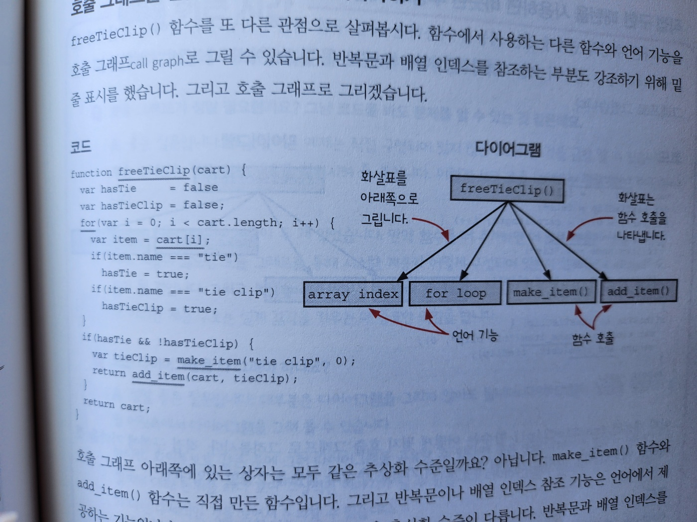
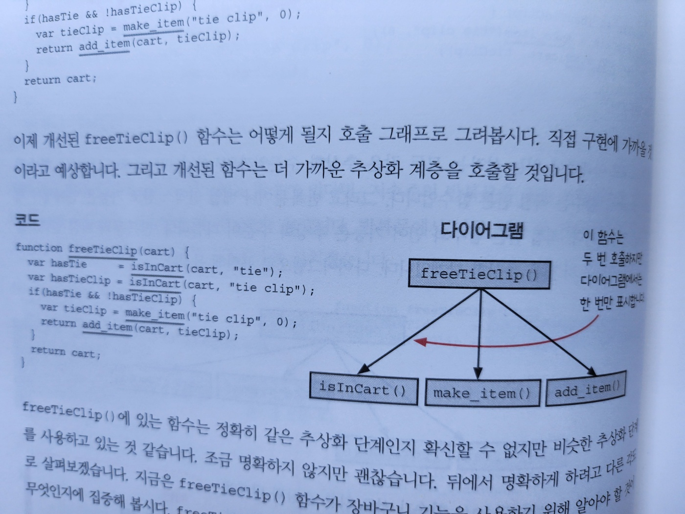
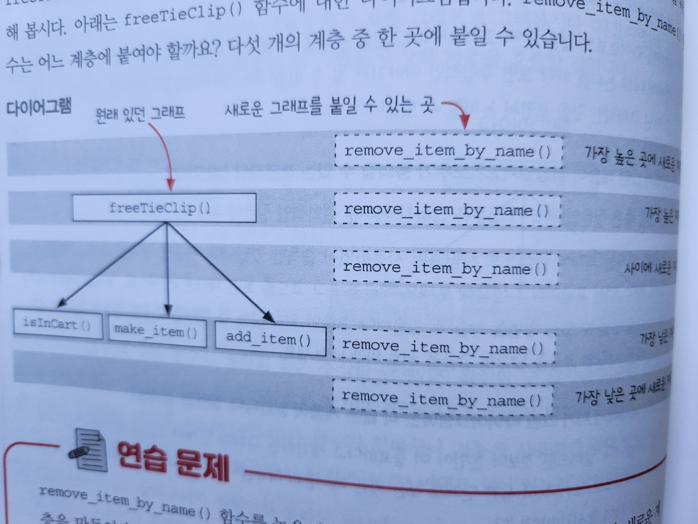
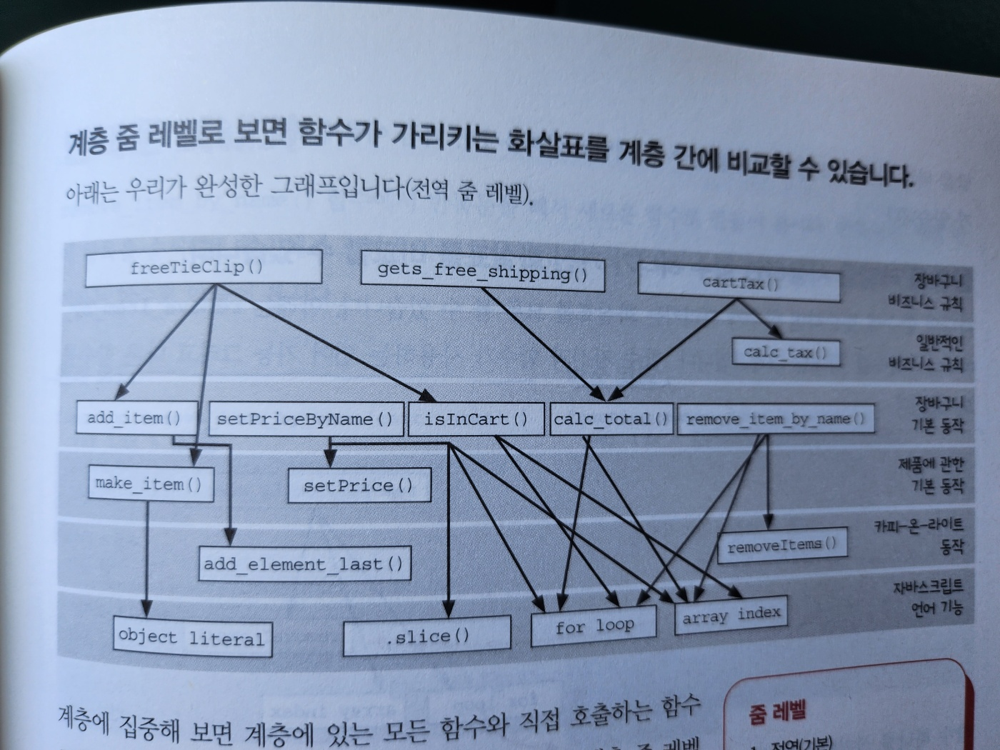
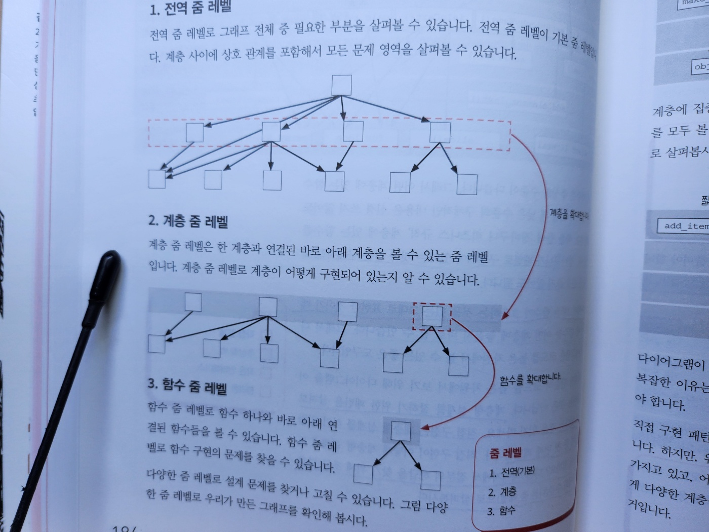
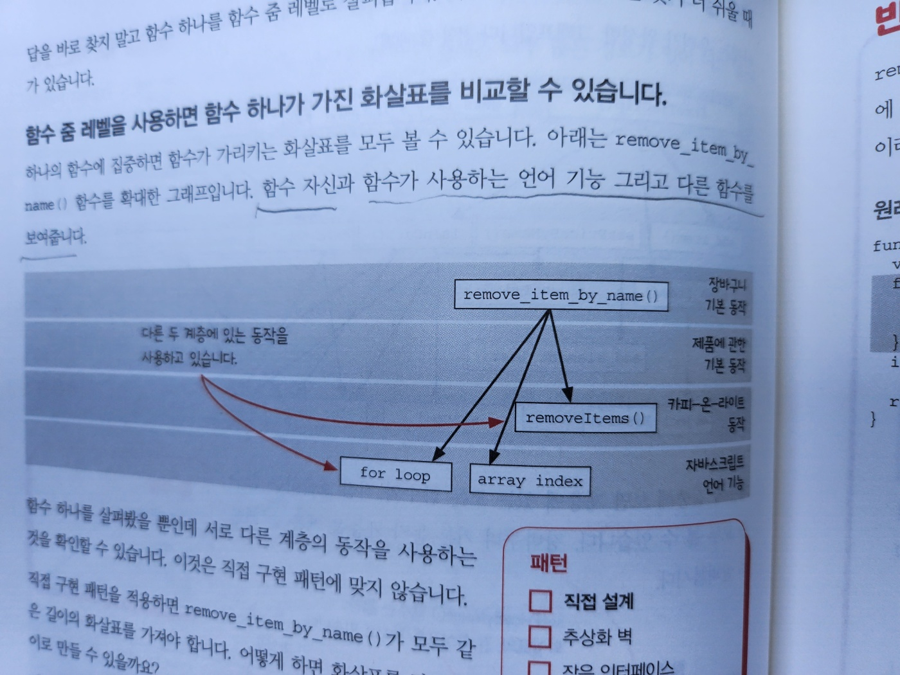
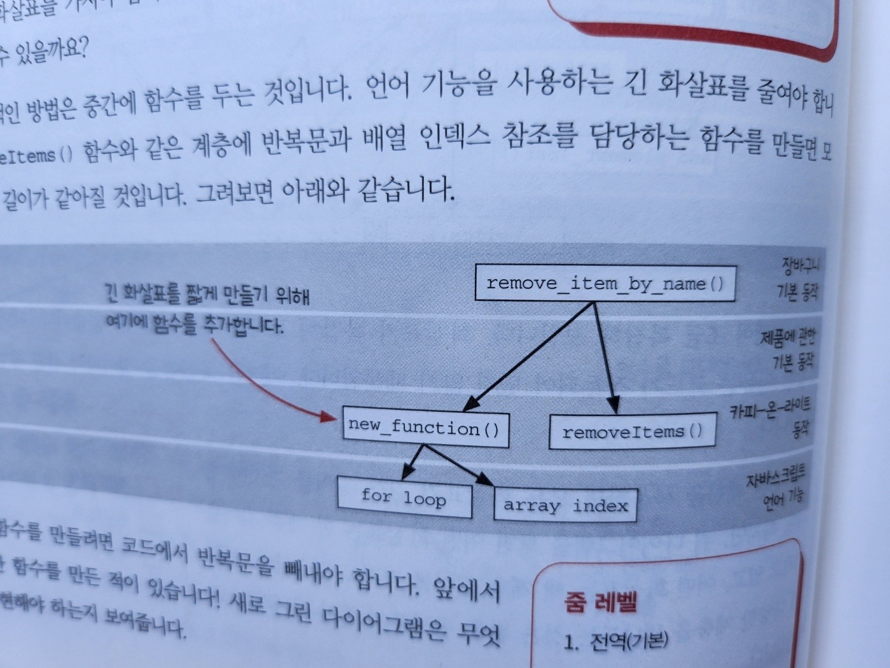

# 8. 계층형 설계 1

- 파트 1의 마지막 장
- 지금까지 작업한 코드에 `계층형 설계(stratified design)`라는 설계 방법을 적용해 보겠습니다
- 계층형 설계는 바로 아래 계층의 함수로 지금 계층의 함수를 만드는 방법입니다
- 계층이 무엇일까요?
- 계층은 왜 필요한 것일까요?
- 이 질문에 대한 답을 이장과 다음장에서 찾아보겠습니다

#### 이번 장에서 살펴볼 내용

- 소프트웨어 설계애 대한 실용적인 정의를 소개합니다
- 계층형 설계를 이해하고 어떤 도움이 되는지 알아봅니다
- 깨끗한 코드를 만들기 위해 함수를 추출하는 방법을 배웁니다
- 계층을 나눠서 소프트웨어를 설계하면 왜 더 나은 생각을 할 수 있는지 알아봅니다

## 소프트웨어 설계란 무엇입니까?

- 코드에 대해 자신이 없다 -> 설계가 잘못되었다는 신호
- 설계를 잘하면 소프트웨어 개발 과정 전체에 도움이 됩니다
- 아이디어를 코드로 구현하고 테스트하고 유지보수하기 쉽습니다
- 소프트웨어 설계
  - 코드를 만들고, 테스트하고, 유지보수하기 쉬운 프로그래밍 방법을 선택하기 위해 미적 감각을 사용하는 것
- 이 장에서는 계층형 설계(stratified design)를 사용해 소프트웨어 설계를 위한 미적 감각을 키워볼 것입니다

## 계층형 설계란 무엇인가요?

- `계층형 설계`는 `소프트웨어를 계층으로 구성`하는 기술입니다
  - 각 계층에 있는 함수는 `아래 계층에 있는 함수를 이용`해 정의
  - https://product.kyobobook.co.kr/detail/S000001033024
- 계층 예시(각 계층의 목적)

  - 비즈니스 규칙 : [gets_free_shipping(), cartTax()] -> calc_total()
  - 장바구니를 위한 동작들 : [remove_item_by_name() -> removeItem(), calc_total(), addItem() -> add_element_last(), setPriceByName() -> .slice()]
  - 카피 온 라이트 : [removeItem() -> .slice(), add_element_last() -> .slice()]
  - 언어에서 지원하는 배열 기능 : [.slice()]

- 이번장에서 코드를 읽을 때 더 좋은 설계를 알려주는 신호를 찾는 법을 배워보자
- 설계를 개선하고, 개선한 것이 어떤 의미가 있는지 알아보자

## 설계 감각을 키우기

### 전문가의 저주

- 전문가는 본인의 전문 분야를 잘 알지만, 설명은 잘 못하는 것으로 악명 높습니다
- 전문가는 오랜 시간 노력으로 축적된 지식이 있지만, 그것을 다른 사람들에게 설명하는 방법을 모릅니다
- 설명하려는 것이 블랙박스와 같기 때문입니다
  - 블랙박스는 복잡하고 다양한 입력을 받아 복잡하고 다양한 결과물을 냅니다

### 계층형 설계 감각을 키우기 위한 입력

- 계층형 설계 감각을 키우기 위해 다양한 입력을 생각해보자
- 이러한 입력들은 `계층형 설계에 대한 단서`가 됩니다
- 코드를 읽고 단서를 찾고 계층형 설계를 위한 길잡이로 사용해봅시다
- 다음은 몇 가지 단서들입니다
  - `함수 본문`
    - 길이
    - 복잡성
    - 구체화 단계
    - 함수 호출
    - 프로그래밍 언어의 기능 사용
  - `계층 구조`
    - 화살표 길이
    - 응집도
    - 구체화 단계
  - `함수 시그니처`
    - 함수명
    - 인자 이름
    - 인자 값
    - 리턴 값

### 계층형 설계 감각을 키우기 위한 출력

- 조직화
  - 새로운 함수를 어디에 놓을지 결정
  - 함수를 다른 곳으로 이동
- 구현
  - 구현 바꾸기
  - 함수 추출하기
  - 데이터 구조 바꾸기
- 변경
  - 새 코드를 작성할 곳 선택하기
  - 적절한 수준의 구체화 단계 결정하기

## 계층형 설계 패턴

- 코드를 여러 방향으로 살펴보고 계층형 설계 패턴을 적용해보자
- 가장 중요한 네 가지 패턴을 살펴보자(네 가지 패턴 중 첫 번째는 이번장에서 다루고 나머지는 다음장에서 다룬다)
  - 패턴 1 : 직접 구현
  - 패턴 2 : 추상화 벽
  - 패턴 3 : 작은 인터페이스
  - 패턴 4 : 편리한 계층

### 패턴 1: 직접 구현

- 직접 구현은 계층형 설계 구조를 만드는 데 도움이 됩니다
- 직접 구현된 함수를 읽을 때, 함수 시그니처가 나타내고 있는 문제를 함수 본문에서 적절한 구체화 수준에서 해결해야 합니다
- 만약 너무 구체적이라면 코드에서 나는 냄새입니다

### 패턴 2: 추상화 벽

- 호출 그래프에 어떤 계층은 중요한 세부 구현을 감추고 `인터페이스를 제공`합니다
- 인터페이스를 사용하여 코드를 만들면 높은 차원으로 생각할 수 있습니다
- 고수준의 추상화 단계만 생각하면 되기 때문에 두뇌 용량의 한계를 극복할 수 있습니다

### 패턴 3: 작은 인터페이스

- 시스템이 커질 수록 비즈니스 개념을 나타내는 중요한 인터페이스는 작고 강력한 동작으로 구성하는 것이 좋습니다
- 다른 동작도 직간접적으로 최소한의 인터페이스를 유지하면서 정의해야 합니다

### 패턴 4: 편리한 계층

- 계층형 설계 패턴과 실천 방법은 개발자의 요구를 만족시키면서 비즈니스 문제를 잘 풀 수 있어야 합니다
- 소프트웨어를 더 빠르고 고품질로 제공하는 데 도움이 되는 계층에 시간을 투자해야 합니다
- 그냥 좋아서 계층을 추가하면 안됩니다
- 코드와 그 코드가 속한 추상화 계층은 `작업할 때 편리`해야 합니다

### Recap

- 위 패턴들은 너무 추상적이기 때문에 구체적으로 알아봅시다
- 시나리오나 다이어그램, 설명, 예제를 통해 계층형 설계에 구체적으로 설명해 보겠습니다
- 첫 번째 패턴을 알아봅시다

## 패턴 1: 직접 구현

- 어떻게 하면 구현된 코드를 잘 읽을 수 있을까
- 계층 구조는 아무리 강력한 기능을 하는 함수가 있더라도 `복잡하지 않게 함수를 표현`해야 합니다

```js
// bad
function freeTieClip(cart) {
  let hasTie = false;
  let hasTieClip = false;
  for (let i = 0; i < cart.length; i++) {
    let item = cart[i];
    if (item.name === "tie") hasTie = true;
    if (item.name === "tie clip") hasTieClip = true;
  }
  if (hasTie && !hasTieClip) {
    let tieClip = make_item("tie clip", 0);
    return add_item(cart, tieClip);
  }
  return cart;
}
```

- 어렵지 않지만 `많은 기능`이 있습니다
  - 장바구니를 돌면서 체크하고 무엇인가를 결정하고 있습니다
- 이 코드는 첫 번째 계층형 설계 패턴인 직접 구현을 따르지 않고 있습니다
  - 코드를 바로 추가하면 유지보수하기 어렵습니다
  - freeTieClip() 함수가 `알아야 할 필요가 없는 구체적인 내용`을 담고 있습니다
  - 마케팅 캠페인에 관련된 함수가 `장바구니가 배열이라는 사실을 알아야 할까요?`
  - 장바구니 배열을 돌다가 off-by-one 에러가 생기면 실패할까요?
    - off-by-one 에러 : 주로 배열을 반복해서 처리할 때 '크다' 또는 '크거나 같다'와 같은 비교문을 잘못 선택해 `의도하지 않게 마지막 항목을 처리하지 못하거나 처리하는 오류`를 말합니다

### 장바구니가 해야할 동작

- 장바구니가 해야할 동작 정리

  - 제품 추가하기 : add_item
  - 제품 삭제하기 : remove_item_by_name
  - [ ] 장바구니에 제품이 있는지 확인하기
  - 합계 계산하기 : calc_total
  - [ ] 장바구니 비우기
  - 제품 이름으로 가격 설정하기 : setPriceByName
  - 세금 계산하기 : cartTax
  - 무료 배송이 되는지 확인하기 : gets_free_shipping

- 구현하지 않은 동작은 두 개입니다. 뒤에서 구현하겠습니다

```js
// 장바구니 구현 코드
// 제품 추가하기
function add_item(cart, item) {
  return add_element_last(cart, item);
}

// 제품 삭제하기
function remove_item_by_name(cart, name) {
  let idx = null;
  for (let i = 0; i < cart.length; i++) {
    if (cart[i].name === name) {
      idx = i;
    }
  }
  if (idx !== null) {
    return removeItems(cart, idx, 1);
  }
  return cart;
}

// 합계 계산하기
function calc_total(cart) {
  let total = 0;
  for (let i = 0; i < cart.length; i++) {
    const item = cart[i];
    total += item.price;
  }
  return total;
}

// 제품 이름으로 가격 설정하기
function setPriceByName(cart, name, price) {
  const cartCopy = cart.slice();
  for (let i = 0; i < cartCopy.length; i++) {
    if (cartCopy[i].name === name) {
      cartCopy[i] = setPrice(cartCopy[i], price);
    }
  }
  return cartCopy;
}

// 세금 계산하기
function cartTax(cart) {
  return calc_tax(calc_total(cart));
}

// 무료 배송이 되는지 확인하기
function gets_free_shipping(cart) {
  return calc_total(cart) >= 20;
}
```

- 아직 구현되지 않은 동작 두 개는 뒤에서 구현
  - 장바구니에 제품이 있는지 확인하기
  - 장바구니 비우기

### 제품이 있는지 확인하는 함수가 있다면 설계를 개선할 수 있습니다

- freeTieClip() 함수에 직접 구현 패턴을 적용해보자

```js
// before
function freeTieClip(cart) {
  let hasTie = false;
  let hasTieClip = false;
  /**
   * 반복문은 장바구니에 넥타이와 넥타이 클립이 있는지 확인하고 있습니다
   */
  for (let i = 0; i < cart.length; i++) {
    let item = cart[i];
    if (item.name === "tie") hasTie = true;
    if (item.name === "tie clip") hasTieClip = true;
  }
  if (hasTie && !hasTieClip) {
    let tieClip = make_item("tie clip", 0);
    return add_item(cart, tieClip);
  }
  return cart;
}
```

- `장바구니 안에 제품이 있는지 확인하는 함수`가 있다면, `저수준의 반복문을 직접 쓰지 않았을 것`입니다
- `저수준 코드는 추출해야` 할 가능성이 높습니다
- 반복문에서 다른 제품 두 개가 있는지 확인하고 있는데, 하나의 함수를 만들어 사용하도록 고치겠습니다

```js
// after
function freeTieClip(cart) {
  let hasTie = isInCart(cart, "tie"); // 반복문을 추출해 새로운 함수를 만들었습니다
  let hasTieClip = isInCart(cart, "tie clip");

  if (hasTie && !hasTieClip) {
    let tieClip = make_item("tie clip", 0);
    return add_item(cart, tieClip);
  }
  return cart;
}

function isInCart(cart, name) {
  for (let i = 0; i < cart.length; i++) {
    if (cart[i].name === name) return true;
  }
  return false;
}
```

- 개선한 함수는 짧고 명확합니다
- 또한, 모두 비슷한 구체화 수준에서 작동하고 있기 때문에 `읽기 쉽습니다`

### 호출 그래프를 만들어 함수 호출을 시각화하기

- freeTieClip() 함수를 또 다른 관점으로 살펴봅시다
- 함수에서 사용하는 다른 함수와 언어 기능을 호출 그래프로 그릴 수 있습니다
- 반복문과 배열 인덱스를 참조하는 부분도 강조하기 위해 밑줄 표시를 했습니다
- 그리고 호출 그래프로 그리겠습니다



- 호출 그래프 아래쪽 상자는 모두 같은 추상화 수준일까요?
  - 아닙니다. make_item() 함수와 add_item() 함수는 직접 만든 함수입니다
  - 직접 만든 함수와 언어 기능은 추상화 수준이 다릅니다
  - 반복문과 배열 인덱스를 참조하는 기능(언어 기능)은 더 낮은 추상화 단계입니다

### 직접 구현 패턴을 사용하면 비슷한 추상화 계층에 있는 함수를 호출합니다

- 이제 개선된 freeTieClip() 함수는 어떻게 호출 될지 호출 그래프로 그려봅시다



- 다이어그램
  - freeTieClip()
    - isInCart() : 함수 호출
    - make_item() : 함수 호출
    - add_item() : 함수 호출
- 이처럼 `함수가 모두 비슷한 계층에 있다`면 `직접 구현`했다고 할 수 있습니다

### remove_item_by_name() 함수 그래프 그려보기

- freeTieClip() 함수에 대한 그래프를 그린 것처럼 remove_item_by_name() 함수에 대한 그래프를 그려봅시다
- 다이어그램

  - remove_item_by_name()
    - array index : 언어 기능
    - for loop : 언어 기능
    - removeItems() : 함수 호출



- freeTieClip() 함수 옆에 remove_item_by_name() 그래프를 붙여 전체 그래프를 확장해 봅시다

  - 어느 계층에 붙여야 할까요?

- 다이어그램 : remove_item_by_name() 가 위치할 수 있는 다섯 개의 계층
  - // 가장 높은 곳에 새로운 계층
  - freeTieClip() // 가장 높은 계층
    - // 사이에 새로운 계층
    - isInCart(), make_item(), add_item() // 가장 낮은 계층
    - // 가장 낮은 곳에 새로운 계층

#### remove_item_by_name() 함수를 어느 계층에 붙여야 할까요?

- 후보 계층을 하나씩 지워가면서 적당한 위치를 찾아봅시다
- **가장 높은 계층**
  - freeTieClip() 함수와 같은 계층에 있습니다
  - freeTieClip() 이름을 봅시다
    - 마케팅 캠페인 관련 이름입니다
    - 하지만 remove_item_by_name() 함수는 마케팅 캠페인과 관련이 없습니다
    - `remove_item_by_name() 함수`는 freeTieClip() 보다 `일반적인 동작에 관한 이름`입니다
    - 따라서 화살표가 아래쪽을 향해야 한다는 규칙을 지키기 위해
      - remove_item_by_name() 함수는 freeTieClip() 함수보다 `낮은 계층에 있어야 합니다`
- **가장 낮은 계층**

  - 가장 낮은 계층에 있는 함수 이름을 보면 장바구니와 제품을 다루는 함수 이름입니다
  - remove_item_by_name() 함수도 장바구니를 다루기 때문에 `괜찮은 위치`인 것 같습니다

- **가장 낮은 곳 아래 새로운 계층**

  - 가장 낮은 계층에서 remove_item_by_name()를 함수로 호출할 일은 없기 때문에
    - 가장 낮은 곳에서 새로운 계층을 만드는 후보는 지워도 됩니다

- **가장 높은 계층과 가장 낮은 계층 사이에 새로운 계층**

  - 지워도 될까요?
    - 확실하지 않습니다
    - 확신하기 위해 가장 낮은 계층에 있는 함수가 어떤 함수나 언어 기능을 호출하는지 봅시다
      - remove_item_by_name() 함수가 가장 낮은 계층에 있는 함수와 비슷한 점이 있다면 가장 낮은 계층에 놓을 수 있다는 확신을 할 수 있습니다
    - 다이어 그램을 그려서 같은 박스(for loop, array index)를 가리키고 있다는 것은 같은 계층에 있어도 좋다는 정보입니다

- 지금은 `remove_item_by_name()`을 `isInCart(), make_item(), add_item() 함수가 있는` `가장 낮은 계층`에 놓는 것이 좋을 것 같습니다

### '같은 계층'에 있는 함수는 '같은 목적'을 가져야 합니다



- 다이어 그램은 명확하고 모호한 것이 없는 여섯 개의 계층으로 되어있습니다

  - 함수를 어떤 계층에 놓을지 선택하는 과정은 복잡합니다
  - 그래도 계층이 서로 구분되는 목적이 있다면, 함수가 위치할 계층을 선택하는 데 좋은 정보로 사용할 수 있습니다
  - 계층의 목적은 각 계층에 있는 함수의 목적과 같습니다
  - 각 계층의 목적을 그래프에 표시해 봅시다

- 각 계층은 추상화 수준이 다릅니다

  - 그래서 어떤 계층에 있는 함수를 읽거나 고칠 때 낮은 수준의 구체적인 내용은 신경 쓰지 않아도 됩니다
  - '장바구니 비즈니스 규칙' 계층에 있는 함수를 쓸 때, 장바구니가 배열로 구현되어 있다는 것과 같은 구체적인 내용느 신경쓰지 않아도 됩니다

- 다이어 그램은 코드를 높은 차원에서 볼 수 있는 좋은 도구입니다
- 직접 구현이 어떻게 계층형 설계에 도움이 되는지 다른 구체화 수준(다른 줌 레벨)으로 살펴봅시다
  - 직접 구현: 함수가 모두 비슷한 계층에 있다

## 3단계 줌 레벨

- 다이어그램에는 너무 많은 정보가 있어 어느 곳에 문제가 있는지 찾기 어렵습니다
- 계층형 설계에서 문제는 세 가지 다른 영역에서 찾을 수 있습니다

  - 1. 계층 사이에 상호 관계
  - 2. 특정 계층의 구현
  - 3. 특정 함수의 구현

- 문제를 찾기 위해 알맞은 줌 레벨을 사용해 하나의 영역을 살펴볼 수 있습니다
- 내 생각) 3단계 줌 레벨도 다이어그램으로 계층을 구분한 것을 기반으로 작동하는 것 같다



### 1. 전역 줌 레벨

- 그래프 전체 중 필요한 부분을 살펴볼 수 있습니다
- 전역 줌 레벨이 기본 줌 레벨입니다
- 계층 사이에 상호 관계를 포함해서 모든 영역을 살펴볼 수 있습니다

### 2. 계층 준 레벨

- 계층 줌 레벨으 한 계층(root)과 연결된 바로 아래 계층을 볼 수 있는 줌 레벨입니다
- 계층 줌 레벨로 계층이 어떻게 구현되어 있는지 알 수 있습니다

### 3. 함수 줌 레벨

- 함수 줌 레벨로 함수 하나와 바로 아래 연결된 함수들을 볼 수 있습니다
- 함수 줌 레벨로 함수 구현의 문제를 찾을 수 있습니다

### recap

- 다양한 줌 레벨로 설계 문제를 찾거나 고쳐봅시다

### 계층 줌 레벨로 보면 함수가 가리키는 화살표를 계층 간에 비교할 수 있습니다


- 장바구니 기본 동작 계층을 계층 줌 레벨로 살펴봅시다
  - 다이어 그램이 복잡
    - 복잡함을 정리하기 위한 방법을 찾아야 합니다
- `직접 구현 패턴`을 사용하면 `모든 화살표가 같은 길이`를 가져야 합니다
  - 위 다이어 그램을 보면 어떤 화살표는 한 계층, 어떤 화살표는 세 계층 길이를 가지고 있습니다
  - 이렇게 `다양한 계층을 넘나드는 것`은 `같은 구체화 수준이 아니라는 증거`입니다
- 답을 바로 찾지 말고 `함수 줌 레벨로 살펴봅시다`
  - 가끔 이렇게 보면 답을 찾기 더 쉬울 때가 있습니다

### 함수 줌 레벨을 사용하면 함수 하나가 가진 화살표를 비교할 수 있습니다



- 함수 줌 레벨
  - 함수 자신과 함수가 사용하는 언어 기능 그리고 다른 함수를 보여줍니다
- remove_item_by_name() 함수를 살펴봅시다
  - 서로 다른 계층의 동작을 사용하는 것을 확인할 수 있습니다



- 가장 일반적인 방법은 중간에 함수를 두는 것입니다

  - 새 함수를 만들려면 코드에서 반복문을 빼내야 합니다

- 기존 remove_item_by_name 다이어그램

  - 카피 온 라이트 동작
    - removeItems()
  - 자바스크립트 언어 기능
    - for loop
    - array index

- 변경 후 remove_item_by_name 다이어그램
  - 카피 온 라이트 동작
    - removeItems()
    - new_function()

```js
// 원래 코드
function remove_item_by_name(cart, name) {
  let idx = null;
  for (let i = 0; i < cart.length; i++) {
    if (cart[i].name === name) {
      idx = i;
    }
  }
  if (idx !== null) {
    return removeItems(cart, idx, 1);
  }
  return cart;
}
```

```js
// 바꾼 코드
function remove_item_by_name(cart, name) {
  let idx = indexOfItem(cart, name);
  if (idx !== null) {
    return removeItems(cart, idx, 1);
  }
  return cart;
}

function indexOfItem(cart, name) {
  for (let i = 0; i < cart.length; i++) {
    if (cart[i].name === name) {
      return i;
    }
  }
  return null;
}
```

- remove_item_by_name() 함수는 전보다 읽기 쉬워졌습니다
- 다이어그램에서도 보기 쉬워졌습니다
- 엄밀히 말하면 indexOfItem()함수가 removeItems() 함수보다 조금 더 위에 위치합니다
  - indexOfItem() 함수는 배열에 있는 항목이 name 속성을 가지고 있다는 것을 알아야 합니다
  - 하지만 removeItems() 함수는 배열에 들어있는 항목이 어떻게 생겼는지 몰라도 됩니다
  - 10장에서 반복문을 더 일반적으로 처리하는 방법에 대해 알아보겠습니다
- 지금은 이대로 사용하면서 나중에 재사용할 수 있다는 가능성을 열어둡시다

## TODO

- 연습문제들을 풀어보기

## 직접 구현 패턴 리뷰

### 직접 구현한 코드는 한 단계의 구체화 수준에 관한 문제만 해결합니다

- 좋은 설계를 고민하지 않고 만든 코드는 읽거나 고치기 어렵습니다
  - 코드가 서로 다른 구체화 단계에 있다면 읽기 어렵습니다
  - 코드를 읽을 때 이해해야 할 것이 많이 있는데 구체화 단계가 다르다면 이해하기가 더 어렵습니다
- 직접 구현하면 코드를 읽기 위해 알아야 하는 구체화 단계의 범위를 줄일 수 있습니다

### 계층형 설계는 특정 구체화 단계에 집중할 수 있게 도와줍니다

- 쉽지 않지만 코드에 있는 다양한 단서를 통해 구체화 수준에 집중하다 보면 설계 감각을 키울 수 있고 코드를 필요에 알맞게 바꿀 수 있습니다

### 호출 그래프는 구체화 단계에 대한 풍부한 단서를 보여줍니다

- 코드에는 설계를 개선하기 위한 단서가 많이 있습니다
- 하지만 큰 그림으로 한 번에 보익에는 너무 많은 정보가 있습니다
- 호출 그래프는 함수가 어떻게 연결되어 있는지 보여줍니다
- 함수 시그니처와 본문, 호출 그래프와 같으 다양한 단서를 가지고 직접 코드 패턴을 적용할 수 있습니다

### 함수를 추출하면 더 일반적인 함수로 만들 수 있습니다

- 함수에 직접 구현 패턴을 적용하는 방법의 하나는 함수가 더 구체적인 내용을 다루지 않도록 함수를 일반적인 함수로 빼내는 것입니다
- 일반적인 함수는 보통 구체적인 내용을 하나만 다루기 때문에 테스트하기 쉽습니다
- 명확한 코드와 알맞은 이름을 가진 함수는 더 읽기 쉽습니다

### 일반적인 함수가 많은 수록 재사용하기 좋습니다

- 함수로 빼내면 재사용할 수 있는 곳이 보입니다
- '중복 코드'를 찾기 위해 함수를 빼내는 것과는 다릅니다
- 구현을 명확하게 하기 위해 일반적인 함수를 빼내는 것입니다
- 일반적인 함수는 구체적인 함수보다 더 많은 곳에서 쓸 수 있습니다
- 그리고 사용할 곳을 따로 찾지 않아도 재사용 할 수 있는 곳을 발견할 수 있을 것입니다

### 복잡성을 감추지 않습니다

- 직접 구현 패너을 적용한 코드처럼 보이게 만든느 것은 쉽습니다
- 명확하지 않은 코드를 감추기 위해 '도우미 함수(helper function)'를 만들면 됩니다
  - 하지만 이렇게 하는 것은 계층형 설계가 아닙니다
- 계층형 설계에서 모든 계층은 바로 아래 계층에 의존해야 합니다
- 복잡한 코드를 같은 계층으로 옮기면 안됩니다
- 더 낮은 구체화 수준을 가진 일반적인 함수를 만들어 소프트웨어에 직접 구현 패턴을 적용해야 합니다

## 결론

- 계층 간 차이를 보기 위해 `호출 그래프`를 그려 `코드를 시각화`했습니다
- 그리고 계층형 설계에서 가장 중요한 첫 번째 패턴인 직접 구현 패턴을 알아봤습니다
- 직접 구현 패턴이 적용된 계층 구조로 만들면, 간단한 함수로 또 다른 간단한 함수를 만들면서 코드를 구성할 수 있습니다
- 하지만 계층형 설계를 잘 만드는 방법은 더 있습니다
- 다음 장에서 남은 세 개의 패턴을 살펴보겠습니다

## 요점 정리

- 계층형 설계는 코드를 추상화 계층으로 구성합니다
  - 각 계층을 볼 때 다른 계층에 구체적인 내요을 몰라도 됩니다
- 문제 해결을 위한 함수를 구현할 때 어떤 구체화 단계로 쓸지 결정하는 것이 중요합니다
  - 그래야 함수가 어떤 계층에 속할지 알 수 있습니다
- 함수가 어떤 `계층`에 속할지 `알려주는 요소`는 많이 있습니다
  - 함수 `이름`과 `본문`, `호출 그래프` 등이 그런 요소입니다
- `함수 이름`은 `의도`를 알려줍니다
  - `비슷한 목적의 이름`을 가진 함수를 `함께 묶을 수 있습니다`
- `함수 본문`은 중요한 `세부 사항`을 알려줍니다
  - 함수 본문은 함수가 `어떤 계층 구조에 있어야 하는지` 알려줍니다
- `호출 그래프`로 구현이 직접적이지 않다는 것을 알 수 있습니다
  - 함수를 호출하는 `화살표가 다양한 길이`를 가지고 있다면 `직접 구현되어 있지 않다는 신호`입니다
- 직접 구현 패턴은 함수를 명확하고 아름답게 구현해 계층을 구성할 수 있도록 알려줍니다
