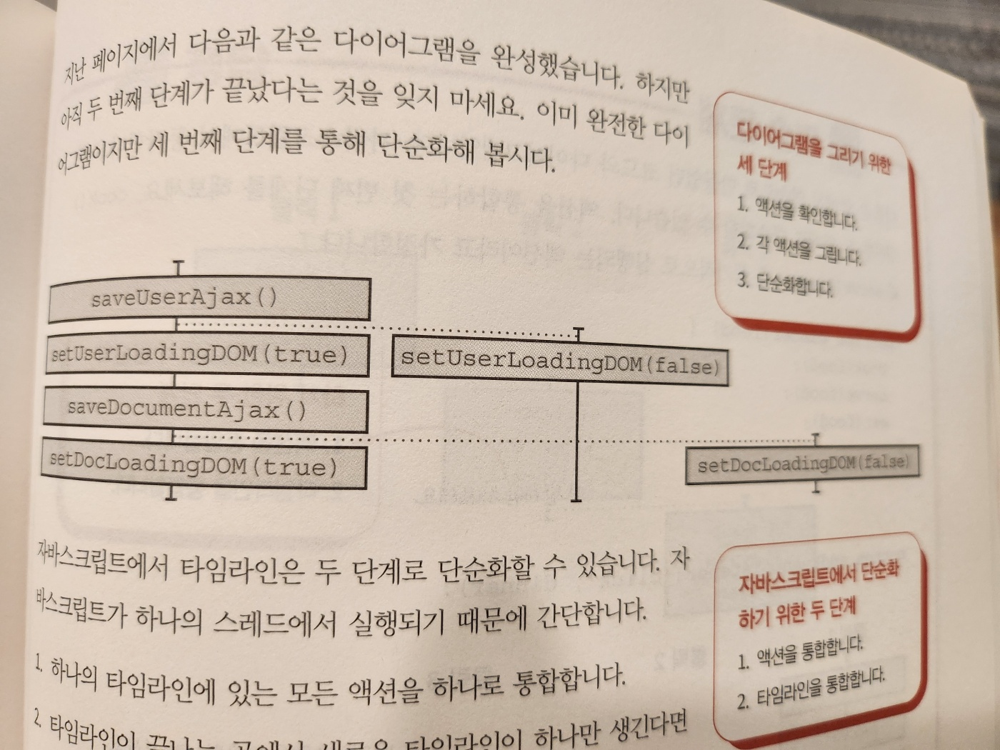

# 15. 타임라인 격리하기

#### 이번 장에서 살펴볼 내용

- 코드를 타임라인 다이어그램으로 그리는 방법을 배웁니다
- 버그를 찾기 위해 타임라인 다이어그램 보는 법을 이해합니다
- 타임라인끼리 공유하는 자원을 줄여 코드 설계를 개선하는 방법을 알아봅니다

---

이번장에서는 `시간에 따라` 실행되는 `액션의 순서`를 나타내기 위해 타임라인 다이어그램에 대해 알아보겠습니다

타임라인 다이어그램은 `소프트웨어`가 어떻게 `동작`하는지 `이해`하는 데 도움이 됩니다

특히 웹 서버와 클라이언트 간 통신처럼 분산 시스템을 이해하기 좋습니다

또 타임라인 다이어그램으로 버그를 진단하고 예측할 수 있습니다

그리고 문제를 해결하는 코드를 만들 수 있습니다

## 버그가 있습니다!

- 이슈

  - 장바구니에서 합계 금액이 잘못 표시도니다는 문의가 많이 들어오고 있다
  - 표시되는 금액이랑 결제되는 금액이 다르다

- 버그
  - 천천히 클릭하면 문제가 생기지 않습니다
  - 빠르게 클릭하면 금액이 잘못 표기되는 이슈가 발생합니다
  - 빠르게 두 번 클릭해서 나오는 결과들
    - 14달러(정상)
    - 16달러
    - 22 달러

### 코드를 보면서 버그를 이해해 봅시다

```js
// add_item_to_cart()는 장바구니에 추가 버튼을 클릭할 때 실행되는 핸들러 함수입니다
function add_item_to_cart(name, price, quantity) {
  // 장바구니 전역변수를 읽고 씁니다
  cart = add_item(cart, name, price, quantity);
  calc_cart_total();
}

function calc_cart_total() {
  total = 0;
  // 제품 API로 AJAX 요청을 보냅니다
  cost_ajax(cart, function (cost) {
    // 요청이 완료될 때 실행되는 콜백
    total += cost;
    // 판매 API로 AJAX 요청을 보냅니다
    shipping_ajax(cart, function (shipping) {
      // 판매 API 응답이 오면 실행되는 콜백
      total += shipping;
      // 합계를 DOM에 보여줍니다
      update_total_dom(total);
    });
  });
}
```


- 유스케이스(use case) 다이어그램

- 장바구니에 제품을 추가하고 다음 제품을 추가할 때 까지 기다리면 시스템은 올바르게 동작합니다
- 고객이 기다리지 않고 다음 제품을 추가할 때 어떻게 되는지 볼 수 있는 방법이 필요합니다
- 이 경우 두 가지 일이 동시에 진행됩니다
  - 타임라인 다이어그램을 통해 동시 진행되는 일을 표현해 봅시다

## 타임라인 다이어그램은 시간에 따라 어떤 일이 일어나는지 보여줍니다

- 타임라인(timeline)은 액션을 순새대로 나열한 것입니다
- 타임라인 다이어그램은 시간에 따른 액션 순서를 시각적으로 표시한 것입니다


- 왼쪽 다이어그램을 보면 잘못된 동작을 한다는 것을 알 수 있습니다
- 이번 장에서 배울 것들
  - 타임라인 다이어그램 그리는 방법
  - 시간에 관련된 문제를 찾기 위해 다이어그램을 읽는 방법
  - 타임라인 원책일 사용해 이런 종류의 버그를 줄일 방법
- 다이어그램을 그리는 방법부터 시작해봅시다

## 두 가지 타임라인 다이어그램 기본 규칙

- 타임라인 다이어그램으로 알 수 있는 중요한 두 가지 사실

  - 순서대로 실행되는 액션
  - 동시에 나란히 실행되는 액션

- 위와 관련된 두 가지 기본 규칙을 살펴봅시다

### 기본규칙 1. 두 액션이 순서대로 나타나면 같은 타임라인에 넣습니다

- 직렬

```js
// 순서대로 실행되는 경우
sendEmail1();
sendEmail2();
```

### 기본규칙 2. 두 액션이 동시에 실행되거나 순서를 예상할 수 없다면 분리된 타임라인에 넣습니다

- 병렬

```js
// 순서를 예상할 수 없는 경우
setTimeout(sendEmail1, Math.random() * 10000);
setTimeout(sendEmail2, Math.random() * 10000);
```

- 액션이 서로 다른 스레드나 프로세스, 기계, 비동기 콜백에서 실행되면 서로 다른 타임라인에 표시합니다

### 요약

1. 액션은 순서대로 실행되거나 동시에 실행됩니다
2. 순서대로 실행되는 액션은 같은 타임라인에 하나가 끝나면 다른 하나가 실행됩니다
3. 동시에 실행되는 액션은 여러 타임라인에서 나란히 실행됩니다

## 자세히 보면 놓칠 수 있는 액션 순서에 관한 두 가지 사실

### 1. ++와 +=는 사실 세 단계입니다

```js
total++;

// 숨겨진 단계
let temp = total; // 읽기(액션)
temp = temp + 1; // 더하기(계산)
total = temp; // 쓰기(액션)
```

- total이 전역변수라면 첫 번째 단계와 세 번째 단계는 액션입니다
- 두 번째 단계인 1을 더하는 동작은 계산입니다
  - 따라서 다이어그램에 표시하지 않습니다

### 2. 인자는 함수를 부르기 전에 실행됩니다

## add-to-cart 타임라인 그리기: 단계 1

- 타임라인 다이어그램 단계
  - 1. 액션을 확인합니다
  - 2. 순서대로 실행되거나 동시에 실행되는 액션을 그립니다
  - 3. 플랫폼에 특화된 지식을 사용해 다이어그램을 단순하게 만듭니다

### 1. 액션을 확인합니다

- 계산은 다이그램을 그릴 때 신경 쓰지 않아도 됩니다

```js
function add_item_to_cart(name, price, quantity) {
  // 전역변수(cart)를 읽고 씁니다 -> 1. cart 읽기, 2. cart 쓰기
  cart = add_item(cart, name, price, quantity);
  calc_cart_total();
}

function calc_cart_total() {
  total = 0; // 3. total = 0 쓰기
  // 4. cart 읽기 / 5. cost_ajax() 부르기
  cost_ajax(cart, function (cost) {
    total += cost; // 6. total 읽기 / 7. total 쓰기
    // 8. cart 읽기 / 9. shipping_ajax() 부르기
    shipping_ajax(cart, function (shipping) {
      total += shipping; // 10. total 읽기 / 11. total 쓰기
      update_total_dom(total); // 12. total 읽기 / 13 update_total_dom() 부르기
    });
  });
}
```

- 액션

  - 1. cart 읽기
  - 2. cart 쓰기
  - 3. total = 0 쓰기
  - 4. cart 읽기
  - 5. cost_ajax() 부르기
  - 6. total 읽기
  - 7. total 쓰기
  - 8. cart 읽기
  - 9. shipping_ajax() 부르기
  - 10. total 읽기
  - 11. total 쓰기
  - 12. total 읽기
  - 13. update_total_dom() 부르기

- 이 짧은 코드에 13개의 액션이 있습니다
  - 그리고 비동기 콜백 두 개가 있다는 것도 주의해야 합니다(5, 9)
  - 아직 콜백을 그리는 방법은 배우지 않았습니다
- 콜백을 어떻게 그리는지 알아보고 다음 단계를 진행해 봅시다

## 비동기 호출은 새로운 타임라인으로 그립니다

- 자바스크립트 비동기 엔진이 어떻게 동작하는지 알아보겠습니다
- 타임라인다이어그램에 점선이 왜 필요한지도 이야기하겠습니다

```js
// 사용자와 문서를 저장하는 과정에서 로딩 상태를 보여주는 코드

// 서버에 사용자를 저장합니다(ajax)
saveUserAjax(user, function () {
  // 사용자 로딩 표시를 감춥니다
  setUserLoadingDOM(false);
});
setUserLoadingDOM(true); // 사용자 로딩 표시를 보여줍니다

// 서버에 문저를 저장합니다(ajax)
saveDocumentAjax(document, function () {
  // 문서 로딩 표시를 감춥니다
  setDocLoadingDOM(false);
});
setDocLoadingDOM(true); // 문서 로딩 표시를 보여줍니다
```

- 다이어그램을 그리기 위한 세 단계

  - 1. 액션을 확인
  - 2. 각 액션을 그립니다
  - 3. 단순화합니다

- 액션

  - 1. saveUserAjax()
  - 2. setUserLoadingDOM(false)
  - 3. setUserLoadingDOM(true)
  - 4. saveDocumentAjax()
  - 5. setDocLoadingDOM(false)
  - 6. setDocLoadingDOM(true)

- 액션 그리기


## 서로 다른 언어, 서로 다른 스레드 모델

- 자바스크립트는 단일 스레드, 비동기 모델을 사용합니다
- 하지만 모든 언어가 단일 스레드, 비동기 모델을 사용하는 것은 아닙니다
- 다른 언어에서 사용하는 스레드 모델에 대해 알아봅시다

### 단일 스레드, 동기

- 기본적으로 멀티스레드를 지원하지 않는 언어도 있습니다(e.g. PHP)
- 제약 시스템이 단순하다는 장점이 있습니다
- 스레드가 하나면 타임라인도 하나이지만, 네트워크를 통한 API호출 같은 것은 다른 타임라인이 필요합니다
- 하지만 메모리를 공유하지 않기 때문에 공유 자원을 많이 없앨 수 있습니다

### 단일 스레드, 비동기

- 자바스크립트는 스레드가 하나입니다
- 입출력 작업을 하려면 비동기 모델을 사용해야 합니다
- 입출력의 결과는 콜백으로 받을 수 있지만, 언제 끝날지 알 수 없기 때문에 다른 타임라인에 표현해야 합니다

### 멀티스레드

- 자바, 파이썬, 루비, C, C# 과 같은 많은 언어가 멀티스레드를 지원합니다
- 멀티스레드는 실행 순서를 보장하지 않기 때문에 프로그래밍하기 매우 어렵습니다
- 새로운 스레드가 생기면 새로운 타임라인을 그려야 합니다

### 메시지 패싱(message-passing) 프로세스

- 엘릭서나 얼랭 같은 언어는 서로 다른 프로세스를 동시에 실행할 수 있는 스레드 모델을 지원합니다
- 프로세스는 서로 메모리를 공유하지 않고 메시지로 통신합니다
- 서로 다른 타임라인에 있는 액션은 순서가 섞이지만, 메모리를 공유하지 않기 때문에 가능한 실행 순서가 많아도 문제가 되지 않습니다

## 한 단계씩 타임라인 만들기

```js
// 사용자와 문서를 저장하는 과정에서 로딩 상태를 보여주는 코드

// 서버에 사용자를 저장합니다(ajax)
saveUserAjax(user, function () {
  // 사용자 로딩 표시를 감춥니다
  setUserLoadingDOM(false);
});
setUserLoadingDOM(true); // 사용자 로딩 표시를 보여줍니다

// 서버에 문저를 저장합니다(ajax)
saveDocumentAjax(document, function () {
  // 문서 로딩 표시를 감춥니다
  setDocLoadingDOM(false);
});
setDocLoadingDOM(true); // 문서 로딩 표시를 보여줍니다
```

- 1. saveUserAjax()
  - 타임라인 시작
- 2. setUserLoadingDOM(false)
  - 비동기 콜백 - 새로운 타임라인 필요
  - 요청을 보내기 전엔 응답을 받을 수 없기 때문에 점선으로 순서를 표시해야 합니다
- 3. setUserLoadingDOM(true)
- 4. saveDocumentAjax()
- 5. setDocLoadingDOM(false)
- 6. setDocLoadingDOM(true)

## add-to-cart 타임라인 그리기: 단계 2

```js
function add_item_to_cart(name, price, quantity) {
  // 전역변수(cart)를 읽고 씁니다 -> 1. cart 읽기, 2. cart 쓰기
  cart = add_item(cart, name, price, quantity);
  calc_cart_total();
}

function calc_cart_total() {
  total = 0; // 3. total = 0 쓰기
  // 4. cart 읽기 / 5. cost_ajax() 부르기
  cost_ajax(cart, function (cost) {
    total += cost; // 6. total 읽기 / 7. total 쓰기
    // 8. cart 읽기 / 9. shipping_ajax() 부르기
    shipping_ajax(cart, function (shipping) {
      total += shipping; // 10. total 읽기 / 11. total 쓰기
      update_total_dom(total); // 12. total 읽기 / 13 update_total_dom() 부르기
    });
  });
}
```

- 1. cart 읽기
- 2. cart 쓰기
- 3. total = 0 쓰기
- 4. cart 읽기
- 5. cost_ajax() 부르기
- 6. total 읽기
- 7. total 쓰기
- 8. cart 읽기
- 9. shipping_ajax() 부르기
- 10. total 읽기
- 11. total 쓰기
- 12. total 읽기
- 13. update_total_dom() 부르기

### 2. 순서대로 실행되거나 동시에 실행되는 액션을 그립니다


- ajax 콜백 두 개는 새로운 타임라인으로 그려야 합니다.

## 타임라인 다이어그램으로 순서대로 실행되는 코드에도 두 가지 종류가 있다는 것을 알 수 있습니다

- 순서대로 실행되는 두 액션 사이에 다른 타임 라인에 있는 액션이 끼어들 수 있습니다
- 하지만 어떤 환경에서는 그렇지 않습니다

  - 예를 들어 자바스크립트 스레드 모델에서 동기화된 액션 사이에는 다른 액션이 끼어들 수 없습니다

- 순서대로 실행되지만 `순서가 섞일 수 있는 코드`와 그렇지 않은 코드(`순서가 섞이지 않는 코드`) 모두 타임라인 다이어그램으로 표현할 수 있습니다
  - 순서가 섞일 수 있는 코드
    - (액션1) - (액션2)
    - 액션1과 액션2 사이에 다른 타임라인 사이에 있는 액션이 끼어들 수 있습니다
  - 순서가 섞이지 않는 코드
    - (액션1 액션2)

## 타임라인 다이어그램으로 동시에 실행되는 코드는 순서를 예측할 수 없다는 것을 알 수 있습니다

- 타임라인 다이어그램은 순차적으로 실행되는 코드 뿐만 아니라 동시에 실행되는 코드를 표현할 수 있습니다
- 하지만, 동시에 실행되는 코드는 실행 순서를 확신할 수 없습니다
- 타임라인 다이어그램을 볼 때 선의 길이나 정렬된 위치와 상관없이 다른 타임라인이라면 같은 순서에 실행될 수 있음을 의미합니다


- 왼쪽, 중앙, 오른쪽 다이그램들은 모두 같은 것을 의미합니다
  - 다른 타임라인이라면 다른 타임라인의 액션의 순서와 상관없이 실행될 수 있습니다

## 좋은 타임라인의 법칙

- 1. 타임라인은 적을수록 이해하기 쉽습니다
  - 여러 줄의 타임라인 - 멀티스레드나 비동기 콜백, 클라이언트-서버 간 통신 등을 사용하려면 새로운 타임라인이 필요합니다
- 2. 타임라인은 짧을수록 이해하기 쉽습니다
  - 타임라인을 이해하기 쉽게 만드는 방법은 타임라인의 단계를 줄이는 것입니다
- 3. 공유하는 자원이 적을수록 이해하기 쉽습니다
  - 두 액션이 서로 자원을 공유하지 않는다면 실행 순서에 신경 쓸 필요가 없습니다
  - 실행 가능한 순서의 개수가 줄어들지 않더라도, 신경 써야할 실행 가능한 순서를 줄일 수 있습니다
  - 타임라인이 두 개 이상 있다면 서로 자원을 공유하는 액션을 주의 깊게 봐야 합니다
- 4. 자원을 공유한다면 서로 조율해야 합니다
  - 공유자원을 많이 없앤다고 해도 여전히 없앨 수 없는 공유자원이 남습니다
  - 타임라인은 공유 자원을 안전하게 공유할 수 있어야 합니다
    - 안전하게 공유한다는 말은 올바른 순서대로 자원을 쓰고 돌려준다는 말입니다
    - 타임라인 간 조율은 올바른 결과를 주지 않는 실행 순서를 없애는 것을 말합니다
- 5. 시간을 일급으로 다룹니다

  - 액션의 순서와 타이밍을 맞추는 것은 어렵습니다
  - 타임라인 다루는 재사용 가능한 객체를 만들면 타이밍 문제를 쉽게 잡을 수 있습니다
    - 다른 장에서 예제를 통해 알아보겠습니다

## 자바스크립트의 단일 스레드

```java
int x = 0;

public void addToX(int y) {
  x += y;
}
```

- 자바 스레드 모델에서 위 addToX를 여러 스레드가 사용하면 문제가 생길 수 있습니다
- 하지만 자바스크립트는 스레드가 하나만 있습니다
  - 그래서 특별히 문제가 생기지 않습니다
- 일반적인 절차적 프로그래밍으로 공유변수를 읽고 쓸 때는 타임라인에 대해 고민할 필요가 없습니다
- 하지만 비동기 콜백을 함께 사용한다면 문제가 생길 수 있습니다
  - 비동기 호출은 미래에 알 수 없는 시점에 런타임에 의해 실행됩니다
  - 어떤 동작이 동기인지 비동기인지 아는 것은 중요합니다

## 자바스크립트의 비동기 큐

- 브라우저에서 동작하는 자바스크립트 엔진은 작업 큐라고 하는 큐를 가지고 있습니다
  - 작업 큐는 이벤트 루프에 의해 처리됩니다


### 작업이란 무엇인가요?

- 작업 큐에 있는 `작업`은 `이벤트 데이터`와 이벤트를 처리할 `콜백`으로 구성되어 있습니다
- 이벤트 루프는 단순히 첫 번째 인자에 이벤틀 데이터를 넣어 콜백 함수를 실행합니다

### 작업은 큐에 어떻게 들어가나요?

- 이벤트(마우스 클릭, AJAX 이벤트 등)가 발생하면 큐에 작업이 추가됩니다

### 작업이 없을 때 엔진은 무엇을 하나요?

- 처리할 작업이 없으면 대기상태로 들어가고 전원을 아낍니다
- 또는 가비지 컬렉션 같은 관리 작업을 하기도 합니다

## AJAX와 이벤트 큐

- AJAX: Asynchronous JavaScript and XML
  - 비동기 통신
  - JSON을 주로 사용하지만 예전에 XML을 사용했기 때문에 이름에 XML이 들어갑니다
- 이 책에서 AJAX요청을 하는 함수 뒤에 \_ajax라는 단어를 붙이겠습니다

## 완전한 비동기 예제

- `장바구니에 제품을 넣기 위해` `구매버튼을 누르면` 어떤 과정을 거치는지 살펴봅시다

```js
buy_button.addEventListener("click", () => {
  // ajax 요청을 만듭니다
  add_to_cart_ajax({ item: "shoes" }, () => {
    // 이 콜백은 ajax 요청이 완료되면 실행됩니다
    shopping_cart.add({ item: "shoes" });
    render_cart_icon();
    buy_button.innerHTML = "Buy Now"; // 나중에 ajax 요청이 완료
  });
  buy_button.innerHTML = "loading..."; // ajax 요청을 만들고 바로 버튼을 "loading..."으로 바꿉니다
});
```

- 이벤트 루프는 할 일을 하다가 클릭 이벤트를 작업 큐에서 꺼내면 이벤트에 등록된 콜백을 실행합니다
- 콜백은 ajax 요청을 만들고 바로 버튼을 "loading..."으로 바꿉니다
- 그리고 ajax 요청이 완료되면 콜백이 실행되고 버튼을 "Buy Now"로 바꿉니다

## 타인라인 단순화하기

- 지금까지 타임라인 다이어그램을 그리는 두 번째 단계까지 진행했습니다
- 이제 세 번째 단계인 타임라인 단순화하기를 할 수 있습니다

```js
saveUserAjax(user, function () {
  setUserLoadingDOM(false);
});
setUserLoadingDOM(true);

saveDocumentAjax(document, function () {
  setDocLoadingDOM(false);
});
setDocLoadingDOM(true);
```

- 액션

  - 1. saveUserAjax()
  - 2. setUserLoadingDOM(false)
  - 3. setUserLoadingDOM(true)
  - 4. saveDocumentAjax()
  - 5. setDocLoadingDOM(false)
  - 6. setDocLoadingDOM(true)

- `세 번째 단계`는 플랫폼의 스레드 모델에 따라 `다이어그램을 단순하게` 만드는 일입니다
- 자바스크립트에서 단순화하는 단계는 두 단계로 정리할 수 있습니다
  - 1. 하나의 타임라인에 있는 모든 액션을 하나로 통일합니다
  - 2. 타임라인이 끝나는 곳에서 새로운 타임라인이 하나 생긴다면 통합합니다



- 단순화 전


- 단순화 후
  - 타임라인에 있는 모든 액션을 박스하나에 넣습니다
  - 점선을 타임라인 끝으로 옮깁니다

## 연습문제 - p416, p418

- TODO : 연습문제 풀어보기
  - 자바스크립트에서 동작한다면 단계를 단순화할 수 있습니다

## 완성된 타임라인 읽기

- 타임라인이 다르다면 어느 것이 먼저 실행되는지 알 수 없습니다
- 단, 점선으로 부터 출발한다면 타임라인이 달라도 순서가 보장됩니다

## add-to-cart 타임라인 단순화하기: 단계 3


- 두 번째 단계까지 완성한 다이어그램(단순화 전)


- 단순화 후
  - 1. 하나의 타임라인에 있는 모든 액션을 하나로 통합합니다
  - 2. 타임라인이 끝나는 곳에서 새로운 타임라인이 하나 생긴다면 통합합니다


- 각 타임라인은 새로운 타임라인이 시작되는 곳에서 끝납니다
- 따라서 모든 타임라인을 하나의 타임라인으로 합칠 수 있습니다
- 이 상태에선 모든 액션을 하나의 박스로 넣을 수는 없습니다
  - 만약 다른 타임라인에 액션이 생긴다면 각 박스는 순서가 섞일 가능성이 있기 때문입니다

#### 타임라인을 쉽게 만드는 네 가지 원칙

- 1. 적은 타임라인
- 2. 짧은 타임라인
- 3. 적은 공유 자원
- 4. 자원을 공유한다면 조율하기

## 리뷰: 타임라인 그리기(단계 1~3)

- 첫 번째 단계
  - 코드에 있는 모든 액션을 확인
- 두 번째 단계
  - 다이어그램의 초안을 그리기
- 세 번째 단계
  - 타임라인을 단순화하기
  - 세 번째 이자 마지막 단계에서 플랫폼 정보를 사용해서 단순화
    - 자바스크립트는 싱글스레드이기 때문에 모든 액션을 박스 하나에 넣을 수 있습니다
    - 비동기 액션 이후에 연속되는 콜백이 하나라면 하나의 타임라인으로 통합할 수 있습니다

## 요약: 타임라인 다이어그램 그리기

- 액션을 확인하기
  - '++'나 '+='는 하나의 액션처럼 생겼지만 실제로는 복합적 액션으로 되어 있습니다
- 액션을 그리기
  - 액션을 그린 후 실행 순서를 제한하기 위해 점선을 사용할 수 있습니다
- 타임라인을 단순화하기
- 타임라인 읽기

## 타임라인을 나란히 보면 문제가 보입니다

## 두 번 천천히 클릭하면 준제가 없습니다


## 빠르게 두 번 클릭하면 잘못된 결과가 나옵니다


## 자원을 공유하는 타임라인은 문제가 생길 수 있습니다

### 공유하는 자원을 없애 문제를 해결할 수 있습니다

```js
function add_item_to_cart(name, price, quantity) {
  cart = add_item(cart, name, price, quantity); // cart: 전역변수
  calc_cart_total();
}

function calc_cart_total() {
  total = 0; // total: 전역변수
  cost_ajax(cart, function (cost) {
    total += cost;
    shipping_ajax(cart, function (shipping) {
      total += shipping;
      update_total_dom(total);
    });
  });
}
```

## 전역변수를 지역변수로 바꾸기

- 전역변수 total은 공유할 필요가 없습니다
- 가장 쉬운 개선 방법은 전역 변수 대신 지역변수를 사용하는 것입니다

```js
function calc_cart_total() {
  let total = 0; // total: 전역변수 -> 지역변수
  cost_ajax(cart, function (cost) {
    total += cost;
    shipping_ajax(cart, function (shipping) {
      total += shipping;
      update_total_dom(total);
    });
  });
}
```

- 1. 지역변수로 바꿀 수 있는 전역변수를 찾습니다
- 2. 찾은 전역변수를 지역변수로 바꿉니다

- 지역변수로 바꿔서 액션이 아니게 바뀌었습니다
  - 액션이 아닌 것은 타임라인에 표시하지 않습니다
- 이제 cart 전역변수를 없애 봅시다

## 전역변수를 인자로 바꾸기

```js
function add_item_to_cart(name, price, quantity) {
  cart = add_item(cart, name, price, quantity); // cart: 전역변수
  calc_cart_total(cart); // cart를 인자로 넘깁니다
}

function calc_cart_total(cart) {
  // cart를 인자로 받도록 변경했습니다
  let total = 0;
  cost_ajax(cart, function (cost) {
    // 여기에서 cart는 전역변수가 아닙니다
    total += cost;
    shipping_ajax(cart, function (shipping) {
      total += shipping;
      update_total_dom(total);
    });
  });
}
```

- 다이어그램에 cart 전역변수를 사용하는 단계가 하나 있습니다
- 하지만 두 번째 타임라인은 첫 번째 타임라인의 첫 번째 단계(점선이 있기 때문에)가 끝나야 실행된다는 제약이 있습니다
  - 그러므로 첫 번째 단계의 cart값은 서로 영향을 주지 않습니다
  - 이 방법은 이 책의 남은 부분에서 이런 특성을 많이 사용할 것입니다
- 하지만 아직 이 코드에 버그가 남아 있습니다
  - DOM 자원을 여전히 공유하고 있기 때문입니다
  - DOM업데이트는 필요하므로 그냥 없앨 수는 없습니다
  - 다음 장에서 공유 자원을 다루는 방법에 대해 배울 때 알아보겠습니다

## 쉬는 시간

- 더 진행하기 전에 가벼운 질문을 보면서 쉬어 갑시다
  - calc_cart_total()에 있는 모든 전역변수를 없앴습니다
  - 그러면 이 함수는 계산이 아닌가요?
    - DOM업데이트도 액션입니다
    - 전역변수를 읽고 쓰는 부분을 없앴기 때문에 계산에 가깝습니다
    - 뒤에서 calc_cart_total() 함수 안에 있는 DOM 업데이트 코드를 함수 바깥으로 옮겨보겠습니다
    - 이렇게 하면 더 계산에 가까워지고 재사용하지 좋아집니다

## 연습 문제

1. 두 타임라인은 자원을 공유할 수 있습니다
2. 자원을 공유하지 않는 타임라인보다 자원을 공유하는 타임라인이 안전합니다
3. 같은 타임라인에 있는 두 액션은 서로 자원을 공유할 수도 있습니다
4. 계산은 타임라인에 그릴 필요가 없습니다
5. 같은 타임라인에 있는 두 액션은 동시에 실행되지 않을 수 있습니다
6. 자바스크립트는 스레드가 하나이더라도 타임라인을 무시할 순 없습니다
7. 서로 다른 타임라인에 있는 두 액션은 동시에 실행되거나 왼쪽 또는 오른쪽 먼저 실행될 수 있습니다
8. 공유하는 전역변수를 없애는 방법은 인자나 지역변수를 사용하는 것입니다
9. 타임라인 다이어그램은 소프트웨어가 동작할 때 실행 가능한 순서를 이해하기 좋습니다
10. 자원을 공유하는 타임라인은 타이밍 문제가 생길 수 있습니다

## 재사용하기 더 좋은 코드로 만들기

- 4~5장에서 암묵적 출력을 리턴값으로 바꾸는 것을 봤습니다
  - DOM을 바꾸는 것은 암묵적 출력입니다
- `함수 본문을 콜백으로 바꾸기` 리팩터링을 사용해 봅시다

```js
// 원래 코드
function calc_cart_total(cart) {
  let total = 0;
  cost_ajax(cart, function (cost) {
    total += cost;
    shipping_ajax(cart, function (shipping) {
      total += shipping;
      update_total_dom(total);
    });
  });
}

function add_item_to_cart(name, price, quantity) {
  cart = add_item(cart, name, price, quantity);
  calc_cart_total(cart);
}
```

```js
// callback으로 바꿈
function calc_cart_total(cart, callback) {
  // update_total_dom()을 callback으로 바꿈
  let total = 0;
  cost_ajax(cart, function (cost) {
    total += cost;
    shipping_ajax(cart, function (shipping) {
      total += shipping;
      callback(total);
    });
  });
}

function add_item_to_cart(name, price, quantity) {
  cart = add_item(cart, name, price, quantity);
  calc_cart_total(cart, update_total_dom); // update_total_dom()을 callback으로 전달합니다
}
```

## 원칙: 비동기 호출에서 명시적인 출력을 위해 리턴값 대신 콜백을 사용할 수 있습니다

- 비동기 호출에서 결괏값을 리턴값으로 줄 수 없습니다
- 비동기 호출에서 결과를 받을 수 있는 방법은 콜백을 사용하는 것 입니다

  - 결과가 준비되었을 때 결과를 인자에 넣어 콜백을 호출합니다
    - 자바스크립트에서 일반적인 비동기 프로그래밍 방법입니다

- 함수형 프로그래밍을 할 때 이 기술은 비동기 함수에서 액션을 빼낼 때 사용할 수 있습니다

```js
// 액션을 빼내기 전 동기 함수
function sync(a) {
  // ...
  action1(b);
}

function caller() {
  // ...
  sync(a);
}

// 액션을 빼낸 후
function sync(a) {
  // ...
  return b;
}

function caller() {
  // ...
  action1(sync(a));
}
```

- 동기함수는 리턴 값을 사용하고, 비동기 함수는 콜백을 사용합니다

```js
// 액션을 빼내기 전 비동기 함수
function async(a) {
  // ...
  action1(b);
}

function caller() {
  // ...
  async(a);
}

// 액션을 빼낸 후
function async(a, callback) {
  // ...
  callback(b);
}

function caller() {
  // ...
  async(a, action1);
}
```

## 연습문제 - p438

- TODO : 연습문제 풀어보기

## 결론

- 이 장에서 타임라인 다이어그램을 그리고 다이어그램으로 버그를 찾는 방법을 배웠습니다
- 자바스크립트 스레드 모델 지식을 타임라인을 단순화했습니다
- 버그를 없애기 위해 공유하는 자원을 줄이는 원칙을 적용해봤습니다

## 요점 정리

- 타임라인은 동시에 실행될 수 있는 순차적 액션을 말합니다
  - 코드가 순서대로 실행되는지 동시에 실행되는지 알 수 있습니다
- 현대 소프트웨어는 여러 타임라인에서 실행됩니다
  - 서로 다른 컴퓨터나 스레드, 프로세스, 비동기 호출과 같은 것이 있다면 새로운 타임라인을 추가합니다
- 서로 다른 타임라인에 있는 액션은 끼어들 수 있어서 여러 개의 실행 가능한 순서가 생깁니다
  - 실행 가능한 순서가 많으면 코드가 항상 올바른 결과를 내는지 알기 어렵습니다
- 타임라인 다이어그램은 코드가 순서대로 실행되는지 동시에 실행되는지를 알려줍니다
  - 타임라인 다이어그램으로 서로 영향을 주는 부분이 어떤 부분인지 알 수 있습니다
- 언어에서 지원하는 스레드 모델을 이해하는 것은 중요합니다
  - 분산 시스템에서 어떤 부분이 순서대로 실행되고 어떤 부분이 동시에 실행되는지 이해하는 것이 중요합니다
- 자원을 공유하는 부분은 버그가 발생하기 쉽습니다
  - 공유 자원을 확인하고 없애면 코드가 더 좋아집니다
- 자원을 공유하지 않는 타임라인은 독립적으로 이해하고 실행할 수 있습니다
  - 따라서 함게 생각해야 할 내용이 줄어듭니다

## 다음 자에서 배울 내용

- 아직 공유하고 있는 자원이 하나 남았습니다
  - 바로 DOM입니다
- 공유하고 있는 DOM을 안전하게 쓸 수 있는 방법은 타임라인을 조율하는 방법뿐입니다
- 다음 장에서 이러한 방법에 대해 알아보겠습니다
