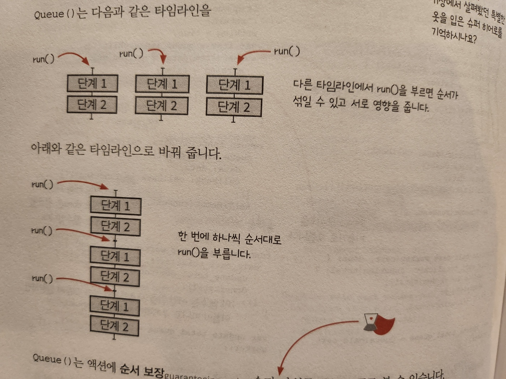
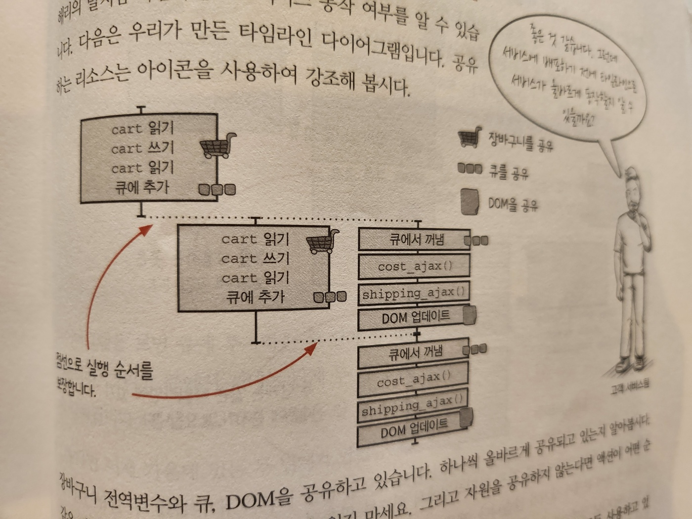
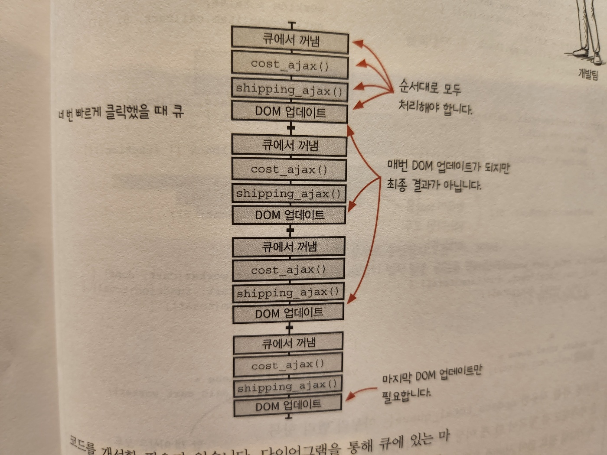

# 16. 타임라인 사이에 자원 공유하기

#### 이번 장에서 살펴볼 내용

- `자원을 공유해서 생기는 버그`를 `찾는 방법`을 배웁니다
- `안전하게 자원을 공유`할 수 있는 `자원 공유 기본형`을 만드는 방법을 이해합니다
  - 동시성 기본형(concurrency primitive), 재사용 가능한 코드

## 좋은 타임라인의 원칙

1. 타임라인은 적을수록 이해하기 쉽습니다
2. 타임라인은 짧을수록 이해하기 쉽습니다
3. 공유하는 자원이 적을수록 이해하기 쉽습니다
4. 자원을 공유한다면 서로 조율해야 합니다
5. 시간을 일급으로 다룹니다

- 15장에선 1~3번까지 알아봤습니다
  - 1. 액션 확인
  - 2. 타임라인 그리기
  - 3. 타임라인 단순화
- 이번장에서 배울 타임라인 원칙
  - 4. 타임라인끼리 공유하는 자원을 조율하기 위해 재사용 가능한 방법을 만들기

## 장바구니에 아직 버그가 있습니다


- 장바구니 추가 클릭을 두 번
- 가능한 실행 순서
  - 1. 동시에 실행(불가능)
  - 2. 왼쪽 먼저 실행(기대한 결과)
  - 3. 오른쪽 먼저 실행(기대하지 않은 결과)

## DOM이 업데이트 되는 순서를 보장해야 합니다

- 오른쪽이 먼저 실행되는 것을 막아야 합니다
- 클릭을 큐에 추가

## 자바스크립트에서 큐 만들기

### 자바스크립트에는 큐 자료 구조가 없기 때문에 만들어야 합니다


- 큐에서 처리할 일과 클릭 핸들러에서 처리할 일을 나눠 봅시다
- 클릭 핸들러
  - 가능한 많은 잡업을 클릭 핸들러에서 하는 것이 좋습니다
  - 클릭 핸들러에는 다른 작업이 끼어들 수 없어서 순서가 섞일 염려가 없습니다
- 핸들러가 끝날 때 비동기 액션을 큐에 추가합니다

### 큐에서 처리할 작업을 큐에 넣기

```js
// 현재 코드
function add_item_to_cart(item) {
  cart = add_item(cart, item);
  calc_cart_total(cart, update_total_dom);
}

function calc_cart_total(cart, callback) {
  let total = 0;
  cost_ajax(cart, function (cost) {
    total += cost;
    shipping_ajax(cart, function (shipping) {
      total += shipping;
      callback(total);
    });
  });
}
```

```js
// 새로운 코드
function add_item_to_cart(item) {
  cart = add_item(cart, item);
  update_total_queue(cart);
}

function calc_cart_total(cart, callback) {
  let total = 0;
  cost_ajax(cart, function (cost) {
    total += cost;
    shipping_ajax(cart, function (shipping) {
      total += shipping;
      callback(total);
    });
  });
}

const queue_items = [];

function update_total_queue(cart) {
  queue_items.push(cart);
}
```

- 지금까지 큐는 그냥 배열입니다.
  - 큐에 항목을 추가하는 것은 배열 끝에 항목을 추가하는 간단한 코드 입니다

### 큐에 있는 첫 번째 항목을 실행합니다

- 큐에 넣은 작업을 실행하려면 큐 가장 앞에 있는 항목을 꺼내 작업을 시작하면 됩니다

```js
function add_item_to_cart(item) {
  cart = add_item(cart, item);
  update_total_queue(cart);
}

function calc_cart_total(cart, callback) {
  let total = 0;
  cost_ajax(cart, function (cost) {
    total += cost;
    shipping_ajax(cart, function (shipping) {
      total += shipping;
      callback(total);
    });
  });
}

const queue_items = [];

function runNext() {
  // 배열의 첫 번째 항목을 꺼내 cart에 넣습니다
  const cart = queue_items.shift();
  calc_cart_total(cart, update_total_dom);
}

function update_total_queue(cart) {
  queue_items.push(cart);
  setTimeout(runNext, 0); // setTimeout 이벤트 루프에 작업을 추가합니다
}
```

- 항목을 순서대로 처리해야 하지만 지금은 동시에 두 항목이 처리되는 것을 막는 코드가 없습니다

### 두 번째 타임라인이 첫 번째 타임라인과 동시에 실행되는 것을 막기

- 이미 실행되는 작업이 있는지 확인해서 두 타임라인이 섞이지 않도록 만들어 봅시다


```js
// 새로운 코드
function add_item_to_cart(item) {
  cart = add_item(cart, item);
  update_total_queue(cart);
}

function calc_cart_total(cart, callback) {
  let total = 0;
  cost_ajax(cart, function (cost) {
    total += cost;
    shipping_ajax(cart, function (shipping) {
      total += shipping;
      callback(total);
    });
  });
}

const queue_items = [];
let working = false; // 현재 동작하고 있는 다른 작업이 있는지 확인합니다

function runNext() {
  if (working) {
    return; // 동시에 두 개가 동작하는 것을 막을 수 있습니다
  }
  working = true;
  const cart = queue_items.shift();
  calc_cart_total(cart, update_total_dom);
}

function update_total_queue(cart) {
  queue_items.push(cart);
  setTimeout(runNext, 0);
}
```

- 두 타임라인에 동시에 실행되는 것을 막았지만 장바구니에 추가된 작업이 항상 하나만 실행될 것입니다
- 현재 작업이 끝났을 때 다음 작업을 실행할 수 있도록 고쳐봅시다

### 다음 작업을 시작할 수 있도록 calc_cart_total() 콜백 함수를 고쳐봅시다

- calc_cart_total()에 새로운 콜백을 전달해 봅시다
  - 작업 완료(working = false)를 기록하고 다음 작업을 실행하게 하는 콜백 함수


```js
// 새로운 코드
const queue_items = [];
let working = false;

function runNext() {
  if (working) {
    return;
  }
  working = true;
  const cart = queue_items.shift();
  calc_cart_total(cart, function (total) {
    update_total_dom(total);
    // 작업완료를 표시하고 다음 작업을 시작합니다
    working = false;
    runNext();
  });
}

function update_total_queue(cart) {
  queue_items.push(cart);
  setTimeout(runNext, 0);
}
```

- 비동기로 작업을 이어서 할 수 있는 중요한 반복 구조를 만들었습니다
  - 이제 배열에 있는 모든 항목을 반복할 수 있습니다
  - 하지만 문제가 있습니다
  - 배열이 비었을 때 멈추지 않는다는 것 입니다

### 항목이 없을 때 멈추게 하기

- 큐 워커는 기본적으로 큐가 바닥날 때까지 실행합니다
- 빈 큐에서 queue_items.shift()를 호출하면 undefined가 반환됩니다
  - 이 값을 장바구니 항목으로 사용하면 안됩니다


```js
// 새로운 코드
const queue_items = [];
let working = false;

function runNext() {
  if (working) {
    return;
  }
  // 추가된 부분 시작
  if (queue_items.length === 0) {
    return;
  }
  // 추가된 부분 끝
  working = true;
  const cart = queue_items.shift();
  calc_cart_total(cart, function (total) {
    update_total_dom(total);
    working = false;
    runNext();
  });
}

function update_total_queue(cart) {
  queue_items.push(cart);
  setTimeout(runNext, 0);
}
```

- 잘 동작하는 큐가 생겼습니다
  - 이제 사용자가 아무리 많이 빠르게 클릭해도 순서대로 처리할 수 있습니다
- 큐 코드에 전역변수 두 개가 있습니다
  - 전역변수는 잠재적으로 문제가 될 수 있기 때문에 없애봅시다

### 변수와 함수를 함수 범위로 넣기

- Queue()라는 함수에 전역변수와 사용하는 함수를 넣어 다른 곳에서 접근할 수 없도록 해봅시다
- 사용자는 update_total_queue()만 필요하기 때문에 Queue()의 리턴값을 update_total_queue 변수에 할당해서 사용하면 됩니다


```js
// 새로운 코드 - 모든 코드를 Queue() 함수로 감싸기
function Queue() {
  const queue_items = []; // 전역 변수가 Queue()의 지역변수로 바뀝니다
  let working = false;

  function runNext() {
    if (working) {
      return;
    }
    if (queue_items.length === 0) {
      return;
    }

    working = true;
    const cart = queue_items.shift();
    calc_cart_total(cart, function (total) {
      update_total_dom(total);
      working = false;
      runNext();
    });
  }

  return function (cart) {
    // update_total_queue
    queue_items.push(cart);
    setTimeout(runNext, 0);
  };
}

const update_total_queue = Queue(); // 리턴된 함수를 원래 함수처럼 쓸 수 있습니다
```

- 모든 전역변수를 Queue() 범위로 넣었기 때문에 Queue() 밖에서 변경할 수 없습니다
  - 그리고 Queue()는 작은 코드이므로 전역변수에 접근하는 코드도 많지 않습니다
  - 그리고 큐를 여러 개 만들 수 있게 되었습니다
  - 하지만 모두 장바구니에 제품을 추가하는 일을 합니다

## 쉬는 시간

### Q1. 위 코드는 저희가 함수형 프로그래밍을 하는 데 변경 가능한 값을 자주 사용하는 것이 아닌가요?

- 함수형 프로그래밍은 특정한 코딩 습관을 강요하지 않습니다
  - 대신 여러분의 선택을 통해 생각할 수 있는 틀을 제공합니다
- update_total_queue()는 액션입니다
  - 특히 호출하는 순서와 횟수가 중요한 공유 자원입니다
- 함수형 프로그래밍에서 계산보다 액션에 더 큰 노력과 주의를 기울일 필요가 있습니다
  - 그래서 공유할 수 있는 큐를 잘 만드는 것이 중요합니다
  - 어떤 타임라인에서나 update_total_queue()를 사용할 수 있고, 동작을 예상할 수 있습니다
- 함수형 프로그래밍은 다루기 어려운 액션을 잘 다루기 좋습니다
  - 만약 액션을 잘 사용하기 위해 값을 변경해야 한다면 그렇게 하는 것이 좋습니다

### Q2. 왜 콜백 안에서 runNext()를 호출해야 하나요? calc_cart_total() 다음에 runNext()를 호출하면 안 되나요?


- 콜백 안에서 runNext()를 호출하는 이유는 calc_cart_total()이 비동기 호출이기 때문입니다

### Q3. 두 타임라인이 자원을 안전하게 공유하게 만들려면 많은 작업이 필요한 것 같습니다. 이 방법이 최선인가요?

- 큐를 만들기 위해 여러 단계를 거쳤습니다
  - 큐는 조심해서 만들어야 하기 때문에 여러 단계로 나눠 작업했습니다
  - 하지만 그렇게 긴 코드는 아닙니다
  - 그리고 한번 만든 큐는 다시 만들 필요는 없습니다

## 원칙: 공유하는 방법을 현실에서 착안하기

- 사람들이 자원을 공유하기 위해 줄 서는 것을 보고 큐를 만들었습니다
  - 공유자원: 화장실, 은행, 푸드트럭 등
- 줄 서는 것은 일반적이지만 모든 경우에 좋은 것은 아닙니다
  - 기다려야 한다는 단점이 있습니다
  - 사람들은 기다리지 않고 자원을 공유하기도 합니다
    - 화장실 문을 잠글 수 있게 한다
    - 공공 도서관은 지역사회가 많은 책을 공유할 수 있는 곳입니다
    - 칠판을 사용하면 선생님 한 명이 교실 전체에 정보를 공유할 수 있습니다
- 자원을 공유하는 프로그램을 만든다면 이런 것을 모두 사용해 볼 수 있습니다
  - 다음페이지에서 앞에서 만든 코드를 재사용할 수 있도록 만들어 봅시다

## 큐를 재사용할 수 있도록 만들기

### done() 함수 빼내기

- 함수 본문을 콜백으로 바꾸기 리팩터링으로 큐를 반복화해서 처리하는 코드(runNext()를 부르는 코드)와 큐에서 하는 일(calc_cart_total()을 부르는 코드)을 분리할 수 있습니다

```js
// 새로운 코드
function Queue() {
  const queue_items = [];
  let working = false;

  function runNext() {
    if (working) {
      return;
    }
    if (queue_items.length === 0) {
      return;
    }

    working = true;
    const cart = queue_items.shift();

    // 원래 cart를 사용하지 않고 cart를 인자로 받아 지역적으로 사용합니다
    function worker(cart, done) {
      // done은 콜백함수 이름입니다
      calc_cart_total(cart, function (total) {
        update_total_dom(total);
        done(total);
      });
    }

    // 두 줄을 새로운 함수로 뺍니다
    worker(cart, function () {
      working = false;
      runNext();
    });
  }

  return function (cart) {
    queue_items.push(cart);
    setTimeout(runNext, 0);
  };
}

const update_total_queue = Queue();
```

- done() 콜백으로 큐 타임라인 작업을 이어서 할 수 있습니다
- 콜백함수에서 working 값을 false로 설정하고 다음 작업을 실행하기 위해 runNext()를 호출합니다
- 이제 worker() 함수는 의존하고 있는 것이 없어서 Queue() 밖으로 빼서 인자로 전달합니다

### 워커 행동을 바꿀 수 있도록 밖으로 뺍니다

```js
// 새로운 코드
function Queue(worker) {
  const queue_items = [];
  let working = false;

  function runNext() {
    if (working) {
      return;
    }
    if (queue_items.length === 0) {
      return;
    }

    working = true;
    const cart = queue_items.shift();

    worker(cart, function () {
      working = false;
      runNext();
    });
  }

  return function (cart) {
    queue_items.push(cart);
    setTimeout(runNext, 0);
  };
}

function calc_cart_worker(cart, done) {
  calc_cart_total(cart, function (total) {
    update_total_dom(total);
    done(total);
  });
}

const update_total_queue = Queue(calc_cart_worker);
```

- 일반적인 큐를 만들었습니다
- Queue()에 있는 기능은 모두 일반적인 기능입니다
  - 원하는 동작은 인자로 넘길 수 있습니다

### 작업이 끝났을 때 실행하는 콜백을 받기

- 개발팀에서 작업이 끝났을 때 콜백을 실행하는 설정 기능이 필요하다고 합니다
  - 추가 정보는 작업 데이터와 콜백을 작은 객체로 만들어 큐에 넣을 수 있습니다

```js
function Queue(worker) {
  const queue_items = [];
  let working = false;

  function runNext() {
    if (working) {
      return;
    }
    if (queue_items.length === 0) {
      return;
    }

    working = true;
    const item = queue_items.shift(); // cart -> item으로 이름을 바꿉니다

    worker(item.data, function () {
      working = false;
      runNext();
    });
  }

  return function (data, callback) {
    queue_items.push({
      data: data,
      callback: callback || function () {},
    });
    setTimeout(runNext, 0);
  };
}

function calc_cart_worker(cart, done) {
  calc_cart_total(cart, function (total) {
    update_total_dom(total);
    done(total);
  });
}

const update_total_queue = Queue(calc_cart_worker);
```

- callback을 기본값을 설정하기 위해 관용 문법을 사용했습니다
  - callback || function () {}
- 현재까지 코드는 작업이 끝났을 때 실행되는 콜백을 데이터와 함께 저장했습니다
  - 하지만 아직 콜백을 사용하지 않았습니다

### 작업이 완료되었을 때 콜백 부르기

```js
function Queue(worker) {
  const queue_items = [];
  let working = false;

  function runNext() {
    if (working) {
      return;
    }
    if (queue_items.length === 0) {
      return;
    }

    working = true;
    const item = queue_items.shift();

    worker(item.data, function (val) {
      working = false;
      setTimeout(item.callback, 0, val); // 콜백에 인자를 전달합니다
      runNext();
    });
  }

  return function (data, callback) {
    queue_items.push({
      data: data,
      callback: callback || function () {},
    });
    setTimeout(runNext, 0);
  };
}

/**
 * cart에는 제품 데이터가 들어있고
 * done은 완료될 때 부르는 함수입니다
 */
function calc_cart_worker(cart, done) {
  calc_cart_total(cart, function (total) {
    update_total_dom(total);
    done(total);
  });
}

const update_total_queue = Queue(calc_cart_worker);
```

- Queue() 코드에서 item.data와 val이름을 잘 보면 일반적인 이름을 사용했습니다
  - Queue()는 일반적인 함수이기 때문에 어떤 데이터에 사용할지 모릅니다
- 하지만 calc_cart_work()에서는 같은 값의 변수에 cart와 total이라는 이름을 사용했습니다
  - calc_cart_work()는 이 값이 어떤 값으로 사용할지 알기 때문입니다
- 변수명은 구체화 단계에 따라 하는 일을 표현해야 합니다
- 이제 큐는 재사용하기 정말 좋습니다
  - 큐를 거치는 모든 작업을 처리하고 작업이 완료되면 타임라인이 이어서 작업을 계속합니다
  - 이제 지금까지 한 일을 정리해 봅시다

### Queue()는 액션에 새로운 능력을 줄 수 있는 고차 함수입니다

- Queue()는 함수를 인자로 받아 또 다른 함수를 리턴하는 함수입니다

```js
const update_total_queue = Queue(calc_cart_worker);
```

- Queue()는 어떤 함수를 새로운 타임라인에서 실행하고 한 번에 한 타임라인만 실행할 수 있도록 만들어주는 고차함수입니다



- Queue()는 액션에 순서 보장(guaranteeing order)하는 슈퍼 파워를 주는 도구로 볼 수 있습니다
- Queue()라는 말 대신 linearize()라고 할 수도 있습니다
  - 큐가 액션 호출을 순서대로 만들기 때문입니다
  - 내부적으로 큐를 사용하지만 큐를 사용하지만 큐를 사용한다는 것은 내부 구현일 뿐입니다
- Queue()는 동시성 기본형(concurrency primitive)입니다
  - 여러 타임라인을 올바르게 동작하도록 만드는 재사용 가능한 코드입니다
  - 동시성 기본형은 방법은 다르지만 모두 실행 가능한 순서를 제한하면서 동작합니다
  - 기대하지 않는 실행 순서를 없애면 코드가 기대한 순서로 동작한다는 것을 보장할 수 있습니다

## 지금까지 만든 타임라인 분석하기



- 공유 리소스

  - 장바구니 전역변수
  - 큐
  - DOM

- 하나씩 올바르게 공유되고 있는지 알아봅시다
  - 장바구니 전역변수
    - 동시 실행(불가능)
    - 왼쪽 먼저 실행(기대한 결과) : 가능
    - 오른쪽 먼저 실행(기대하지 않은 결과) : 불가능
  - DOM
    - 동시 실행(불가능)
    - 왼쪽 먼저 실행(기대한 결과) : 가능
    - 오른쪽 먼저 실행(기대하지 않은 결과) : 불가능
  - 큐
    - 동시 실행(불가능)
    - 왼쪽 먼저 실행(기대한 순서) : 가능
    - 오른쪽 먼저 실행(기대한 순서) : 가능
    - 액션의 순서가 바뀌는 것은 막을 수 없습니다
      - 하지만 동시성 기본 큐가 모두 올바른 결과가 나오는 것을 보장해줍니다

## 원칙: 문제가 있을 것 같으면 타임라인 다이어그램을 살펴보세요

## 큐를 건너 뛰도록 만들기

- 세라) 올바른 순서로 동작하지만 너무 느려요 !



- 네 번 빠르게 클릭했을 때 큐

- 코드 개선 필요
  - 다이어그램을 통해 DOM 업데이트는 큐에 있는 마지막 업데이트만 필요하다는 것을 알 수 있습니다

```js
// max: 보관할 수 있는 최대 큐 크기를 넘깁니다
function DroppingQueue(max, worker) {
  const queue_items = [];
  let working = false;

  function runNext() {
    if (working) {
      return;
    }
    if (queue_items.length === 0) {
      return;
    }

    working = true;
    const item = queue_items.shift();

    worker(item.data, function (val) {
      working = false;
      setTimeout(item.callback, 0, val);
      runNext();
    });
  }

  return function (data, callback) {
    queue_items.push({
      data: data,
      callback: callback || function () {},
    });
    while (queue_items.length > max) {
      // 큐에 추가한 후에 항목이 max를 넘는다면 모두 버립니다
      queue_items.shift();
    }
    setTimeout(runNext, 0);
  };
}

function calc_cart_worker(cart, done) {
  calc_cart_total(cart, function (total) {
    update_total_dom(total);
    done(total);
  });
}

const update_total_queue = DroppingQueue(1, calc_cart_worker); // 한 개 이상은 모두 버립니다
```

- 사용자는 아무리 빨리 항목을 추가해도 큐 항목이 한 개 이상 늘어나지 않습니다(최대 두 번만 기다리게 됩니다)

## 연습 문제

- 문제 저장하기 버튼을 구현할 때 save_ajax() 호출은 서로 덮어 쓸 수 있습니다
- 드로핑 큐를 사용해 문제를 해결해 보세요

```js
// 개선 전
const document = {
  // ...
};

function save_ajax(document, callback) {
  // ...
}

saveButton.addEventListener("click", function () {
  save_ajax(document);
});
```

```js
// 개선 후
const document = {
  // ...
};

function save_ajax(document, callback) {
  // ...
}

const save_ajax_queued = DroppingQueue(1, save_ajax);

saveButton.addEventListener("click", function () {
  save_ajax_queued(document);
});
```

## 결론

- 이 장에서 자원 공유 문제에 대해 살펴봤습니다
- DOM 업데이트는 특정한 순서로 발생합니다
- 다이어 그램을 통해 문제를 찾은 다음 큐를 만들어 문제를 해결했습니다
- 큐 코드를 고쳐 재사용 가능한 고차 함수로 만들었습니다

## 요점 정리

- 타이밍 문제는 재현하기 어렵고, 테스트로 확인하지 못할 수 있습니다
  - 타임라인 다이어그램을 그려 분석하고 타이밍 문제를 확인해 보세요
- 자원 공유 문제가 있을 때 현실에서 해결 방법을 찾아보세요
  - 사람들은 항상 무엇인가를 문제없이 공유합니다
  - 사람을 통해 배우세요
- 재사용 가능한 도구를 만들면 자원 공유에 도움이 됩니다
  - 자원 공유를 위한 도구를 동시성 기본형이라고 부릅니다
  - 동시성 기본형을 사용하면 코드가 더 깨끗하고 단순해집니다
- 동시성 기본형은 액션을 고차 함수로 받습니다
  - 이 고차함수는 액션에 슈퍼파워를 줍니다
- 동시성 기본형은 스스로 만들기 어렵지 않습니다
  - 작은 단계부터 시작해 리팩터링 하면서 스스로 만들 수 있습니다

## 다음 장에서 배울 내용

- 자원 공유 문제를 확인하는 방법과 동시성 기본형으로 문제를 해결하는 것을 알아봤습니다
- 다음 장에서 두 타임라인을 조율해 문제를 해결하는 방법을 알아보겠습니다
