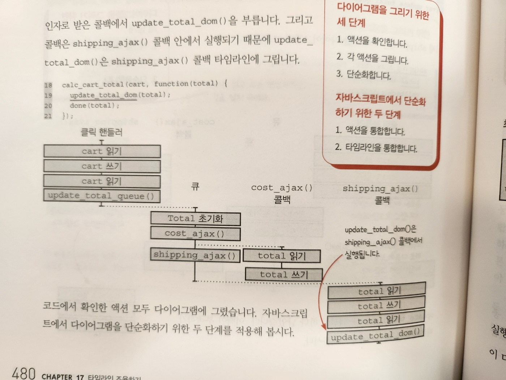
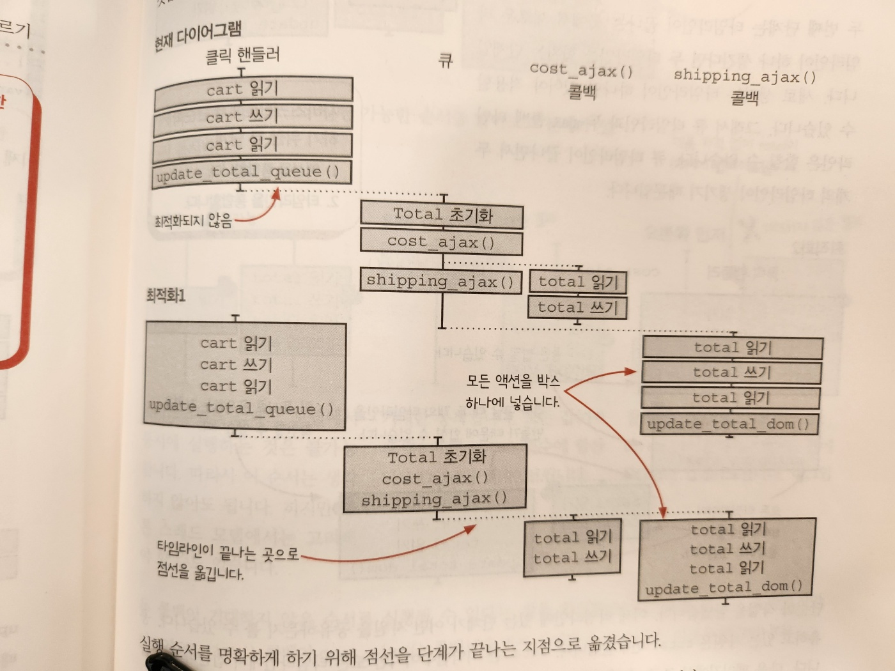
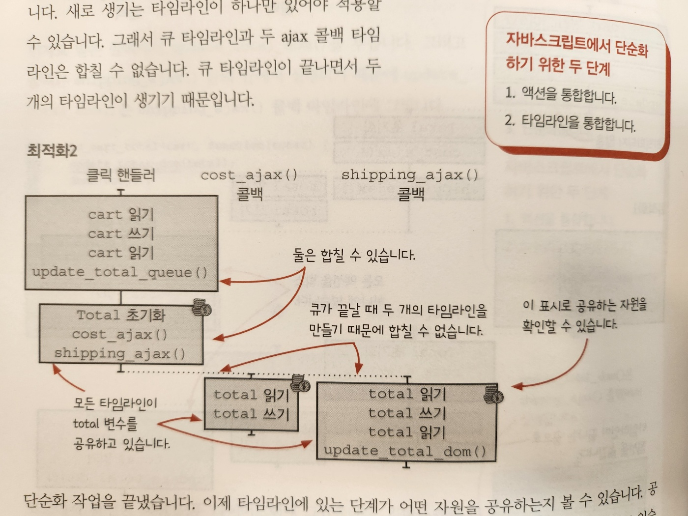
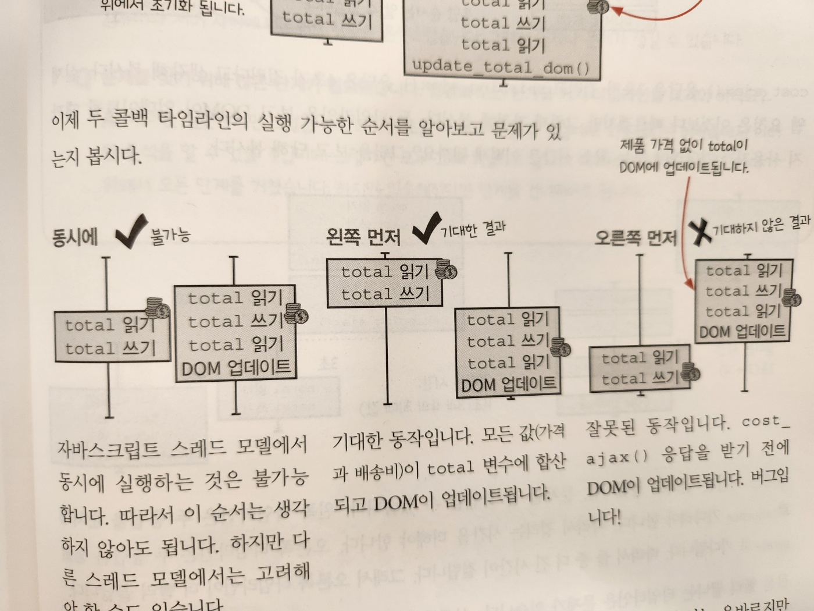
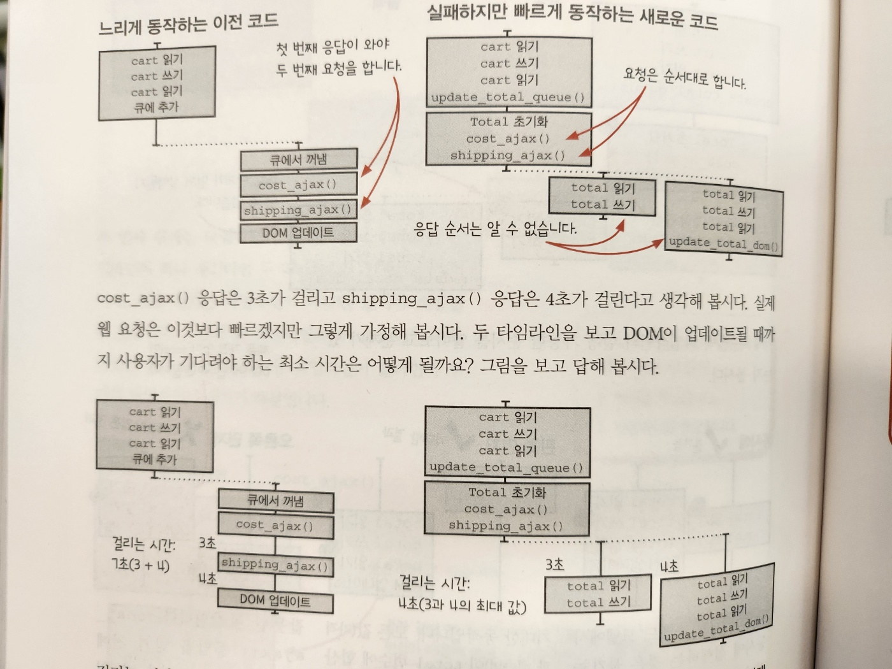
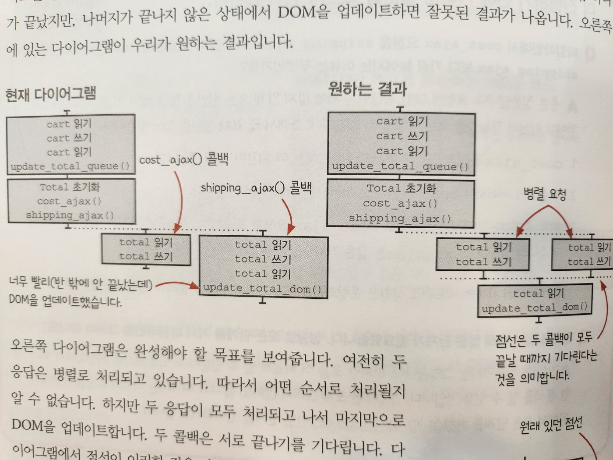
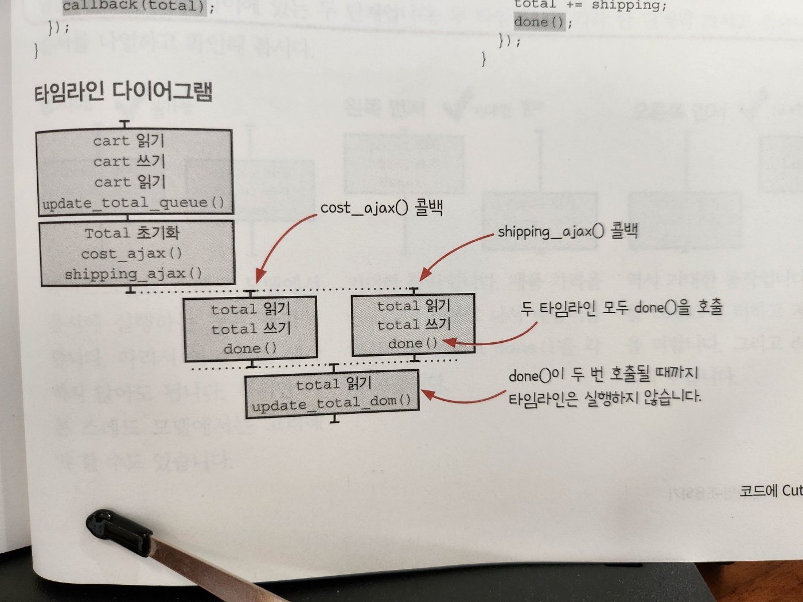
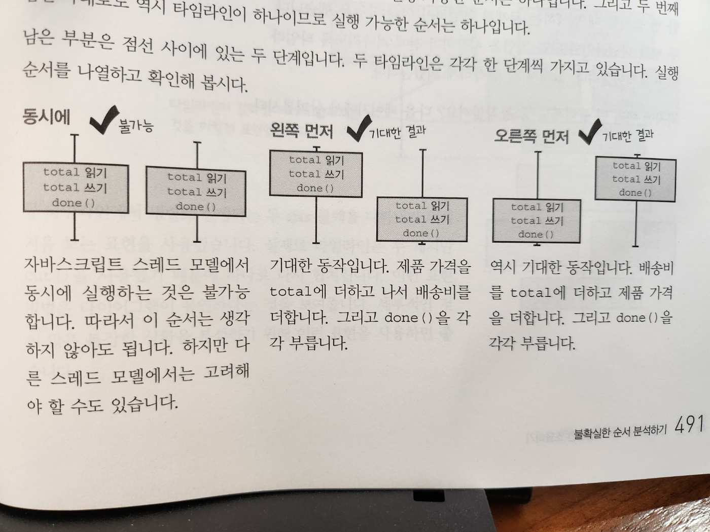
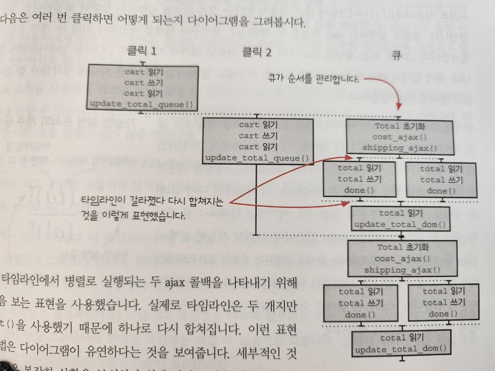

# 17. 타임라인 조율하기

#### 이번 장에서 살펴볼 내용

- `타임라인을 조율`하기 위한 `동시성 기본형`을 만들어 봅니다
  - 동시성 기본형(concurrency primitive)
    - 실행가능한 순서를 제한
    - e.g. 큐
- 시간에 관한 중요한 관점인 순서와 반복을 함수형 개발자들이 어떠햐게 다루는지 배웁니다

## 좋은 타임라인의 원칙

- 1. 타임라인은 적을수록 이해하기 쉽습니다
- 2. 타임라인은 짧을 수록 이해하기 쉽습니다
- 3. 공유하는 자원이 적을수록 이해하기 쉽습니다
- 4. 자원을 공유한다면 서로 조율해야 합니다
- 5. 시간을 일급으로 다룹니다

  - 액션의 순서와 타이밍을 맞추는 것은 어렵습니다
  - `타임라인을 관리하는 재사용 가능한 객체`를 만들면 `타이밍 문제를 쉽게 처리`할 수 있습니다
    - 중요한 것은 시간에 대한 관점입니다
    - 호출 순서와 반복은 직접 다룰 수 있습니다
  - 모든 언어는 시간에 대한 암묵적인 모델을 가지고 있습니다
  - 하지만 언어에서 제공하는 시간 모델은 우리가 해결하려는 문제와 맞지 않는 모델인 경우가 있습니다
    - 함수형 프로그래밍으로 문제에 맞는 새로운 시간 모델을 만들 수 있습니다

- 1~4번 까지는 지난 두 장에서 알아봤습니다

## 버그가 있습니다

- 새로운 버그가 생긴 장바구니에 다섯 번째 원칙을 적용해 봅시다
- 인터페이스 속도를 개선해달라는 요청이 많이 있었습니다

  - 그래서 장바구니에 대한 속도 개선과 제품 추가 버튼에 대한 최적화를 했습니다
  - 그런데 하나만 추가해도 가끔 잘못된 합계가 표시됩니다
  - 버그를 재현해 봅시다

- 장바구니에 제품 하나만 추가했습니다
  - 올바르게 작동하는 경우
    - 제품 6$ + 배송비 2$ = 8$
  - 잘못 동작하는 경우
    - 제품 6$ + 배송비 2$ => 2$ ?

## 코드가 어떻게 바뀌었나요

```js
// 최적화하기 전(항상 올바르게 동작함)
function add_item_to_cart(item) {
  cart = add_item(cart, item);
  update_total_queue(cart);
}

function calc_cart_total(cart, callback) {
  var total = 0;
  cost_ajax(cart, function (cost) {
    total += cost;

    shipping_ajax(cart, function (shipping) {
      total += shipping;
      callback(total);
    });
  });
}

function calc_cart_worker(cart, done) {
  calc_cart_total(cart, function (total) {
    update_total_dom(total);
    done(total);
  });
}

const update_total_queue = DroppingQueue(1, calc_cart_worker);
```

```js
// 최적화한 후(가끔 잘못된 합계가 표시됨)
function add_item_to_cart(item) {
  cart = add_item(cart, item);
  update_total_queue(cart);
}

function calc_cart_total(cart, callback) {
  var total = 0;
  cost_ajax(cart, function (cost) {
    total += cost;
  }); // 닫는 괄호의 위치가 바뀜 - shipping_ajax가 콜백안에서 실행되었던 것이 바깥으로 빠져나옴

  shipping_ajax(cart, function (shipping) {
    total += shipping;
    callback(total);
  });
}

function calc_cart_worker(cart, done) {
  calc_cart_total(cart, function (total) {
    update_total_dom(total);
    done(total);
  });
}

const update_total_queue = DroppingQueue(1, calc_cart_worker);
```

- shipping_ajax()는 cost_ajax() 콜백 안에서 호출되는 대신 cost_ajax() 다음 바로 실행됩니다
- 두 ajax 요청이 거의 동시에 실행되기 때문에 빠르지만 버그가 있습니다
- 타임라인 다이어그램을 그려봅시다

## 액션을 확인하기: 단계1

```js
function add_item_to_cart(item) {
  cart = add_item(cart, item); // cart: 읽기, 쓰기, 읽기
  update_total_queue(cart); // update_total_queue() 부르기
}

function calc_cart_total(cart, callback) {
  var total = 0; // total = 0 초기화
  cost_ajax(cart, function (cost) {
    // cost_ajax() 부르기
    total += cost; // total: 읽기, 쓰기
  });

  shipping_ajax(cart, function (shipping) {
    // shipping_ajax() 부르기
    total += shipping; // total: 읽기, 쓰기, 읽기
    callback(total);
  });
}

function calc_cart_worker(cart, done) {
  calc_cart_total(cart, function (total) {
    update_total_dom(total); // update_total_dom() 부르기
    done(total);
  });
}

const update_total_queue = DroppingQueue(1, calc_cart_worker);
```

- 코드에서 액션에 해당하는 부분을 확인합니다
- calc_cart_total()의 total은 지난번에 지역변수로 바꾸고 다이어그램에서 없앴지만
  - 이제 여러 타임라이에서 사용하게 되었습니다
  - 안전하게 공유되는지 확신이 없습니다

## 모든 액션을 그리기: 단계2

- 1. cart 읽기
- 2. cart 쓰기
- 3. cart 읽기
- 4. update_total_queue() 부르기
- 5. total = 0 초기화
- 6. cost_ajax() 부르기
- 7. total 읽기
- 8. total 쓰기
- 9. shipping_ajax() 부르기
- 10. total 읽기
- 11. total 쓰기
- 12. total 읽기
- 13. update_total_dom() 부르기

- 이제 그려봅시다
  - 이미 경험이 있기 때문에 액션을 몇 개로 모아서 그리겠습니다



## 다이어그램 단순화하기: 단계3

- 자바스크립트 모델에서 최적화하려면 두 단계를 적용하면 됩니다
  - 1. 하나의 타임라인에 있는 모든 액션을 하나로 통합합니다
  - 2. 타임라인이 끝나는 곳에서 새로운 타임라인이 하나만 생긴다면 통합합니다



- 실행 순서를 명확하게 하기 위해 점선을 단계가 끝나는 지점으로 옮겼습니다
- 이제 문제가 명확히 보입니다
- 나머지 단순화 단계를 계속해 봅시다



- 타임라인이 끝나는 곳에서 새로운 타임라인이 하나 생긴다면 두 타임라인을 합치는 단계입니다
  - 새로 생기는 타임라인이 하나만 있어야 적용할 수 있습니다
    - 마지막의 두 ajax 콜백 타임라인은 합칠 수 없습니다(두 개의 타임라인이 생기기 때문)
- 타임라인에 있는 단계가 어떤 자원을 공유하는지 볼 수 있습니다
  - 공유하고 있는 자원은 total 변수뿐입니다
  - total은 지역변수이지만 모든 타임라인에서 접근하고 있습니다

## 실행 가능한 순서 분석하기

- 두 콜백 타임라인의 실행 가능한 순서를 알아보고 문제가 있는지 알아봅시다



- 두 콜백이 기대하지 않은 순서로 실행될 수 있다는 것을 확인했습니다
- 요청 순서는 올바르지만 shipping_ajax() 콜백이 cost_ajax() 콜백보다 먼저 실행될 수 있습니다
  - 이것은 버그입니다!

## 왜 지금 타임라인이 더 빠를까요?

- 가정
  - cost_ajax() 응답은 3초가 걸리고
  - shipping_ajax() 응답은 4초가 걸린다고 생각해 봅시다



- 왼쪽 타임라인은 두 응답을 순서대로 기다려야 합니다
  - 따라서 걸리는 시간을 더해야 합니다
- 오른쪽 타임라인은 두 응답을 병렬로 기다립니다
  - 따라서 더 빠릅니다

## 모든 병렬 콜백 기다리기

- 동시에 동작하는 ajax 응답을 모두 기다렸다가 DOM을 업데이트하면 됩니다
  - 나머지가 끝나지 않은 상태에서 DOM을 업데이트하면 잘못된 결과가 나옵니다



- 오른쪽 다이어그램은 완성해야 할 목표를 보여줍니다
- 두 응답은 병렬로 처리되고 있습니다
  - 따라서 어떤 순서로 처리될지 알 수 없습니다
- 하지만 컷은 앞에서 본 점선과 다르게 여러 타임라인의 끝에 맞춰 그립니다
- 컷은 타임라인을 앞 부분과 뒷 부분으로 나눕니다
- 컷은 실행가능한 순서를 줄이기 때문에 애플리케이션의 복잡성을 줄여줍니다
- 컷을 동시성 기본형으로 만들 수 있습니다
  - 만들어 봅시다!

## 타임라인을 나누기 위한 동시성 기본형

- `여러 타임라인이 다른 시간에 종료되어도 서로 기다릴 수 있는` 간단하고 재사용 가능한 기본형이 필요합니다
- 만약 그런 것이 있다면 여러 타임라인이 실행되는 순서를 신경쓰지 않아도 되고 타임라인이 모두 끝나는 것도 쉽게 처리할 수 있습니다
- 결국 경쟁 조건을 막을 수 있습니다
  - 경쟁 조건(race condition)
    - 어떤 동작이 먼저 끝나는 타임라인에 의존할 때 발생합니다
- 현실의 예시

  - 점심 시간
    - 누가 일을 먼저 끝나는지 신경쓰지 않고 서로를 기다릴 것입니다
    - 그리고 함께 점심을 먹습니다

- 멀티 스레드를 지원하는 언어에서는 스레드가 변경 가능한 상태를 공유하기 위해 원자적 업데이트 같은 기능을 사용해야 합니다
  - 하지만 자바스크립트는 단일 스레드라는 장점을 활용할 수 있습니다
  - 가능한 동기적으로 접근하는 간단한 변수로 동시성 기본형을 구현할 수 있습니다
  - 어떤 함수를 만들고 작업이 끝났을 때 이 함수를 부를 것입니다
  - 이 함수는 `호출될 때마다 호출된 횟수를 증가`시킵니다
  - `마지막 타임라인이 함수를 호출했을 때 콜백을 불러줍니다`

```js
/**
 * @param {number} num 기다릴 타임라인 수
 * @param {function} callback 모든 것이 끝났을 때 실행할 콜백
 */
function Cut(num, callback) {
  let num_finished = 0; // 카운터를 0으로 초기화
  // 리턴되는 함수는 타임라인이 끝났을 때 호출합니다
  return function () {
    num_finished += 1; // 함수를 호출할 때 마다 카운터가 증가합니다
    if (num_finished === num) {
      callback(); // 마지막 타임라인이 끝났을 때 콜백을 호출합니다
    }
  };
}
```

### 간단한 예제

```js
const done = Cut(3, function () {
  console.log("3 timelines are finished");
});
done();
done();
done();

// console.log => 3 timelines are finished
```

### 되새겨보기

- 자바스크립트 스레드는 하나입니다
- 타임라인은 다른 타임라인이 시작되기 전에 완료됩니다
- Cut()은 이런 장점을 활용해 변경할 수 있는 값을 안전하게 공유합니다
- 다른 언어에서는 타임라인을 조율하기 위해 락이나 다른 기능을 사용해야 합니다

## 코드에 Cut() 적용하기

- 장바구니에 제품을 추가하는 코드에 적용해봅시다
- 두 가지만 고민하면 됩니다
  - 1. Cut()을 보관할 범위
  - 2. Cut()을 어떤 콜백에 넣을지

### 1. Cut()을 보관할 범위

- 응답 콜백 끝에서 done()을 불러야 합니다
- 따라서 두 응답 콜백을 맏느는 calc_cart_total() 함수 범위에 cut()을 만드는 것이 좋을 것 같습니다

### 2. Cut()을 어떤 콜백에 넣을지

```js
// Cut()을 적용한 코드
function calc_cart_total(cart, callback) {
  let total = 0;

  // Cut 추가
  const done = Cut(2, function () {
    callback(total);
  });

  cost_ajax(cart, function (cost) {
    total += cost;
    done(); // Cut()을 호출합니다
  });

  shipping_ajax(cart, function (shipping) {
    total += shipping;
    done(); // Cut()을 호출합니다
  });
}
```



- 두 타임라인 모두 done()을 호출
- done()이 두 번 호출될 때 까지 타임라인은 실행하지 않습니다

## 쉬는 시간

### Q. Cut()은 정말 잘 동작하나요?

- Cut()은 잘 동작하지만 한가지 지켜야 할 원칙이 있습니다
  - done()은 항상 타임라인 끝에서 불러야 한다는 것입니다

### Q. Cut()은 정말 작은 코드입니다. 이렇게 간단한 코드가 유용할 수 있나요?

- 간단하지 않은 것을 재사용하기 쉬울까요?
- 간단하기 때문에 재사용하기 쉽고, 세야할 숫자가 있고 다 세면 함수를 실행하는 것이 Cut이 하는 일입니다

### Q. Promise처럼 다른 것을 사용하는 것이 더 좋지 않나요?

- 좋은 지적입니다
- 이미 구현된 동시성 기본형이 많이 있습니다
- 각 언어는 나름의 동시성 기본형을 가지고 있습니다
- 자바스크립트에 익숙한 개발자라면 Promise에 익숙할 것입니다
  - 특히 Cut()과 매우 비슷한 Promise.all()을 알고 있을 것입니다
- 문제를 해결하기 위해 이미 알고 있는 기본형이 있다면 그것을 사용하면 됩니다
- 하지만 이 책은 자바스크립트가 아닌 함수형 프로그램을 알려주는 것이 목적입니다
  - 언어와 상관 없이 어떤 소프트웨어 문제를 만났을 대 이런 원칙을 사용할 수 있어야 합니다
  - 만약 기본형이 없다면 구현할 수 있어야 합니다

## 불확실한 순서 분석하기

- Cut() 동시성 기본형을 코드에 적용해 봤습니다
- 동시에 실행하기 때문에 빠르고 모든 실행 순서에 문제가 없어서 올바른 결과를 얻을 것으로 예상합니다



## 여러 번 클릭하는 경우 분석



- 큐가 순서를 관리합니다
- Cut()이 있어서 다이어그램을 분석하기 조금 쉽습니다
- 타임라인을 두 개로 나누는 점선을 컷(cut)이라고 불렀습니다

  - 점선을 기준으로 위와 아래를 따로 분석할 수 있습니다
  - 컷을 기준으로 순서대로 동작하기 때문에 쉽습니다

- Q. 이렇게 복잡한 것이 모두 필요한 것인가요? 그냥 브라우저에서 동작하는 간단한 GUI를 만들려고 하는데요

  - A. 좋은 질문입니다. 우리는 다음 세 가지 복잡성을 다루고 있습니다
    - 1. 비동기 웹 요청
    - 2. 결과를 합쳐야 하는 두 개의 API응답
    - 3. 예측 불가능한 사용자의 액션

- `애플리케이션을 만들 때 사용자 인터랙션을 적게 만들어 3번을 없앨 수 있습니다`
  - 사용자에게 입력폼을 줄 수 있습니다
  - 사용자가 구매하고 싶은 모든 것을 적고 입력 폼을 전송할 수 있습니다
  - 물론 이것은 사용자에게 좋지 않은 경험을 줍니다
  - 인터렉션을 줄이는 것보다 충분히 편리하도록 사용자가 앱과 인터랙션을 할 수 있어야 합니다
- ajax 요청을 사용하지 않으면 1번 복잡성을 없앨 수 있습니다
  - 불가능
- 만약 API 하나로 처리할 수 있다면 2번 복잡성을 없앨 수 있습니다
  - 하지만 이것은 복잡성을 없앤 것이 아닌 복잡성을 서버로 옮긴 것뿐입니다
- 그럼 복잡성은 필연적일까요?
  - 아닙니다. 복잡성은 바꾸지 않으려고 하는 선택들로부터 생깁니다
  - 선택한 것이 항상 고려되어야 한다면 복잡성은 피할 수 없을지도 모릅니다
  - 그래서 우리에게는 복잡성을 다룰 수 있는 좋은 프로그래밍 기술이 필요합니다

## 연습문제

```js
// 잘못된 결과를 보여주는 코드
let sum = 0;

function countRegister(registerId) {
  const temp = sum;
  registerTotalAjax(registerId, function (money) {
    sum = temp + money;
  });
}

countRegister(1);
countRegister(2);

// 올바르게 수정한 코드
let sum = 0;

function countRegister(registerId) {
  registerTotalAjax(registerId, function (money) {
    sum += money; // temp를 제거하고 바로 더합니다
  });
}

countRegister(1);
countRegister(2);
```

## 딱 한 번만 호출하는 기본형

- 개발팀 킴) 새로운 기능이 필요합니다!
  - 누군가 제품을 장바구니에 처음 추가했을 때만 메시지를 보내려고 합니다
- 개발팀 제나) Cut() 또는 비슷한 것으로 만들 수 있을 것 같습니다
- 킴) Cut()은 모든 타임라인이 완료 되면 부르는 동시성 기본형이 아닌가요?
- 제나) 맞습니다. 만약 마지막이 아닌 첫 번째로 실행되는 타임라인이 done()을 부르도록 한다면 어떨까요?
  - 이 기본형을 JustOnce()라고 합시다!

```js
function JustOnce(action) {
  let alreadyCalled = false;
  return function (a, b, c) {
    if (alreadyCalled) {
      return;
    }
    alreadyCalled = true;
    return action(a, b, c);
  };
}
```

#### 되새겨 보기

- 자바스크립트는 싱글 스레드입니다
- 타임라인은 다른 타임라인이 시작되기 전에 끝납니다
- JustOnce()은 이런 장점을 활용해 변경할 수 있는 값을 안전하게 공유합니다
- 다른 언어에서는 타임라인을 조율하기 위해 락이나 다른 기능을 사용해야 합니다

## 암묵적 시간 모델 vs. 명시적 시간 모델

- 시간 모델로 실행에 관한 두 가지 관점을 알 수 있습니다
  - 순서와 반복입니다
- 자바스크립트의 시간 모델은 간단합니다

  - 1. 순차적 구문은 순서대로 실행됩니다(순서)
  - 2. 두 타임라인에 있는 단계는 왼쪽 먼저 실행되거나, 오른쪽 먼저 실행될 수 있습니다(순서)
  - 3. 비동기 이벤트는 새로운 타임라인에서 실행됩니다(순서)
  - 4. 액션은 호출할 때마다 실행됩니다(반복)

- 간단한 프로그램에서 암묵적 시간 모델은 좋습니다
  - 하지만 실행 방식을 바꾸지는 못합니다
- 암묵적 시간 모델의 실행 방식이 애플리케이션에서 필요한 실행방식과 따거 맞을 일은 거의 없습니다
  - 그래서 함수형 개발자는 필요한 실행 방식에 가깝게 새로운 시간 모델을 만듭니다
  - 예를 들어 비동기 콜백을 사용할 때 새로운 타임라인을 만들지 않도록 큐를 만들었습니다
  - 또 여러번 호출해도 한 번만 실행하는 액션을 만들기 위해 JustOnce() 기본형을 만들었습니다

## 쉬는 시간

- Q. 앞에서 만든 동시성 기본형은 모두 고차함수 입니다. 모든 동시성 기본형은 고차함수로 만들어야 하나요?
  - 항상 고차함수를 사용하는 것은 아닙니다
  - 자바스크립트에서는 비동기 콜백을 많이 사용하기 때문에 고차함수를 많이 사용해야 합니다
  - 대부분의 함수형 프로그래밍에 있는 동시성 기본형은 공통된 특징이 있습니다
    - 일급 값을 사용한다는 것입니다
    - 어떤 것을 일급으로 만들면 프로그래밍 언어로 다룰 수 있게 됩니다
    - 앞에서 만든 동시성 기본형도 일급 액션을 사용한 것을 알 수 있습니다
    - e.g. 큐 워커, JustOnce
- Q. 다섯 번째 원칙에서 '시간을 다룬다'라는 말이 있습니다. 조금 과장된 표현이 아닌가요?
  - 어쩌면 그럴지도 모르겠습니다. 프로그래밍할 때 중요한 관점인 순서와 반복을 명시적인 모델로 만들 때 '다룬다'는 용어를 사용했습니다
  - 언어가 사용하는 암묵적인 모델 대신 명시적인 모델을 만들 수 있지만, 엄밀히 말하면 시간을 다루는 것이 아니고 시간 모델을 다룬다고 하는 것이 맞습니다

## 연습문제

- 각각이 어떤 시간 모델을 만든 것일까요?
- Queue()
  - 큐에 추가된 항목은 독립적으로 하나의 타임라인에서 처리됩니다
  - 하나의 항목이 처리되어야 다음 항목을 처리할 수 있습니다
- Cut()
  - 모든 타임라인이 완료되면 콜백을 불러 새로운 타임라인을 시작합니다
- JustOnce()
  - JustOnce로 감싼 액션은 여러번 불러도 한 번만 실행됩니다
- DroppingQueue()
  - Queue와 비슷하지만 항목이 늘어나면 작업을 건너뜁니다

## 요약: 타임라인 사용하기

- 가장 중요한 것 부터 순서대로 나열했습니다
- 1. 타임라인 수를 줄입니다
  - 스레드나 비동기 호출, 서버 요청을 줄여 적은 타임라인을 만들면 시스템이 단순해집니다
- 2. 타임라인 길이를 줄입니다
  - 타임라인에 있는 액션을 줄여보세요.
  - 또 액션을 계산으로 바꿔보세요
    - 계산은 타임라인에 표시하지 않습니다
  - 그리고 암묵적인 입력과 출력을 업생 보세요
- 3. 공유 자원을 없앱니다
  - 공유하는 자원을 줄여보세요
  - 자원을 공유하지 않는 타임라인은 순서 문제가 생기지 않습니다
  - 가능하다면 단일 스레드에서 공유 자원에 접근하세요
- 4. 동시성 기본형으로 자원을 공유합니다
  - 자원을 안전하지 않게 공유한다면 큐나 락을 사용해 안전하게 공유할 수 있는 방법으로 바꾸세요
- 5. 동시성 기본형으로 조율합니다
  - 타임라인을 조율하기 위해 Promise나 컷과 같은 것으로 액션에 순서나 반복을 제한해 보세요

## 결론

- 응답 시간 차이 때문에 발생하는 경쟁 조건에 대해 알아봤습니다
  - 요청한 순서대로 응답이 도착하지 않는다면 잘못된 결과를 얻을 수 있습니다
- 두 타임라인이 협력할 수 있는 동시성 기본형을 만들었습니다
  - Cut(), JustOnce()

## 요점 정리

- 함수형 개발자느 언어가 제공하는 암묵적 시간 모델 대신 새로운 시간 모델을 만들어 사용합니다
  - 새로운 모델은 해결하려고 하는 문제를 푸는 데 도움이 됩니다
- 명시적 시간 모델은 종종 일급 값으로 만듭니다
  - 일급 값으로 만든 시간 모델은 프로그래밍 언어를 사용해서 시간을 다룰 수 있습니다
- 타임라인을 조율하기 위해 동시성 기본형을 만들 수 있습니다
  - 가능한 순서를 제한해 항상 올바른 결과가 나올 수 있도록 보장합니다
- 타임라인을 나누는 것도 타임라인을 조율하는 방법 중 하나입니다
  - 컷은 모든 타임라인의 작업이 끝날 때까지 기다렸다가 새로운 타임라인을 시작할 수 있도록 합니다

## 다음 장에서 배울 내용

- 파트2에서 일급 함수와 고차 함수를 많이 살펴봤습니다
  - 일급 함수와 고차함수를 조합하는 방법도 살펴보고 시간 모델을 만드는 방법도 알아봤습니다
- 이제 파트2의 마지막 주제인 어니언 아키텍처(onion architecture)를 중심으로 설계에 대해 이야기해 보겠습니다
