# 18. 반응형 아키텍처와 어니언 아키텍처

- 이번 장에서는 조금 더 높은 수준에서 설계와 아키텍처에 대해 살펴보려고 합니다
- 두 가지 일반적인 패턴
  - 반응형 아키텍처 : 순차적인 액션을 표현하는 방식을 뒤집습니다
  - 어니언 아키텍처 : 함수형 프로그래밍으로 현실 세계를 다루기 위한 고수준의 개념입니다

#### 이번 장에서 살펴볼 내용

- `반응형 아키텍처`로 `순차적 액션을 파이프라인으로` 만드는 방법을 배웁니다
- `상태 변경을 다루기 위한 기본형`을 만듭니다
- `도메인과 현실 세계의 상호작용`을 위해 `어니언 아키텍처`를 만듭니다
- 여러 계층에 어니언 아키텍처를 적용하는 방법을 살펴봅니다
- 전통적인 계층형 아키텍처와 어니언 아키텍처를 비교해 봅니다

## 두 아키텍처 패턴은 독립적입니다

- 반응형(reactive)과 어니언(onion) 패턴에 대해 알아보겠습니다
  - 두 패턴은 서로 다른 단계에서 사용합니다
- 반응형 아키텍처는 순차적 액션 단계에 사용하고, 어니언 아키텍처는 서비스의 모든 단계에서 사용합니다
- 두 패턴은 함께 사용할 수 있지만 따로 사용할 수도 있습니다

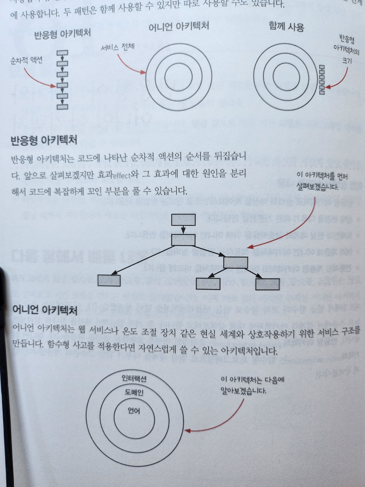

### 반응형 아키텍처

- 효과와 그 원인을 분리해서 코드에 복잡하게 꼬인 부분을 풀 수 있습니다

### 어니언 아키텍처

- 웹 서비스나 온도 조절 장치 같은 `현실 세계와 상호작용하기 위한 서비스 구조`를 만듭니다
- 함수형 사고를 적용한다면 자연스럽게 쓸 수 있는 아키텍처입니다

## 변경에 대한 원인과 효과가 강력하게 결합

- 이슈
  - UI를 추가할 때 마다 고쳐야 하는 곳이 많다 그리고 점점 더 많아진다

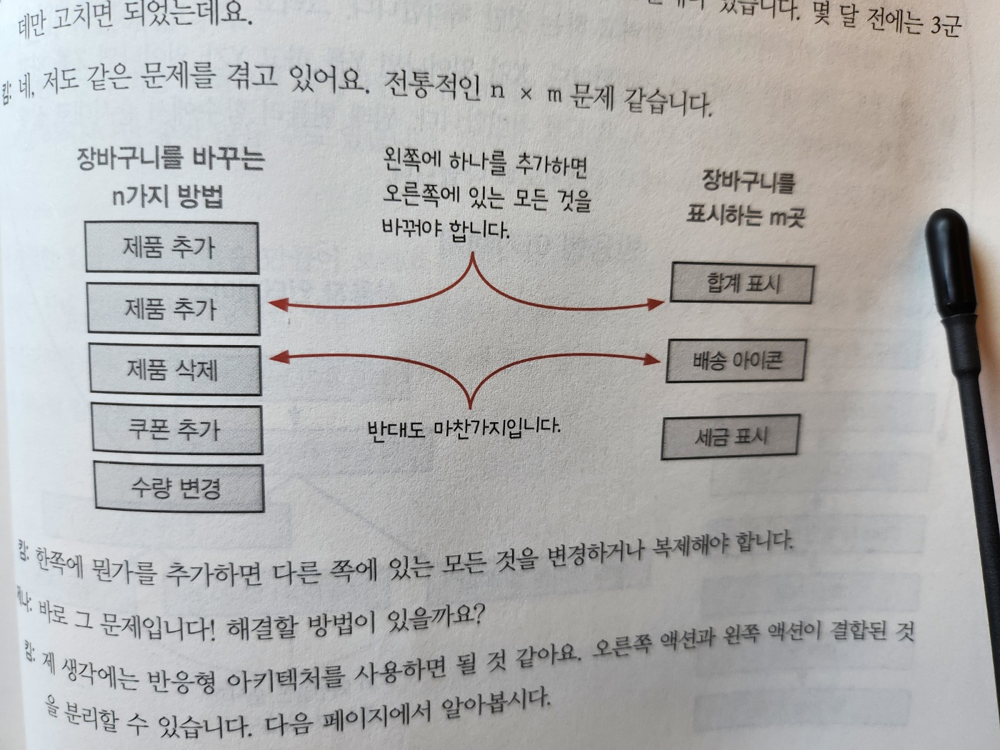

- 전통적인 `n * m` 문제
- 왼쪽에 하나를 추가하면 오른쪽에 있는 모든 것을 바꿔야 합니다
  - 반대도 마찬가집니다
- 반응형 아키텍처를 사용 -> 오른쪽 액션과 왼쪽 액션이 결합된 것을 분리할 수 있습니다

## 반응형 아키텍처는 무엇인가요?

- 반응형 아키텍처는 애플리케이션을 구조화하는 방법입니다
  - 반응형 아키텍처의 핵심 원칙은 이벤트에 대한 반응으로 일어날 일을 지정하는 것입니다
- 반응형 아키텍처는 웹 서비스와 UI에 잘 어울립니다
  - 웹 서비스는 웹 요청 응답에 일어날 일을 지정하고, UI는 버튼 클릭과 같은 이벤트 응답에 일어날 일을 지정하면 됩니다
    - 이런 것을 일반적으로 이벤트 핸들러라고 합니다

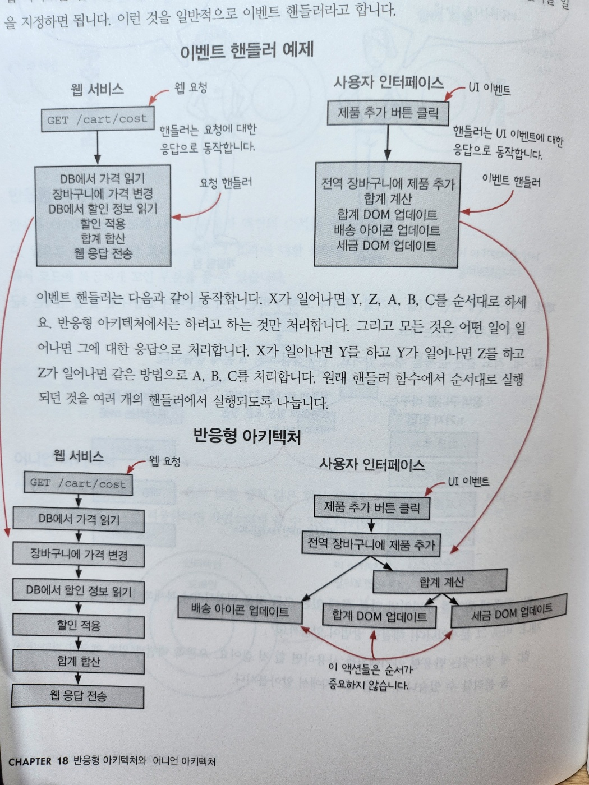

- 이벤트 핸들러 동작
  - X가 일어나면 Y, Z, A, B, C를 순서대로 하세요
- 반응형 아키텍처에서는 하려고 하는 것만 처리합니다
  - 그리고 모든 것은 어떤 일이 일어나면 그에 대한 응답으로 처리합니다
    - X가 일어나면 Y를 하고
    - Y가 일어나면 Z를 하고
    - Z가 일어나면 같은 방법으로 A, B, C를 처리합니다
- 원래 핸들러 함수에서 `순서대로 실행되던 것`을 `여러 개의 핸들러에서 실행되도록 나눕니다`
- 내 생각
  - 반응형 아키텍처는 계층인데 이게 왜 어니언이 아닌걸까

## 반응형 아키텍처의 절충점

- 코드에 나타난 순차적 액션의 순서를 뒤집습니다
  - (**중요**) `X를 하고 Y를 하는 대신, X가 일어나면 언제나 Y를 합니다`
    - 읽기 쉽고 유지보수하기도 좋습니다
- 언제 사용하고 어떻게 사용할지는 여러분이 판단해야 합니다
  - 반응형 아키텍처를 완전히 이해하면 사용하는 방법과 시기를 잘 판단할 수 있을 것입니다

### 원인과 효과가 결합한 것을 분리합니다

- 어떤 경우에는 `원인과 효과를 분리`하면 코드가 읽기 어려워집니다
- 하지만 코드가 더 `유연`하고 하려고 하는 것을 `정확하게 표현`할 수 있습니다

### 여러 단계를 파이프라인으로 처리합니다

- 앞에서 우리는 데이터 변환을 파이프러인으로 처리했습니다
  - 좋은 점
    - 파이프라인은 함수형 도구를 연결해서 만들었습니다
    - 계산을 조합하는 정말 멋진 방법이었습니다
- 반응형 아키텍처로 이와 비슷하게 계산을 조합할 수 있습니다

### 타임라인이 유연해집니다

- 순서를 표현하는 방법을 뒤집으면 타임라인이 유연해집니다
  - 물론 이러한 유연성이 기대하지 않은 실행 순서로 이어진다면 좋지 않을 수도 있습니다
  - 하지만 익숙해지면 더 짧은 타임라인을 만들 수 있습니다
- 이제 강력한 `일급 상태 모델`을 만들어 보려고 합니다(많은 웹 애플리케이션과 함수형 프로그램에서 사용하는 상태 모델입니다)
  - 상태는 애플리케이션에서 중요한 부분을 차지합니다
  - 함수형 프로그램에서도 마찬가지입니다
  - 다음 페이지에서 상태 모델을 만들고 생성한 상태 모델을 통해 위에서 나열한 내용을 하나씩 알아봅시다

## 셀은 일급 상태입니다

- X가 일어날 때 Y를 하는 것을 장바구니에 적용해봅시다
- 우리가 살펴본 장바구니 예제에서 전역 상태는 장바구니 뿐입니다
  - 나머지는 신경쓰지 않을 것입니다
  - 필요한 것은 장바구니가 변경될 때 Y를 하는 것입니다
- 장바구니는 언제 바뀔지 모릅니다
  - 전역변수이고 할당 연산자를 통해 값을 바꾸고 있습니다
  - 상태를 일급 함수로 만들어 봅시다
  - 전역변수를 몇 가지 동작과 함께 객체로 만듭니다
- 다음은 변경 가능한 값을 일급 함수로 만드는 코드입니다

```js
function ValueCell(initialValue) {
  let currentValue = initialValue; // 변경 불가능한 값(컬렉션이 될 수 있습니다)을 하나 담아 둡니다
  return {
    // 현재 값을 가져옵니다
    val: function () {
      return currentValue;
    },
    // 현재 값에 함수를 적용해 값을 바꿉니다(교체 패턴)
    update: function (f) {
      const oldValue = currentValue;
      const newValue = f(oldValue);
      currentValue = newValue;
    },
  };
}
```

- ValueCell에는 값 하나와 두 개의 동작이 있습니다
  - 값을 읽는 동작: val()
  - 현재 값을 바꾸는 동작: update()
  - 두 연산 모두 앞에서 장바구니를 구현할 때 사용했던 패턴을 사용했습니다
- 장바구니에 적용해 봅시다

```js
// 원래 코드
let shopping_cart = {};

function add_item_to_cart(name, price) {
  let item = make_cart_item(name, price);
  shopping_cart = add_item(shopping_cart, item); // 읽고 바꾸고 쓰는(교체) 패턴

  const total = calc_total(shopping_cart);
  set_cart_total_dom(total);
  update_shipping_icons(shopping_cart);
  update_tax_dom(total);
}
```

```js
// 셀을 적용한 코드
let shopping_cart = ValueCell({});

function add_item_to_cart(name, price) {
  const item = make_cart_item(name, price);
  shopping_cart.update((cart) => add_item(cart, item)); // 값을 변경하기 위해 값을 직접 사용하지 않고 메서드를 호출합니다
  const total = calc_total(shopping_cart.val());
  set_cart_total_dom(total);
  update_shipping_icons(shopping_cart.val());
  update_tax_dom(total);
}
```

## ValueCell을 반응형으로 만들 수 있습니다

- 이전 페이지에서 변경 가능한 상태를 나타내는 새로운 기본형을 만들었습니다
- 상태가 바뀔 때 X를 하도록 만들어야 합니다
- ValueCell 코드에 감시자(watcher) 개념을 추가해 봅시다
- 감시자는 상태가 바뀔 때 마다 실행되는 핸들러 함수입니다

```js
// 감시자를 적용한 코드
function ValueCell(initialValue) {
  let currentValue = initialValue;
  let watchers = []; // 감시자 목록을 저장
  return {
    val: function () {
      return currentValue;
    },
    update: function (f) {
      const oldValue = currentValue;
      const newValue = f(oldValue);
      if (oldValue !== newValue) {
        currentValue = newValue;
        // 값이 바뀔 때 모든 감시자를 실행
        watchers.forEach((handler) => handler(newValue));
      }
    },
    // 감시자를 추가합니다
    addWatcher: function (handler) {
      watchers.push(handler);
    },
  };
}
```

- 감시자로 장바구니 바뀔 때 할 일을 지정할 수 있습니다
  - 따라서 장바구니 바뀔 때 배송 아이콘을 갱신하도록 만들 수 있습니다
- 셀을 감시하는 기능이 생겼습니다. 다음 페이지에서 add-to-cart에 적용해 봅시다

#### 용어 설명

- 감시자(watcher) 개념은 다른 이름으로 사용하기도 합니다
  - 감시자(watcher)
  - 옵저버(observer)
  - 리스너(listener)
  - 이벤트 핸들러(event handler)
  - 콜백(callback)
- 모두 같은 개념을 나타내는 이름입니다
  - 어떤 것이 더 올바른 이름이라고 할 수는 없습니다

## 셀이 바뀔 때 배송 아이콘을 갱신할 수 있습니다

- shipping_cart 값을 가진 ValueCell에 update_shipping_cisons()를 감시자로 등록해 봅시다
- 이렇게 하면 장바구니가 바뀔 때 항상 배송 아이콘이 갱신됩니다

```js
// 원래 코드
let shopping_cart = ValueCell({});

function add_item_to_cart(name, price) {
  const item = make_cart_item(name, price);
  shopping_cart.update((cart) => add_item(cart, item));
  const total = calc_total(shopping_cart.val());
  set_cart_total_dom(total);
  update_shipping_icons(shopping_cart.val());
  update_tax_dom(total);
}
```

```js
// 감시자를 적용한 코드
let shopping_cart = ValueCell({});

function add_item_to_cart(name, price) {
  const item = make_cart_item(name, price);
  shopping_cart.update((cart) => add_item(cart, item));
  const total = calc_total(shopping_cart.val());
  set_cart_total_dom(total);
  // update_shipping_icons(shopping_cart.val()); // 이후에 진행할 액션을 삭제해서 이벤트 핸들러가 간단해졌습니다
  update_tax_dom(total);
}

// 여기에 코드를 한 번만 써주면 장바구니가 바뀔 때 마다 실행됩니다
shopping_cart.addWatcher(update_shipping_icons);
```

- 코드를 고치고 나서 두 가지 사실을 알 수 있습니다
  - 1. 핸들러 함수가 더 작아졌다
    - 원래 하던 것보다 적은 일을 합니다
    - 아이콘 갱신을 직접하지 않습니다 -> 책임은 감시자로 넘어갔습니다
  - 2. 장바구니를 바꾸는 모든 핸들러에서 update_shipping_icons()를 부르지 않아도 된다는 것입니다
    - 이제 장바구니가 변경될 때 항상 update_shipping_icons()이 실행됩니다
    - 장바구니에 제품을 추가, 삭제, 수량 변경을 할 때마다 항상 배송 아이콘이 갱신됩니다
    - 예상한 대로 잘 동작합니다
    - 배송 아이콘은 항상 최신 바구니 상태를 반영합니다
- add_item_to_cart 핸들러에서 DOM 갱신하는 부분을 하나 없앴습니다
  - 이제 DOM을 갱신하는 코드는 두 군데 있습니다
  - total값을 사용해 DOM을 갱신하는데, total 값은 장바구니 값에 따라 변하는 값입니다
  - 다음 페이지에서 어떤 값이 바뀌면 따라서 바뀌는 파생된 값을 관리하는 기본형을 만들어 보겠습니다

## FormulaCell은 파생된 값을 계산합니다

- 지난 페이지에서 ValueCell에 감시자 기능을 추가해 반응형으로 만들었습니다
- 어떤 셀은 다른 셀의 값을 최신으로 반영하기 위해 파생될 수 있습니다
- FormulaCell로 이미 있는 셀에서 파생한 셀을 만들 수 있습니다
- 다른 셀의 변화가 감지되면 값을 다시 계산합니다

```js
// upstreamCell의 값이 바뀔 때마다 f()를 실행해서 myCell의 값을 바꿉니다
function FormulaCell(upstreamCell, f) {
  const myCell = ValueCell(f(upstreamCell.val())); // ValueCell을 재사용
  upstreamCell.addWatcher((newUpsreamValue) => {
    // 셀 값을 다시 계산하기 위해서 감시자를 추가
    myCell.update((currentValue) => {
      return f(newUpsreamValue);
    });
  });
  return {
    val: myCell.val, // val()과 addWatcher()를 myCell에 위임합니다
    addWatcher: myCell.addWatcher,
  };
}
```

- FormulaCell은 값을 직접 바꿀 수 없습니다
- 감시하던 상위(upstream)셀 값이 바뀌면 formulaCell값이 바뀝니다

```js
// 원래 코드
let shopping_cart = ValueCell({});

function add_item_to_cart(name, price) {
  const item = make_cart_item(name, price);
  shopping_cart.update((cart) => add_item(cart, item));
  const total = calc_total(shopping_cart.val());
  set_cart_total_dom(total);
  update_tax_dom(total);
}

shopping_cart.addWatcher(update_shipping_icons);
```

```js
// 고친 코드
let shopping_cart = ValueCell({});
const cart_total = FormulaCell(shopping_cart, calc_total);

function add_item_to_cart(name, price) {
  const item = make_cart_item(name, price);
  shopping_cart.update((cart) => {
    return add_item(cart, item);
  });
}

shopping_cart.addWatcher(update_shipping_icons);
cart_total.addWatcher(set_cart_total_dom);
cart_total.addWatcher(update_tax_dom); // cart_total 값이 바뀌면 DOM이 업데이트됩니다
```

- 이제 장바구니가 바뀔 때 항상 DOM 3개가 갱신됩니다
- 핸들러는 간단해졌기 때문에 해야 할 일을 명확하게 하고 있습니다

## 함수형 프로그래밍과 변경 가능한 상태

- 함수형 개발자는 변경 가능한 상태를 사용하지 않는다는 말을 들어본적이 있을 것입니다
  - 변경 가능한 상태는 잘 관리해야 합니다
- 변화하는 현실 세계로부터 정보를 가져와 일부는 저장해야 합니다
  - 상태가 외부 데이터베이스에 있는지 메모리에 있는지는 중요하지 않습니다
- 중요한 것은 상태를 가능한 한 안전하게 사용하는 것입니다
  - 셀은 변경할 수 있지만 변경 불가능한 변수에 값을 담아두기 때문에 전역변수보다 더 안전합니다
- ValueCell의 update() 메서드를 사용하면 현재 값을 항상 올바르게 유지할 수 있습니다
  - update()를 사용할 때 계산을 넘기기 때문입니다
- ValueCell은 다른 타임라인에서 읽거나 쓰는 순서를 보장하지 않습니다
  - 하지만 어떤 값이 저장되어도 그 값이 항상 올바른 값이라는 것은 보장합니다
  - 이 정도면 사용하기 충분합니다

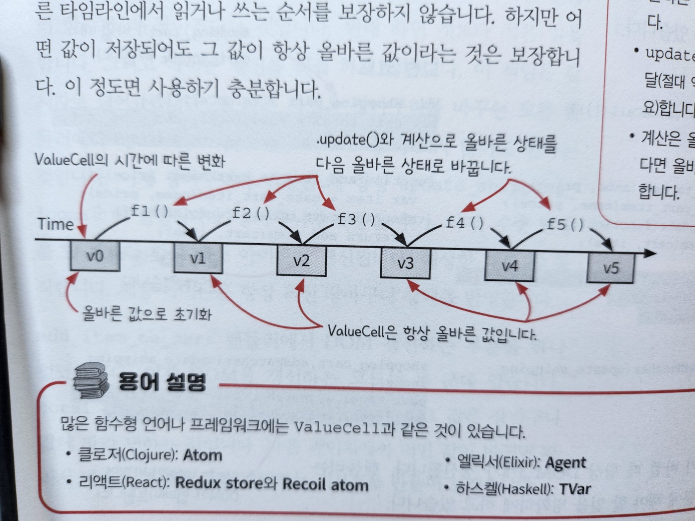

#### ValueCell을 일관되게 유지하기 위한 안내

- 올바른 값으로 초기화합니다
- update()에는 계산을 전달합니다
  - 절대 액션을 전달하지 마세요
- 계산은 올바른 값이 주어졌다면 올바른 값을 리턴해야 합니다

#### 용어 설명

- 많은 함수형 언어나 프레임워크에는 ValueCell과 같은 것이 있습니다
  - Clojure: Atom
  - Haskell: TVar
  - Elixir: Agent
  - React: Rdux store와 Recoil atom

## 반응형 아키텍처가 시스템을 어떻게 바꿨나요

- 앞에서 코드를 반응형 아키텍처 버전으로 바꿨습니다
  - 어떤 것이 바뀔 때 실행되는 핸들러로 만들었습니다

```js
// 일반적인 아키텍처
let shopping_cart = {};

function add_item_to_cart(name, price) {
  let item = make_cart_item(name, price);
  shopping_cart = add_item(shopping_cart, item);

  const total = calc_total(shopping_cart);
  set_cart_total_dom(total);
  update_shipping_icons(shopping_cart);
  update_tax_dom(total);
}
```

```js
// 반응형 아키텍처
let shopping_cart = ValueCell({});
const cart_total = FormulaCell(shopping_cart, calc_total);

function add_item_to_cart(name, price) {
  const item = make_cart_item(name, price);
  shopping_cart.update((cart) => {
    return add_item(cart, item);
  });
}

shopping_cart.addWatcher(update_shipping_icons);
cart_total.addWatcher(set_cart_total_dom);
cart_total.addWatcher(update_tax_dom);
```

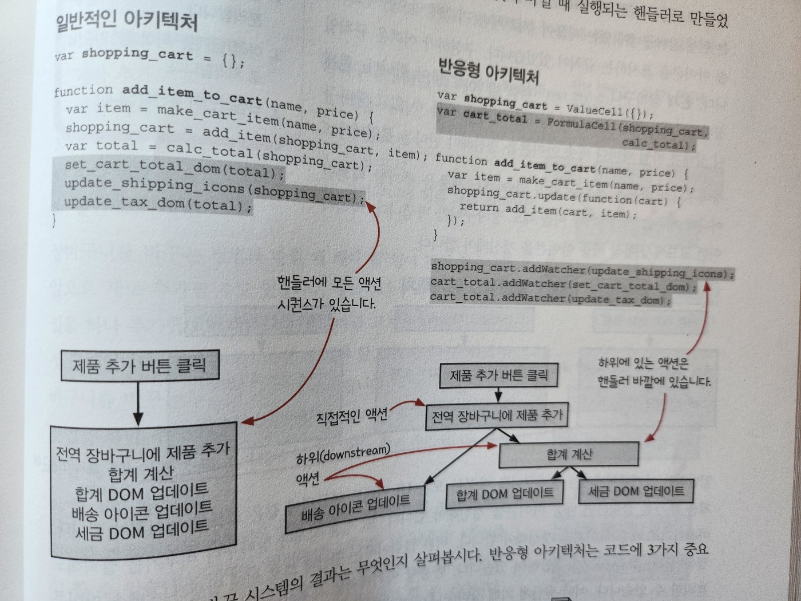

- 하위에 있는 액션은 핸들러 바깥에 있습니다

#### 반응형 아키텍처가 바꾼 시스템의 결과는 무엇인지 살펴봅시다

- `반응형 아키텍처는 코드에 3가지 중요한 영향`을 줍니다(1~3을 하나씩 살펴봅시다)
  - 1. `원인과 효과`가 결합된 것을 `분리`합니다
  - 2. `여러 단계를 파이프라인`으로 처리합니다
  - 3. `타임라인이 유연`해집니다
- 다음 페이지에서 하나씩 살펴봅시다

## 원인과 효과가 결합된 것을 분리합니다

- 가끔 코드를 작성할 때 중요한 규칙을 구현해야 합니다
  - 현재 예제에는 장바구니에 있는 제품이 무료 배송 기준에 맞으면 무료 배송 아이콘을 표시하는 규칙이 있습니다
  - 현재 장바구니는 언제나 바뀔 수 있고 장바구니 상태가 바뀔 때마다 배송 아이콘을 갱신해야 한다는 뜻입니다

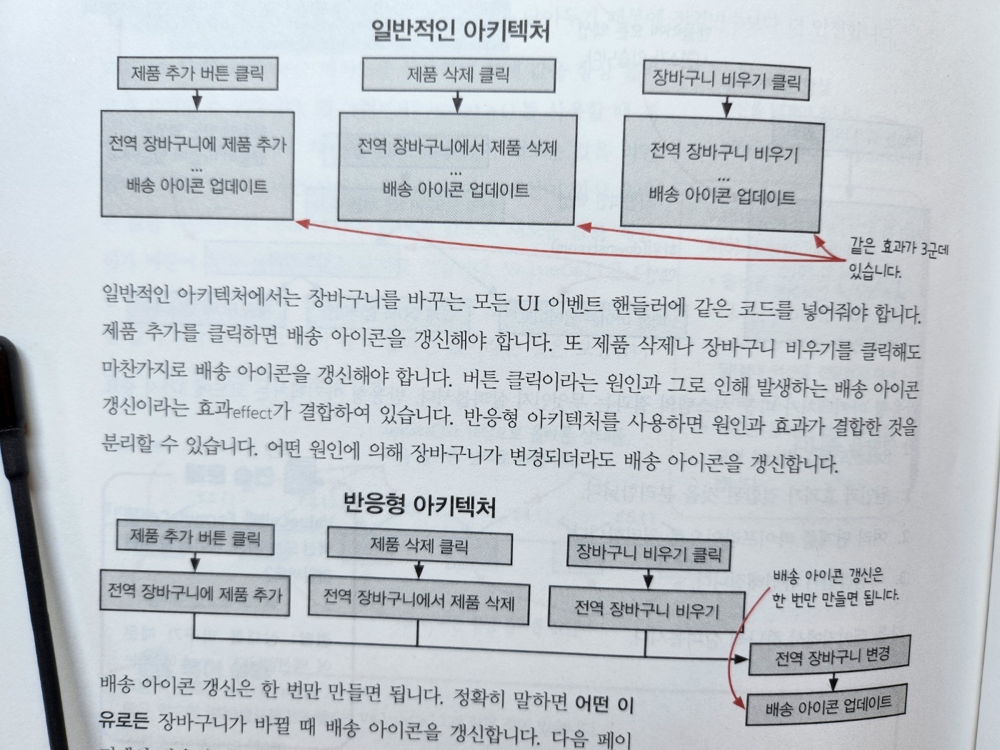

- 일반적인 아키텍처

  - 같은 효과가 3군데 있습니다

- 반응형 아키텍처
  - 배송 아이콘 갱신은 한 번만 만들면 됩니다(원인과 효과 분리)

## 1. 결합의 분리는 원인과 효과의 중심을 관리합니다

- 반응형 아키텍처가 원인과 효과를 어떻게 분리하는지 살펴봤습니다
- 정말 어려운 문제를 풀 수 있는 강력한 기술입니다
- 이슈
  - 장바구니를 바꾸는 방법과 장바구니가 바뀔 때 해야 할 일이 많은 것이 문제입니다

> 장바구니를 바꾸는 방법

- 1. 제품 추가
- 2. 제품 삭제
- 3. 장바구니 비우기
- 4. 수량 변경
- 5. 할인 코드 적용

> 장바구니가 바뀔 때 해야 할 액션

- 1. 배송 아이콘 업데이트
- 2. 세금 표시
- 3. 합계 표시
- 4. 장바구니에 제품 개수 업데이트

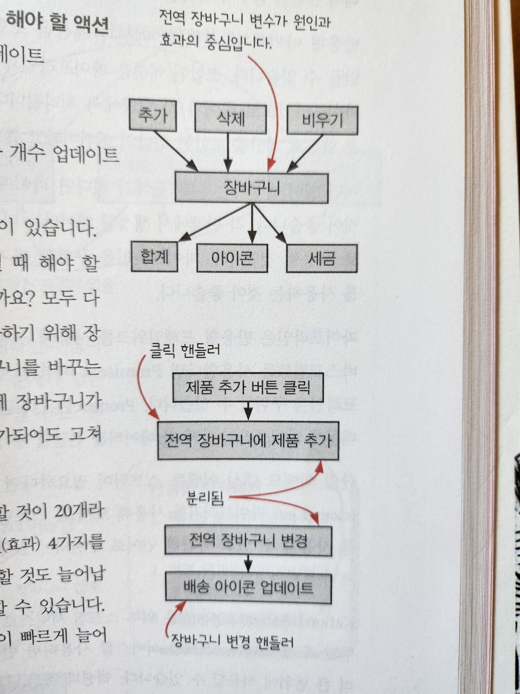

- 전역 장바구니는 원인과 결과 중심이라고 할 수 있습니다
- 원인과 효과의 중심을 잘 관리해야 할 것이 빠르게 늘어나지 않도록 해야 합니다
- 이 문제는 원인과 효과를 분리(decoupling)하면 해결됩니다
- 5개의 원인과 4개의 결과

  - 원인과 효과가 분리되지 않은 경우 : `5 * 4 => 20가지`
  - 원인과 효과가 분리된 경우 : `5 + 4 => 9가지`

- 문제가 없다면 이 방법으로 분리하는 것은 좋지 않을 수도 있습니다
  - 코드에 액션을 순서대로 표현하는 것이 더 명확할 수도 있습니다
  - 장바구니처럼 원인과 효과의 중심이 없다면 분리하지 마세요

## 2. 여러 단계를 파이프라인으로 처리합니다

- 13장에서 함수형 도구로 여러 계산을 조합하는 방법을 봤습니다
- 반응형 아키텍처도 간단한 액션과 계산을 조합해 복잡한 동작을 만들 수 있습니다
- 조합된 액션은 파이프라인과 같습니다
  - 데이터가 파이프라인으로 들어가 각 단계에서 처리됩니다
  - `파이프라인`은 `작은 액션과 계산을 조합한` 하나의 `액션`이라고 볼 수 있습니다
- 파이프라인은 반응형 프레임워크를 사용해 구현하기도 합니다
  - 자바스크립트를 사용한다면 Promise로 액션과 계산을 조합해 파이프라인을 구현할 수 있습니다
  - Promise는 단일 값을 전달할 수 있기 때문에 파이프라인 단계 간 데이터를 전달할 수 있습니다
- 만일 이벤트 대신 이벤트 스트림이 필요하다면 ReactiveX 라이브러리를 사용해 보세요
  - 스트림에 map이나 filter를 사용할 수 있고 다양한 언어로 구현되어 있습니다
  - 자바스크립트 구현체는 RxJS입니다
- Kafka나 RabbitMQ와 같은 외부 스트림 서비스로 파이프라인을 구현할 수 있습니다
  - 스트림 서비스를 사용하면 반응형 아키텍처를 더 큰 범위에 적용할 수 있습니다
  - 액션과 계산 단위가 아닌 서비스 관점에서 서로 분리할 수 있습니다
- 만약 여러 단계가 있지만 데이터를 전달하지 않는다면 이 패턴을 사용하지 않는 것이 좋습니다
  - 데이터를 전달하지 않으면 파이프라인이라고 볼 수 없습니다

## 3. 타임라인이 유연해집니다

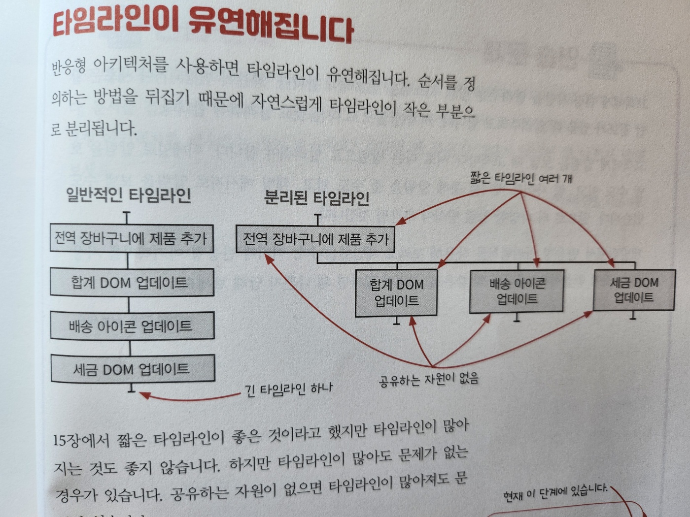

- 반응형 아키텍처를 사용하면 타임라인이 유연해집니다
- 순서를 정의하는 방법을 뒤집기 때문에 자연스럽게 타임라인이 작은 부분으로 분리됩니다
- 15장에서 타임라인이 짧은 것이 좋은 것이라고 했지만, 타임라인이 많아지는 것도 좋지 않습니다
- 하지만 타임라인이 많아도 문제가 없는 경우가 있습니다
  - 공유하는 자원이 없으면 타임라인이 많아져도 문제가 없습니다

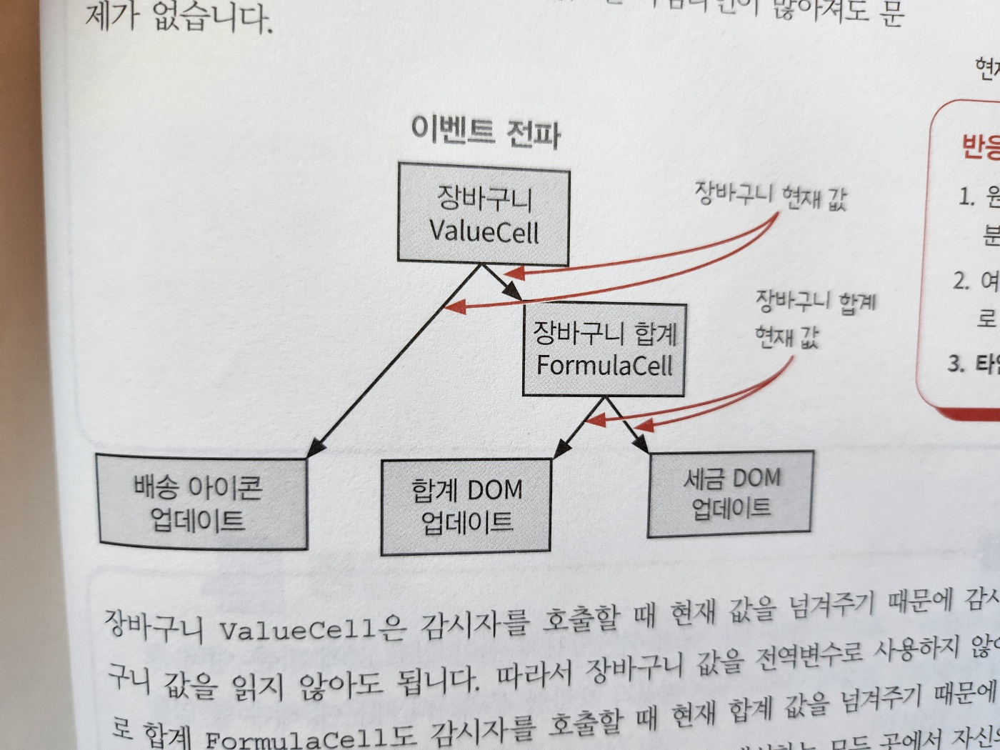

- 장바구니 ValueCell은 감시자를 호출할 때 현재 값을 넘겨주기 때문에 감시자 함수가 직접 장바구니 값을 읽지 않아도 됩니다
  - 따라서 장바구니 값을 전역변수로 사용하지 않아도 됩니다
- 마찬가지로 합계 FormulaCell도 감시자를 호출할 때 현재 합계 값을 넘겨주기 때문에 DOM 갱신을 할 때 FormulaCell을 직접 읽지 않아도 됩니다
  - DOM을 갱신하는 모든 곳에서 자신의 DOM만 갱신하면 됩니다
  - 타임라인은 서로 다른 자원을 사용하기 때문에 안전하다고 할 수 있습니다

## 또 다른 아키텍처 패턴

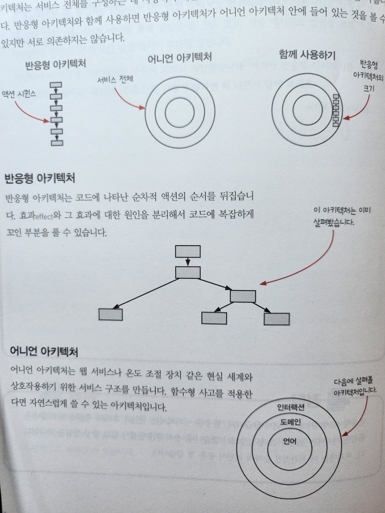

- 반응형 아키텍처에 대해 알아봤습니다
- `어니언 아키텍처(onion architecture)`라고 부르는 아키텍처에 대해 알아보겠습니다
  - 어니언 아키텍처는 반응형 아키텍처보다 더 넓은 범위에 사용합니다
- `어니언 아키텍처`는 `서비스 전체를 구성`하는 데 사용하기 때문에 `바깥 세계와 상호작용`을 하는 부분을 다룹니다
- 반응형 아키텍처와 함께 사용하면 반응형 아키텍처가 어니언 아키텍처 안에 들어 있는 것을 볼 수 있지만 서로 의존하지는 않습니다

### 반응형 아키텍처

- 반응형 아키텍처는 코드에 나타난 순차적 액션의 순서를 뒤집습니다
- 효과와 그 `효과에 대한 원인을 분리`해서 코드에 복잡하게 꼬인 부분을 풀 수 있습니다

### 어니언 아키텍처

- 어니언 아키텍처는 웹 서비스나 온도 조절 장치 같은 현실 세계와 상호작용하기 위한 서비스 구조를 만듭니다
- 함수형 사고를 적용한다면 자연스럽게 쓸 수 있는 아키텍처입니다
- 이제 살펴봅시다

## 어니언 아키텍처는 무엇인가요?

- 어니언 아키텍처는 이름에서 알 수 있듯이 둥글게 겹겹이 쌓인 양파 모양을 하고 있습니다

- 인터랙션 > 도메인 > 언어

  - 인터랙션 계층 : 바깥세상에 영향을 주거나 받는 액션
  - 도메인 계층 : 비즈니스 규칙을 정의하는 계산
  - 언어 계층 : 언어 유틸리티와 라이브러리

- 어니언 아키텍처는 특정 계층이 꼭 필요하다고 강제하지 않습니다
  - 하지만 ㅁ낳은 경우에 위와 같이 3가지 큰 분류로 나눌 수 있습니다
- 위의 간단한 그림으로 함수형 시스템이 잘 동작할 수 있는 중요한 규칙을 알 수 있습니다
  - 1. 현실 세계와 상호작용은 인터랙션 계층에서 해야 합니다
  - 2. 계층에서 호출하는 방향은 중심 방향입니다
  - 3. 계층은 외부에 어떤 계층이 있는지 모릅니다
- 어니언 아키텍처는 파트1에서 배운 액션과 계산의 분리, 계층형 설계 방식과 잘 맞습니다
- 이 내요을 복습해보고 어니언 아키텍처를 적용하는 예제를 살펴봅시다

## 다시 보기: 액션과 계산, 데이터

- 데이터
  - 이벤트에 대한 사실
  - 숫자나 문자열, 컬렉션 같은 것들이 데이터입니다
  - 수동적이고 투명합니다
- 계산
  - 입력으로 출력을 만드는 연산입니다
  - 같은 입력을 주면 항상 같은 결과를 냅니다
  - 계산은 호출 시점이나 횟수에 영향을 받지 않습니다
- 액션
  - 액션은 바깥 세계에 영향을 주거나 받는 실행 가능한 코드입니다
  - 호출 시점과 횟수가 중요합니다
  - 4장에서 배운 방식으로 액션에서 계산을 빼내면 의도하지 않아도 어니언 아키텍처 구조가 됩니다
  - 그래서 함수형 개발자들은 어니언 아키텍처에 특별한 이름을 부팅지 않아도 된다고 생각할지도 모릅니다
  - 그래도 어니언 아키텍처라는 용어가 사용되기 때문에 알고 있어야 합니다
  - 어니언 아키텍처는 함수형 프로그래밍을 할 때 높은 차원에서 `서비스를 구조화하기 좋은 방법입니다`

## 다시 보기: 계층형 설계

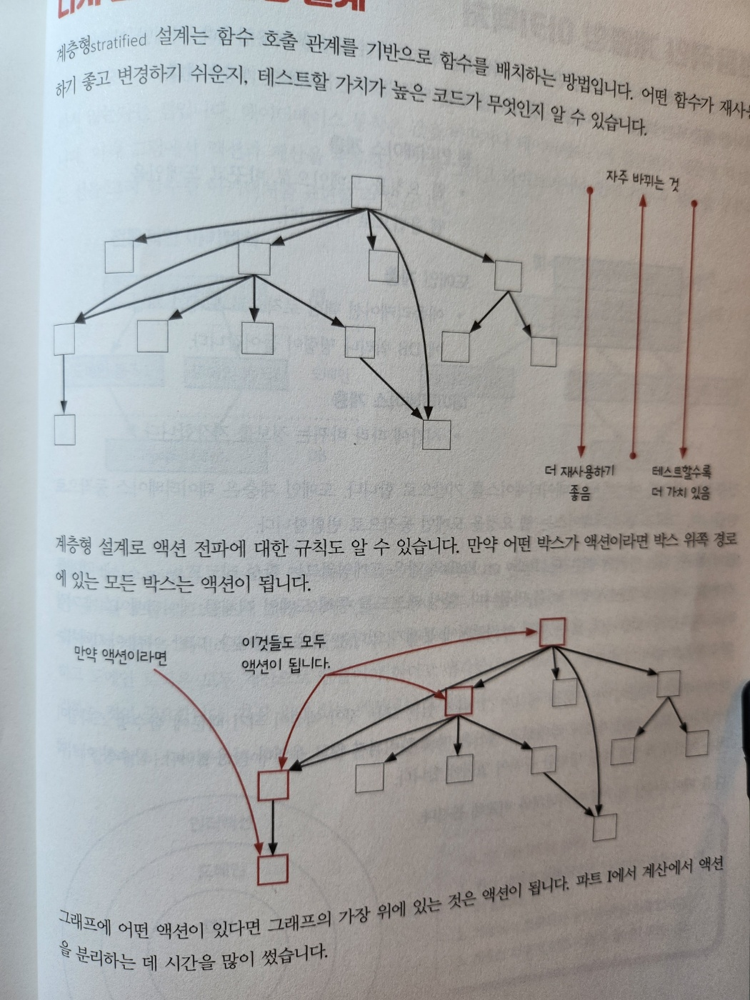

- 계층형 설계는 함수 호출 관계를 기반으로 함수를 배치하는 방법입니다

  - 어떤 함수가 재사용하기 좋고 변경하기 쉬운지, 테스트할 가치가 높은 코드가 무엇인지 알 수 있습니다

- 계층형 설계로 액션 전파에 대한 규칙도 알 수 있습니다
  - 만약 어떤 박스가 액션이라면 박스 위쪽 경로에 있는 모든 박스는 액션이 됩니다
    - 그래서 파트1에서 계산에서 액션을 분리하는 데 시간을 많이 썼습니다

## 전통적인 계층형 아키텍처

- 전통적인 아키텍처로 웹 API를 만들 때 계층(layer)이라고 하는 개념을 사용합니다

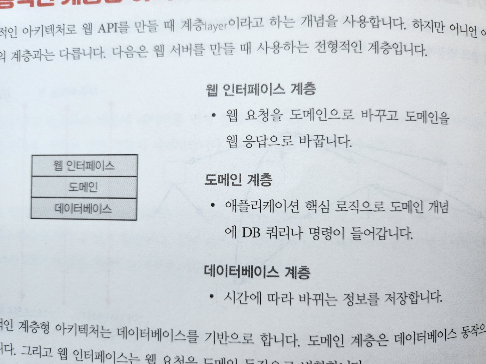

- 웹 인터페이스 계층
  - 웹 요청을 도메인으로 바꾸고 도메인을 웹 응답으로 바꿉니다
- 도메인 계층
  - 애플리케이션 핵심 로직으로 도메인 개념에 DB 쿼리나 명령이 들어갑니다
- 데이터베이스 계층

  - 시간에 따라 바뀌는 정보를 저장합니다

- 전통적인 계층형 아키텍처는 데이터베이스를 기반으로 합니다
  - 도메인 계층은 데이터베이스 동작으로 만듭니다
  - 그리고 웹 인터페이스는 웹 요청을 도메인 동작으로 변환합니다
- 데이터 베이스 계층이 가장 아래 있다면 그 위에 있는 모든 것이 액션이 되기 때문에 함수형 스타일이 아닙니다
  - 모든 것이 계층에 쌓여있고 계산은 따로 관리되지 않고 우연히 사용됩니다
  - 함수형 아키텍처는 계산과 액션에 대한 명확한 규칙이 있어야 합니다
    - 다음 페이지에서 함수형 아키텍처와 비교해 봅시다

## 함수형 아키텍처

- 함수형이 아닌 전통적인 아키텍처와 함수형 아키텍처를 비교해 봅시다

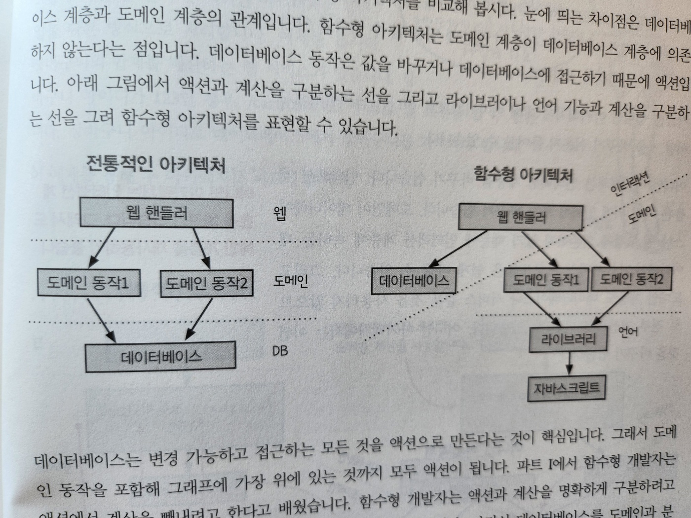

- 눈에 띄는 차이점은 데이터베이스 계층과 도메인 계층의 관계 입니다
- 함수형 아키텍처는 도메인 계층이 데이터베이스 계층에 의존하지 않는다는 점입니다
- 데이터베이스 동작은 값을 바꾸거나 데이터베이스에 접근하기 때문에 액션입니다
- 액션과 계산을 구분하는 선을 그리고 라이브러리나 언어 기능과 계산을 구분하는 선을 그려 함수형 아키텍처를 표현할 수 있습니다

- 데이터 베이스는 변경 가능하고 접근하는 모든 것을 액션으로 만드는 것이 핵심입니다
  - 도메인 동작을 포함해 그래프에 가장 위에 있는 것까지 모두 액션이 됩니다
  - 함수형 개발자는 액션에서 계산을 빼내려고 한다고 배웠습니다
  - 함수형 개발자는 액션과 계산을 명확하게 구분하려고 하고 도메인 로직은 모두 계산으로 만들어야 한다고 생각합니다
  - 따라서 데이터베이스를 도메인과 분리하는 것이 중요합니다

## 변경과 재사용이 쉬워야 합니다

- 소프트웨어 아키텍처는 변화를 다루는 일입니다
  - 어떤 것이 바꾸기 쉬워야 하나요? 이 물음에 답을 할 수 있다면 아키텍처의 반은 결정한 것입니다
- 지금은 어니언 아키텍처에 대해 이야기 하므로 어니언 아키텍처에서 어떤 것을 바꾸기 쉬운지 물어볼 수 있습니다
- `어니언 아키텍처`는 `인터랙션 계층을 바꾸기 쉽습니다`
  - 인터랙션 계층은 가장 위에 있어서 가장 바꾸기 쉽습니다
- 도메인 계층도 데이터베이스나 서비스 같은 것을 사용하지 않으므로 전부 계산으로 만들 수 있습니다

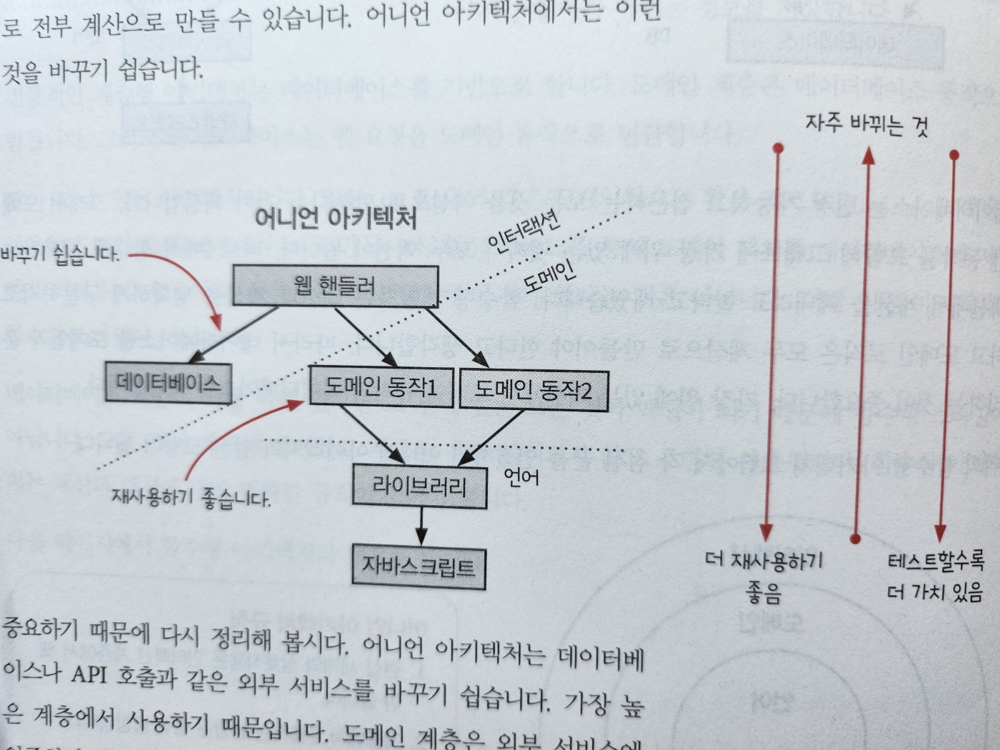

- 아니언 아키텍처는 데이터베이스나 API호출과 같은 외부 서비스를 바꾸기 쉽습니다
- 도메인 계층은 외부 서비스에 의존하지 않아서 테스트하기 좋습니다
- 어니언 아키텍처는 좋은 인프라보다 좋은 도메인을 강조합니다

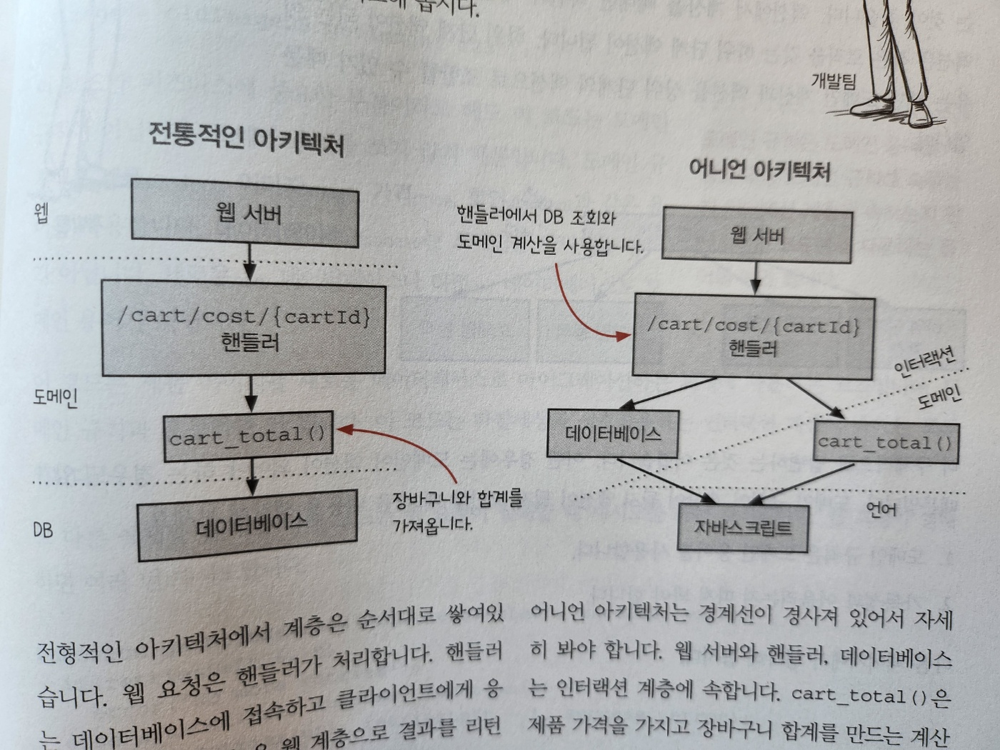

#### 전형적인 아키텍처

- 전형적인 아키텍처에 계층은 순서대로 쌓여있습니다
- 웹 요청은 핸들러가 처리합니다
- `핸들러`는 데이터베이스에 접속하고 클라이언트에게 응답하기 위해 `가장 높은 웹 계층으로 결과를 리턴`합니다
- 여기서 장바구니 합계를 계산하는 도메인 규칙은 데이터베이스에서 합계를 가져와 처리합니다
- 도메인은 데이터베이스에 접근하기 계산이 아닙니다

#### 어니언 아키텍처

- 어니언 아키텍처는 경계선이 경사져 있어서 자세히 봐야 합니다
- 웹 서버와 핸들러, 데이터베이스는 인터랙션 계층에 속합니다
- cart_total()은 제품 가격을 가지고 장바구니 합계를 만드는 계산입니다
- 장바구니가 어디에서(데이터베이스 또는 다른 곳에서) 왔는지 모릅니다
- `핸들러`가 데이터베이스에서 장바구니를 가져와 `도메인에 전달`하는 역할을 합니다
- 인터랙션 계층에서 값을 가져오고 도메인 계층에서 합산을 합니다

#### 도메인 규칙이 액션이 되어야 하는 경우는 정말 없나요?

- 도메인을 계산으로 만드는 것은 항상 가능합니다
- 파트1 액션을 계산으로 만들기 위해 많은 것을 살펴봤습니다
- 액션에서 계산을 빼내는 것이 좋습니다
- 액션은 작은 로직을 갖는 하위 단계 액션이 됩니다
- 하위 단계 액션이 되는 이유는 빼낸 도메인 계산과 액션을 상위 단계의 액션으로 조합할 수 있기 때문입니다

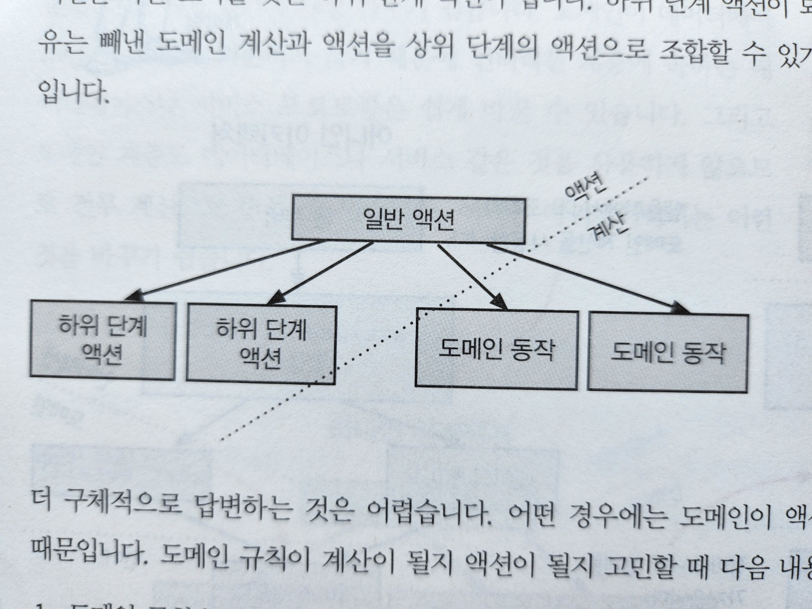

- 어떤 경우에는 도메인이 액션이 되어야 하는 경우도 있기 때문입니다
- 도메인 규칙이 계산이 될지 액션이 될지 고민할 때 다음 내용을 생각해보세요
  - 1. 도메인 규칙은 도메인 용어를 사용합니다
  - 2. 가독성과 어울리는 따져 봐야 합니다
- 다음 페이지에서 생각해 봅시다

## 도메인 규칙은 도메인 용어를 사용합니다

- `도메인 규칙(domain rule)` 또는 `비즈니스 규칙(business rule)`이라고 합니다

```js
// 도메인 로직 아닌 예
const image = newImageDB.getImage("123");
if (image === undefined) {
  image = oldImageDB.getImage("123");
}
```

- 이 코드가 비즈니스에 중요한 부분이지만 이 코드는 도메인 규칙이 아닙니다
- 도메인 용어를 쓰지 않기 때문입니다
  - 도메인 용어 예: 제품(product), 이미지(image), 가격(price), 할인(discount), ...

```js
// 요청이 실패할 때 재시도를 하는 로직
function getWithRetries(url, retriesLeft, success, error) {
  if (retriesLeft <= 0) {
    error("No more retries");
  } else {
    ajaxGet(url, success, function (e) {
      getWithRetries(url, retriesLeft - 1, success, error);
    });
  }
}
```

- 비즈니스에 중요한 기능이라고 해도 비즈니스 규칙이 아닙니다
  - 도메인 용어를 쓰지 않기 때문입니다
- 역시 인터랙션 계층에 속하는 코드입니다

## 가독성을 따져 봐야 합니다

- 특정 패러다임의 장점이 항상 좋은 것이 아니라는 것을 알았습니다
- 도메인을 계산으로 만드는 것도 마찬가지입니다
- 도메인을 항상 계산으로 만들 수 있지만, 어떤 경우는 문맥에 따라 계산보다 액션이 읽기 좋은 경우가 있습니다
- 가독성을 결정하는 요소는 여러 가지 있습니다
  - 1. 사용하는 언어
  - 2. 사용하는 라이브러리
  - 3. 레거시 코드와 코드 스타일
  - 4. 개발자들의 습관
- 앞서 이야기한 어니언 아키텍처는 가장 이상적인 모습입니다
  - 100% 순수한 어니언 아키텍처를 만들면 된다고 쉽게 생각할 수 있습니다
  - 하지만 세상에 완벽한 것은 없습니다
  - 설계자의 역할 중 하나는 현실 세계의 문제와 이상적인 다이어그램 사이를 균형있게 유지하는 것입니다

### 코드의 가독성

- `함수형 코드는 읽기 좋습니다 하지만 함수형 코드가 아닌 코드가 더 명확한 경우도 있습니다`
- 이때 얼마나 명확해지는지 봐야 합니다
- 어쩌면 명확함을 위해 함수형 스타일을 사용하지 않아야 할 수도 있습니다
- `도메인 계층을 계산으로 만들어` `인터랙션 계층과 분리`하면서 읽기 좋은 코드를 만들려고 노력해야 합니다

### 개발 속도

- 비즈니스 이유로 기능을 빨리 출시해야 하는 경우도 있습니다
- 이 책에서 배운 것 처럼 `계산을 추출`하고 함수형 도구로 코드를 연결하고 타임라인을 잘 관리하세요

### 시스템 성능

- 시스템 성능과 타협해야 하는 때도 있습니다
- 변경 가능한 데이터 구조는 불변 데이터 구조보다 빠릅니다
- 성능 개선과 도메인 계산으로 만드는 것은 따로 생각하는 것이 좋습니다
- 최적화는 인터랙션 계층에서 하고 도메인 계층은 재사용 가능한 계산으로 만드는 것입니다
- 책 앞 부분에서 데이터베이스에서 이메일을 비효율적으로 가져오는 코드를 최적화할 때도 도메인 계층을 고치지 않았습니다

### 도메인 계층에서 선택적인 값을 어떻게 가져오나요?

- 예. 지난해 판매된 모든 제품에 대한 보고서를 만든다고 해봅시다
  - 다음과 같이 `제품을 가져와서` `보고서를 생성`하는 함수를 만들어야 할 것입니다

```js
function generateReport(products) {
  return products.reduce((report, product) => {
    return report + product.name + " " + product.price + "\n";
  }, "");
}

const productsLastYear = db.fetchProducts("last year");
const reportLastYear = generateReport(productsLastYear);
```

- 여기에 새로운 요구사항이 생겨서 보고서를 고쳐야 한다고 해봅시다
  - 새로운 요구사항 : 보고에 할인 정보를 표시해야 합니다(할인 아이디는 옵셔널)

```js
// 제품에 discountID가 있는 경우
{
  name: "shoes",
  price: 3.99,
  discountID: '23111'
}

// 제품에 discountID가 없는 경우
{
  name: "watch",
  price: 223.43,
  discountID: null
}
```

- 가장 쉬운 방법은 reduce콜백에서 할인 레코드 아이디로 데이터베이스에서 가져오는 것입니다
  - 하지만 이렇게 하면 generateReport()가 액션이 됩니다
  - 제품을 데이터베이스에서 가져오는 가장 상위 액션에서 이 작업을 해야 합니다

```js
function generateReport(products) {
  return products.reduce((report, product) => {
    return report + product.name + " " + product.price + "\n";
  }, "");
}

const productsLastYear = db.fetchProducts("last year");

const productsWithDiscount = productsLastYear.map(
  // 제품은 최상위 계층에 있는 인자입니다
  (product) => {
    if (product.discountID) {
      return product;
    }
    return {
      ...product,
      discount: db.fetchDiscount(product.discountID),
    };
  }
);

// generateReport()는 계산으로 유지하고 productsWithDiscount라는 중간 계층을 추가했습니다
const reportLastYear = generateReport(productsWithDiscount);
```

- 항상 `도메인 계층과 인터랙션 계층을 분리`해 `도메인 규칙을 계산으로 유지`할 수 있다는 것을 잊지 마세요

## 연습문제

- 문제
  - 사용자가 책을 대여할 수 있는 공공 도서관 소프트웨어를 만들고 있습니다
  - 다음 기능들은 어떤 계층에 속하는지 표시해 보세요
    - 인터랙션 계층
    - 도메인 계층
    - 언어 계층
- 1. 문자열을 처리하기 위해 불러온 라이브러리 : 언어 계층
- 2. 데이터베이스에서 사용자 레코드를 질의하는 루틴 : 인터랙션 계층
- 3. 국회 도서관 API를 사용 : 인터랙션 계층
- 4. 주제에 따라 책을 분류를 결정하는 루틴 : 도메인 계층
- 5. 주어진 대출 목록에 대한 벌금을 계산하는 루틴
- 6. 고객의 새로운 주소를 저장하는 뤁니 : 인터랙션 계층
- 7. Lodash 자바스크립트 라이브러리 : 언어 계층
- 8. 도서관 객체에게 대출 화면을 표시하는 루틴 : 인터랙션 계층

## 결론

- 이 장에서는 높은 수준의 개념인 반응형 아키텍처와 어니언 아키텍처에 대해서 알아봤습니다
  - `반응형 아키텍처`는 `액션에 반응할 다른 액션을 지정`해 순차적 `액션의 순서를 바꿉`니다
  - `어니언 아키텍처`는 함수형 사고를 적용한다면 자연스럽게 따라오는 아키텍처입니다
    - 어니언 아키텍처는 코드의 모든 단계를 다루기 때문에 유용한 개념입니다

## 요점 정리

- 반응형 아키텍처는 코드에 나타난 순차적 액션의 순서를 뒤집습니다
  - X를 하고 Y를 하는 것 -> X가 발생하면 Y를 하도록 바꿉니다
- 반응형 아키텍처는 액션과 계산을 조합해 파이프라인을 만듭니다
  - 파이프라인은 순서대로 발생하는 작은 액션들의 조합입니다
- 읽고 쓰는 동작을 제한해 변경 가능한 일급 상태를 만들 수 있습니다
  - ValueCell은 스프레드 시트에서 영향을 받아 만들었습니다
  - ValueCell로 반응형 파이프라인을 구현할 수 있습니다
- 어니언 아키텍처는 넓은 범위에서 소프트웨어를 세 개의 계층으로 나눕니다
  - 인터렉션 계층
  - 도메인 계층
  - 언어 계층
- 가장 바깥 `인터랙션 계층`은 액션으로 되어 있습니다
  - 도메인 계층과 액션을 사용하는 것을 조율합니다
- `도메인 계층`은 도메인 로직과 비즈니스 규칙과 같은 소프트웨어의 동작으로 되어 있습니다
  - 도메인 계층은 대부분 계산으로 구성됩니다
- `언어 계층`은 소프트웨어를 만들 수 있는 언어 기능과 라이브러리로 되어 있습니다
- 어니언 아키텍처는 프랙털(fractal)입니다.
  - 액션의 모든 추상화 수준에서 찾을 수 있습니다
  - 프랙털: 일부조각이 전체와 비슷한 구조입니다
    - 어니언 아키텍처를 소프트웨어 전체에 적용할 수도 있지만, 작은 부분에서도 같은 모습으로 적용할 수 있기 때문에 프랙털에 비유했습니다
