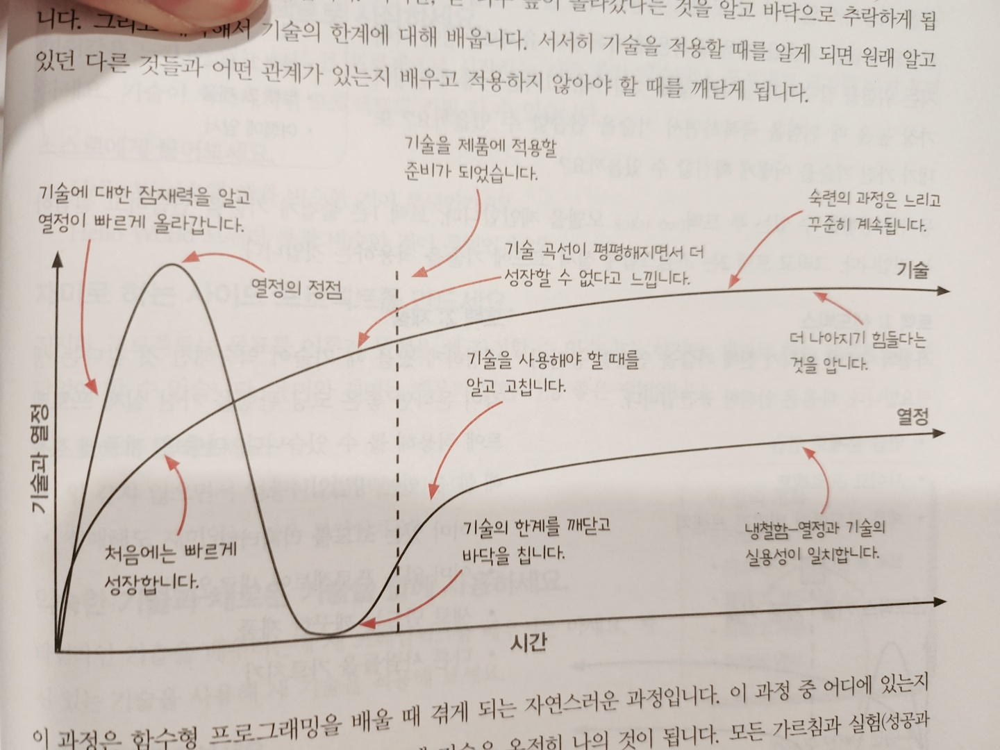
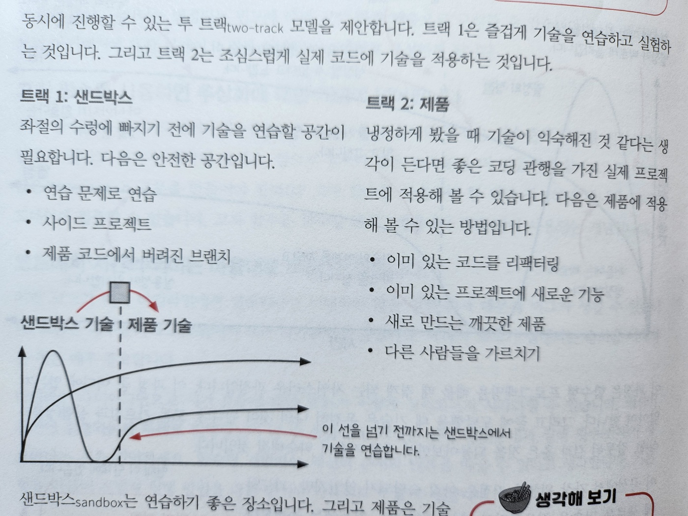

# 19. 함수형 프로그래밍 여행에 앞서

- 함수형 프로그래밍에 대한 기본 기술과 유용한 것들을 많이 배웠습니다
- 이 장에서는 새로운 기술을 적용하기 위한 현실적인 조언과 이 책을 덮고 나서도 배움을 이어나가기 위한 몇 가지 방법을 소개합니다

#### 이번 장에서 살펴볼 내용

- 직장 상사의 심기를 건드리지 않고 새로운 기술을 적용하거나 학습하는 방법을 배웁니다
- 함수형 기능에 심취하기 위해 함수형 프로그래밍 언어 한두 개를 골라 봅니다
- 함수형 프로그래밍의 수학적인 관점으로 깊이 들어가 봅니다
- 함수형 프로그래밍을 더 배우기 위한 책을 알아봅니다

## 마지막 장의 계획

- 이 책에서 배운 기술을 다시 보기

- 마스터를 향해 가는 길

  - 배운 기술을 사용하기 시작했을 것입니다
  - 마스터가 되기 위해 가는 길을 한 차원 높은 곳에서 살펴보겠습니다
  - 투 트랙(two-track) 모델에 대해 배우게 됩니다

- 트랙1: 샌드박스

  - 새로운 기술을 시험하고 연습해 보기 위한 장소가 필요합니다
  - 여기서 2가지 샌드박스 환경에 대해 알아보겠습니다
    - 사이드 프로젝트(side project)
    - 연습 문제로 훈련하기

- 트랙2: 제품

  - 기술이 숙련되었다면 기술을 더욱 갈고닦기 위해 실제 제품에 적용해봐야 합니다
  - 원하는 대로 적용해 볼 수 있지만, 다음과 같은 곳에 먼저 해보면 좋습니다
    - 오늘 당장 버그를 없애 보기
    - 설계를 하나씩 개선해 보기

- 함수형 프로그래밍 여행을 계속하기 위해
  - 지금까지 긴 시간 동안 든든한 기초를 얻었습니다
  - 기술을 더욱 갈고닦고 싶다는 생각이 든다면 다음과 같은 길이 있습니다
    - 함수형 언어를 배우기
    - 수학적 지식을 얻기
    - 더 많은 책을 읽기

## 전문가의 기술을 배웠습니다

- 여기까지 오면서 배운 것들을 정리해 봅시다

### 파트 1: 액션과 계산, 데이터

- 코드에서 액션과 계산, 데이터를 구분해 가장 문제가 되는 부분을 찾습니다
- 액션에서 계산을 빼내 재사용하기 좋고 테스트하기 쉬운 코드를 만듭니다
- 암묵적인 입력과 출력을 명시적인 것으로 바꿔 액션의 설계를 개선합니다
- 불변성(immutability)을 구현해 데이터 읽기를 계산으로 만듭니다
- 계층형(stratified) 설계로 코드를 구성하고 개선합니다

### 파트 2: 일급 추상

- 언어의 문법을 일급으로 만들어 코드를 추상화할 수 있습니다
- 함수형 반복과 함수형 도구를 사용해 고차원으로 추론합니다
- 함수형 도구를 연결해 데이터 변환 파이프라인을 만듭니다
- 타임라인 다이어그램을 통해 동시성 분산 시스템을 이해합니다
- 버그를 없애기 위해 타임라인을 활용합니다
- 고차함수로 안전하게 상태를 변경합니다
- 반응형 아키텍처를 사용해 원인과 효과의 결합을 줄입니다
- 세상과 상호작용하기 위해 어니언 아키텍처 설계를 서비스에 적용합니다

## 꼭 기억해야 할 것

- 10년 뒤에 이 책의 내용 중 3가지만 생각날지 모릅니다
  - 다른 것은 다 잊어버려도 아래 3가지 내용은 가장 중요하기 때문에 꼭 기억하세요

### 어떤 경우에는 액션에 계산이 숨어 있습니다

- 계산을 빼내는 것은 귀찮지만 가치있는 일입니다
- 계산은 액션보다 재사용하기 좋고, 테스트하거나 이해하기 쉽습니다
- 그리고 빼내는 데 그렇게 많은 시간이 걸리지 않을 것입니다
- 액션과 계산, 데이터를 구분하는 것은 함수형 프로그래밍 기술의 기본입니다
- 액션과 계산, 데이터는 변경되는 빈도에 따라 각각 다른 계층으로 구성할 수 있습니다
- 넓은 관점에서 보면 아키텍처에 대한 문제이고 결국 어니언 아키텍처로 구성하게 됩니다

### 고차 함수를 사용하면 추상화에 대한 개념이 넓어집니다

- 고차함수(함수를 인자로 받거나 함수를 리턴하는 함수)를 사용하면 똑같은 저수준의 코드를 반복적으로 만들지 않아도 됩니다
- 생각해보세요. 앞으로 얼마나 많은 반복문을 더 만들어야 할까요?
  - 또 얼마나 많은 try/catch 구문을 만들어야 할까요?
- 고차함수를 사용하면 한 번만 작성하면 됩니다
  - 그리고 도메인에 집중할 수 있습니다
- 고차함수는 함수형 프로그래밍에서 정말 많이 사용되는 개념입니다

### 코드에서 시간의 의미는 마음대로 바꿀 수 있습니다

- 어떤 코드가 여러 타임라인에서 실행된다면 기대하지 않은 실행 순서 때문에 버그가 생길 수 있습니다
  - 요즘은 대부분의 소프트웨어 여러 타임라인을 갖습니다
  - 따라서 코드가 실행되는 순서를 이해하는 것은 매우 중요합니다
- `타임라인 다이어그램`으로 시간 흐름에 따라 코드가 어떻게 `실행`되는지 `시각화`할 수 있습니다
  - 액션이 동시에 실행되는지 차례로 실행되는지 알 수 있습니다
  - 액션은 실행 시점(순서)과 실행 횟수(반복)가 중요하다는 것을 기억하세요
- 함수형 개발자는 액션의 순서와 반복을 바꿀 수 있다고 생각합니다
  - 기본형을 만들어 문법적 실행 방법을 다른 순서나 반복으로 바꿀 수 있습니다

## 시간에 따른 기술과 열정의 변화

- 새로운 기술을 배울 때마다 완전한 숙달을 위해 누구나 비슷한 과정을 거칩니다
- 처음에는 새로운 기술을 알게 된 기쁨을 주체하지 못하고 여기저기 적용할 곳을 찾아 이것저것 해봅니다
  - 그리고 쌓아 올린 기술을 자랑스럽게 생각합니다
  - 하지만, 곧 너무 높이 올라갔다는 것을 알고 바닥으로 추락하게 됩니다
  - 그리고 계속해서 기술의 한계에 대해 배웁니다
- 서서히 기술을 적용할 때를 알게 되면 원래 알고 있던 다른 것들과 어떤 관계가 있는지 배우고 적용하지 않아야 할 때를 깨닫게 됩니다

- 이 과정 중 어디에 있는지 알아야 합니다
  - 그리고 끝에 도달했을 때 기술은 온전히 나의 것이 됩니다
- 모든 가르침과 실험(성공과 실패), 잘못된 길과 옳은 것을 되돌아보면서 점점 기술이 익숙해질 것입니다
- 이 곡선에서 가장 위험한 지점은 아직 숙달되지 않았지만, 과도하게 새로운 기술을 적용하려고 하는 때입니다
  - 처음에는 능력보다 의욕이 훨씬 앞섭니다
  - 제품 코드에 과도하게 적용해 가독성과 유지보수성이 나빠질 위험이 있습니다
- 하지만 때가 되면 기술에 대한 한계를 알게 되고 제품에 적용할 준비가 됩니다
- 그럼 기술을 완전히 익히고 실제 업무에 적용하기 위한 전략을 살펴봅시다

## 투 트랙으로 마스터가 되기

- 앞에서 기술과 열정이 어떻게 변하는지, 그래프를 통해 알아봤습니다
  - 문제는 숙련도보다 열정이 더 빠르게 상승한다는 점입니다
- 기술을 적용하지 않아야 할 곳에도 적용하려고 할 수 있습니다
  - 아직 완성되지 않은 기술을 제품에 적용해 가독성과 유지보수성이 나빠지는 위험을 감수하고 싶지는 않을 것입니다
- 그러면 어떻게 열정이 가장 높을 때 위험을 극복하면서 기술을 연습할 수 있을까요?
  - 또 내가 가진 기술을 어떻게 확신할 수 있을까요?
- 동시에 진행할 수 있는 투 트랙(two-track) 모델을 제안합니다
  - 트랙 1을 즐겁게 기술을 연습하고 실험하는 것입니다
  - 트랙 2는 조심스럽게 실제 코드에 기술을 적용하는 것입니다

### 트랙 1: 샌드박스

- 좌절의 수렁에 빠지기 전에 기술을 연습할 공간(안전한 공간)이 필요합니다
  - 연습 문제로 연습
  - 사이드 프로젝트
  - 제품 코드에서 버려진 브랜치

### 트랙 2: 제품

- 냉정하게 봤을 때 기술이 익숙해진 것 같다는 생각이 든다면 좋은 코딩 관행을 가진 실제 프로젝트에 적용해 볼 수 있습니다
- 다음은 제품에 적용해 볼 수 있는 방법입니다
  - 이미 있는 코드를 리팩터링
  - 이미 있는 프로젝트에 새로운 기능
  - 새로 만드는 깨끗한 제품
  - 다른 사람들을 가르치기

- 두 트랙 모두 기술을 마스터하기 위해 중요하고 각 트랙은 기술마다 다른 시점에 있다는 것을 알아야 합니다
- 처음에는 빠르게 성장한다고 느껴질 것입니다
- 그리고 언젠가 모든 것이 판단과 개선에 대한 것이라고 생각하는 때에 도달합니다
- 처음에는 모든 것이 실험과 한계에 대한 테스트라고 생각하겠지만 제품에 적용해야할 때가 가까워지면 자연스럽게 기술을 다듬게 됩니다

#### 생각해보기

- 이 책에서 배운 각 기술에 대해 각 기술마다 나의 위치는 어디에 있는지 평가해보고
  - 어떤 것을 샌드박스에 적용할 수 있는지, 어떤 것을 제품에 적용할 수 있는지 생각해보세요

## 샌드박스: 사이드 프로젝트를 시작하세요

- 사이드 프로젝트는 실패에 대한 큰 위험 없이 즐겁게 연습하기 좋습니다
  - 다음은 즐겁고 의미 있는 사이드 프로젝트를 위한 4가지 조언입니다

### 처음에는 작은 프로젝트로 시작하세요

- 성취감을 느낄 수 없는 너무 큰 프로젝트로 시작하는 것은 좋지 않습니다
- 프로젝트 크기를 작게 유지하세요
  - 기술이 익숙해지면 프로젝트도 키워갈 수 있습니다

#### 스스로에게 물어보세요

- Hello World 웹 앱과 비슷한 것이 무엇인가요?
- Hello World 트위터 봇과 비슷한 것이 무엇인가요?

### 재미로 하는 사이드 프로젝트를 만드세요

- 진지한 프로젝트는 목표를 이루지 못했을 때 좌절할 수 있습니다
- 하지만, 재미로 하는 프로젝트는 부담없이 할 수 있습니다
  - 유머와 재미는 배우기 위한 가장 좋은 방법입니다

#### 스스로 에게 물어보세요

- 일 같지 않으면서 엉뚱한 것은 무엇인가요?
- 실패해도 재미있는 것은 무엇인가요?

### 익숙한 기술과 새로운 기술을 함께 사용하세요

- 타임라인 기술을 배우는데 새 프레임워크를 배우지는 마세요
  - 자신 있는 기술을 사용해 새 기술을 적용해 보세요

#### 스스로에게 물어보세요

- 바로 만들 수 있는 것은 무엇인가요?
- 어떻게 하면 그 위해 새로운 기술 하나를 적용할 수 있을까요?

### 언제든지 기능을 추가해 볼 수 있는 프로젝트를 준비하세요

- 기술을 연습하고 싶을 때 준비되어 있는 사이드 프로젝트가 있다면 좋습니다
- 설계가 필요한 부분도 있을 것입니다
- 또 새로운 기술로 추가해야할 기본 기능도 있을 것입니다
- 예를 들어 기본적인 블로그가 있다면 사이드 프로젝트에서 사용자 인증 기능을 추가하면 됩니다

#### 스스로에게 물어보세요

- 어떤 프로젝트가 언제든지 기능을 추가할 수 있는 기반이 될까요?
- 나중에 추가할 만한 기본 기능은 무엇인가요?

## 샌드박스: 연습 문제로 훈련하기

- 기술은 훈련이 필요합니다
- 때로는 연습 문제를 풀어보는 것이 가장 좋은 훈련일 수 있습니다
- 연습 문제는 맥락이 필요 없고 명확한 요구 사항이 있습니다
- 연습문제는 훈련을 위해 만들었기 때문에 성취할 결과물 없이 기술을 연마할 수 있습니다
- 다음 사이트에서 좋은 연습 문제를 제공합니다

### Edabit(https://edabit.com/challenges)

- 코딩 문제 뿐만 아니라 다른 함수형 프로그래밍 기술도 연습할 수 있습니다
- 같은 문제에 다른 기술을 적용해서 풀어보세요

### Project Euler(https://projecteuler.net)

- 많은 프로그래밍 문제가 모여 있는 곳입니다
- 가끔 수학적인 문제가 있지만 모든 것을 명확하게 설명해 놨습니다
- 이 사이트의 가장 좋은 점은 문제에 제약이 있다는 점입니다

### CodeWars(https://www.codewars.com)

- CodeWars는 기술을 연습하기에 충분히 방대한 문제를 제공하고 몇 분 안에 풀 수 있는 간단한 문제로 되어 있습니다
- 같은 문제를 다른 방식으로 풀어보는 데 도움이 됩니다

### Code Katas(https://github.com/gamontal/awesome-katas)

- Code Katas는 같은 문제를 반복적으로 풀어보는 방법으로 훈련을 할 수 있습니다
- 문제를 푸는 것보다 프로그래밍하는 과정을 연습하기 위해 사용합니다
- 함수형 프로그래밍 기술을 테스트와 같은 다른 개발 기술과 통합해보기 좋습니다

## 제품: 오늘 당장 버그를 없애 보세요

- 이 책에서 소개하는 모든 기술은 코드에 바로 적용해 볼 수 있는 기술입니다
- 하지만 10만 줄이 넘는 코드라면 어디에 적용해야 할지 찾기 어려울 것입니다
  - 걱정하지 마세요
  - 어떤 곳이나 작은 부분에 적용하면 됩니다
  - 작은 부분을 고쳐도 코드를 개선할 수 있습니다
- 어떤 기술은 오늘 당장 소스 코드에 적용해 큰 버그를 없앨 수 있습니다
  - 그렇게 되면 코드가 크게 개선되고 팀 동료들과 함께 기뻐할 수 있습니다

### 변경 가능한 전역변수를 하나씩 줄입니다

- 3~5장에서 함수의 암묵적 입력과 출력을 확인하는 것을 배웠습니다
- 암묵적 입력과 출력은 변경 가능한 전역변수일 때도 있습니다
- 전역변수는 공유할 수 있는 데이터입니다
- 변경 가능한 데이터를 공유하는 곳은 버그의 진원지가 될 수 있습니다
  - 큰 성과를 얻기 위해변경 가능한 전역변수를 하나씩 줄여보세요

### 타임라인을 하나씩 줄입니다

- 15~17장에서 코드가 동작하는 방식을 이해하기 위해 타임라인을 사용하는 방법을 배웠습니다
- 타임라인 다이어그램으로 경쟁 조건과 순서에 관한 문제를 알 수 있습니다
- 타임라인을 격리하고 공유하고 조율하면 기대하지 않는 실행 순서를 없앨 수 있습니다
- 긴 코드 베이스를 가지고 일을 하다 보면 직감적으로 버그가 생기리라는 것을 알 수 있습니다
- 여기에 경쟁 조건이 있나요?
  - 그렇다면 하나를 선택하고 잘못된 순서를 없애는 기술을 사용해 타임라인 다이어그램을 하나씩 줄여보세요

## 제품: 설계를 하나씩 개선하세요

- 이 책에서 배운 기술 중 어떤 것은 코드 설계를 점진적으로 개선하기 위해 바로 적용할 수 있습니다
- 설계는 중요하지만 당장 좋은 점을 느끼지 못할 수도 있습니다
- 하지만 시간이 지나면서 설계를 하나씩 개선하다 보면 좋은 설계의 장점이 빛나기 시작할 것입니다

### 액션에서 계산을 빼내세요

- 코드에서 액션을 없애는 것은 어렵습니다
  - 대부분의 액션은 목적이 있습니다
  - 불필요한 액션은 거의 없습니다
- 할 수 있는 것은 액션을 작게 만든느 것입니다
- 액션에서 로직을 찾고 로직을 계산으로 빼내세요
  - 간단하고 직접적인 액션이 좋은 액션입니다

### 암묵적 입력과 출력을 명시적으로 바꿔 보세요

- 액션을 없애는 것은 정말 어렵습니다
- 암묵적인 입력과 출력을 없애는 것이 더 효과적입니다

### 반복문을 바꿔 보세요

- 12 ~ 14장에서 반복문을 대신해 쓸 수 있는 유용한 함수들을 살펴봤습니다
- 반복문에는 많은 알고리즘이 숨어 있습니다
  - 반복문 대신 forEach, map, filter, reduce를 사용해보세요
- 반복문은 함수형 스타일로 가기 위한 디딤돌이 되기도 합니다
  - 반복문을 함수형 스타일로 마드는 과정에서 어쩌면 여러분만의 새로운 함수형 도구를 발견할 수도 있습니다

## 인기 있는 함수형 프로그래밍 언어

- 실용적으로 배우기 좋은 언어들
- 인지도가 높고 라이브러리가 많은 언어들
- 일자리가 얼마나 많은지, 어떤 플랫폼에 쓸 수 있는지, 함수형 프로그래밍의 어떤 부분을 배울 수 있는지에 따라 나눠 보겠습니다

### 클로저(Clojure, https://clojure.org)

- 클로저는 자바 가상 머신(JVM)과 자바스크립트 런타임(ClojureScript라고 부릅니다)에서 동작합니다

### 엘릭서(Elixir, https://elixir-lang.org)

- 엘릭서는 얼랭 가상 머신에서 동작합니다
- 동시성을 다루기 위해 액터(actor) 모델을 사용합니다

### 스위프트(Swift, https://swift.org)

- 스위프트는 애플이 만든 주력 오픈 소스 언어입니다

### 코틀린(Kotlin, https://kotlinlang.org)

- 코틀린은 자바 가성머신에서 동작하고 객체 지향 언어와 함수형 프로그래밍 언어의 특징을 가지고 있습니다

### 하스켈(Haskell, https://www.haskell.org)

- 하스켈은 주로 학교나 스타트업, 대기업에서 사용하는 정적 타입 언어입니다

### 얼랭(Erlang, https://www.erlang.org)

- Erlang은 장애 내성을 위해 만들어졌습니다
- 동시성을 다루기 위해 액터 모델을 사용합니다

### 엘름(Elm, https://elm-lang.org)

- 엘름은 프런트엔드 웹 애플리케이션에 사용하는 정적 타입 언어입니다. 자바스크립트로 컴파일됩니다

### 스칼라(Scala, https://www.scala-lang.org)

- 스칼라는 객체 지향 개념과 함수형 프로그래밍 개념을 하나로 통합한 언어입니다
- 자바 가상 머신과 자바스크립트 런타임에서 동작합니다

### F#(https://fsharp.org)

- F#은 Microsoft Common Language Runtime에서 동작하는 정적 타입 언어입니다

### 러스트(Rust, https://www.rust-lang.org)

- 러스트는 메모리 누수나 동시성 에러를 줄이기 위해 설계되었씁니다
- 강력한 타입 시스템을 갖고 있는 시스템 언어입니다

### 퓨어스크립트(PureScript, https://www.purescript.org)

- 퓨어스크립트는 브라우저에서 실행하는 자바스크립트로 컴파일되는 언어입니다.
- 하스켈과 비슷합니다

### 라켓(Racket, https://racket-lang.org)

- 라켓은 깊은 역사와 활발한 커뮤니티를 가지고 있습니다

### 리즌(Reason, https://reasonml.github.io)

- 리즌은 자바스크립트와 네이티브 어셈블리(native assembly)로 컴파일되는 정적 타입 언어입니다

## 일자리가 가장 많은 함수형 언어

- 개발자를 많이 구하는 언어들(사용하기 쉬운 것부터 어려운 순으로 정렬)
  - Elixir - Kotlin - Swift - Scala - Rust
- 위 언어들 보다는 적지만 그래도 많은 일자리가 있습니다(사용하기 쉬운 것부터 어려운 순으로 정렬)
  - Clojure -Erlang - Haskell

## 사용할 수 있는 플랫폼별 함수형 언어

### 브라우저(자바스크립트 엔진)

- 다음 언어는 자바스크립트로 컴파일 됩니다
- 브라우저에서도 실행할 수 있지만 Node에서도 실행할 수 있습니다
- Elm - ClojureScript - Reason - Scala.js - PureScript

### 웹 백엔드

- 다음 언어는 웹 애플리케이션 서버를 구현하는 데 많이 사용합니다
- Elixir - Kotlin - Swift - Racket - Scala - Clojure - F# - Haskell

### 모바일(iOS와 안드로이드)

- 네이티브: Swift
- JVM으로 사용: Scala - Kotlin
- Xamarin으로 사용: F#
- React Native로 사용: ClojureScript - Scala.js

### 임베디드 장치

- Rust

## 배울 수 있는 것에 따라 나눈 함수형 언어

### 정적 타입

- 오늘날 가장 진화된 타입 시스템은 함수형 언어에서 찾을 수 있습니다
  - 이런 타입 시스템은 수학적 논리에 기반해 일관성이 있다는 것이 증명되었습니다
- 타입은 오류를 막는 것 이상의 역할을 합니다
  - 더 좋은 소프트웨어 설계로 안내합니다
- 좋은 타입 시스템이 있다면 논리학자들의 어깨에 올라 좋은 소프트웨어를 쉽게 만들 수 있습니다
- Elm - Scala - F# - Reason - PureScript - Rust - Haskell
- Swift와 Kotlin, Racket은 타입시스템이 있지만 강력하지 않습니다

### 함수형 도구와 데이터 변환

- 대부분의 언어에는 좋은 함수형 도구가 있기 때문에 데이터 변환을 쉽게 할 수 있습니다
  - 하지만 다음 언어들은 데이터 변환에 특화되어 있습니다
- 새로운 타입을 정의하는 대신 적은 데이터 타입과 데이터를 조작하는 많은 동작을 제공합니다
- Kotlin - Elixir - Clojure - Racket - Erlang

### 동시성과 분산 시스템

- 대부분의 함수형 언어는 불변 데이터 구조를 지원하기 때문에 멀티스레드를 사용하기 쉽습니다
- 하지만 어떤 언어는 동시성 작업을 더 잘 처리할 수 있습니다
- 다음 언어들은 여러 타임라인을 직관적인 방법으로 잘 관리하는 기능을 가지고 있습니다
- 제공하는 기능에 따라 다시 분류할 수 있습니다
- 동시성 기본형: Clojure - F# - Haskell - Kotlin
- 액터(actor) 모델을 사용: Elixir - Erlang - Scala
- 타입 시스템을 통해: Rust

## 수학적 지식을 얻기

- 함수형 프로그래밍의 많은 부분이 수학적 지식에서 온 것입니다
- 어떤 사람들은 수학적인 부분 때문에 함수형 프로그래밍을 좋아하기도 합니다
- 만약 수학적 지식에 대해 궁금하다면 다음 목록을 참고하세요

### 람다 대수

- 람다 대수는 강력하고 단순한 수학 시스템입니다
- 함수 정의와 함수 호출에 대한 내용을 다루고 있습니다
- 람다 대수에서 함수를 많이 사용하므로 함수형 프로그래밍에 람다 대수를 얼마든지 사용할 수 있습니다

### 콤비네이터

- 람다 대수에 흥미로운 부분 중 하나는 콤비네이터(combinator)에 대한 개념입니다
- 콤비네이터는 다른 함수를 바꾸거나 조합하는 함수를 말합니다

### 타입 이론

- 타입 이론도 람다 대수가 함수형 프로그래밍에 영향을 준 것 중 하나입니다
- 타입 이론은 기본적으로 코드에 적용된 논리입니다
- 타입 이론은 논리적인 불일치 없이 도출하고 증명하는 것에 대한 개념입니다
- 타입 이론은 정적 타입 시스템을 가진 함수형 언어의 기본이 됩니다

### 카테고리 이론

- 카테고리이론은 서로 다른 타입 간에 구조적 유사성을 탐구하는 추상 수학입니다
- 프로그래밍에 적용하면 소프트웨어 구현과 설계에 대한 많은 아이디어를 얻을 수 있을 것입니다

### 이펙트 시스템

- 이펙트 시스템은 모나드(monad)나 어플리커티브 펑터(applicative functor)와 같이 카테고리 이론에서 사용하는 수학적 객체를 사용합니다
- 이 개념을 통해, 실행하고 변경 가능한 상태, 예외, 다른 부수 효과와 같은 액션을 모델링합니다
- 액션을 불변 데이터 구조로 모델링하기 때문에 계산과 데이터만 사용해 언어의 한계를 뛰어넘습니다

## 더 읽을 거리

- 함수형 프로그래밍 책 추천
- Functional-Light JavaScript - Kyle Simpson

  - 자바스크립트 스타일 가이드와 함수형 프로그래밍에서 사용하는 용어들을 함께 설명합니다

- Domain Modeling Made Functional - Scott Wlaschin

  - 고객의 요구사항을 함수형 작업 흐름으로 구현하는 방법을 보여줍니다
  - 타입 시스템을 사용해서 도메인을 모델링합니다
  - DDD(Domain Driven Design) 책 중 최고라고 할 수 있습니다

- Structure and Interpretation of Computer Programs - Harold Abelson, Gerald Jay Sussman, Julie Sussman

  - 번역서 : 컴퓨터 프로그램의 구조와 해석(인사이트)
  - 함수형 프로그래밍 기술을 학습하면서 항상 옆에 두고 보는 책

- Grokking Functional Programming - Michal Plachta
  - 함수형 프로그래밍을 소개하는 훌륭한 입문서입니다
  - 순수 함수와 함수형 도구, 불변 데이터에 대해 더 깊이 이해할 수 있습니다
  - 데이터 모델링에 대해 자세히 다루고 있습니다

## 결론

- 마지막 장에서 이 책을 통해 배운 것을 정리하는 시간을 가졌습니다
- 함수형 프로그래밍을 실제 코드에 적용할 수 있는 힘이 생겼습니다
- 함수형 기술을 어떻게 연습하고 연마하면 좋을지 알아봤습니다
- 더 많은 것을 배우려면 무엇을 봐야 하는지 살펴봤습니다

## 요점 정리

- 이 책에서 중요한 기술을 많이 배웠습니다
  - 기술을 마스터하기 위해 계획을 세워 보면 좋습니다
- 기술을 잘 쓸 수 있는 준비가 되지 않았지만 열정이 넘칠 수 있습니다
  - 실험하고 연습할 수 있는 안전한 장소를 찾아세요
- 함수형 프로그래밍으로 더 좋은 제품 코드를 만들 수 있습니다
  - 제품코드에 사용함녀서 생기는 부담은 기술을 연마하는 데 도움이 되기도 합니다
- 사이드 프로젝트나 실제 제품에 사용할 수 있는 실용적인 함수형 프로그래밍 언어가 많이 있습니다
  - 사이드 프로젝트나 실제 제품에 적용하는 것은 함수형 프로그래밍 분야에서 경험을 쌓기 좋은 환경입니다
- 함수형 프로그래밍에는 수학적 개념이 사용되기도 합니다. 관심이 있다면 더 공부해보세요
- 함수형 프로그래밍에 대해 배울 수 있는 좋은 책이 많이 있습니다. 한번 읽어보세요.
