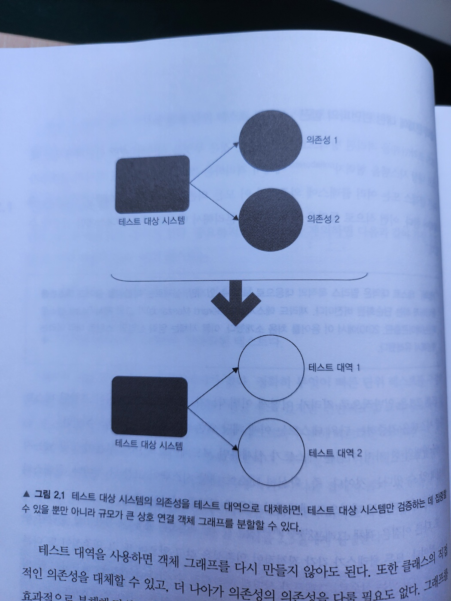
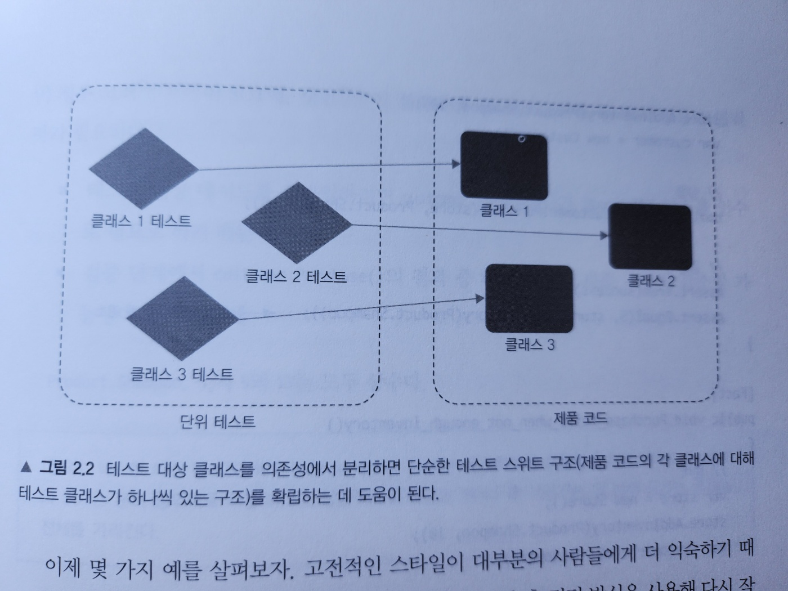
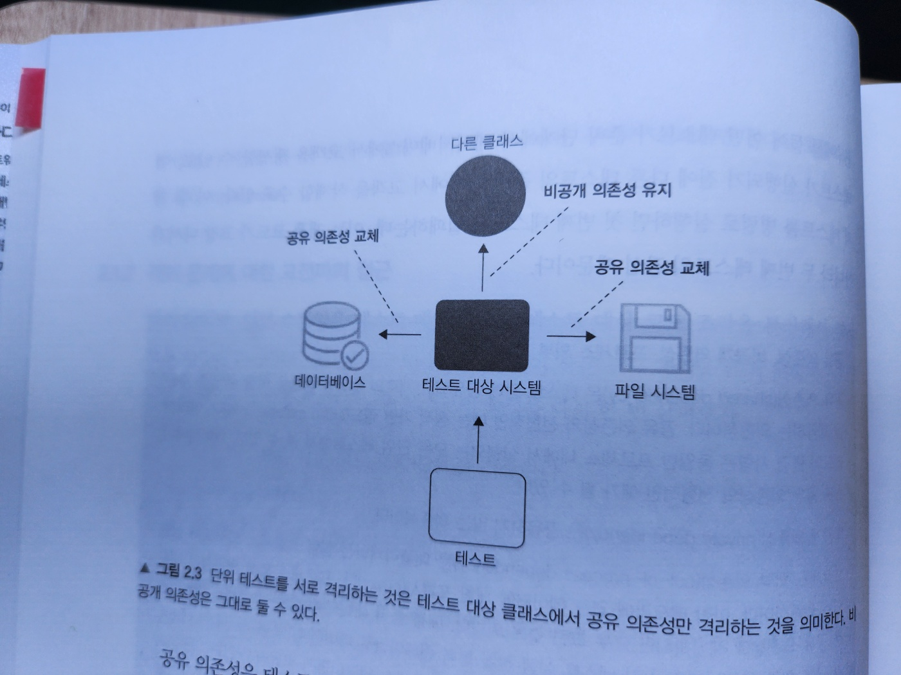

# 2. 단위 테스트란 무엇인가

#### 2장에서 다루는 내용

- 단위 테스트란?
- 공유 의존성, 비공개 의존성, 휘발성 의존성 간의 차이점
- 단위 테스트의 두 분파: 고전파와 런던파
- 단위 테스트, 통합 테스트, 엔드 투 엔드 테스트의 차이점

- 단위 테스트는 많은 뉘앙스(해석의 차이)를 가진다

  - 단위 테스트에 접근하는 방법이 두 가지 뚜렷한 견해로 나뉘었다 -> 고전파와 런던파

- 고전파와 런던파
  - 고전파는 모든 사람이 단위 테스트와 테스트 주도 개발에 원론적으로 접근하는 방식이기 때문에 '고전'이라고 한다
  - 런던파는 런던의 프로그램이 커뮤니티에서 시작됐다
  - 이번 장에서 고전적 스타일과 런던 스타일의 차이는 5장의 토대가 되고, 5장에서는 목(mock)과 테스트 취약성을 자세히 다룬다
- 주의 사항 및 세부 사항과 함께 단위 테스트 정의로 시작해보자
  - 이 정의가 고전파와 런던파를 구분짓는 열쇠다

## 2.1 '단위 테스트'의 정의

- 단위 테스트의 가장 중요한 세 가지 속성

  - 작은 코드 조각(단위라고도 함)을 검증하고,
  - 따르게 수행하고,
  - 격리된 방식으로 처리하는 자동화된 테스트다

- 논쟁이 되는 부분은 세 번재 속성이다
  - 격리 문제는 단위 테스틍츼 고전파와 런던파를 구분할 수 있게 해주는 근원적 차이에 속한다
  - 격리가 정확히 무엇인지에 대한 의견 차이로 시작됐다
  - 저자는 고전적 스타일을 선호한다 -> 2.3절

### 단위 테스트의 고전파와 런던파

#### 고전파

- '디트로이트(Detroit)'라고도 하며, 때로는 단위 테스트에 대한 고전주의적(classicist)'접근법이라고도 한다
- 가장 대표적인 책은 켄트 백(Kent Beck)의 '테스트 주도 개발(Test-Driven Development)'이다

#### 런던파

- '목 추종자(mockist)'으로도 표현된다
  - 런던파에선 목 추종자라고 불리는 것을 좋아하지 않는다
- 유명한 지지자들
  - 스티브 프리먼(Stve Freeman)
  - 냇 프라이스(Nat Pryce)
- 대표적인 책
  - 'Growing Object-Oriented Software, Guided by Tests(Addison-Wesley Professional, 2009)'

### 2.1.1 격리 문제에 대한 런던파의 접근

- 코드 조각을 격리된 방식으로 검증한다는 것

  - 런던파에서는 테스트 대상 시스템을 협력자(collaborator)에게서 격리하는 것을 일컫는다
  - 즉, 하나의 클래스가 다른 클래스 또는 여러 클래스에 의존하면 이 모든 의존성을 테스트 대역(test double)으로 대체해야 한다
  - 이런 식으로 동작을 외부 영향과 분리해서 테스트 대상 클래스에만 집중할 수 있다



- 그림 2-1. 테스트 대상 시스템의 의존성을 테스트 대역으로 대체하면, 테스트 대상 시스템만 검증하는 데 집중할 수 있을 뿐만 아니라 규모가 큰 상호 연결 객체 그래프를 분할할 수 있다

- 그림 2-1.은 일반적으로 격리가 어떻게 이뤄지는지 보여준다
- 의존성이 포함된 테스트 대상 시스템을 검증하는 단위 테스트는 이제 해당 의존성과 별개로 수행할 수 있다
- 장점
  - `테스트가 실패`하면 코드베이스의 `어느 부분이 고장났는지 확실히 알 수 있다`는 것이다
  - 객체 그래프를 분할 할 수 있다
- 클래스의 수가 너무 많으면 어려운 작업일 수 있다



- 그림2-2. 런던파는 각 클래스별 테스트를 작성한다

#### 예제 2.1 고전적인 스타일로 작성된 테스트

```java
[Fact]
public void Puchase_succeeds_when_enough_inventory() {
  // 준비
  var store = new Store();
  store.AddInventory(Product.Shampoo, 10);
  var customer = new Customer();

  // 실행
  bool success = customer.Purchase(store, Product.Shampoo, 5);

  // 검증
  Assert.True(success);
  Assert.Equal(5, store.GetInventory(Product.Shampoo)); // 상점 제품 다섯 개 감소
}
```

- Customer와 Store 둘 다 검증한다
- 두 클래스는 서로 격리되어 있지 않다

### 예제 2.2 런던 스타일로 작성된 단위 테스트

- 정의) 목은 테스트 대상 시스템과 협력자 간의 상호 작용을 검사할 수 있는 특별한 테스트 대역이다
  - 목: 테스트 대역의 부분 집합
  - 테스트 대역: 실행과 관련 없이 모든 종류의 가짜 의존성을 설명하는 포괄적인 용어

```java
[Fact]
public void Purchase_succeeds_when_enough_inventory() {
  // 준비
  var store = new Mock<IStore>();
  store //
    .Setup(s => s.HasEnoughInventory(Product.Shampoo, 5))
    .Returns(true);
  var customer = new Customer();

  // 실행
  bool success = customer.Purchase(store.Object, Product.Shampoo, 5);

  // 검증
  Assert.True(success);
  store.Verify(s => s.RemoveInventory(Product.Shampoo, 5), Times.Once);
}
```

### 2.1.2 격리 문제에 대한 고전파의 접근

- 런던 스타일은 테스트 대역(목)으로 테스트 대상(코드)을 분리해서 격리 요구 사항에 다가간다
- 단위 테스트의 속성 복습

  - 단위 테스트는 작은 코드 조각(단위)을 검증한다
  - 신속하게 수행한다
  - 격리된 방식으로 진행한다

- 코드 조각은 얼마나 작아야 하는가?
- 고전적 방법에서 코드를 꼭 결리 시켜야 하는 것은 아니다
  - 대신 단위 테스트는 서로 격리해서 실행해야 한다
  - 이렇게 하면 테스트를 어떤 순서(병렬이나 순차 등)로든 가장 적합한 방식으로 실행할 수 있으며, 서로의 결과에 영향을 미치지 않는다
- 이를 통해 테스트가 서로 소통하고 실행 컨텍스트에 영향을 줄 수 있다
  - 데이터 베이스, 파일 시스템 등 프로세스 외부 의존성이 이러한 공유 상태의 대표적인 예다

#### 공유 의존성, 비공개 의존성, 프로세스 외부 의존성

- 공유 의존성(shared dependency)
  - 테스트 간에 공유되고 서로의 결과에 영향을 미칠 수 있는 수단을 제공하는 의존성이다
  - 공유 의존성의 전형적인 예
    - 정적 가변 필드다
    - 데이터 베이스
- 비공개 의존성(private dependency)
  - 공유하지 않는 의존성
- 프로세스 외부 의존성(out of process dependency)

  - 애플리케이션 실행 프로세스 외부에서 실행되는 의존성
  - 예
    - 메모리에 없는 데이터에 대한 프록시
    - 데이터베이스는 프로세스 외부이면서 공유 의존성이다
      - 그러나 도커 컨테이너로 데이터베이스를 시작하면 테스트가 더 이상 동일한 인스턴스로 작동하지 않기 때문에 프로세스 외부이면서 공유하지 않는 의존성이 된다



- 그림 2-3. 단위 테스트를 서로 격리하는 것은 테스트 대상 클래스에서 공유 의존성만 격리하는 것을 의미한다

  - 비공개 의존성은 그대로 둘 수 있다

- 격리 문제에 대한 이러한 견해는 목과 기타 테스트 대역의 사용에 대한 훨씬 더 평범한 견해를 수반한다
  - 테스트 대역을 사용할 수 있지만, 보통 테스트 간에 공유 상태를 일으키는 의존성에 대해서만 사용한다
- 싱글턴
  - 각 테스트에서 새 인스턴스를 만들 수 있기만 하면 공유되지 않는다

#### 공유 의존성과 휘발성 의존성

- 비슷하지만 동일하지 않은 또 다른 용어로 휘발성 의존성(volatile dependency)이 있다
- 휘발성 의존성
  - 개발자 머신에 기본 설치된 환경 외에 런타임 환경의 설정 및 구성을 요구한다
  - 추가 설정이 필요하며 시스템에 기본으로 설치돼 있지 않다
    - e.g.
      - 데이터베이스, API 서비스
  - 비결정적 동작(nondeterministic behavior)
    - 이런 의존성은 각 호출에 다른 결과를 제공
    - e.g.
      - 난수 생성기, 현재 날짜와 시간을 반환하는 클래스
- 공유 의존성과 휘발성 의존성은 겹치는 부분이 있다

  - 데이터베이스에 대한 의존성은 공유 의존성이자 휘발성 의존성이다
  - 파일 시스템은 모든 개발자 머신에 설치되고 대부분 결정적으로 작동하므로 휘발성이 아니다
  - 난수 생성기는 휘발성이지만, 각 테스트에 별도의 인스턴스를 제공할 수 있으므로 공유 의존성이 아니다

- 공유 의존성을 대체하는 또 다른 이유는 테스트 실행 속도를 높이는 데 있다
  - 공유 의존성은 거의 항상 실행 프로세스 외부에 있지만
  - 비공개 의존성은 보통 그 경계를 넘지 않는다

## 2.2 단위 테스트의 런던파와 고전파
