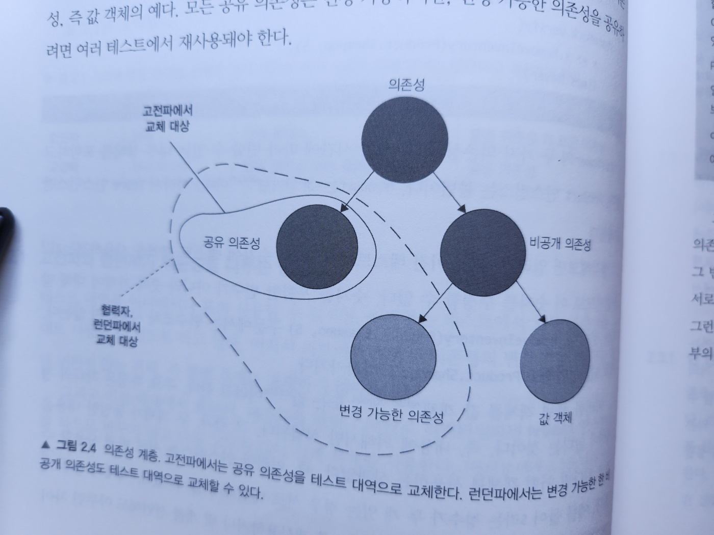
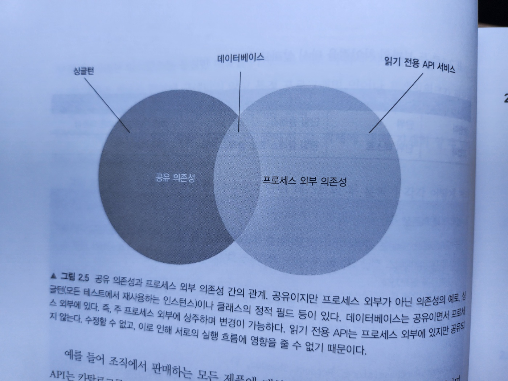
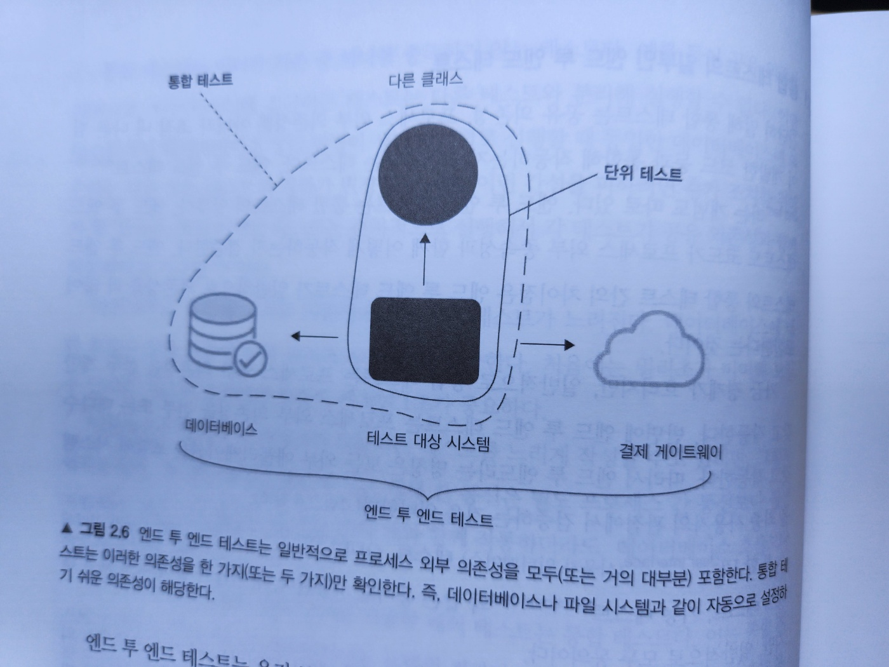

# 2. 단위 테스트란 무엇인가

#### 2장에서 다루는 내용

- 단위 테스트란?
- 공유 의존성, 비공개 의존성, 휘발성 의존성 간의 차이점
- 단위 테스트의 두 분파: 고전파와 런던파
- 단위 테스트, 통합 테스트, 엔드 투 엔드 테스트의 차이점

- 단위 테스트는 많은 뉘앙스(해석의 차이)를 가진다

  - 단위 테스트에 접근하는 방법이 두 가지 뚜렷한 견해로 나뉘었다 -> 고전파와 런던파

- 고전파와 런던파
  - 고전파는 모든 사람이 단위 테스트와 테스트 주도 개발에 원론적으로 접근하는 방식이기 때문에 '고전'이라고 한다
  - 런던파는 런던의 프로그램이 커뮤니티에서 시작됐다
  - 이번 장에서 고전적 스타일과 런던 스타일의 차이는 5장의 토대가 되고, 5장에서는 목(mock)과 테스트 취약성을 자세히 다룬다
- 주의 사항 및 세부 사항과 함께 단위 테스트 정의로 시작해보자
  - 이 정의가 고전파와 런던파를 구분짓는 열쇠다

## 2.1 '단위 테스트'의 정의

- 단위 테스트의 가장 중요한 세 가지 속성

  - 작은 코드 조각(단위라고도 함)을 검증하고,
  - 따르게 수행하고,
  - 격리된 방식으로 처리하는 자동화된 테스트다

- 논쟁이 되는 부분은 세 번재 속성이다
  - 격리 문제는 단위 테스틍츼 고전파와 런던파를 구분할 수 있게 해주는 근원적 차이에 속한다
  - 격리가 정확히 무엇인지에 대한 의견 차이로 시작됐다
  - 저자는 고전적 스타일을 선호한다 -> 2.3절

### 단위 테스트의 고전파와 런던파

#### 고전파

- '디트로이트(Detroit)'라고도 하며, 때로는 단위 테스트에 대한 고전주의적(classicist)'접근법이라고도 한다
- 가장 대표적인 책은 켄트 백(Kent Beck)의 '테스트 주도 개발(Test-Driven Development)'이다

#### 런던파

- '목 추종자(mockist)'으로도 표현된다
  - 런던파에선 목 추종자라고 불리는 것을 좋아하지 않는다
- 유명한 지지자들
  - 스티브 프리먼(Stve Freeman)
  - 냇 프라이스(Nat Pryce)
- 대표적인 책
  - 'Growing Object-Oriented Software, Guided by Tests(Addison-Wesley Professional, 2009)'

### 2.1.1 격리 문제에 대한 런던파의 접근

- 코드 조각을 격리된 방식으로 검증한다는 것

  - 런던파에서는 테스트 대상 시스템을 협력자(collaborator)에게서 격리하는 것을 일컫는다
  - 즉, 하나의 클래스가 다른 클래스 또는 여러 클래스에 의존하면 이 모든 의존성을 테스트 대역(test double)으로 대체해야 한다
  - 이런 식으로 동작을 외부 영향과 분리해서 테스트 대상 클래스에만 집중할 수 있다


- 그림 2-1. 테스트 대상 시스템의 의존성을 테스트 대역으로 대체하면, 테스트 대상 시스템만 검증하는 데 집중할 수 있을 뿐만 아니라 규모가 큰 상호 연결 객체 그래프를 분할할 수 있다

- 그림 2-1.은 일반적으로 격리가 어떻게 이뤄지는지 보여준다
- 의존성이 포함된 테스트 대상 시스템을 검증하는 단위 테스트는 이제 해당 의존성과 별개로 수행할 수 있다
- 장점
  - `테스트가 실패`하면 코드베이스의 `어느 부분이 고장났는지 확실히 알 수 있다`는 것이다
  - 객체 그래프를 분할 할 수 있다
- 클래스의 수가 너무 많으면 어려운 작업일 수 있다


- 그림2-2. 런던파는 각 클래스별 테스트를 작성한다

#### 예제 2.1 고전적인 스타일로 작성된 테스트

```java
[Fact]
public void Puchase_succeeds_when_enough_inventory() {
  // 준비
  var store = new Store();
  store.AddInventory(Product.Shampoo, 10);
  var customer = new Customer();

  // 실행
  bool success = customer.Purchase(store, Product.Shampoo, 5);

  // 검증
  Assert.True(success);
  Assert.Equal(5, store.GetInventory(Product.Shampoo)); // 상점 제품 다섯 개 감소
}
```

- Customer와 Store 둘 다 검증한다
- 두 클래스는 서로 격리되어 있지 않다

### 예제 2.2 런던 스타일로 작성된 단위 테스트

- 정의) 목은 테스트 대상 시스템과 협력자 간의 상호 작용을 검사할 수 있는 특별한 테스트 대역이다
  - 목: 테스트 대역의 부분 집합
  - 테스트 대역: 실행과 관련 없이 모든 종류의 가짜 의존성을 설명하는 포괄적인 용어

```java
[Fact]
public void Purchase_succeeds_when_enough_inventory() {
  // 준비
  var store = new Mock<IStore>();
  store //
    .Setup(s => s.HasEnoughInventory(Product.Shampoo, 5))
    .Returns(true);
  var customer = new Customer();

  // 실행
  bool success = customer.Purchase(store.Object, Product.Shampoo, 5);

  // 검증
  Assert.True(success);
  store.Verify(s => s.RemoveInventory(Product.Shampoo, 5), Times.Once);
}
```

### 2.1.2 격리 문제에 대한 고전파의 접근

- 런던 스타일은 테스트 대역(목)으로 테스트 대상(코드)을 분리해서 격리 요구 사항에 다가간다
- 단위 테스트의 속성 복습

  - 단위 테스트는 작은 코드 조각(단위)을 검증한다
  - 신속하게 수행한다
  - 격리된 방식으로 진행한다

- 코드 조각은 얼마나 작아야 하는가?
- 고전적 방법에서 코드를 꼭 결리 시켜야 하는 것은 아니다
  - 대신 단위 테스트는 서로 격리해서 실행해야 한다
  - 이렇게 하면 테스트를 어떤 순서(병렬이나 순차 등)로든 가장 적합한 방식으로 실행할 수 있으며, 서로의 결과에 영향을 미치지 않는다
- 이를 통해 테스트가 서로 소통하고 실행 컨텍스트에 영향을 줄 수 있다
  - 데이터 베이스, 파일 시스템 등 프로세스 외부 의존성이 이러한 공유 상태의 대표적인 예다

#### 공유 의존성, 비공개 의존성, 프로세스 외부 의존성

- 공유 의존성(shared dependency)
  - 테스트 간에 공유되고 서로의 결과에 영향을 미칠 수 있는 수단을 제공하는 의존성이다
  - 공유 의존성의 전형적인 예
    - 정적 가변 필드다
    - 데이터 베이스
- 비공개 의존성(private dependency)
  - 공유하지 않는 의존성
- 프로세스 외부 의존성(out of process dependency)

  - 애플리케이션 실행 프로세스 외부에서 실행되는 의존성
  - 예
    - 메모리에 없는 데이터에 대한 프록시
    - 데이터베이스는 프로세스 외부이면서 공유 의존성이다
      - 그러나 도커 컨테이너로 데이터베이스를 시작하면 테스트가 더 이상 동일한 인스턴스로 작동하지 않기 때문에 프로세스 외부이면서 공유하지 않는 의존성이 된다


- 그림 2-3. 단위 테스트를 서로 격리하는 것은 테스트 대상 클래스에서 공유 의존성만 격리하는 것을 의미한다

  - 비공개 의존성은 그대로 둘 수 있다

- 격리 문제에 대한 이러한 견해는 목과 기타 테스트 대역의 사용에 대한 훨씬 더 평범한 견해를 수반한다
  - 테스트 대역을 사용할 수 있지만, 보통 테스트 간에 공유 상태를 일으키는 의존성에 대해서만 사용한다
- 싱글턴
  - 각 테스트에서 새 인스턴스를 만들 수 있기만 하면 공유되지 않는다

#### 공유 의존성과 휘발성 의존성

- 비슷하지만 동일하지 않은 또 다른 용어로 휘발성 의존성(volatile dependency)이 있다
- 휘발성 의존성
  - 개발자 머신에 기본 설치된 환경 외에 런타임 환경의 설정 및 구성을 요구한다
  - 추가 설정이 필요하며 시스템에 기본으로 설치돼 있지 않다
    - e.g.
      - 데이터베이스, API 서비스
  - 비결정적 동작(nondeterministic behavior)
    - 이런 의존성은 각 호출에 다른 결과를 제공
    - e.g.
      - 난수 생성기, 현재 날짜와 시간을 반환하는 클래스
- 공유 의존성과 휘발성 의존성은 겹치는 부분이 있다

  - 데이터베이스에 대한 의존성은 공유 의존성이자 휘발성 의존성이다
  - 파일 시스템은 모든 개발자 머신에 설치되고 대부분 결정적으로 작동하므로 휘발성이 아니다
  - 난수 생성기는 휘발성이지만, 각 테스트에 별도의 인스턴스를 제공할 수 있으므로 공유 의존성이 아니다

- 공유 의존성을 대체하는 또 다른 이유는 테스트 실행 속도를 높이는 데 있다
  - 공유 의존성은 거의 항상 실행 프로세스 외부에 있지만
  - 비공개 의존성은 보통 그 경계를 넘지 않는다

## 2.2 단위 테스트의 런던파와 고전파

- 런던파 : 테스트 대상 시스템에서 협력자를 격리
- 고전파 : 단위 테스트끼리 격리

- 런던파와 고전파의 주요 의견 차이 주제
  - 격리 요구 사항
  - 테스트 대상 코드 조각(단위)의 구성 요소
  - 의존성 처리

#### 표 2.1 런던파와 고전파의 차이

| -      | 격리 주체   | 단위의 크기                  | 테스트 대역 사용 대상      |
| ------ | ----------- | ---------------------------- | -------------------------- |
| 런던파 | 단위        | 단일 클래스                  | 불변 의존성 외 모든 의존성 |
| 고전파 | 단위 테스트 | 단일 클래스 또는 클래스 세트 | 공유 의존성                |

### 2.2.1 고전파와 런던파가 의존성을 다루는 방법

- 런던파는 테스트에서 일부 의존성을 그대로 사용할 수 있도록 한다
- 테스트를 런던 스타일로 리팩터링하면 Product 인스턴스를 목으로 바꾸지 않고 다음 코드와 같이 실제 객체를 사용한다



- 그림 2.4. 의존성 계층. 고전파에서는 공유 의존성을 테스트 대역으로 교체한다
  - 런던파에서는 변경 가능한 비슷한 의존성도 테스트 대역으로 교체할 수 있다
- 그림 2.4에서는 의존성의 종류를 나타내고 단위 테스트의 두 분파가 각각 어떻게 처리하는지 보여준다
  - 비공개 의존성은 변경 가능하거나 불변일 수 있다
    - 불변인 경우: 값 객체
  - 예.
    - 데이터베이스는 공유 의존성이며, 내부 상태는 (테스트 태역으로 대체되지 않은) 모든 자동화된 테스트에서 공유한다
    - Store 인스턴스는 변경 가능한 비공개 의존성이다
    - Product 인스턴스(또는 에제에서 숫자 5의 인스턴스)는 불변인 비공개 의존성. 즉 값 객체의 예다
  - 모든 공유 의존성은 변경가능하지만 변경 가능한 의존성을 공유하려면 여러 테스트에서 재사용돼야 한다

#### 협력자 vs. 의존성

- 협력자(collaborator)는 공유하거나 변경 가능한 의존성이다
  - 예시
    - 데이터베이스는 공유 의존성이므로 데이터베이스 접근 권한을 제공하는 클래스는 협력자다
    - Store도 시간에 따라 상태가 변할 수 있기 때문에 협력자다
    - Product와 숫자 5도 역시 의존성이지만 협력자는 아니다
      - 값 또는 객체로 분류된다
- 일반적인 클래스는 두 가지 유형의 의존성으로 동작한다

  - `협력자`와 `값`
  - 예시. customer.Purchase(store, Product, shampoo, 5)
    - 여기에 세 가지 의존성이 있다
      - 협력자: store
      - 값 또는 객체: Product.Shampoo, 5



- 그림 2.5 공유 의존성과 프로세스 외부 의존성 간의 관계

  - 공유이지만 프로세스 외부가 아닌 의존성의 예: 싱글턴, 클래스의 정적 필드
  - 데이터 베이스는 공유이면서 프로세스 외부에 있다
    - 즉, 주 프로세스 외부에 상주하며 변경이 가능하다
  - 읽기 전용 API는 프로세스 외부에 있지만 공유되지 않는다
    - 수정할 수 없고, 이로 인해 서로의 실행 흐름에 영향을 줄 수 없기 때문이다

- 의존성에 대해

  - 모든 프로세스 외부 의존성이 공유 의존성의 범주에 속하는 것은 아니다
  - 공유 의존성은 거의 항상 프로세스 외부에 있지만, 그 반대는 그렇지 않다(그림2.5 참조)
  - 프로세스 외부 의존성을 공유하려면 단위 테스트가 서로 통신할 수 있는 수단이 있어야 한다

- 예. 조직에서 판매하는 모든 제품의 카탈로그를 반환하는 API
  - API는 카탈로그를 변경하는 기능을 노출하지 않는 한 공유 의존성이 아니다
  - 이러한 의존성은 휘발성이고 애플리케이션 경계를 벗어나는 것이 사실이지만, 테스트가 반환하는 데이터에 영향을 미칠 수 없기 때문에 공유가 아니다
  - 그렇다고 이러한 의존성을 테스트 범주에 포함해야 하는 것은 아니다
  - 대부분의 경유 테스트 속도를 높이려면 테스트 대역으로 교체해야 한다
  - 그러나 프로세스 외부 의존성이 충분히 빠르고 연결이 안정적이라면 테스트에서 그대로 사용하는 것도 괜찮다
- 이 책에서는 공유 의존성과 프로세스 외부 의존성이라는 용어는 서로 바꿀 수 있게 사용한다
  - 실제 프로젝트에서 프로세스 외부가 아닌 공유 의존성은 거의 없다
- 의존성이 프로세스 내부에 있으면 각 테스트에서 별도의 인스턴스를 쉽게 공급할 수 있으므로 테스트 간에 공유할 필요가 없다
- 마찬가지로 공유되지 않는 프로세스 외부 의존성은 일반적으로 접할 일이 없다
- 이러한 의존성 대부분은 변경가능하며, 테스트로 수정될 수 있다

## 2.3 고전파와 런던파의 비교

- 고전파와 런던파의 주요 차이는 단위 테스트의 정의에서 격리 문제를 어떻게 다루는지에 있다
  - 테스트해야할 단위의 처리
  - 의존성 처리에 대한 방법
- 저자는 고전파를 선호한다
  - 목을 사용하는 테스트는 고전적인 테스트보다 불안정한 경향이 있기 때문이다
- 지금은 런던파의 주요 장점을 하나씩 살펴보자
  - 입자성(granularity)이 좋다. 테스트가 세밀해서(fine-grained) 한 번에 한 클래스만 확인한다
  - 서로 연결된 클래스의 그래프가 커져도 테스트하기 쉽다
  - 테스트가 실패하면 어떤 기능이 실패했는지 확실히 알 수 있다

### 2.3.1 한 번에 한 클래스만 테스트하기

- 런던파
- 단일 동작 단위를 검증하는 것은 좋은 테스트다
- 이보다 작은 것은 단위 테스트를 훼손하는 결과를 가져온다
- 예
  - O : 우리집 강아지를 부르면, 바로 나에게 온다
  - X : 우리집 강아지를 부르면 먼저 왼쪽 앞다리를 움직이고, 이어서 오른쪽 앞다리를 움직이고, 머리를 돌리고, 꼬리를 흔들기 시작한다...

### 2.3.2 상호 연결된 클래스의 큰 그래프를 단위 테스트하기

- 협력자를 대신해 목을 사용하면 클래스를 쉽게 테스트 할 수 있다
- 클래스 그래프가 커진 것은 코드 설계 문제의 결과다

### 2.3.3 버그 위치 정확히 찾아내기

- 런던 스타일 테스트: 버그가 포함된 테스트만 실패
- 고전 스타일 테스트: 버그가 포함된 테스트와 연관된 모든 테스트가 실패
  - 테스트를 정기적으로 실행하면 버그의 원인을 알아낼 수 있다
  - 마지막으로 한 수정이 무엇인지 알기 때문에 문제를 찾는 것은 그리 어렵지 않다
  - 또한 실패한 테스트를 모두 볼 필요는 없다
    - 하나를 고치면 다른 것들도 자동으로 고쳐진다
  - 테스트 스위트 전체에 걸쳐 계단식으로 실패한다면 해당 코드 조각은 중요하다는 정보이다

### 2.3.4 고전파와 런던파 사이의 다른 차이점

- 두 가지 차이점

  - 테스트 주도 개발을 통한 시스템 설계 방식
  - 과도한 명세 문제

- 테스트 주도 개발

  - 1. 추가해야 할 기능과 어떻게 동작해야 하는지를 나타내는 실패 테스트를 작성한다
  - 2. 테스트가 통과할 만큼 충분히 코드를 작성한다. 이 단계에서 코드가 깨끗하거나 명쾌할 필요는 없다
  - 3. 코드를 리팩터링한다. 통과 테스트 보호하에서 코드를 안전하게 정리해 좀 더 읽기 쉽고 유지하기 쉽도록 만들 수 있다
  - 추천 도서
    - 켄트 백의 '테스트 주도 개발'
    - 스티브 프리먼과 냇 프라이스의 'Growing Object-Oriented Software, Guided by Tests'

- `런던 스타일`의 단위 테스트
  - `하향식` TDD로 이어지며, 전체 시스템에 대한 기대치를 설정하는 상위 레벨 테스트부터 시작한다
  - 목을 사용해 예상 결과를 달성하고자 시스템이 통신해야 하는 협력자를 지정한다
  - 모든 클래스를 구현할 때 까지 클래스 그래프를 다져나간다
  - 목은 한 번에 한 클래스에 집중할 수 있기 때문에 이 설계 프로세스를 가능하게 한다
  - 테스트할 때 SUT의 모든 협력자를 차단해 해당 협력자의 구현을 나중으로 미룰 수 있다
- `고전파 스타일`의 테스트

  - 실제 객체를 다뤄야 하기 때문에 지침을 똑같이 두지 않는다
  - 일반적으로 `상향식`으로 한다
  - 고전적 스타일에서는 도메인 모델을 시작으로 최종 사용자가 소프트웨어를 사용할 수 있을 때 까지 계층을 그 위에 더 둔다

- 과도한 명세 문제
  - 고전파와 런던파 간의 가장 중요한 차이점
  - 테스트가 SUT의 구현 세부 사항에 결합되는 것이다
  - 런던 스타일은 고전 스타일보다 테스트가 구현에 더 자주 결합되는 편이다
  - 이로 인해 런던 스타일과 목을 전반적으로 아무 데나 쓰는 것에 대해 주로 이의가 제기된다
  - 목에 대한 자세한 내용은 4장 부터 살펴보자

## 2.4 두 분파의 통합 테스트

- 격리에 대한 견해에서 차이가 나면서 자연스럽게 다른 의견으로 이어졌다
- 런던파
  - 실제 협력자 객체를 사용하는 모든 테스트를 통합 테스트로 간주한다
  - 고전 스타일로 작성된 테스트는 런던파 지지자들에게 통합 테스트로 느껴질 것이다
- 이 책에서는 단위 테스트와 통합 테스트의 고전적인 정의를 사용한다
  - `단위테스트`는 다음과 같은 특징이 있는 자동화된 테스트 이다
    - 작은 코드 조각을 검증하고
    - 빠르게 수행하고
    - 격리된 방식으로 처리한다
  - `고전파 관점에서 다시 정의`
    - 단일 동작 단위를 검증하고
    - 빠르게 수행하고
    - 다른 테스트와 별도로 처리한다
- 통합 테스트는 이러한 기준 중 하나를 충족하지 않는 테스트다
  - 공유 의존성(e.g. 데이터베이스)에 접근하는 테스트는 다른 테스트와 분리해 실행할 수 없다
    - 어떤 테스트에서 데이터베이스 상태 변경이 생기면 병렬로 실행할 때 동일한 데이터베이스에 의존하는 다른 모든 테스트의 결과가 변경될 것이다
    - 이런 간섭을 피하려면 추가 조치를 취해야 할 것이다
    - 이러한 테스트는 순차적으로 실행해서 각 테스트가 공유의존성과 함게 작동하려고 기다릴 수 있다
  - 외부 의존성에 접근
    - 느려짐
  - 둘 이상의 동작 단위를 검증하는 테스트
- 통합 테스트는 시스템 전체를 검증해 소프트웨어 품질을 기여하는 데 중요한 역할을 한다
  - 3부에서 자세히 살펴본다

### 2.4.1 통합 테스트의 일부인 엔드 투 엔드 테스트

- 공유의 존성, 프로세스 외부 의존성 뿐 아니라 조직 내 다른 팀이 개발한 코드 등과 통합해 작동하는지 검증하는 테스트
- 엔드 투 엔드 테스트라는 개념도 따로 있다
- 엔드 투 엔드 테스트는 통합 테스트의 일부다
- 또한 UI 테스트, GUI 테스트, 기능 테스트와 같은 용어도 사용한다(모두 e2e테스트의 동의어)
- 예. 애플리케이션이 데이터베이스, 파일 시스템, 결제 게이트웨이라는 세 가지 프로세스 외부 의존성으로 작동한다고 가정
  - 일반적인 통합 테스트는 데이터베이스와 파일 시스템만 포함하고, 결제 게이트웨이는 테스트 대역으로 대체한다



- 그림 2.6 엔드 투 엔드 테스트는 프로세스 외부 의존성을 모두(또는 거의 대부분) 포함한다

  - 통합 테스트는 이러한 의존성을 한 가지(또는 두 가지)만 확인한다
  - 즉, 데이터베이스나 파일 시스템과 같이 자동으로 설정하기 쉬운 의존성이 해당한다

- 엔드 투 엔드 테스트는 유지보수 측면에서 가장 비용이 많이 들기 때문에 모든 단위 테스트와 통합 테스트를 통과한 후 빌드 프로세스 후반에 실행하는 것이 좋다
- 또한 개인 개발자 머신이 아닌 빌드 서버에서만 실행할 수도 있다
- 엔드 투 엔드 테스트를 하더라도 모든 프로세스 외부 의존성을 처리하지 못할 수도 있다
- 일부 의존성의 테스트 버전이 없거나 해당 의존성을 필요한 상태로 자동으로 가져오는 것이 불가능할 수 있다
- 따라서 여전히 테스트 대역을 사용할 필요가 있고, 통합 테스트와 엔드 투 엔드 테스트 사이에 뚜렷한 경계가 없다는 사실을 강조한다

## 요약

- 이 장에서 단위 테스트의 정의를 다듬었다(고전파)
  - 단일 동작 단위를 검증하고
  - 빠르게 수행하고
  - 다른 테스트와 별도로 처리한다
- 격리 문제를 주로 논의하고 있는데, 이 논쟁으로 고전파(디트로이트)와 런던파(목 추종자)라는 두 개의 단위 테스트 분파로 나뉘었다
  - 이러한 의견 차이는 무엇이 단위 테스트를 의미하는지에 대한 관점과 `테스트 대상 시스템(SUT)`의 의존성 처리 방식에 영향을 미친다
  - 런던파
    - 단위 테스트를 서로 분리해야 한다고 한다
    - 클래스 단위
    - 불변 의존성을 제외한 모든 의존성을 테스트 대역으로 대체해야 한다
  - 고전파
    - 단위가 아니라 단위 테스트를 서로 분리해야 한다고 한다
    - 테스트 대상 단위는 코드 단위가 아니라 동작 단위다
    - 따라서 공유 의존성만 테스트 대역으로 대체해야 한다
    - 공유 의존성은 테스트가 서로 실행 흐름에 영향을 미치는 수단을 제공하는 의존성이다
- 런던파는 더 나은 이밪성, 테스트 용이성, 버그가 있는 기능을 쉽게 찾을 수 있는 편의성 등을 제공한다
- 런던파의 장점이 처음에는 매력적으로 보인다 그러나 몇 가지 문제가 있다
  - 대상 클래스에 대한 초점이 잘못됐다
    - 테스트는 코드 단위가 아니라 동작 단위를 검증해야 한다
    - 코드 조각을 단위 테스트할 수 없다는 것은 코드 설계에 문제가 있다는 사실을 알려주는 강한 징후다
  - 테스트 대역을 사용한다고 해도 이 문제를 해결하는 게 아니라 오히려 숨길 뿐이다
  - 테스트 실패 후 어떤 기능에 버그가 있는지 판단하는 것이 도움은 되지만, 종종 버그의 원인을 알고 있기 때문에 그리 큰 문제는 아니다
    - 마지막에 수정한 것이 버그의 원인일 것이다
- 런던파 테스트의 가장 큰 문제는 과잉 명세, 즉 SUT(테스트 대상 시스템) 세부 구현에 결합된 테스트 문제다
- 통합 테스트는 단위 테스트 기준 중 하나 이상을 충족하지 못하는 테스트다
  - 엔드 투 엔드 테스트는 통합 테스트의 일부다
  - 최종 사용자의 관점에서 시스템을 검증한다
  - 엔드 투 엔드 테스트는 애플리케이션과 함께 작동하는 프로세스 외부 의존성의 전부 또는 대부분에 직접 접근한다
- 추천 도서
  - 켄트 백의 '테스트 주도 개발'
  - 스티브 프리먼과 냇 프라이스의 'Growing Object-Oriented Software, Guided by Tests'
