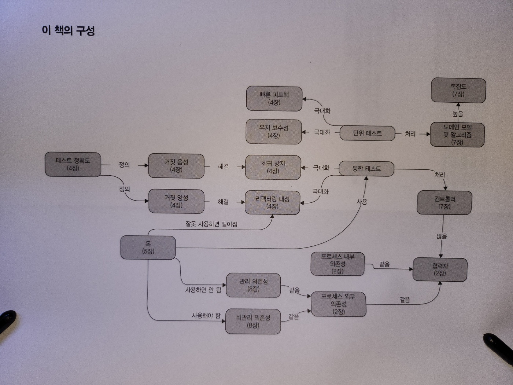

# 단위 테스트(Unit Testing)

- 생산성과 품질을 위한 단위 테스트 원칙과 패턴
- 저자: 블라디미르 코리코프

## 지은이의 말

- 단위 테스트의 기본 원칙
- 단위 테스트는 사실상 소프트웨어 프로젝트의 필수 요소이다
- 이 책을 통해 가치 있고 유지보수가 용이한 테스트를 작성하는 데 필요한 모든 것을 알 수 있다

## 옮긴이의 말

- 다른 책들은 테스트의 본질에 접근했다면,
- 이 책은 실용적인 테스트 구성에 대한 방법론으로 접근한다

## 목차

### 1부. 더 큰 그림

- 1장. 단위 테스트의 목표
  - 1.1 단위 테스트 현황
  - 1.2 단위 테스트의 목표
  - 1.3 테스트 스위트 품질 측정을 위한 커버리지 지표
  - 1.4 무엇이 성공적인 테스트 스위트를 만드는가?
  - 1.5 이 책을 통해 배우는 것
- 2장. 단위 테스트란 무엇인가
  - 2.1 '단위 테스트'의 정의
  - 2.2 단위 테스트의 런던파와 고전파
  - 2.3 고전파와 런던파의 비교
  - 2.4 두 분파의 통합 테스트
- 3장. 단위 테스트 구조
  - 3.1 단위 테스트를 구성하는 방법
  - 3.2 xUnit 테스트 프레임워크 살펴보기
  - 3.3 테스트 간 테스트 픽스처 재사용
  - 3.4 단위 테스트 명명법
  - 3.5 매개변수화된 테스트 리팩터링하기
  - 3.6 검증문 라이브러리를 사용한 테스트 가독성 향상

### 2부. 개발자에게 도움이 되는 테스트 만들기

- 4장. 좋은 단위 테스트의 4대 요소
  - 4.1 좋은 단위 테스트의 4대 요소 자세히 살펴보기
  - 4.2 첫 번째 특성과 두 번째 특성 간의 본질적인 관계
  - 4.3 세 번째 요소와 네 번째 요소: 빠른 피드백과 유지 보수성
  - 4.4 이상적인 테스트를 찾아서
  - 4.5 대중적인 테스트 자동화 개념 살펴보기
- 5장. 목과 테스트 취약성
  - 5.1 목과 스텁 구분
  - 5.2 식별할 수 있는 동작과 구현 세부 사항
  - 5.3 목과 테스트 취약성 간의 관계
  - 5.4 단위 테스트의 고전파와 런던파 재고
- 6장. 단위 테스트 스타일
  - 6.1 단위 테스트의 세 가지 스타일
  - 6.2 단위 테스트 스타일 비교
  - 6.3 함수형 아키텍처 이해
  - 6.4 함수형 아키텍처와 출력 기반 테스트로의 전환
  - 6.5 함수형 아키텍처의 단점 이해하기
- 7장. 가치 있는 단위 테스트를 위한 리팩터링
  - 7.1 리팩터링할 코드 식별하기
  - 7.2 가치 있는 단위 테스트를 위한 리팩터링하기
  - 7.3 최적의 단위 테스트 커버리지 분석
  - 7.4 컨트롤러에서 조건부 로직 처리
  - 7.5 결론

### 3부. 통합 테스트

- 8장. 통합 테스트를 하는 이유
  - 8.1 통합 테스트는 무엇인가?
  - 8.2 어떤 프로세스 외부 의존성을 직접 테스트해야 하는가?
  - 8.3 통합 테스트: 예제
  - 8.4 의존성 추상화를 위한 인터페이스 사용
  - 8.5 통합 테스트 모범 사례
  - 8.6 로깅 기능을 테스트하는 방법
- 9장. 목 처리에 대한 모범 사례
  - 9.1 목의 가치를 극대화하기
  - 9.2 목 처리에 대한 모범 사례
- 10장. 데이터베이스 테스트
  - 10.1 데이터베이스 테스트를 위한 전제 조건
  - 10.2 데이터베이스 트랜잭션 관리
  - 10.3 테스트 데이터 생명 주기
  - 10.4 테스트 구절에서 코드 재사용하기
  - 10.5 데이터베이스 테스트에 대한 일반적인 질문

### 4부. 단위 테스트 안티 패턴

- 11장. 단위 테스트 안티 패턴
  - 11.1 비공개 메서드 단위 테스트
  - 11.2 비공개 상태 노출
  - 11.3 테스트로 유출된 도메인 지식
  - 11.4 코드 오염
  - 11.5 구체 클래스를 목으로 처리하기
  - 11.6 시간 처리하기
