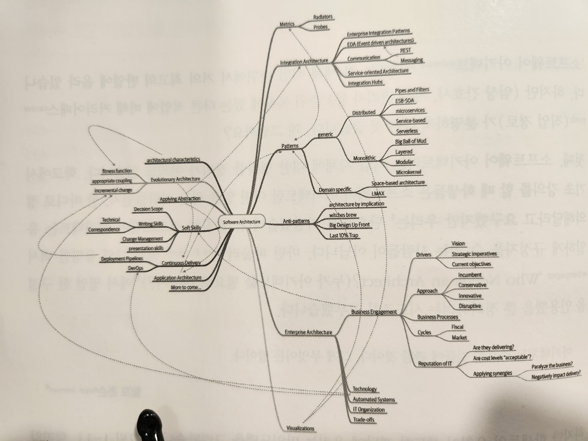
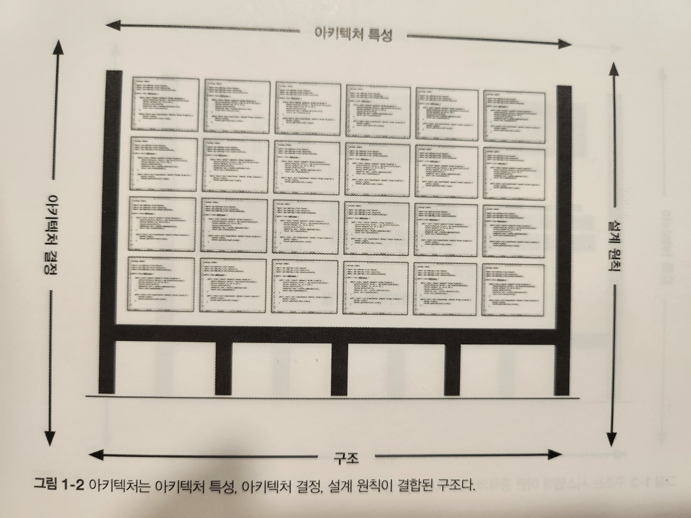
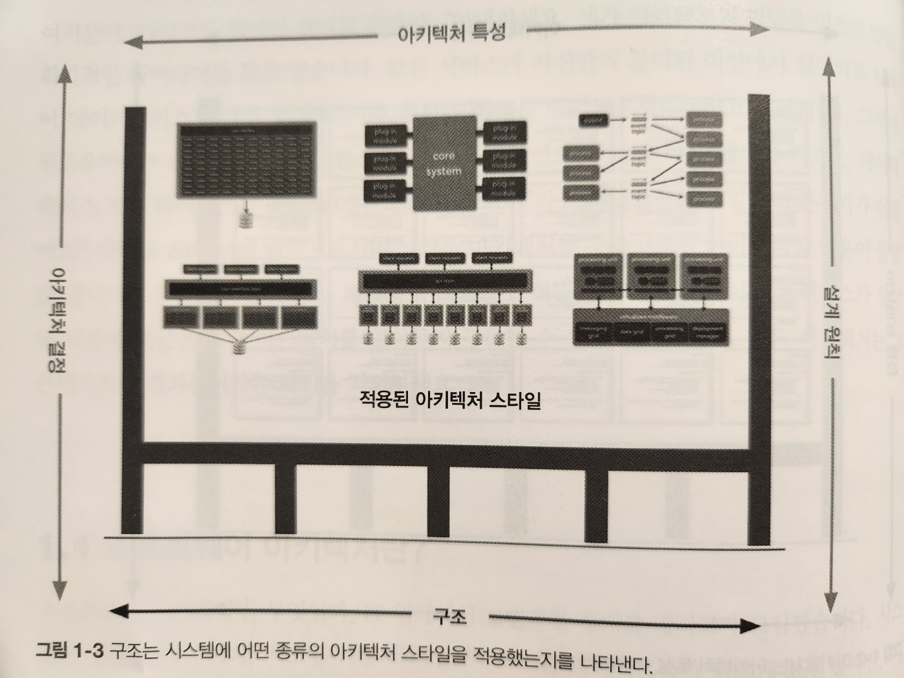
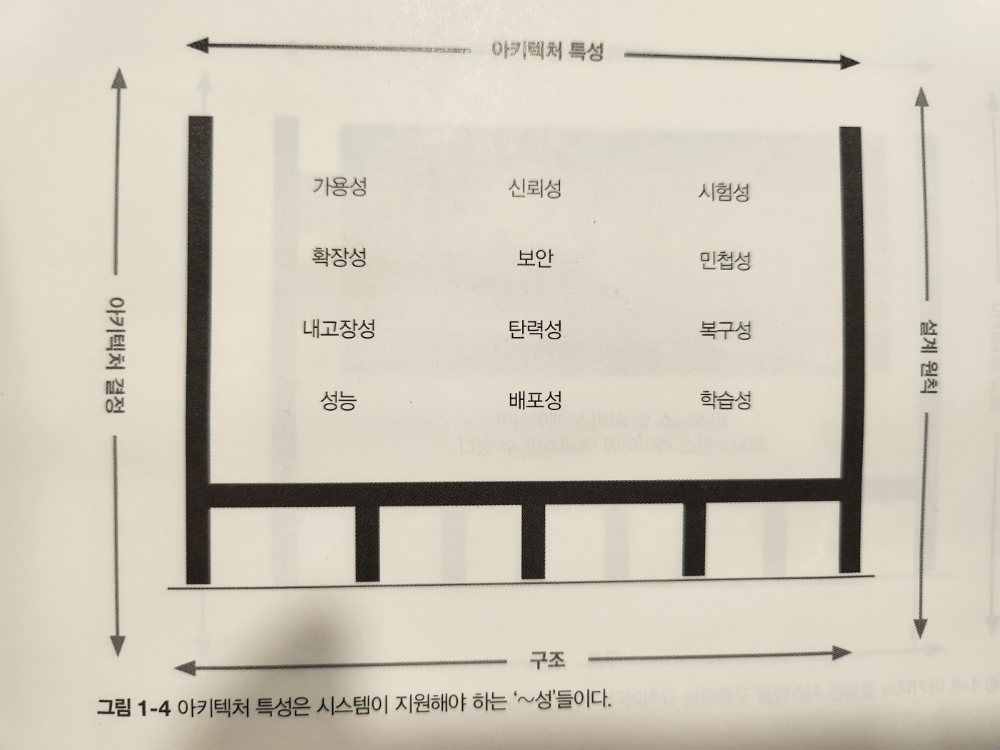
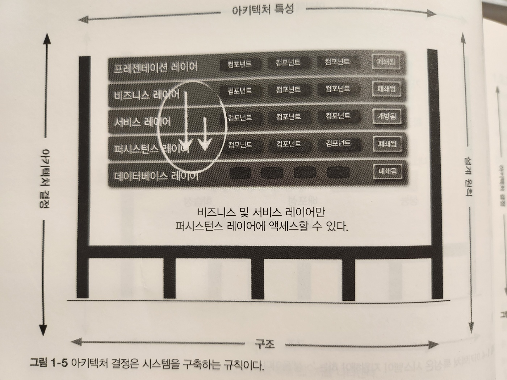
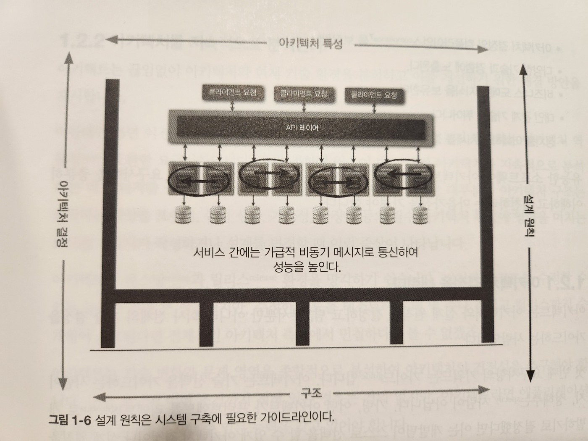

# 1. 서론

### 소프트웨어 아키텍트에 대한 정의가 분명하지 않다

- 소프트웨어 아키텍트(software architect)는 다른 직업에 비해 커리어패스(career path, 직업 경로)가 분명하지 않은 것 같다. 왜 그럴까요?

> 첫째, 소프트웨어 아키텍트라는 직업 자체에 대한 명확한 정의가 아직도 없습니다

- 소프트웨어 아키텍트는 유일하게 규정지을 수 있는 사람들이 아닙니다

- 소프트웨어 아키텍트 마인드맵

- 그림 1-1. 소프트웨어 아키텍트의 업무는 기술 역량, 소프트 스킬, 운영 감각 등 많은 분야를 아우른다

> 둘째, 마인드맵만 봐도 알 수 있듯이 소프트웨어 아키텍트의 역할은 실로 방대한 분야를 포괄하며 업무 범위도 계속 넓어지고 있습니다

- 10년 전만 해도 소프트웨어 아키텍트는 주로 모듈성, 컴포넌트, 패턴 등 순수 기술적인 부분을 다루었지만,
  - 이제는 (마이크로서비스처럼) 훨씬 폭넓은 능력을 활용하는 새로운 아키텍처 스타일의 등장으로 인해 그 역할과 범위가 한층 더 확대되었습니다

> 셋째, 소프트웨어 개발 생태계는 워낙 빠르게 발전하는 분야이고 소프트웨어 아키텍처는 끊임없이 변합니다

- 소프트웨어 아키텍처가 '일단 구축한 이후에 변경하려면 비용이 드는 근본적인 구조를 선택하는 일'이라고 나와 있는데 이 또한 철지난 문장입니다
  - 마이크로 서비스 같은 요즘 아키텍처 스타일은 단계적으로 구축한다는 개념에 기반을 두기 때문에 구조를 변경하는 작업도 그리 비싸지 않습니다
- 물론, 이런 능력은 커플링 등의 다른 관심사와 언제나 트레이드오프가 존재하며, 대부분의 소프트웨어 아키텍처 도서는 이것을 정적인 문제로 취급합니다
  - 일단 해결되면 안심하고 무시해도 되는 문제라고 보지만 이는 잘못된 생각입니다
  - 앞으로 이 책에서 소프트웨어 아키텍처는 그 정의를 포함한 본질 자체가 동적입니다

> 넷째, 소프트웨어 아키텍처에 관한 자료는 대부분 역사적인 연관성을 강조합니다

- 수년 전까지 들어맞았던 솔루션도 상황이 달라지면서 지금은 돌아가지 않는 것들도 수두룩합니다
- 소프트웨어 아키텍처의 역사는 과거 아키텍트들이 시도했으나 해로운 부수 효과만 식별하게 된 것들로 난잡하게 얽혀 있습니다
- 이 책은 그 과정에서 얻은 많은 교훈들을 이야기합니다

### 아키텍처 기초에 관한 책이 무슨 소용일까요?

- 소프트웨어 아키텍처의 범위는 끊임없이 변화하는 개발 세상의 유일한 요소가 아닙니다
- 새로운 기술, 기법, 기능, ... 지난 수십 년간 달라진 것들을 나열하는 것보다 외려 달라지지 않은 것을 찾아보는 게 더 쉬울 정도입니다
- 소프트웨어 아키텍트는 이렇게 끊임없이 변하는 생태계안에서 뭔가 결정을 내리는 사람들입니다
  - 그렇게 결정한 기반을 비롯한 모든 것이 변하므로 과거 아키텍처에 관한 글에서 강조한 핵심 원칙들도 다시 검토해봐야 합니다
- 예를 들면, 예전엔 데브옵스라는 개념이 존재하지 않았으니 데브옵스의 영향은 하나도 고려하지 않았습니다

- 아키텍처란 문맥으로 이해할 수 있습니다
  - 예전엔 효율적인 리소스를 공유하여 사용하는 것이 목표
    - 인프라 가격이 비쌌기 때문
- 오픈소스가 개발되고 데브옵스 혁명을 통해 엔지니어링 프랙티스가 향상된 덕분에 지금은 아키텍처를 얼마든지 구축할 수 있게 되었습니다
  - 윈도우, 데이터베이스 라이선스를 여러개 구입할 필요가 없다

## 1.1 소프트웨어 아키텍처란?

- '청사진', '이정표'라는 말이 실제로 의미하는 바는 무엇인지 이해해야한다
- 아키텍트가 시스템을 '분석'한다면 과연 무엇을 '분석'한다는 말일까요?

- 그림 1-2. 아키텍처는 아키텍처 특성, 아키텍처 결정, 설계 원칙이 결합된 구조다
- 그림 1-2는 소프트웨어 아키텍처를 바라보는 방법 중 하나입니다
  - 아키텍처 특성
  - 아키텍처 결정
  - 설계 원칙
  - 시스템 구조

- 그림 1-3. 구조는 시스템에 어떤 종류의 아키텍처 스타일을 적용했는지를 나타낸다

#### `시스템 구조`란 시스템이 구현된(마이크로서비스, 레이어드, 마이크로커널 같은) 아키텍처 스타일(들)의 종류를 말합니다(그림 1-3)

- 하지만 구조만으로 아키텍처를 전체적으로 설명하기에 부족합니다

  - 가령 아키텍처를 설명해달라는 요청에 "마이크로서비스 아키텍처입니다"라고 대답했다면?
    - 그는 시스템의 구조만 언급했을 뿐, 시스템의 아키텍처를 이야기한 것이 아닙니다
  - 시스템의 아키텍처를 완전히 이해하려면 아키텍처 특성, 아키텍처 결정, 설계 원칙도 알아야 합니다

- 아키텍처 특성은 소프트웨어 아키텍처를 다른 관점에서 바라본 것으로, 일반적으로 시스템의 기능과 직교하는 시스템의 성공 기준을 결정합니다

#### `아키텍처 특성`은 시스템이 지원해야 하는 '~성'들이다

- 아키텍처 특성은 소프트웨어 아키텍처를 다른 관점에서 바라본 것으로, 일반적으로 시스템의 기능과 직교하는 시스템의 성공 기준을 결정합니다(그림 1-4).
- 여기에 나열된 모든 아키텍처 특성이 시스템 기능에 관한 지식을 필요로 하는 것은 아니지만, 시스템이 올바르게 동작하기 위해서는 반드시 필요한 것들입니다

- 그림 1-5. 아키텍처 결정은 시스템을 구축하는 규칙이다

#### 소프트웨어 아키텍처를 규정하는 또 다른 측면은 `아키텍처 결정`입니다

- 소프트웨어 결정은 시스템 구축에 필요한 규칙들을 정한 것입니다
  - e.g. '레이어드(게층화) 아키텍처에서는 프레젠테이션 레이어가 데이터베이스를 직접 호출하지 못하게 비즈니스와 서비스 레이어에서만 데이터베이스에 액세스할 수 있다'고 결정하는 식입니다
- 아키텍처 결정은 시스템의 제약조건을 형성하며, 개발자가 해도 되는 것과 하지말아야 할 것을 알려줍니다

- 어떤 상황 때문에, 또는 다른 제약조건 탓에 이전에 만든 결정을 따를 수 없다면 변형을 통해 깨뜨릴 수 있습니다
  - 아키텍처 심사 위원회(ARB, Architecture Review Board)에서 사용하는 변형 모델을 갖고 있는 회사들이 많은데, 이 모델은 어떤 표준이나 아키텍처 결정의 변형을 추구하는 프로세스를 규정합니다
- 아키텍처 결정에 대한 예외는 ARB가 검토하여 타당한 근거와 트레이드오프를 고려한 뒤 승인/거부합니다

#### 아키텍처를 정의하는 마지막 요소는 `설계 원칙`입니다

- 그림 1-6. 설계 원칙은 시스템 구축에 필요한 가이드라인이다

- 아키텍처 결정이 반드시 지켜야할 규칙이라면 설계원칙은 가이드라인입니다
  - 예를 들어, 그림 1-6에서 마이크로서비스 아키텍처의 성능 향상을 위해 서비스 간 통신은 비동기 메시징을 활용해야 한다고 기술하는 것이 설계 원칙입니다
- 서비스 간 통신에 관한 모든 조건과 구현 방안을 아키텍처 결정(규칙)으로 다룰 수는 없기에 특정 환경에서 개발자가 더 적합한 (REST나 gRPC 같은) 통신 프로토콜을 선택할 수 있도록 우선 권장하는 방법에 관한 가이드를 설계 원칙으로 제공하는 것입니다

## 1.2 아키텍트에 대한 기대치

- 소프트웨어 아키텍트가 무엇을 하는 사람인가는 소프트웨어 아키텍처만큼이나 정의하기가 어렵고, 전문 프로그래머부터 회사의 전략적 기술 방향을 결정하는 것까지 매우 다양합니다
- 우리는 정답도 없는 문제에 우왕좌왕하기 보다 사람들이 아키텍트에게 바라는 기대치에 집중하고자 합니다
- 역할, 직책, 직무에 상관없이 소프트웨어 아키텍트에게 바라는 핵심적임 요구사항은 다음 여덞가지로 정리할 수 있습니다
  - 아키텍처 결정을 내린다
  - 아키텍처를 지속적으로 분석한다
  - 최신 트렌드를 계속 유지한다
  - 아키텍처 결정의 컴플라이언스를 보장한다
  - 다양한 기술과 경험에 노출된다
  - 비즈니스 도메인 지식을 보유한다
  - 대인 관계 기술이 뛰어나다
  - 정치를 이해하고 처세를 잘한다

### 1.2.1 아키텍처 결정을 내린다

- 아키텍트는 아키텍처와 설계 원칙을 결정하고 팀, 부서뿐만 아니라 회사 전체의 기술 결정을 가이드하는 사람입니다
- 첫 번째 요구사항의 키워드는 '가이드'입니다
  - 아키텍트는 기술 선택을 가이드 하는 사람이지 정해주는 사람이 아닙니다
  - 가령, 어떤 아키텍트가 프런트엔드를 리액트로 개발하기로 결정했다면 이는 개발팀이 스스로 선택을 할 수 있게 아키텍처 결정이나 설계원칙을 가이드한 것이 아니라
    - 기술 결정을 해버린 것입니다
  - 아키텍트는 개발자들이 프런트엔드 웹 개발용 리액티브 기반의 프레임워크를 사용하도록 기술 지도를 하고 앵귤러, 엘름, 리액트, 뷰와 같은 리액티브 기반의 웹 프레임워크 중 하나를 선정할 수 있도록 가이드합니다
- 아키텍처 결정과 설계 원칙을 통해 기술 선택을 가이드하는 일은 생각보다 어렵습니다
  - 효과적인 아키텍처 결정을 하려면 아키텍트 자신이 내린 결정이 개발팀 스스로 옳은 기술 결정을 하도록 가이드하는 데 도움이 되는지, 아니면 개발팀을 위해 기술을 대신 선택해 주는 게 더 나을지 자문해봐야 합니다
  - 확장성, 성능, 가용성 등의 아키텍처 특성을 수호하기 위해 특정한 기술을 결정해야 할 때도 있는데, 이런 경우에는 그 기술을 지정한 행위 자체를 아키텍처 결정이라고 할 수 있습니다

### 1.2.2 아키텍처를 지속적으로 분석한다

- 아키텍트는 끊임없이 아키텍처와 현재 기술환경을 분석하고 이를 개선하기 위한 해결 방안을 제시합니다
  - 이를테면, 3년 이전에 정의한 아키텍처가 지금도 얼마나 현실성 있는지 평가하는 아키텍처 역동성에 관한 요구사항입니다
- 아키텍트는 테스팅과 릴리스 환경을 망각하기 쉽습니다
  - 수정한 코드를 테스트하는 데 몇 주나 걸리고 릴리스까지 수개월이 소요하다면 아키텍처 측면에서 민첩하다고 볼 수 없다
- 아키텍트는 기술 변화와 문제 영역을 종합적으로 분석하여 아키텍처의 건전성을 추구해야 합니다
  - 아키텍트라면 애플리케이션을 계속 적절하게 유지할 수 있는 능력을 갖고 있어야 합니다

### 1.2.3 최신 트렌드를 계속 따라간다

- 핵심 트렌드를 이해하고 계속 좇아갈 수 있어야 미래를 대비하고 올바른 결정을 내릴 수 있습니다
- 이것을 수행하는 다양간 기술과 방법은 24장에서 자세히 다룹니다

### 1.2.4 아키텍처 결정의 컴플라이언스를 보장한다

- 컴팔라이언스 보장이란, 아키텍트가 정의하고 문서화하여 전달한 아키텍처 결정과 설계 원칙들을 개발팀이 제대로 준수하고 있는지 지속적으로 확인한다는 뜻입니다
  - 컴플라이언스(Compliance)란 '준수'라는 뜻으로, 아키텍처 결정을 준수하는 것을 의미합니다
- e.g. 단순한 데이터베이스 호출이라도 모든 아키텍처 레이어를 거쳐야 통신이 가능하다다고 결정
  - UI개발자가 이 결정을 어기지 않도록 지속적으로 확인해야 합니다
- 자동화 피트니스 함수와 자동화 도구를 이용해 컴플라이언스를 측정하는 방법은 6장에서 다룹니다

### 1.2.5 다양한 기술과 경험에 노출된다

- 아키텍트는 다양한 기술, 프레임워크, 플랫폼, 환경에 노출되어야 합니다
- 모든 프레임워크, 플랫폼, 언어에 통달해야 할 필요는 없지만, 적어도 다양한 기술을 거리낌없이 쓸 줄을 알아야 합니다
- 다양한 시스템과 서비스를 연동하는 방법은 알고 있어야 합니다
  - 그러려면 아키텍트 자신이 가장 익숙한 영역을 점점 넓혀가는 것이 가장 좋습니다
- 예를 들어, 아키텍트는 한 가지 캐시 제품에 정통한 전문가가 되려고 하기보다는 10가지 캐시 제품을 어느 정도 다룰 줄 알고 각각의 장단점을 아는 게 더 중요합니다

### 1.2.6 비즈니스 도메인 지식을 보유한다

- 아키텍트는 어느 수준 이상 비즈니스 도메인 전문가여야 합니다
- 비즈니스 도메인 지식이 없으면 비즈니스의 문제점, 목표, 요구사항을 이해하기 어렵고, 따라서 비즈니스 요구사항을 수용할 만한 효율적인 아키텍처를 설계하기도 어렵습니다
- 기본적인 업무 지식도 없는 아키텍트가 이해 담당자, 업무 담당자들과 소통하는 건 불가능하고 머지않아 곧 신뢰를 잃게 될 것입니다

### 1.2.7 대인 관계 기술이 뛰어나다

- 아키텍트는 팀워크, 조정, 리더십을 포함한 대인 관계 기술이 뛰어나야 합니다
- 아키텍트는 개발팀을 기술적으로 이끌기만 하는 사람이 아니라, 개발팀을 리드해서 아키텍처를 구현해야 하는 사람이므로 아키텍트라는 직책 또는 역할과 상관없이, 리더십 스킬은 소프트웨어 아키텍트로서 성공하기 위해 필수 요구사항의 최소한 절반 이상은 차지합니다

### 1.2.8 정치를 이해하고 처세를 잘한다

- 아키텍트는 기업 내부의 정치적 분위기를 이해하고 적절하게 잘 처신할 줄 알아야 합니다
- 소프트웨어 아키텍처를 논하는 책에서 협상과 회사 정치를 운운하는 게 다소 이상하게 느껴질 지도 모르지만
  - 협상 기술을 정말 중요하고 또 중요한 것입니다
- e.g. 1, 개발자가 복잡한 코드의 복잡도를 줄이고자 전략 패턴을 구사하기로 결정했다고 합시다
  - 누가 신경이나 쓸까요? 대부분의 개발자는 누군가에게 인정받기 위해 그런 결정을 내릴 필요가 없습니다
- e.g. 2, 대규모 고객 관계 관리(CRM, customer relationship management) 시스템을 담당한 한 아키텍트의 사례
  - 각 애플리케이션이 자신이 소유한 데이터베이스만 액세스 할 수 있는, 사일로를 구축하기로 했습니다
  - 하지만 이 결정은 모든 사람들의 심한 공격에 시달리게 될 겁니다
  - 다른 애플리케이션도 고객 관리 데이터가 필요한데, 데이터베이스를 더 이상 직접 액세스 할 수 없다면 REST, SOAP 아니면 다른 원격 액세스 프로토콜을 통해 호출을 해달라고 조르겠죠
    - 당장 데이터베이스를 내놓으라고 CRM 시스템을 압박하기 시작할지도 모릅니다
- 코드 구조, 클래스 설계, 패턴, 언어 등은 모두 프로그래밍이라는 예술 활동의 일부입니다
  - 하지만 최종적으로 폭넓고 중요한 결정을 내리는 아키텍트 수준에 이르면 거의 모든 결정을 정당화하고 반대 세력에 맞서 싸울 준비를 갖추어야 합니다
- 협상 기술을 리더십만큼이나 중요하기 때문에 23장에서 자세히 다룹니다

## 1.3 아키텍처의 교차점 그리고...
