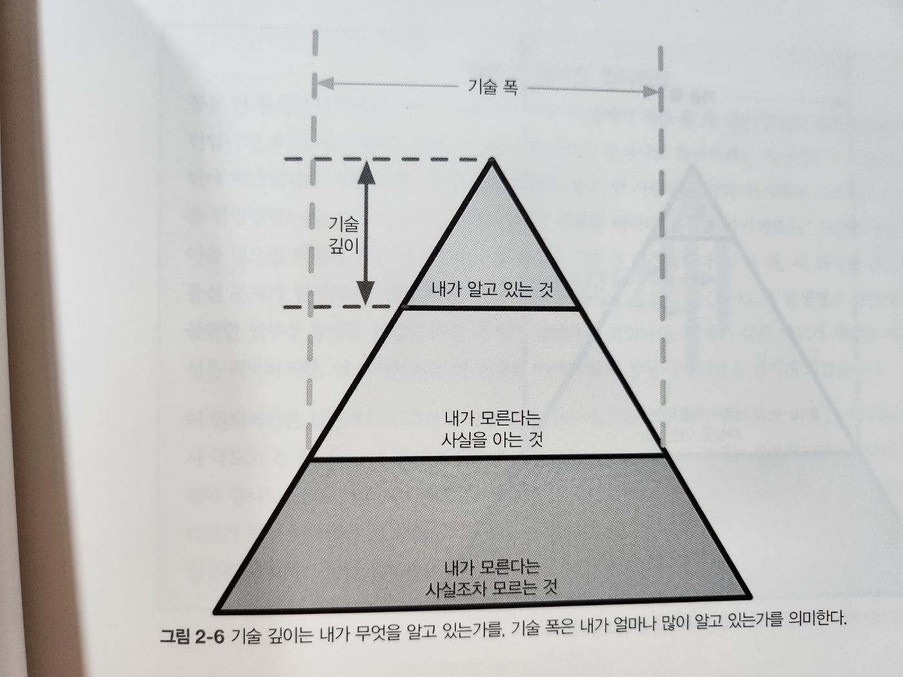

# 2. 아키텍처 사고

- 아키텍처 사고는 아키텍처적인 눈(관점)으로 사물을 바라보는 것

#### 아키텍트 사고 방식

- 1. 아키텍처와 설계의 차이를 이해하고 아키텍처 작업을 진행하려면 개발팀과 어떻게 협ㄹ펵해야 할지 아는 것
- 2. 어느 정도 기술 깊이를 유지하면서 폭넓은 기술 지식을 확보하는 것
  - 다른 사람들이 보지 못하는 해결책과 가능성을 떠올릴 수 있습니다
- 3. 다양한 솔루션과 기술 간의 트레이드오프를 이해하고, 분석하고, 조율하는 것
- 4. 비즈니스 동인의 중요성을 이해하고 그것을 아키텍처 관심사로 해석할 줄 아는 것

## 2.1 아키텍처 vs. 설계

- 아키텍처처럼 사고한다는 건 `비즈니스`와 `기술 문제`를 `해결`하기 위해 `아키텍처와 설계의 차이점을 알고 이 둘을 긴밀하게 통합한 솔루션을 모색`하는 것입니다

- 2-2. 아키텍트와 설계를 구분하는 기존 시각
- 전통적인 아키텍트의 책임과 개발자의 책임을 비교
- 문제점
  - 단방향 화살표
- 양방향 소통 관계를 정립해야 한다
  - 동일한 팀에 소속되어 있어야 합니다(그림 2-3)

- 2-3. 아키텍처는 협력을 통해 만들어간다
- 아키텍처는 어디까지고 설계는 어디서부터일까요? 그런 경계는 따로 없습니다
  - 아키텍처, 설계 모두 소프트웨어 프로젝트 생명 주기의 일부로서 항상 서로 동기화 되어야 성공할 수 있습니다

## 2.2 기술 폭

- 기술 세부의 범위 또한 개발자와 아키텍트가 다릅니다
  - 개발자 : 업무를 진행하기 위해 기술 깊이를 확보
  - 아키텍트 : 아키텍트답게 사고하고 아키텍처 시각을 유지하기 위해 상당한 기술 폭을 갖춰야 합니다

- 2-4. 세상의 모든 지식을 표현한 지식 피라미드
  - 기술 전문가가 자신의 커리어 단계마다 가치를 달리 해야 할 지식의 종류를 알 수 있습니다
- 내가 알고 있는 것
  - 일상 업무 수행에 사용하는 기술, 프레임워크, 언어, 도구
  - 개발자 초심 시절
  - 개발자가 계속 유지해야 할 부분
- 내가 모른다는 사실을 아는 것
  - 한번 들어봤거나 얕은 지식은 가고 있지만 실무 경험은 거의 전무한 기술
- 내가 모른다는 사실조차 모르는 것
  - 기술자가 해결하려는 문제에 완벽한 정답임에도 불구하고 그 존재조차 알지 못하는, 절대 다수의 기술, 도구, 프레임워크, 언어

- 2-5. 개발자는 전문성을 계속 유지해야 한다

- 2-6. 기술 깊이는 내가 무엇을 알고 있는가를, 기술 폭은 내가 얼마나 많이 알고 있는가를 의미한다

- 그러나 개발자가 아키텍트로 진로를 바꾸면 지식의 성격이 달라집니다
  - 아키텍트는 어느 한 가지 문제만 해결 가능한 한 가지 전문 지식보다는, 문제를 해결할 수 있는 다섯 가지 솔루션을 알고 있는 게 더 중요합니다
- 지식 피라미드에서 가장 중요한 영역은 꼭대기와 중간입니다
- 아키텍트의 기술 폭은 이 중간 영역이 아래 영역을 얼마나 더 멀리 관통하는가 입니다
- 아키텍트에게는 깊이보다 폭이 더 중요합니다

- 2-7. 아키텍트 역할은 기술 폭은 넓어지고 깊이는 얕아진다
- 개발자가 아키텍트로 전환하려면 관점부터 바꾸어야 합니다
- 많은 사람들이 이것을 어려워하기 때문에 결국 두 가지 역효과가 일어납니다
  - 1. 아키텍트가 되어 다양한 분양에서 전문성을 유지하려고 하나, 어느 하나도 성공하지 못한 채 그러는 도중 지레 지쳐버립니다
  - 2. 김빠진 전문성이나 나타납니다
    - 자신의 낡은 정보가 아직도 첨단을 달리고 있는 것처럼 그릇된 인식에 사로잡히게 됩니다
- 깊이와 폭 사이에서 지식 포트폴이오의 균형을 맞추는 일은 모든 개발자가 커리어 내내 고민해야 할 문제입니다

## 2.3 트레이드오프 분석

- 아키텍처는 모든 게 다 트레이드오프입니다
  - 질문마다 "경우에 따라 드랍니다"라고 답할 때가 많은 것도 이 때문이죠
- 배포환경, 비즈니스 동인, 회사 문화, 예산, 기간, 개발자 스킬 세트 등 여러 팩터들이 영향을 미칩니다

- 2-8. 경매 시스템의 트레이드오프(예: 큐냐 토픽이냐 그것이 문제로다)
  - 정답은 없다. 각 방안의 트레이드오프를 분석하고 주어진 상황에서 가장 나은 선택을 해야 합니다

## 2.4 비즈니스 동인(dynamic driver)의 이해

- 아키텍처 사고는 성공적인 시스템 구축에 필요한 비즈니스 동인을 이해하고 `요구사항`을 (확장성, 성능, 가용성 등의) `아키텍처 특성으로 해석`하는 것입니다
  - 4장 : 다양한 아키텍처 특성을 정의
  - 5장 : 아키텍처 특성을 식별/검증하는 방법
  - 6장 : 시스템의 비즈니스 요구사항을 충족시키기 위해 각 아키텍처 특성을 측정하는 방법

## 2.5 아키텍처와 코딩 실무 간 균형 맞추기

- 아키텍트가 코딩을 하면서 어느 정도의 기술 깊이는 유지해야 한다고 믿습니다(2.2절)
  - 그런데 이게 어려운 때가 많습니다

> 코딩 실무와 아키텍처의 균형을 맞추는 첫번째 팁: 병목 트랩에 빠지지 말라

- 병목 트랩은 아키텍트가 프로젝트의 크리티컬 패스(임계 경로, 최장 경로)에 있는 코드(보통 하부를 떠받치는 프레임워크 코드)의 소유권을 갖고 있는 경우에 발생합니다
- 아키텍트는 풀타임 개발자가 아니므로 개발자 역할과 아키텍트 역할의 균형을 잘 맞춰야 합니다
- 병목 트랩에 빠지지 않으려면 크리티컬 패스와 프레임워크 코드는 다른 사람에게 넘기고 비즈니스 기능(서비스나 화면)을 코딩하는 작업에 집중해서 1~3회 이터레이션을 수행하는 것이 좋습니다
- 이렇게 하면 긍정적인 효과가 있습니다

  - 1. 아키텍트는 더 이상 팀의 병목점이 되지 않고 프로덕션(운영계) 코드를 실제로 작성하는 실무 경험을 쌓게 됩니다
  - 2. 크리티컬 패스와 프레임워크 코드를 개발팀에 분산시키고 소유권을 부여함으로써 시스템에서 가장 어려운 부분을 더 잘 이해할 수 있습니다
  - 3. 아키텍트가 개발팀에서 작업 중인 비즈니스 연관 코드를 직접 작성함으로써 개발자들이 프로세스, 절차, 개발 환경, 어느 부분에서 가장 큰 고통을 겪고 있는지 몸소 체험할 수 있습니다

- 아키텍트가 집에서 코딩 연습을 하지 않고도 실무 능력을 유지하는 방법(집에서도 코딩 연습을 하길 권합니다)
  - 1. 개념 증명(POC)를 자주 해보는 것입니다
    - 아키텍트가 소스코드를 직접 작성해보면서 구현 상세를 생각하게 되므로 아키텍처 결정을 검증하는 데 유용합니다
    - 전체 개발 공수 가늠
    - 두 솔루션의 확장성, 성능, 종합적인 내고장성 등의 아키텍처 특성을 구체적으로 비교할 수 있습니다
    - POC는 가능한 프로덕션 수준의 고품질 코드를 작성하는 것이 좋습니다 -> 따라하는 샘플이 되는 경우가 많기 때문
  - 2. 개발팀이 아주 중요한 (유저 스토리) 작업을 할 수 있도록 기술 부채 스토리나 아키텍처 스토리에 전념하는 것입니다
    - 이런 스토리는 우선순위가 낮기 때문에 해당 이터레이션 내에 아키텍트가 끝내지 못한다고 해서 큰 문제가 되지 않습니다
- 간단한 커맨드라인 도구나 분석기를 만들어 개발팀의 일상 업무를 간소화, 자동화하는 것도 코딩 실무 능력을 유지하며 개발팀을 더욱 능률적으로 만드는 일석이조의 방법입니다
- 아키텍처 컴플라이언스 보장을 자동화 -> 6장
- 실무 능력을 유지하는 마지막 방법은 코드리뷰를 자주 하는 것입니다
  - 아키텍처 컴플라이언스를 보장, 팀원 멘토링 기회 등 여러 장점이 많습니다
