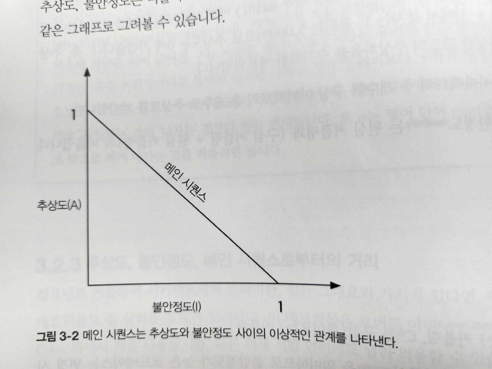
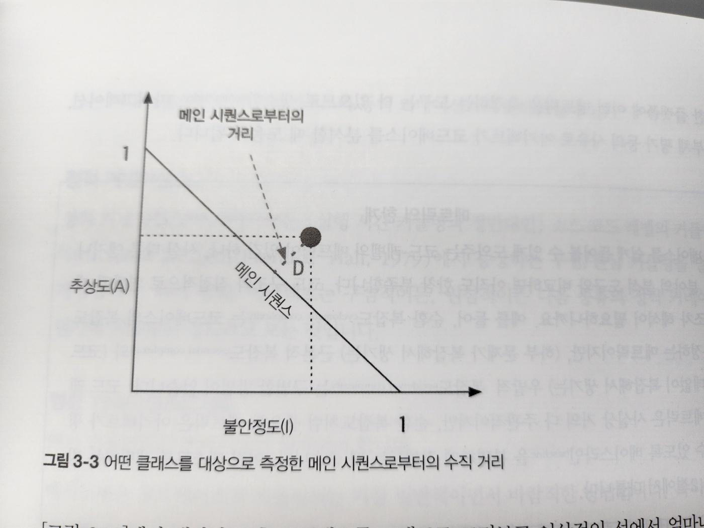
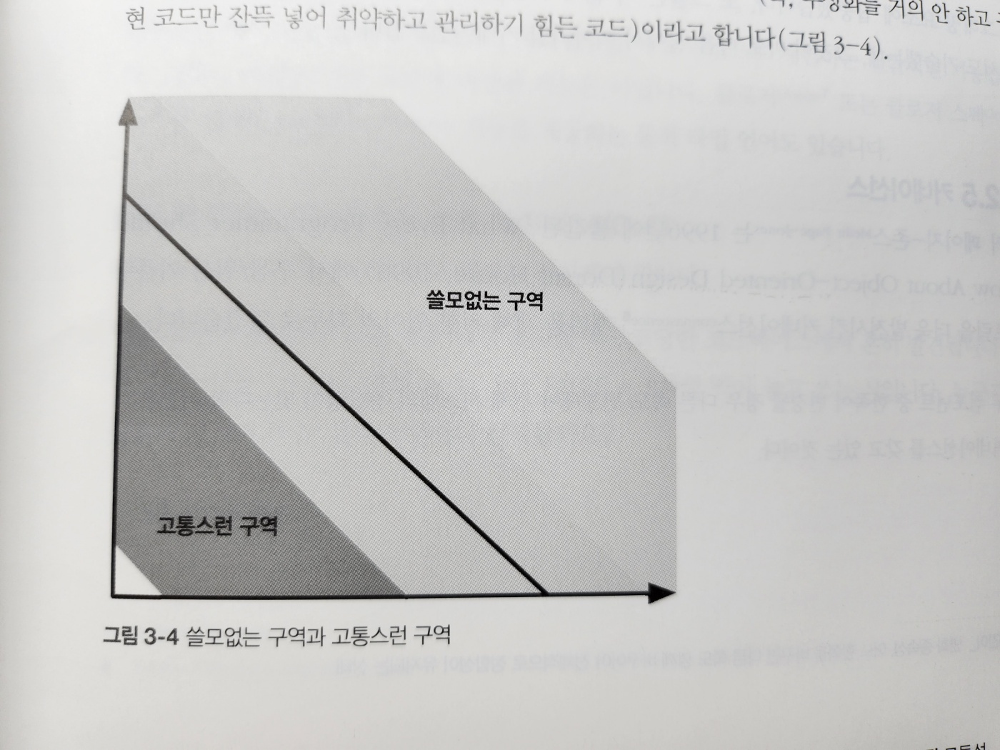
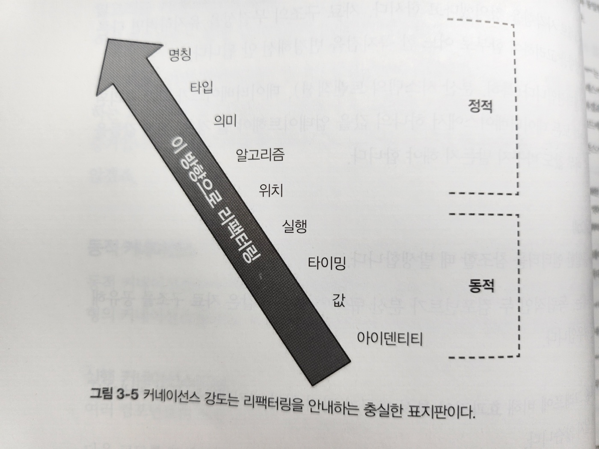
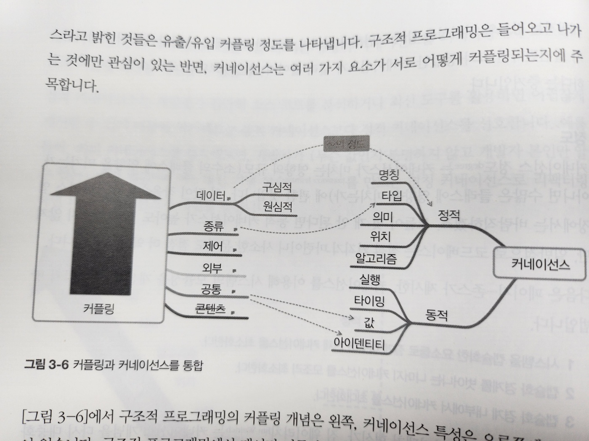

# 3. 모듈성

- 플랫폼마다 제공하는 코드 재사용 매커니즘은 제각각이지만, 연관된 코드를 '모듈(module)'로 묶는 방법은 모두 지원합니다
- 모듈성은 일종의 구성 원리입니다
- 모듈성을 잘 유지하는 건 아키텍처 특성이라고 정의한 것의 좋은 예가 됩니다
  - 질서와 일관성이 필요

## 3.1 정의

- 사전적 정의 : 복잡한 구조를 만드는 데 쓰이는 각각의 표준화한 부품이나 독립적인 단위
- 우리는 모듈성을 이용해 서로 연관된 코드를 논리적으로 묶습니다
  - e.g. 자바 패키지 com.mycompany.customer에 고객ㅇ체 관한 것들을 담는 식
- 아키텍트는 개발자가 모드를 어떻게 패키징하는지 반드시 알아야 합니다
  - 여러 패키지가 단단히 커플링되어 있으면 그 중 하나를 다른 작업에 재사용하기가 아주 어려워집니다
- 클래스, 함수 처럼 코드를 묶어 놓은 덩어리를 모듈성이라는 일반용어로 나타냅니다
  - 이것은 논리적인 구분이지 물리적인 구분은 아닌데, 이 차이점이 굉장히 중요한 경우가 있습니다
  - e.g. 모놀리식 애플리케이션
    - 편의상 꽤 많은 클래스를 한 덩어리로 묶어도 크게 상관 없지만,
    - 아키텍처를 재구축할 때는 이렇게 커플링된 구조가 모놀리스를 나누는 데 걸림돌이 됩니다
    - 따라서 모듈성은 특정 플랫폼에 함축되어 있거나 불가피한 물리적인 분리와 다른 개념으로 바라보는 게 좋습니다

## 3.2 모듈성 측정

- 모듈성을 이해할 도구가 필요
- 모듈성을 이해하는 데 도움일 될만한 다양한 독립적인 메트릭들
  - 응집
  - 커플링
  - 커네이선스

### 3.2.1 응집(cohesion)

- 한 모듈의 파트(구성 요소)가 동일한 모듈 안에 얼마나 포함되어 있는지를 나타냅니다
- 모듈을 구성하는 파트가 서로 얼마나 연관되어 있는가
- 이상적인 응집 모듈 : 모든 파트가 함께 패키징
- 가장 좋은 것 부터 나쁜 것 순으로 나열해보자

#### 기능적 응집(functional cohesion)

- 모듈의 각 파트는 `다른 파트와 연관`되어 있고 기능상 꼭 필요한 모든 것이 모듈에 들어있습니다

#### 순차적 응집(sequential cohesion)

- 두 모듈이, 한쪽이 데이터를 출력하면 다른 한쪽이 그것을 입력 받는 형태로 상호작용합니다

#### 소통적 응집(communicational cohesion)

- 두 모듈이, 각자 정보에 따라 작동하고 어떤 출력을 내는 형태로 통신 체인을 형성합니다
- e.g. 데이터베이스에 레코드를 추가하면 그 정보에 따라 이메일이 만들어지는 식입니다

#### 절차적 응집(procedural cohesion)

- 두 모듈은 `정해진 순서`대로 실행되어야 합니다

#### 일시적 응집(temporal cohesion)

- 모듈은 시점 의존성에 따라 연관됩니다
- e.g, 많은 시스템들이 시동할 때 그다지 `관련이 없어 보이는 것들을 죽 초기화`하는 경우가 많은데, 이런 작업들이 일시적으로 응집됐다고 할 수 있습니다

#### 논리적 응집(logical cohesion)

- 기능적 뿐만 아니라 논리적으로도 연관되어 있습니다
- e.g. 텍스트, 직렬화 객체, 스트림 형태로 받은 데이터를 변환하는 모듈
- 서로 연관된 작업들이지만 하는 일은 전혀 다릅니다
  - 이 패키지에는 각기 다른 작업을 수행하는 정적 메서드가 많이 있지만 서로 연관성은 없습니다

#### 동시적 응집(coincidental cohesion)

- 같은 소스 파일에 모듈 구성 요소가 들어 있지만 그 외에는 아무 연관성도 없습니다
- 가장 좋지 않은 형태의 응집입니다

#### 예시

- 응집은 커플링보다는 덜 정확한 메트릭이므로 아키텍트 재량에 따라 측정된 모듈의 응집도는 다릅니다
- 예를 들어, 모듈을 다음과 같이 정의했다고 합시다

  - 고객관리
    - 고객 추가
    - 고객 수정
    - 고객 조회
    - 고객 알림
    - 고객 주문 조회
    - 고객 주문 취소

- 다음과 같이 2개의 모듈로 나누어야 합니다

  - 고객관리
    - 고객 추가
    - 고객 수정
    - 고객 조회
    - 고객 알림
  - 주문관리
    - 고객 주문 조회
    - 고객 주문 취소

- 어느쪽이 더 정확한 구성일까요? 이것도 경우에 따라 다릅니다
  - 주문 관리에 작업이 2개뿐이다 -> 두 작업을 고객관리로 다시 돌려놓는 게 더 합리적
- 위와 같은 질문이 소프트웨어 아키텍트 업무의 핵심이라고 할 수 있는 트레이드오프 분석입니다

### 3.2.2 커플링(coupling)

- 코드베이스의 커플링은 그래프 이론에 기반한 좋은 도구들이 많이 있습니다
- e.g. 구심 커플링, 원심 커플링 개념
  - 구심 커플링: (컴포넌트, 클래스, 함수 등) 코드 아티팩트로 유입되는 접속 수
  - 원심 커플링: 다른 코드 아티팩트로 유출되는 접속 수
- 어느 플랫폼이든 아키텍트가 커플링 특성 분석도구는 거의 다 있습니다

### 3.2.3 추상도, 불안정도, 메인 시퀀스로부터의 거리

- 컴포넌트 커플링이 아키텍트에게 유의미한 가치가 있다면 여기서 파생된 다른 메트릭(metric)들도 잘 살펴볼 필요가 있습니다
- 추상도
  - (추상 클래스, 인터페이스 등의) 추상 아티팩트와 구상 아티팩트(구현체)의 비율
  - 즉, 구현 대비 추상화 정도
- 불안정도
  - 코드베이스의 변동성(volatility)을 의미
  - 불안정도가 높은 코드베이스는 변경 시 커플링이 높아 깨지기 쉽습니다
  - 예를 들어, 여러 다른 클래스를 호출해서 작업을 위임하는 클래스는 호출되는 메서드 중 하나라도 변경되면 호출하는 이 클래스 역시 잘못될 공산이 매우 큽니다

### 3.2.4 메인 시퀀스로부터의 거리

- 메인 시퀀스로부터의 거리는 아키텍처 구조를 평가하는 몇 가지 전체적인 메트릭 중 하나로, 불안정도와 추상도를 이용하여 계산합니다
- 추상도, 불안정도는 비율이 항상 0과 1 사이의 값입니다
- 따라서 그 관계를 그림3-2와 같은 그래프로 그려보ㅛㄹ 수 있습니다



- 그림3-2. 메인 시퀀스는 추상도와 불안정도 사이의 이상적인 관계를 나타낸다
  - 이상적인선에 가까운 클래스는 서로 경쟁적인 두 메트릭의 건전한 조합



- 그림3-3. 어떤 클래스를 대상으로 측정한 메인 시퀀스로 부터의 수직 거리
  - 개발자는 후보 클래스를 그래프로 그려보고 이상적인 선에서 얼마나 떨어져 있는지 거리를 잽니다
  - 이 선에 가까울 수록 균형이 잘 맞다는 방증입니다



- 그림3-4. 쓸모없는 구역과 고통스런 구역
  - 오른쪽 위로 치우친 부분을 쓸모 없는 구역
    - 너무 추상화를 많이해서 사용하기 어려운 코드
  - 아래로 치우친 부분을 고통스런 구역
    - 추상화를 거의 안하고 구현 코드만 잔뜩 넣어 취약하고 관리하기 힘든 코드

### 3.2.5 커네이선스(connascence: 일치)

- 커네이선스: 변화 종속성, 어느 한쪽을 바꾸면 다른 쪽도 함게 바꾸어야 전체적으로 정합성이 유지되는 상태
- 구심/원심 커플링 메트릭을 더욱 발전시킨 커네이선스 개념 - 객체 지향 언어의 화두로 던져짐

#### 정적 커네이선스

- (실행 시간 커플링과 정반대인) 소스 코드 레벨의 커플링
- 커네이선스는 뭔가에 커플링된 정도이다

#### 명칭 커네이선스(CoN)

- 여러 컴포넌트의 엔티티명이 일치해야 합니다
- 메서드명은 코드베이스가 커플링되는 가장 일반적이면서 바람직한 방법
- 특히, 최신 리팩터링 도구는 대부분 시스템 전체적으로 이름을 바꾸는 기능을 아주 잘 지원합니다

#### 타입 커네이선스(CoT)

- 여러 컴포넌트의 엔티티 타입이 일치해야 합니다
- 대부분의 정적 타입 언어에서 변수와 매개변수를 특정 타입으로 제한하는 일반적인 기능입니다
  - 언어 자체에 내장된 기능은 아닙니다. 선택적 타이핑 기능을 제공하는 동작 타입언어도 있습니다(e.g. 클로저)

#### 의미 커네이선스(CoM) 또는 관례 커네이선스(CoC)

- 여러 컴포넌트에 걸쳐 어떤 값의 의미가 일치해야 합니다
- 이런 종류의 커네이선스는 상수 대신 숫자를 하드코딩한 코드베이스에서 흔히 발견됩니다

#### 위치 커네이선스(CoP)

- 정적 타이핑이 가능한 언어에서도 메서드와 함수 호출 시 전달하는 매개변수 값은 순서가 맞아야 합니다

```java
void updateSeat(String name, String seatLocation)
updateSeat("좌석번호", "이름", "N")
```

- 타입은 맞지만 의미는 맞지 않은 예시

#### 알고리즘 커네이선스(CoA)

- 여러 컴포넌트는 특정 알고리즘이 일치해야 합니다
- e.g. 서버/클라이언트 둘 다 실행되어야 하고 유저 인증 시 반드시 동일한 결과를 내야하는 보안 해시 알고리즘

#### 동적 커네이선스

- 런타임 호출을 분석하는 커네이선스
- 종류
  - 실행 커네이선스
  - 시점 커네이선스
  - 값 커네이선스
  - 식별 커네이선스

#### 커네이선스 속성

##### 강도

- 어떤 커네이선스를 얼마나 쉽게 리팩터링할 수 있는지에 따라 강도가 결정됩니다



- 그림3-5. 커네이선스 강도는 리팩터링을 안내하는 충실한 표지판이다
- `정적 커네이선스`는 개발자가 간단히 소스코드를 분석하거나 최신 도구를 활용하면 `어렵지 않게 개선`할 수 있기 때문에 아키텍트는 동적 커네이선스보다 정적 커네이선스를 선호합니다

##### 지역성

- 코드베이스 모듈들이 서로 얼마나 가까이 있는가

##### 정도

- 커네이선스가 미치는 영향의 규모
  - 소수의 클래스에 영향을 미치는가 아니면 수 많은 클래스에 영향을 미치는가
- 이 값이 작을 수록 코드베이스 입장에서는 바람직하다

- 커네이선스를 이용해 시스템의 모듈성을 개선하는 세 가지 방법

  - 1. 시스템을 캡슐화한 요소들로 잘게 나누어 전체 커네이선스를 최소화한다
  - 2. 캡슐화 경계를 벗어나는 나머지 커네이선스를 모조리 최소화한다
  - 3. 캡슐화 경계 내부에서 커네이선스를 최대화한다

- 정도의 규칙
  - 강한 형태의 커네이선스를 보다 약한 형태의 커네이선스로 전환하라
- 지역성의 규칙
  - 소프트웨어 엘리먼트 간의 거리가 멀어질 수록 보다 약한 형태의 커네이선스를 사용하라

### 3.2.6 커플링과 커네이선스 메트릭을 통합

- 커플링과 커네이선스 - 아키텍트 관점에서는 서로 중첩된 개념
- 정적 커네이선스 : 유출/유입 커플링 정도
- 커네이선스: 여러가지 요소가 어떻게 커플링되는지에 주목



- 그림3-6. 커플링과 커네이선스를 통합
  - 동적 커네이선스 영역 -> 7.2절에서 다시 정리

#### 1990년대 커네이선스의 문제점

- 아키텍트가 이런 유용한 메트릭을 적용해서 시스템을 분석/설계할 때에 몇 가지 문제점이 있습니다
- 1. 이들 메트릭은 아키텍처 구조보다는 저수준 코드의 세부분을 코드 품질 및 정리 상태 위주로 관찰합니다
- 2. 사실 커네이선스 자체는 `요즘 아키텍트가 내려야 할 근본적인 결정에 관한 문제는 다루지 않습니다`
  - 소프트웨어 아키텍처 제 1법칙: 모든 것은 다 트레이오프이다
- 커네이선스를 바라보는 새로운 사고 방식은 7장 아키텍처 특성의 범위를 다루면서 소개하겠습니다

## 3.3 모듈에서 컴포넌트로

- 이 책에서는 연관된 코드의 묶음을 '모듈'이라는 일반 용어로 표현하지만, 대부분의 플랫폼은 '컴포넌트'형태로 지원합니다
- 문제 영역에서 컴포넌트를 도출하는 방법은 8장에서 다룹니다
  - 그 전에 소프트웨어 아키텍처의 또 다른 근본 영역인 아키텍처 특성과 그 범위를 4장에서 살펴보겠습니다
