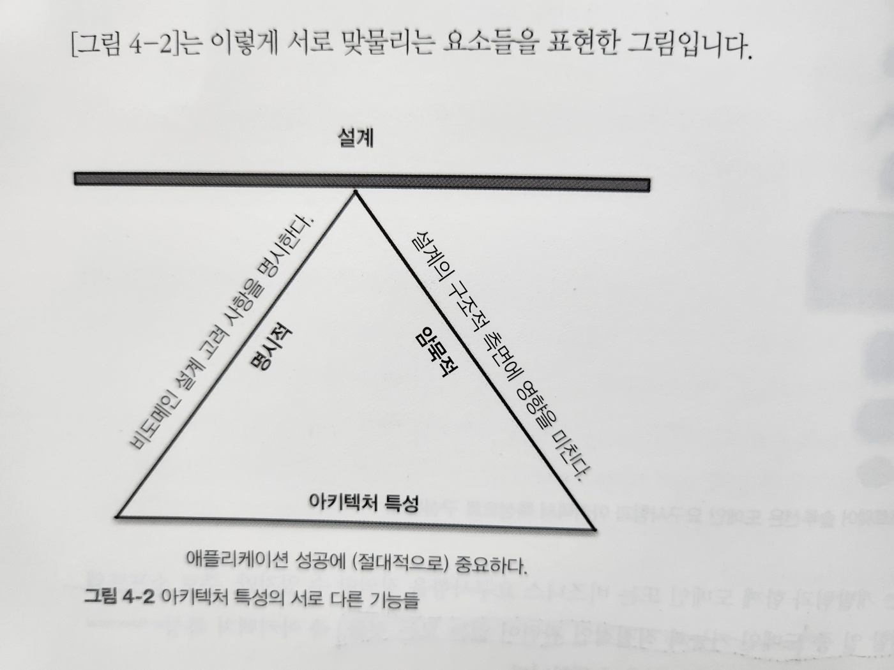

# 4. 아키텍처 특성 정의

- 어떤 문제를 소프트웨어로 해결 시 아키키텍트

  - 시스템 요구사항 취합
  - 구현에 필요한 다양한 기술을을 개발 프로세스에 따라 정리

- 그림 4-1. 소프트웨어 솔루션은 도메인 요구사항과 아키텍처 특성으로 구성된다

  - 감사성, 성능, 보안
  - 요구사항
  - 데이터, 적법성, 확장성

- 아키텍트는 비즈니스 요구사항을 정의할 수 있지만,

  - 주로 소프트웨어 일 중 도메인 기능과 직접적인 관련이 없는 모든 것들,
    - 아키텍처 특성을 정의, 발견, 분석하는 일을 수행합니다

- 소프트웨어 아키텍처 vs 코딩 vs 설계 => 차이점

  - 아키텍처의 특성을 정의하는 아키텍트의 역할 ~ 문제 영역 및 독립적인 시스템의 중요한 부분까지, 많은 점들이 다릅니다
  - 소프트웨어 특성 : 비기능 요구사항(이런 용어를 좋아하진 않음 -> 아키텍처 특성 이라는 용어를 선호)

- 아키텍처 특성의 세 가지 기준 => 설계
  - 비도메인 설계 고려사항을 명시한다 => 명시적
  - 설계의 구조적 측면에 영향을 미친다 => 암묵적
  - 애플리케이션 성공에 (절대적으로) 중요하다 => 아키텍처 특성

- 그림 4-2. 아키텍처 특성의 서로 다른 기능들
  - 각 요소가 다른 요소를 지원하고 시스템 전체 설계를 지원하는 모습
  - 삼각형이 지탱하는 지점은 이러한 아키텍처 특성들이 서로 상호작용 -> 트레이드오프

#### 비도메인 설계 고려 사항을 명시한다

- 설계 시 애플리케이션으로 처리할 일을 구체적인 `요구사항으로 정리`합니다
- 아키텍처 특성
  - 이 요구사항을 구현하는 방법
  - 어떤 선택을 하게 된 이유와 관련된 운영/설계 기준을 명시
  - e.g. 성능, 기술 부채 방치
- `명시적 특성`과 `암묵적 특성`을 구분하는 문제는 5.1절에서 더 자세히 다룹니다

#### 설계의 구조적 측면에 영향을 미친다

- 아키텍처 특성을 기술하는 주된 이유 -> `이 아키텍처 특성은 어떤 특별한 구조적 요소를 고려해야 하는가?`(설계 고려사항)
- e.g, 1. 보안
  - 아키텍트가 뭔가 특별한 것을 설계해야 한다면 보안은 아키텍처 특성 수준으로 격상됩니다
- e.g, 2. 결제 시스템
  - 서드파티 결제 프로세서
    - 결제 처리를 한곳에서 처리한다면 아키텍트가 특별히 구조에 신경 쓸 일은 없습니다
    - 암호화, 해시 등의 표준 보안 장치를 설계에 반영할 필요는 있지만 어떤 구조가 필요한 것은 아닙니다
  - 애플리케이션 내부 결제 처리
    - 애플리케이션이 직접 결제 처리를 한다면 아키텍트는 중요한 보안 문제를 구조적으로 분리하기 위해 특정한 모듈이나 컴포넌트, 서비스를 설계해야 합니다
    - 이 경우 아키텍처 특성은 아키텍처와 설계 모두에 영향을 미칩니다

#### 애플리케이션 성공에 (절대적으로) 중요하다

- 아키텍처 특성을 늘리면 설계 복잡도는 증가합니다
- 가급적 아키텍처 특성을 적게 선정하는 일도 아키텍트의 중요한 책무입니다
- 아키텍처 특성
  - 명시적 특성
  - 암묵적 특성
- 암묵적 아키텍처 특성 : 요구사항 정의서에는 거의 안 나오지만 프로젝트 성공을 위해 꼭 필요한 특성들
  - e.g. 가용성, 신뢰성, 보안
  - 아키텍트는 분석 단계에서 자신이 문제 영역에 대해 습득한 지식을 최대한 활용하여 아키텍처 특성을 밝혀내야 합니다
- 명시적 아키텍처 특성
  - 요구사항 정의서나 다른 지침서에 기재됩니다

## 4.1 아키텍처 특성 (일부) 목록

- 아키텍처 특성은 모듈성 같은 저수준 코드의 특성 ~ 확장성, 탄력성 같은 복잡한 운영 문제까지 소프트웨어 시스템의 넓은 범위에 고루 존재합니다
- 과거에도 `아키텍처 특성을 체계화하려는 시도`는 있었지만 아직도 `보편적인 표준은 따로 없으며` 조직마다 자체적으로 해석하여 용어를 정의합니다

### 4.1.1 운영 아키텍처 특성

- 성능, 확장성, 탄력성, 가용성, 신뢰성 등

- 표 4-1. 운영 아키텍처 특성
  - 가용성 : 시스템이 얼마나 오랬동안 사용가능해야 하나(24/7이면 장애 발생 시 시스템을 신속하게 재가동 시키는 절차가 준비되어야 함)
  - 연속성 : 재해 복구 능력
  - 성능 : 스트레스 테스트, 피크 분석, 기능의 사용 빈도 분석, 필요 용량, 응답 시간, 이 정도 성능이면 됐다 싶으려면 직접 돌려봐야 하는데 그 기간만 대략 수 개월 소요된다
  - 복구성 : 비즈니스 연속성 요구사항
    - e.g. 장애 발생 시 얼마나 신속하게 시스템을 재가동시켜야 하나
    - 백업 전략과 하드웨어 다중화 요건에 영향을 미친다
  - 신뢰성/안전
    - 시스템 페일 세이프(fail-safe)가 필요한가
    - 페일 세이프 시스템 가동에 필수인가? 시스템 실패 시 회사에 거액의 손실이 발생하는가?
  - 견고성
    - 프로그램 실행 중 인터넷 접속 끊김, 정전, 하드웨어 실패 등 에러 및 경계 조건을 감당하는 능력
  - 확장성
    - 유저 수, 요청 수가 늘어나도 시스템이 그에 맞는 성능을 발휘하는 능력
- 운영 아키텍처 특성은 운영 및 데브옵스와 많은 부분에서 중첩되며, 많은 소프트웨어 프로젝트에서 이런 관심사는 교차점을 형성합니다

### 4.1.2 구조 아키텍처 특성

- 구조에도 심혈을 기울여야 한다

  - 우수한 모듈성, 컴포넌트 간 커플링 제어, 가독성 높은 코드, 그 밖의 내부 품질 평가 등
  - 코드 품질 문제를 전담(또는 공동으로 담당)

- 표 4-2. 구조적 아키텍처 특성
  - 설정성 : 최종 유저(end user)가 (쓰기 편한 인터페이스를 통해) 소프트웨어 설정을 쉽게 바꿀 수 있는가?
  - 신장성 : 새로운 기능을 삽입하는 일의 중요성
  - 설치성 : 필요한 모든 플랫폼에 시스템을 얼마나 손쉽게 설치할 수 있나?
  - 활용성/재사용 : 공통 컴포넌트를 여러 제품에서 활용할 수 있나?
  - 지역성 : 데이터를 입력/조회하는 화면에서 다국어가 지원되는가? 리포트(report) 장표에서 멀티바이트 문자 및 측정, 화폐 단위 등의 요구사항
  - 유지보수성 : 시스템을 얼마나 쉽게 변경/개선할 수 있나?
  - 이식성 : 하나 이상의 플랫폼에서 시스템을 실행할 수 있나?
    - e.g. 동일한 프런트엔드를 SAP DB와ㅏ 오라클 데이터베이스에서 모두 실행할 수 있는가?
  - 지원성 : 애플리케이션은 어느 정도의 기술 지원을 필요로 하나?
    - 시스템에서 발생한 에러를 디버깅하려면 로깅 및 기타 기능이 어느 수준으로 뒷받침되어야 하나?
  - 업그레이드성 : 이 애플리케이션/솔루션의 구 버전을 새 버전으로 쉽고 빠르게 업그레이드할 수 있는가?

### 4.1.3 아키텍처 공통 특성

- 중요한 설계 제약조건과 고려 사항은 대부분 따로 분류하기 어려운 경우가 많습니다

- 표 4-3. 아키텍처 공통 특성

  - 접근성
  - 보관성
  - 인증
  - 인가
  - 합법성
  - 프라이버시
  - 보안
  - 사용성/성취성

- 아키텍처 특성은 어떻게 나열해도 불완전한 목록이 될 수 밖에 없고, 소프트웨어마다 고유한 팩터를 바탕으로 중요한 아키텍처 특성이 도출될 수도 있습니다
- 정의가 중복되는 것들도 많습니다

## 4.2 트레이드오프 및 나쁜 것 중에서 제일 나은 아키텍처

- 지금까지 열거한 아키텍처 특성들은 여러 가지 이유로 일부만 애플리케이션에서 지원 가능합니다
  - 첫째, 지원되는 특성마다 설계 노력이 필요하고 구조적으로도 지원돼야 합니다
  - 둘째, 각 아키텍처 특성이 다른 특성에 영향을 미치는 경우가 많다는 사실이 더 큰 문제입니다(트레이드 오프)
    - 예를 들어, 보안을 강화하려고 하면 성능에 부정적인 영향을 미치기 쉽습니다

> Tip. 최고의 아키텍처를 고집하지 말고, 나쁜 것 중에서 제일 나은 아키텍처를 선택하세요

- 아키텍처 특성을 너무 욕심내면 모든 비즈니스 문제를 해결하려고 시도하는 일반적인 솔루션이 되어버립니다
  - 그러나 그런 아키텍처는 설계하기가 대단히 까다롭기 때문에 실현 가능성이 낮습니다
- 아키텍트는 가능한 `한 아키텍처 설`계를 꾸준히 조금씩 `반복`해보는 게 좋습니다
  - 아키텍처를 쉽게 변경할 수 있다면 첫술에 배불러야 한다는 강박관념도 사라지겠죠
  - 반복의 가치는 애자일 소프트웨어 개발에서도 가장 중요한 교훈 중 하나로, 아키텍처뿐만 아니라 모든 레벨의 소프트웨어 개발에도 적용됩니다
