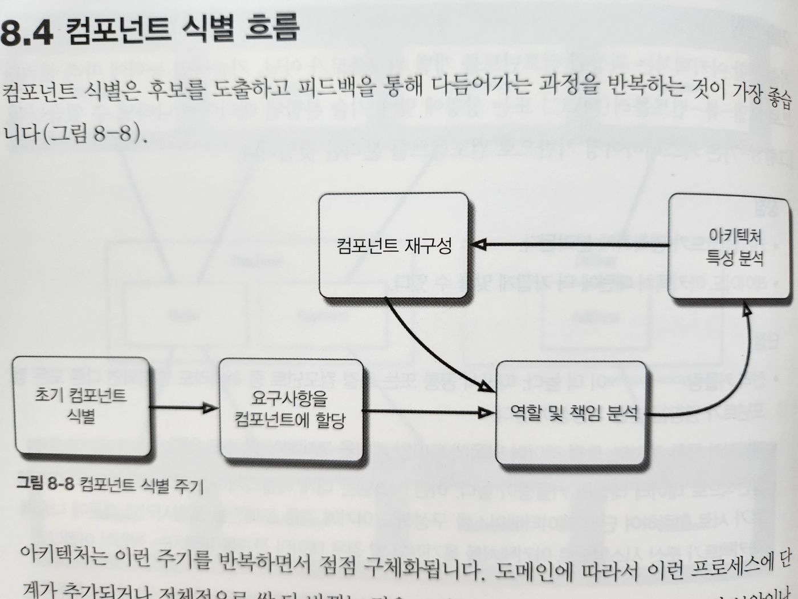
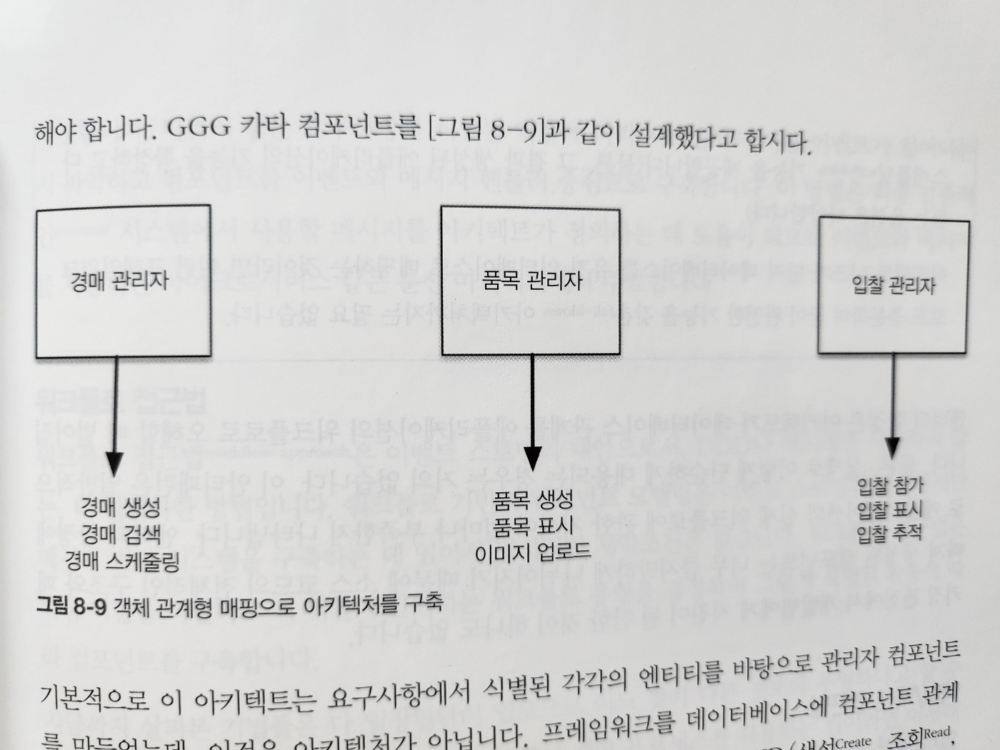
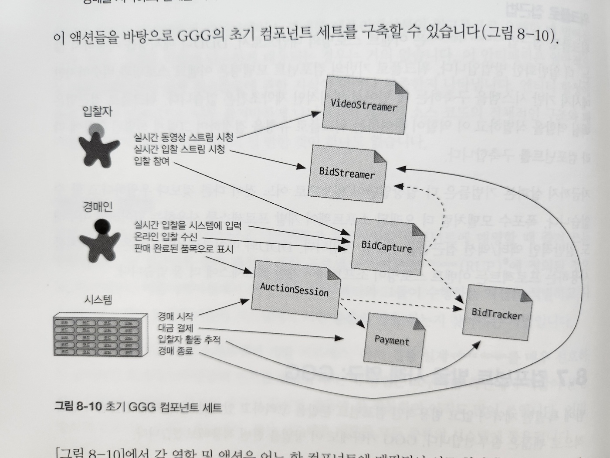
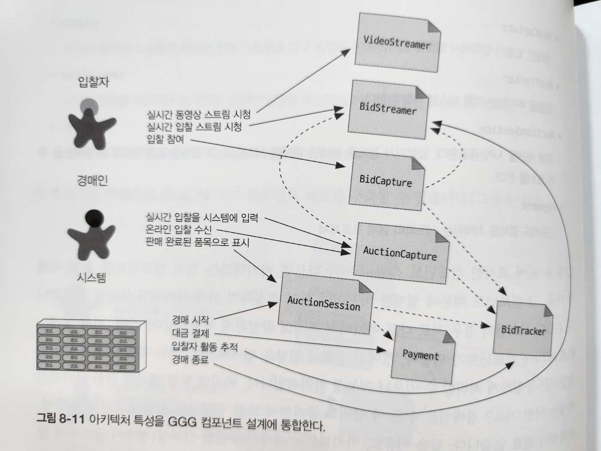

# 8. 컴포넌트 기반 사고

- 3장에서는 모듈(module)을 연관된 코드의 묶음이라고 했지만, 아키텍트는 보통 모듈을 물리적으로 구현한 컴포넌트로 생각합니다
- 개발자는 자신의 개발 플랫폼에 따라 여러 가지 방법으로 모듈을 물리적으로 패키징합니다
  - 이렇게 모듈을 물리적으로 패키징한 것을 컴포넌트라고 합니다
  - e.g. 자바 jar, 닷넷 dll, 루비 gem, ...
- 이 장에서는 범위부터 검색에 이르기까지 컴포넌트에 관한 아키텍처 고려 사항을 알아보겠습니다

## 8.1 컴포넌트 범위

- 그림 8-1. 다양한 컴포넌트 변형
  - `가장 단순한 컴포넌트`는 클래스(또는 비객체 지향 언어의 함수)보다 한 단계 높은 수준의 모듈로 코드를 래핑한 것입니다
  - 이 단순한 래퍼를 보통 `라이브러리(library)`라고 합니다
- 라이브러리는 호출부 코드와 동일한 메모리 주소에서 실행되며 해당 언어의 함수 호출 메커니즘을 이용해 통신합니다

  - 일반적으로 라이브러리는 컴파일 타임에 의존합니다

- `컴포넌트`는 아키텍처에서 서브시스템이나 레이어 형태로도 나타나며, 많은 이벤트 프로세서를 위한 `배포 가능한 작업 단위`입니다

- `마이크로서비스 같은 아키텍처에서 서비스`는 `배포 가능한 독립적인 단위`를 형성합니다

  - 내 생각) MSA에서 서비스는 `컴포넌트`입니다

- 아키텍트가 반드시 컴포넌트를 사용해야 하는 것은 아닙니다
  - 컴포넌트는 언어가 제공하는 저수준이 아닌, 더 높은 수준에서 모듈성을 가지는 것이 더 유용할 때가 많습니다

- 그림 8-2. 마이크로서비스는 코드가 많지 않아 컴포넌트가 필요 없다

- 컴포넌트는 아키텍처의 근본적인 모듈성을 구성하는 요소로서 아키텍트에게 아주 중요한 고려사항입니다
- 실제로 아키텍트가 결정하는 중요한 항목 중 하나가 `아키텍처 컴포넌트의 최상위 분할`과 연관되어 있습니다

- 요약(내 생각)
  - 컴포넌트 범위는 단순한 라이브러리에서부터 마이크로서비스까지 다양합니다
  - 이러한 컴포넌트의 범위를 결정하는 것은 아키텍트의 역할입니다

## 8.2 아키텍트 역할

- 아키텍트는 아키텍처 내부의 컴포넌트를 정의, 개선, 관리, 통제하는 일을 합니다
- 소프트웨어 아키텍트는 4장에서 열거한 아키텍처 특성과 소프트웨어 시스템 요구사항을 종합하여 비즈니스 분석가, 분야별 전문가, 개발자, QA 엔지니어, 운영자, 엔터프라이즈 아키텍트와 함께 소프트웨어 초기 설계를 합니다

- 개발팀이 사용하는 것들과 독립적

  - 예외: 배포 및 자동화 거버넌스

- 컴포넌트는 클래스나 함수로 구성되며, 이들을 (구현 플랫폼에 따라) 설계하는 업무는 기술 리더나 개발자가 담당합니다
- 아키텍트는 클래스 설계에 참여해서도 안 되고, 시스템의 세세한 설계 결정에 관여해서도 안 됩니다

  - 다른 부서 사람들이 중요한 결정을 내리지 못하게 아키텍트가 허용하지 않으면 조직은 다음 세대 아키텍트들에게 자율권을 부여하기가 곤란해질 것입니다

- 새 프로젝트를 시작한 아키텍트는 무엇보다 먼저 컴포넌트를 식별해야 하나, 그 전에 아키텍처를 분할하는 방법을 반드시 이해해야 합니다

### 8.2.1 아키텍처 분할

- 소프트웨어는 만사가 트레이드오프입니다
  - 주어진 아키텍처에서 컴포넌트를 만드는 방법도 마찬가지입니다
- 컴포넌트는 일반적인 적재(containership) 메커니즘을 의미하므로 아키텍트는 재량껏 어떤 유형의 분할도 할 수 있습니다
- 여기에 각기 다른 트레이드오프를 가진 몇 가지 공통적인 스타일이 있습니다
  - 아키텍처 스타일은 2부에서 자세히 다루고, `이 절에서는 최상위 분할`(top-level partitioning)에 대해 다루겠습니다

- 그림 8-3. 두 종류(레이어드, 모듈러)의 최상위 아키텍처 분할

- 레이어드 아키텍처

  - 여러분들에게 익숙한 형태입니다(자세한 내용은 10장에서)
  - 내 생각: React에서 컴포넌트 디렉토리를 계층별 또는 기능별로 나누는 것과 비슷한 것 같다

- 모듈러 모놀리스(modular monolith)

  - 기술적 능력이 아닌, 도메인에 따라 분할된 단일 배포 단위입니다
  - 내 생각: 도메인별로 나누고 그 안에서 레이어드 아키텍처를 적용하는 것과 비슷한 것 같다
    - spring boot에서 도메인별로 패키지를 나누는 것과 비슷한 것 같다

- 이 두 가지 스타일은 서로 다른 방법으로 아키텍처를 최상위 분할한 결과입니다
  - 각 최상위 컴포넌트 내부에는 다른 컴포넌트들이 내장되어 있습니다
- 최상위 분할은 근본적인 아키텍처 스타일과 코드 분할 방법을 결정짓기 때문에 아키텍트에게는 특별한 관심사입니다

- 그림 8-4. 최상위 아키텍처를 분할하는 두 가지 방법

- `기술 분할`

  - 기술적 최상위 분할은 레이어드 아키텍처와 같이 기술적인 능력에 따라 아키텍처를 구성하는 것입니다
  - 이미 수십 년 전에 등장한 레이어드 아키텍처의 기본 개념은 모델-뷰-컨트롤러 설계 패턴과 궁합이 잘 맞고 개발자가 이해하기 쉬워서 수많은 조직에서 기본 아키텍처로 자리 잡았습니다
  - 레이어드 아키텍처 -> 10장

- `도메인 분할`

  - 이것은 복잡한 소프트웨어 시스템을 분리하는 모델링 기법을 다룬 에릭 에반스의 '도메인 주도 설계'에서 비롯됐습니다
  - DDD에서 아키텍트는 서로 독립적으로 분리된 도메인 또는 워크플로를 식별하는데, 이는 마이크로서비스 아키텍처 스타일(17장)의 근본 사상이기도 합니다

- 서로 다른 아키텍처 패턴 간의 근본적이 차이점 중 하나가 바로 각각의 개별 패턴을 다루는 최상위 분할의 유형입니다

  - 아키텍트가 초기에 어떻게 컴포넌트를 식별해야 할지 결정할 때에도 이 최상위 분할 유형이 매우 큰 영향을 미칩니다

- `기술 분할`을 택한 아키텍트는 시스템 컴포넌트를 프레젠페이션, 비즈니스 규칙, 퍼시스턴스 등의 기술적 능력에 따라 구성합니다
  - 이 아키텍처의 구성 원칙 중 하나는 기술 관심사의 분리로서, 이는 결국 유용한 수준의 디커플링을 만듭니다
  - 가령 서비스 레이어가 하부 퍼시스턴스 레이어만 접속하도록 만들면 퍼시스턴스 레이어를 변경할 일이 생겨도 해당 레이어만 영향을 받습니다
    - 이런식으로 의존하는 컴포넌트에 줄줄이 부수 효과가 전파되지 않도록 막을 수 있습니다

- 그림 8-5. 기술 아키텍처, 도메인 분할 아키텍처에서 도메인/워크플로가 나타나는 곳
- 기술적으로 분할하면 코드베이스가 기능별로 구성되므로 개발자가 코드베이스의 특정 카테고리를 신속하게 찾을 수 있지만, 현실적으로 대부분의 소프트웨어 시스템은 여러 기술/가능을 넘나드는 워크플로를 필요로 합니다

  - 예를 들어, CatalogCheckout 처럼 흔한 비즈니스 워크플로도 기술적인 레이어드 아키텍처에서 CatalogCheckout을 처리하는 코드는 모든 레이어에 흩어져 있습니다

- 그림 8-5의 왼쪽에서 CatalogCheckout라는 도메인은 기술 레이어를 넘나들며 모든 레이어에 존재합니다

  - 도메인에 따라 구성한 분할과 비교해보세요
  - 도메인 분할 아키텍처로 설계한 아키텍트는 워크 플로 및 도메인 중심으로 최상위 컴포넌트를 구축합니다
  - 도메인 분할의 각 컴포넌트는 레이어를 포함한 서브컴포넌트를 가질 수 있지만, 최상위 분할은 도메인에 초점을 두는 까닭에 프로젝트에서 가장 자주 발생하는 변경의 유형들이 더 확실하게 반영됩니다

- 두 스타일 모두 어느 것이 더 낫다고 단정지을 수는 없습니다(이것이 트레이드오프의 본질입니다)
- 지난 수년 동안 우리는 모놀리식 아키텍처와 분산 아키텍처(e.g, 마이크로서비스)의 도메인 분할에 관한 업계의 뚜렷한 동향을 지켜봐 왔습니다
  - 어쨌든, 최상위 분할을 어떻게 할 것인지는 아키텍트가 가장 먼저 결정해야 할 문제 중 하나입니다

### 8.2.2 분할 사례 연구: 실리콘 샌드위치

- 그림 8-6. 실리콘 샌드위치를 `도메인 분할`한 설계안
  - Purchase, Promotion, MakeOrder, ManageInventory, Recipes, Delivery, Location 컴포넌트를 도출
  - 공통 기능과 로컬 변형을 다루는 갖가지 유저 정의 코드를 처리하는 서브 컴포넌트를 이들 안에 두었습니다

- 그림 8-7. 실리콘 샌드위치를 기술 분할한 설계안
- 그림 8-7은 공통 및 로컬 파트를 각 파티션으로 분리할 설계입니다
  - 최상위 컴포넌트는 Common과 Local이고 워크플로는 Purchase와 Delivery로 처리합니다

#### 도메인 분할

- 도메인 분할 아키텍처는 최상위 컴포넌트를 워크플로 및 도메인에 따라 나눕니다

- 장점

  - 세부 구현보다 비즈니스 기능에 더 가깝게 모델링된다
  - 역 콘웨이 전략을 활용하여 도메인별 다목적팀을 구성하기 쉽다
  - 모듈러 모놀리스와 마이크로서비스 아키텍처 스타일에 더 가깝게 맞출 수 있다
  - 메시지 흐름이 문제 영역과 일치한다
  - 데이터와 컴포넌트를 분산 아키텍처로 옮기기 쉽다

- 단점
  - 유저 정의 코드가 여기저기 널려 있다

#### 기술 분할

- 기술 분할 아키텍처는 최상위 컴포넌트를 개별 워크플로가 아닌, 기술적인 능력에 따라 분리하므로 모델-뷰-컨트롤러(MVC) 또는 상황에 맞게 기술 분할된 레이어로 나타낼 수 있습니다

  - 그림 8-7은 커스터마이징 기반으로 컴포넌트를 분리한 것입니다

- 장점
  - 커스텀 코드가 명확하게 분리된다
  - 레이어드 아키텍처 패턴에 더 가깝게 맞출 수 있다
- 단점
  - 전역 커플링이 더 높다. 따라서 공통 또는 로컬 컴포넌트 중 하나라도 변경되면 다른 모든 컴포넌트가 영향을 받을 가능성이 높다
  - 개발자가 통통 레이어, 로컬 레이어 양쪽에 도메인 개념을 복제해야 할 수도 있다
  - 일반적으로 데이터 레벨의 커플링이 높다
    - 이런 시스템은 애플리케이션 아키텍트, 데이터 아키텍트가 서로 협력하여 단일 데이터베이스를 구성하고 여기에 각종 도메인을 포함시키기 때문에 나중에 아키텍트가 분산 시스템으로 아키텍처를 옮기려고 할 경우 데이터 관계를 파헤치는 작업이 어렵다

## 8.3 개발자 역할

- 개발자는 아키텍트와 곹오 설계한 컴포넌트를 바탕으로 클래스, 함수, 서브컴포넌트로 더 잘게 나눕니다
  - 일반적으로 클래스, 함수 설계는 아키텍트, 기술리더, 개발자의 공통 책임이지만 대부분 개발자가 담당합니다
- 개발자는 아키텍트가 설계한 컴포넌트가 최종판이라고 생각해선 안 됩니다
  - 모든 소프트웨어 설계는 이터레이션을 거쳐 점점 다듬어집니다
  - 초기 설계는 일단 초안으로 보고 차후 구현을 하며 상세한 것드을 밝히고 하나씩 개선을 하면 됩니다

## 8.4 컴포넌트 식별 흐름

- 컴포넌트 식별은 후보를 도출하고 피드백을 통해 다듬어가는 과정을 반복하는 것이 가장 좋습니다

### 8.4.1 초기 컴포넌트 식별

- 최상위 분할의 유형에 따라 최상위 컴포넌트를 어디서부터 시작할지 결정
- 원하는 컴포넌트를 자유롭게 구성하면서 어느 기능을 어디에 둘지 도메인 기능을 매핑
- 컴포넌트 설계 이터레이션하면서 조금씩 개선

### 8.4.2 요구사항을 컴포넌트에 할당

- 초기 컴포넌트를 식별한 후, 아키텍트는 컴포넌트에 요구사항(또는 유저 스토리)을 대입해서 잘 맞는지 확인합니다
- 이 과정에서 컴포넌트를 새로 만들거나 기존 컴포넌트를 통합하고, 하는 일이 너무 많은 컴포넌트는 분해할 수 있습니다
  - 내 생각: 리팩토링

### 8.4.3 역할 및 책임 분석

- 요구사항 파악 단계에서 밝혀진 역할과 책임을 슬펴보고 세분도(granularity)가 적합한지 확인합니다
- 애플리케이션이 지원해야 할 역할과 기능 둘 다 고려해야 컴포넌트와 도메인의 세분도를 서로 맞출 수 있습니다
- 아키텍처가 하는 가장 어려운 일이 세분도를 정확히 짚어내는 것, 그래서 더 더욱 이터레이션 과정이 필요합니다

### 8.4.4 아키텍처 특성 분석

- 앞서 식별한 아키텍처 특성들이 컴포넌트 분할 및 세분도에 어떤 영향을 미치는지 살펴봐야 합니다
- e.g. 유저 입력을 처리하는 시스템 파트 -> 동시 저버속 유저가 수백 명에 달하는 파트와 소수의 유저만 접속하는 파트의 아키텍처 특성은 다르다
- 따라서 순수하게 기능적인 관점에서만 컴포넌트를 설계하면 단일 컴포넌트가 도출되지만, 아키텍처 특성들을 분석하면 더 하위 컴포넌트로 잘게 나눌 수 있습니다

### 8.4.5 컴포넌트 재구성

- 피드백은 항상 중요합니다. 아키텍트는 개발자들과 함께 지속적으로 컴포넌트 설계를 반복해야 합니다
- 접근 방식
  - 첫째, 차후 재설계를 하게 만들지 모를 모든 발견과 특이 사례를 전부 다 고려하기란 사시리상 불가능합니다
  - 둘째, 아키텍처와 개발자가 애플리케이션 구축에 점점 더 깊이 빠질수록 서로의 기능과 역할을 어떻게 조정하면 좋을지 서로 다른 시각으로 바라보게 됩니다

## 8.5 컴포넌트 세분도

- 컴포넌트에서 가장 적당한 세분도를 찾는 것은 아키텍트의 가장 어려운 작업 중 하나입니다
- 컴포넌트를 `너무 잘게` 나누어 설계하면 `컴포넌트 간 통신이 너무 많아지고`,
  그렇다고 `너무 크게` 나누면 `내부적으로 커플링이 증가`해서 `배포, 테스트가 어려워지고` `모듈성 관점에서도 부정적인 영향`을 미칩니다

## 8.6 컴포넌트 설계

- '왕도'는 없습니다. 트레이드오프가 있겠지만,
  아키텍트는 아키텍처를 설계하면서 요구사항을 접수하고 애플리케이션을 구성할 굵직굵직한 구성 요소를 그려봐야 합니다
- 이 절에서는 컴포넌트를 발견하는 몇 가지 일반적인 방법과 하지 말아야 할 사항을 알려드리겠습니다

### 8.6.1 컴포넌트 발견

- 아키텍트는 개발자, 비즈니스 분석가, 도메인 전문가와 협력해서 `시스템에 관한 일반적인 지식`과 시스템을 `어떻게 분할할지 결정`하고 그에 따라 초기 `컴포넌트 설계`를 합니다
- 초기설계 목표: 아키텍처 특성을 고려하여 문제 영역을 큼지막한 덩이들로 나누는 것

#### 엔티티 함정

- 컴포넌트를 확정하는 문제에 정답은 없지만, 엔티티 함정 안티패턴은 자주 나오니 조심해야 합니다
- GGG 카타 컴포넌트를 그림 8-9와 같이 설계했다고 합시다

- 그림 8-9. 객체 관계형 매핑으로 아키텍처를 구축
  - 기본적으로 이 아키텍트는 요구사항에서 식별된 각각의 엔티티를 바탕으로 관리자 컴포넌트를 만들었는데, 이것은 아키텍처가 아닙니다
  - 프레임워크를 데이터베이스에 컴포넌트 관계형으로 매핑한 것에 불과합니다
  - 단순 CRUD 기능만 필요한 시스템은 아키텍트가 프레임워크를 내려 받아 데이터베이스에서 직접 유저 인터페이스를 생성할 수 있습니다
- `엔티티의 함정`은 아키텍트가 `데이터베이스 관계를 애플리케이션의 워크플로로 오해할 때` 벌어집니다
  - 물론, 실제로 이렇게 단순하게 대응되는 경우는 거의 없습니다
  - 이 안티패턴은 일반적으로 애플리케이션의 실제 워크플로에 관한 지식이 얼마나 부족한지 나타냅니다
  - 엔티티 함정에 빠져 생성된 컴포넌트는 너무 큼지막하게 나뉘어지기 때문에 소스 코드의 전체적인 구조와 패키징 관점에서 개발팀에게 지침이 될 만한 것이 하나도 없습니다

#### 액터/액션 접근법

- 아키텍트가 요구사항을 컴포넌트에 매핑할 때 즐겨 쓰는 방법입니다
- 이 접근법은 원래 래셔널 통합 프로세스(RUP, Rational Unified Process)에 정의
  - 아키텍트는 애플리케이션에서 뭔가 `일을 하는 액터`와 그들이 `수행하는 액션`을 식별하고
  - 시스템의 `대표적인 유저`와 이들이 시스템에서 `어떤 종류의 일을 하는지 찾아내는 기법`입니다
- 액터/액션 접근법은 선행 설계(upfront design)를 매우 선호하는 공식적인 프로세스와 맞물려 인기를 얻었습니다
- 이 방법은 요구사항 측면에서 역할이 분명하고 그들이 수행하는 액션의 종류가 확실한 경우에 잘 작동하며, 아직도 많이 쓰입니다
- 모놀리식, 분산 시스템을 비롯한 모든 종류의 시스템에 통용됩니다

#### 이벤트 스토밍

- 도메인 주도 설계(DDD)에서 사용되는 컴포넌트 발견 기법입니다
- DDD영향을 많이 받은 마이크로서비스와 더불어 널리 보급되었습니다
- 이벤트 스토밍을 하는 프로젝트에서는 다양한 `컴포넌트가` 메시지나 이벤트를 이용해 `서로 통신`한다고 가정합니다
- 따라서 팀은 요구사항과 식별된 역할에 따라 시스템에서 어떤 이벤트가 일어나는지 파악하고 컴포넌트를 이벤트와 메시지 핸들러 중심으로 구축합니다
- 이 방법은 최종 일관적인 시스템에서 사용할 메시지를 아키텍트가 정의하는 데 도움이 되므로 이벤트와 메시지를 사용하는 마이크로서비스 같은 분산 아키텍처에서 주효합니다

#### 워크플로 접근법

- 워크플로 접근법은 이벤트 스토밍의 대안으로, DDD나 메시징을 사용하지 않는, 더 일반화한 방법입니다
  - 워크플로 기반의 컴포넌트 모델링은 `이벤트 스토밍과 비슷`하지만 `메시지 기반 시스템을 구축하는 데 있어서 명시적인 제약조건은 없습니다`
- 워크플로 접근법은 핵심 역할을 식별하고 이 역할이 관여하는 워크플로 유형을 결정하며 그렇게 식별된 활동에 따라 컴포넌트를 구축합니다

#### 정리

- 지금까지 살펴본 기법들은 다 장단점이 있으므로 어느 것이 다른 것보다 우월하다고 할 수 없습니다
- 폭포수 모델처럼 더 오래된 소프트웨어 개발 프로세스를 사용하는 팀이라면 아무래도 일반적인 액터/액션 접근법을 선호할 것입니다
- DDD와 마이크로서비스같은 아키텍처를 사용하는 프로젝트는 이벤트 스토밍이 소프트웨어 개발 프로세스에 더 잘 맞습니다

## 8.7 컴포넌트 발굴 사례 연구: GGG

- 역할: 입찰자(Bidder), 경매인(Auctioneer), 시스템(System, 내부 액션을 수행하기 위해 참여하는 시스템)
  - 이 세 역할을 애플리케이션과 상호작용하며 시스템은 애플리케이션이 이벤트를 개시하는 시점을 식별합니다
    - Bidder: 라이브 동영상 스트림과 라이브 입찰 스트림을 보고 입찰을 한다
    - Auctioneer: 라이브 입찰을 시스템에 입력하고, 온라인 입찰을 수신하며, 아이템을 팔린 것으로 표시한다
    - System: 경매를 시작하고, 결제를 처리하고, 활동을 추적한다
  - e.g.
    - 경매가 완료되면 시스템은 결제 시스템을 트리거하여 결제를 진행

- 그림 8-10. 초기 GGG 컴포넌트 세트

  - 각 역할 및 액션은 어느 한 컴포넌트에 매핑되어 서로 협력하면서 정보를 주고 받습니다

- 이 솔루션에 맞게 식별한 컴포넌트들

  - VideoStreamer: 유저에게 라이브 경매를 스트리밍한다
  - BidStreamer: 입찰이 발생하면 즉시 유저에게 스트리밍한다. VideoStreamer와 BidStreamer는 입찰자에게 읽기 전용 경매 뷰를 제공한다
  - AuctionSession: 경매 세션을 시작/종료한다. 입찰자가 경매를 끝내면 결제를 처리하고 그 결과를 입찰자에게 알려주느 등 후속 조치를 한다
  - Payment: 신용카드 결제를 처리하는 서드파티 결제 프로세서

- 필요한 아키텍처 특성의 수준이 제각각이므로
  - BidCapture를 BidCapture와 AuctioneerCapture 두 컴포넌트로 나누어 각각 다른 수준의 아키텍처 특성을 지원하는게 좋습니다

- 그림 8-11. 아키텍처 특성을 GGG 컴포넌트 설계에 통합한다

## 8.8 아키텍처 퀀텀 딜레마: 모놀리식이냐, 분산 아키텍처냐

- 초기 컴포넌트 설계를 마친 아키텍트는 모놀리식 아키텍처와 분산 아키텍처 중 어느 것을 선택할지 결정해야 합니다

- 모놀리식 아키텍처는 보통 배포 단위가 하나 밖에 없으므로 단일 데이터베이스에 접속하여 실행되는 모든 시스템 기능이 포함됩니다
- 분산아키텍처는 이와 달리, 자신의 체계를 갖추고 네트워킹 프로토콜을 통해 서로 통신하는 여러 서비스로 구성됩니다

  - 분산아키텍처는 배포단위가 잘게 나뉘어 있고, 서비스별로 개발팀과 우선순위를 정해 자체 릴리스 주기와 엔지니어링 프랙티스를 수립합니다

- 아키텍처 스타일은 저마다 트레이드오프가 있습니다
- 그러나 근본적인 결정은 설계 프로세스 중 식별된 아키텍처 퀀텀 수에 좌우됩니다
  - 만약 시스템이 단일 퀀텀(한 세트의 아키텍처 특성)만으로 가능하다면 모놀리스 아키텍처가 장점이 더 많습니다
  - 반면 컴포넌트마다 아키텍처 특성이 달라지는 경우에는 이를 수용할 수 있는 분산 아키텍처가 필요합니다
    - e.g. VideoStreamer와 BidStreamer는 모두 입찰자에게 경매 뷰를 제공합니다
      - 설계 관점에서는 읽기 전용 스트리밍을 대용량 업데이트와 뒤섞어 처리할 이유가 없습니다
      - 서로 다른 아키텍처 특성이 혼재되어 있으면 아키텍트는 분산 아키텍처를 선택하는 것입니다
- 아키텍처 퀀텀을 활용하면 초기 설계 단계에서 아키텍처의 근본적인 설계 특성(모놀리식 or 분산)을 결정할 수 있으므로 아키텍처 특성의 범위와 커플링을 분석하는 방법으로서 장점이 부각됩니다
