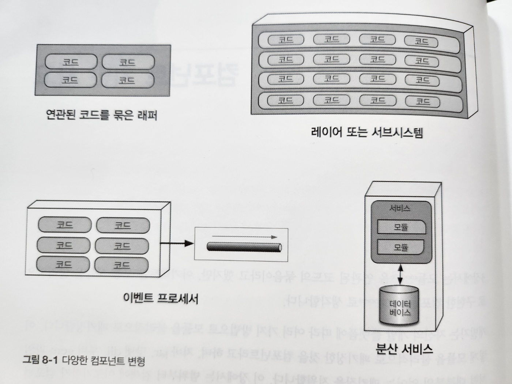
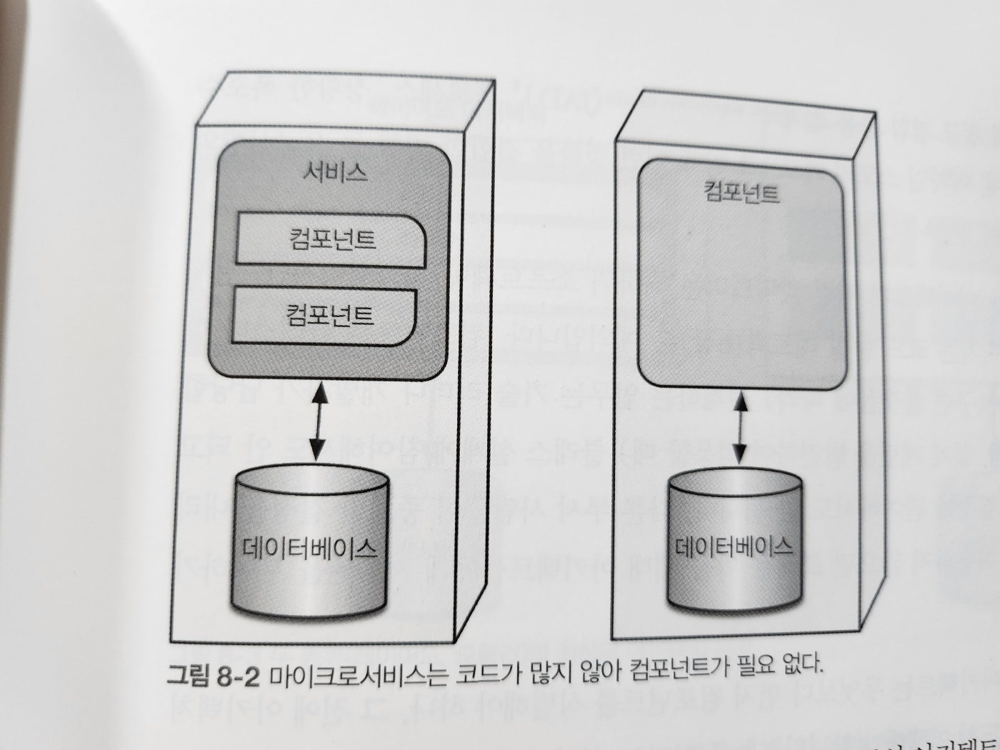
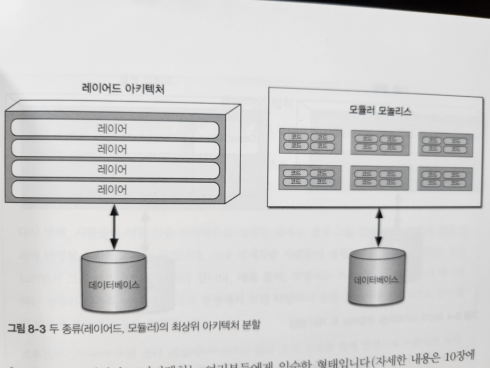
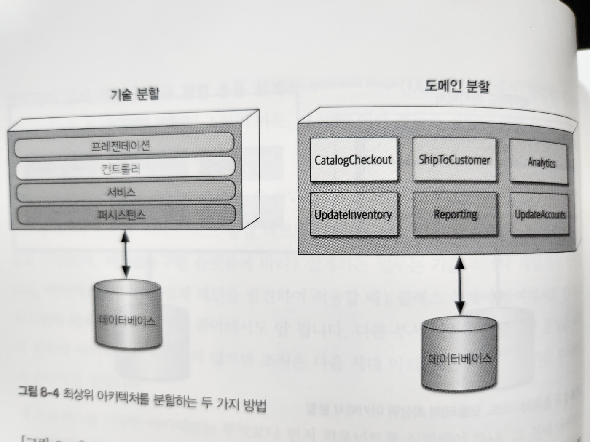
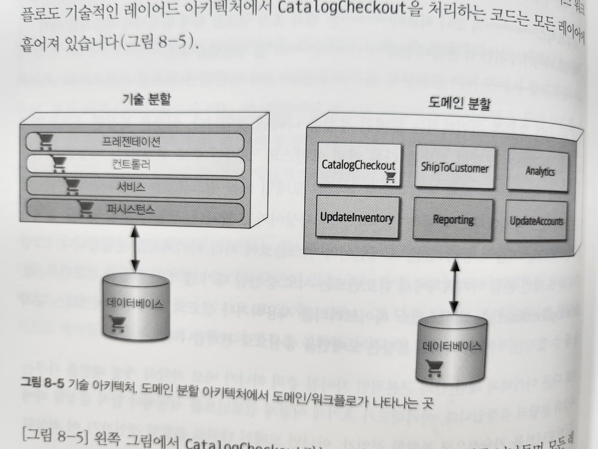
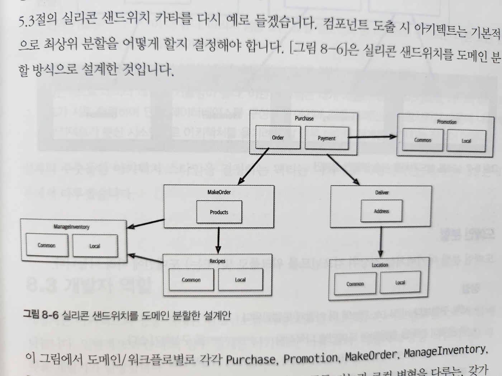
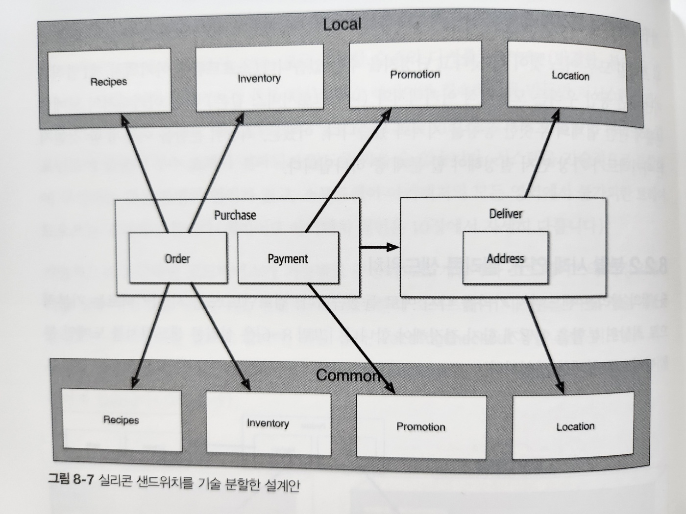

# 8. 컴포넌트 기반 사고

- 3장에서는 모듈(module)을 연관된 코드의 묶음이라고 했지만, 아키텍트는 보통 모듈을 물리적으로 구현한 컴포넌트로 생각합니다
- 개발자는 자신의 개발 플랫폼에 따라 여러 가지 방법으로 모듈을 물리적으로 패키징합니다
  - 이렇게 모듈을 물리적으로 패키징한 것을 컴포넌트라고 합니다
  - e.g. 자바 jar, 닷넷 dll, 루비 gem, ...
- 이 장에서는 범위부터 검색에 이르기까지 컴포넌트에 관한 아키텍처 고려 사항을 알아보겠습니다

## 8.1 컴포넌트 범위

- 그림 8-1. 다양한 컴포넌트 변형
  - `가장 단순한 컴포넌트`는 클래스(또는 비객체 지향 언어의 함수)보다 한 단계 높은 수준의 모듈로 코드를 래핑한 것입니다
  - 이 단순한 래퍼를 보통 `라이브러리(library)`라고 합니다
- 라이브러리는 호출부 코드와 동일한 메모리 주소에서 실행되며 해당 언어의 함수 호출 메커니즘을 이용해 통신합니다

  - 일반적으로 라이브러리는 컴파일 타임에 의존합니다

- `컴포넌트`는 아키텍처에서 서브시스템이나 레이어 형태로도 나타나며, 많은 이벤트 프로세서를 위한 `배포 가능한 작업 단위`입니다

- `마이크로서비스 같은 아키텍처에서 서비스`는 `배포 가능한 독립적인 단위`를 형성합니다

  - 내 생각) MSA에서 서비스는 `컴포넌트`입니다

- 아키텍트가 반드시 컴포넌트를 사용해야 하는 것은 아닙니다
  - 컴포넌트는 언어가 제공하는 저수준이 아닌, 더 높은 수준에서 모듈성을 가지는 것이 더 유용할 때가 많습니다

- 그림 8-2. 마이크로서비스는 코드가 많지 않아 컴포넌트가 필요 없다

- 컴포넌트는 아키텍처의 근본적인 모듈성을 구성하는 요소로서 아키텍트에게 아주 중요한 고려사항입니다
- 실제로 아키텍트가 결정하는 중요한 항목 중 하나가 `아키텍처 컴포넌트의 최상위 분할`과 연관되어 있습니다

- 요약(내 생각)
  - 컴포넌트 범위는 단순한 라이브러리에서부터 마이크로서비스까지 다양합니다
  - 이러한 컴포넌트의 범위를 결정하는 것은 아키텍트의 역할입니다

## 8.2 아키텍트 역할

- 아키텍트는 아키텍처 내부의 컴포넌트를 정의, 개선, 관리, 통제하는 일을 합니다
- 소프트웨어 아키텍트는 4장에서 열거한 아키텍처 특성과 소프트웨어 시스템 요구사항을 종합하여 비즈니스 분석가, 분야별 전문가, 개발자, QA 엔지니어, 운영자, 엔터프라이즈 아키텍트와 함께 소프트웨어 초기 설계를 합니다

- 개발팀이 사용하는 것들과 독립적

  - 예외: 배포 및 자동화 거버넌스

- 컴포넌트는 클래스나 함수로 구성되며, 이들을 (구현 플랫폼에 따라) 설계하는 업무는 기술 리더나 개발자가 담당합니다
- 아키텍트는 클래스 설계에 참여해서도 안 되고, 시스템의 세세한 설계 결정에 관여해서도 안 됩니다

  - 다른 부서 사람들이 중요한 결정을 내리지 못하게 아키텍트가 허용하지 않으면 조직은 다음 세대 아키텍트들에게 자율권을 부여하기가 곤란해질 것입니다

- 새 프로젝트를 시작한 아키텍트는 무엇보다 먼저 컴포넌트를 식별해야 하나, 그 전에 아키텍처를 분할하는 방법을 반드시 이해해야 합니다

### 8.2.1 아키텍처 분할

- 소프트웨어는 만사가 트레이드오프입니다
  - 주어진 아키텍처에서 컴포넌트를 만드는 방법도 마찬가지입니다
- 컴포넌트는 일반적인 적재(containership) 메커니즘을 의미하므로 아키텍트는 재량껏 어떤 유형의 분할도 할 수 있습니다
- 여기에 각기 다른 트레이드오프를 가진 몇 가지 공통적인 스타일이 있습니다
  - 아키텍처 스타일은 2부에서 자세히 다루고, `이 절에서는 최상위 분할`(top-level partitioning)에 대해 다루겠습니다

- 그림 8-3. 두 종류(레이어드, 모듈러)의 최상위 아키텍처 분할

- 레이어드 아키텍처

  - 여러분들에게 익숙한 형태입니다(자세한 내용은 10장에서)
  - 내 생각: React에서 컴포넌트 디렉토리를 계층별 또는 기능별로 나누는 것과 비슷한 것 같다

- 모듈러 모놀리스(modular monolith)

  - 기술적 능력이 아닌, 도메인에 따라 분할된 단일 배포 단위입니다
  - 내 생각: 도메인별로 나누고 그 안에서 레이어드 아키텍처를 적용하는 것과 비슷한 것 같다
    - spring boot에서 도메인별로 패키지를 나누는 것과 비슷한 것 같다

- 이 두 가지 스타일은 서로 다른 방법으로 아키텍처를 최상위 분할한 결과입니다
  - 각 최상위 컴포넌트 내부에는 다른 컴포넌트들이 내장되어 있습니다
- 최상위 분할은 근본적인 아키텍처 스타일과 코드 분할 방법을 결정짓기 때문에 아키텍트에게는 특별한 관심사입니다

- 그림 8-4. 최상위 아키텍처를 분할하는 두 가지 방법

- `기술 분할`

  - 기술적 최상위 분할은 레이어드 아키텍처와 같이 기술적인 능력에 따라 아키텍처를 구성하는 것입니다
  - 이미 수십 년 전에 등장한 레이어드 아키텍처의 기본 개념은 모델-뷰-컨트롤러 설계 패턴과 궁합이 잘 맞고 개발자가 이해하기 쉬워서 수많은 조직에서 기본 아키텍처로 자리 잡았습니다
  - 레이어드 아키텍처 -> 10장

- `도메인 분할`

  - 이것은 복잡한 소프트웨어 시스템을 분리하는 모델링 기법을 다룬 에릭 에반스의 '도메인 주도 설계'에서 비롯됐습니다
  - DDD에서 아키텍트는 서로 독립적으로 분리된 도메인 또는 워크플로를 식별하는데, 이는 마이크로서비스 아키텍처 스타일(17장)의 근본 사상이기도 합니다

- 서로 다른 아키텍처 패턴 간의 근본적이 차이점 중 하나가 바로 각각의 개별 패턴을 다루는 최상위 분할의 유형입니다

  - 아키텍트가 초기에 어떻게 컴포넌트를 식별해야 할지 결정할 때에도 이 최상위 분할 유형이 매우 큰 영향을 미칩니다

- `기술 분할`을 택한 아키텍트는 시스템 컴포넌트를 프레젠페이션, 비즈니스 규칙, 퍼시스턴스 등의 기술적 능력에 따라 구성합니다
  - 이 아키텍처의 구성 원칙 중 하나는 기술 관심사의 분리로서, 이는 결국 유용한 수준의 디커플링을 만듭니다
  - 가령 서비스 레이어가 하부 퍼시스턴스 레이어만 접속하도록 만들면 퍼시스턴스 레이어를 변경할 일이 생겨도 해당 레이어만 영향을 받습니다
    - 이런식으로 의존하는 컴포넌트에 줄줄이 부수 효과가 전파되지 않도록 막을 수 있습니다

- 그림 8-5. 기술 아키텍처, 도메인 분할 아키텍처에서 도메인/워크플로가 나타나는 곳
- 기술적으로 분할하면 코드베이스가 기능별로 구성되므로 개발자가 코드베이스의 특정 카테고리를 신속하게 찾을 수 있지만, 현실적으로 대부분의 소프트웨어 시스템은 여러 기술/가능을 넘나드는 워크플로를 필요로 합니다

  - 예를 들어, CatalogCheckout 처럼 흔한 비즈니스 워크플로도 기술적인 레이어드 아키텍처에서 CatalogCheckout을 처리하는 코드는 모든 레이어에 흩어져 있습니다

- 그림 8-5의 왼쪽에서 CatalogCheckout라는 도메인은 기술 레이어를 넘나들며 모든 레이어에 존재합니다

  - 도메인에 따라 구성한 분할과 비교해보세요
  - 도메인 분할 아키텍처로 설계한 아키텍트는 워크 플로 및 도메인 중심으로 최상위 컴포넌트를 구축합니다
  - 도메인 분할의 각 컴포넌트는 레이어를 포함한 서브컴포넌트를 가질 수 있지만, 최상위 분할은 도메인에 초점을 두는 까닭에 프로젝트에서 가장 자주 발생하는 변경의 유형들이 더 확실하게 반영됩니다

- 두 스타일 모두 어느 것이 더 낫다고 단정지을 수는 없습니다(이것이 트레이드오프의 본질입니다)
- 지난 수년 동안 우리는 모놀리식 아키텍처와 분산 아키텍처(e.g, 마이크로서비스)의 도메인 분할에 관한 업계의 뚜렷한 동향을 지켜봐 왔습니다
  - 어쨌든, 최상위 분할을 어떻게 할 것인지는 아키텍트가 가장 먼저 결정해야 할 문제 중 하나입니다

### 8.2.2 분할 사례 연구: 실리콘 샌드위치

- 그림 8-6. 실리콘 샌드위치를 `도메인 분할`한 설계안
  - Purchase, Promotion, MakeOrder, ManageInventory, Recipes, Delivery, Location 컴포넌트를 도출
  - 공통 기능과 로컬 변형을 다루는 갖가지 유저 정의 코드를 처리하는 서브 컴포넌트를 이들 안에 두었습니다

- 그림 8-7. 실리콘 샌드위치를 기술 분할한 설계안
- 그림 8-7은 공통 및 로컬 파트를 각 파티션으로 분리할 설계입니다
  - 최상위 컴포넌트는 Common과 Local이고 워크플로는 Purchase와 Delivery로 처리합니다

#### 도메인 분할
