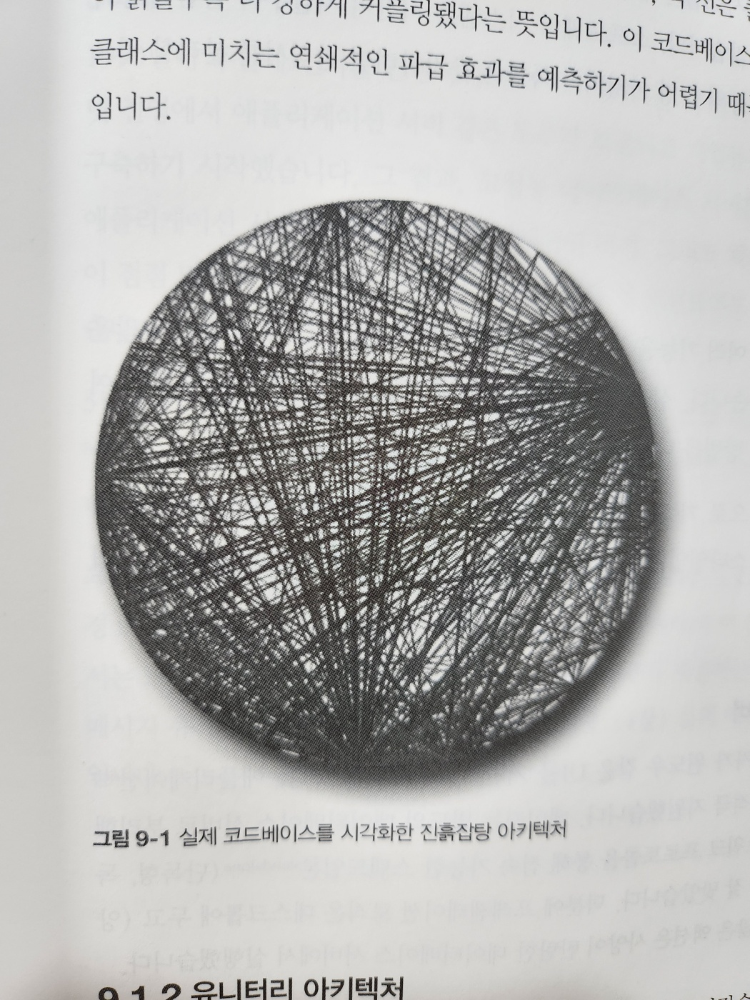
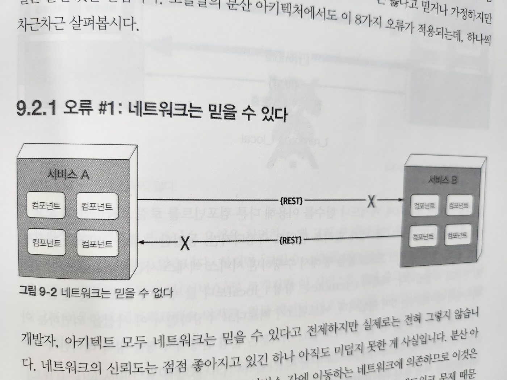
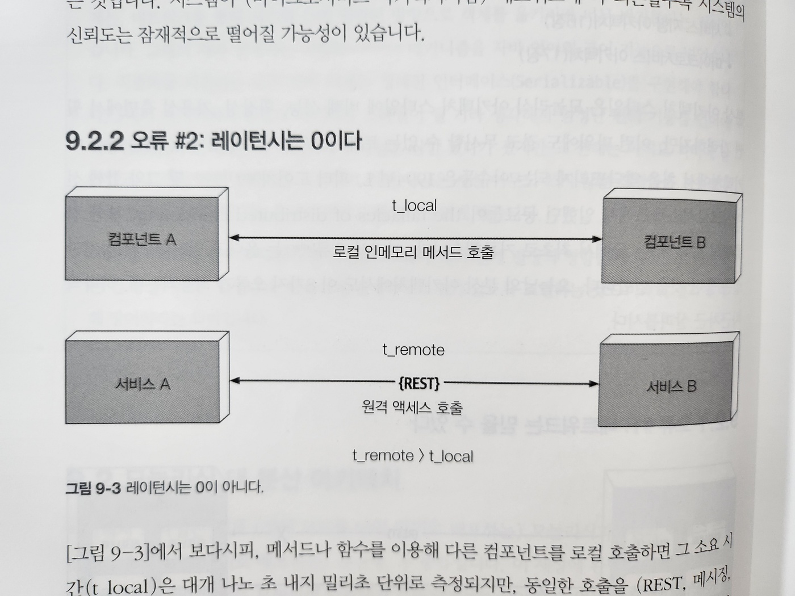
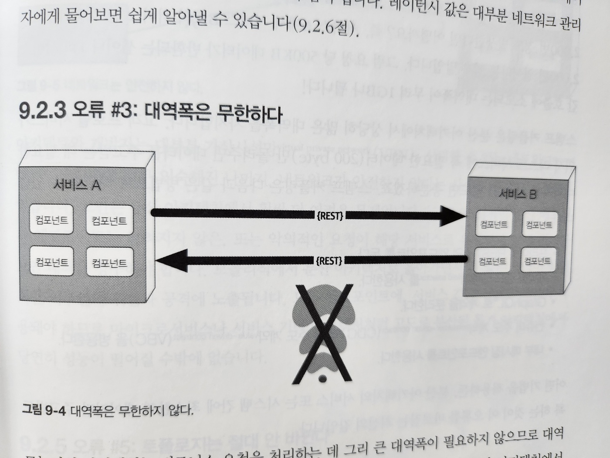
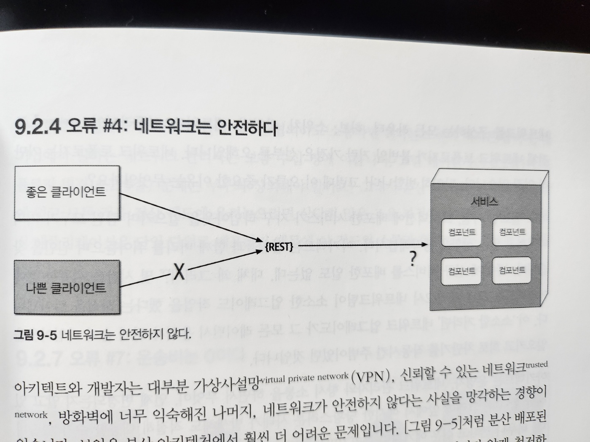
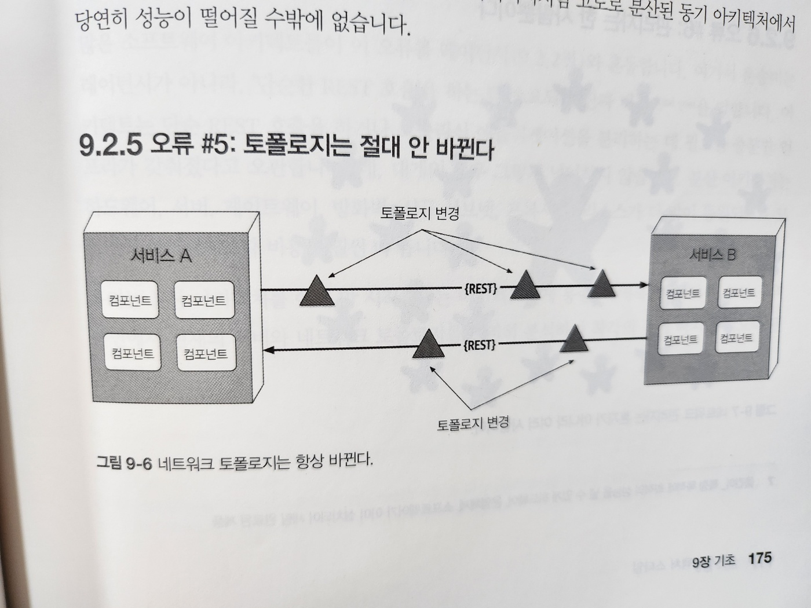
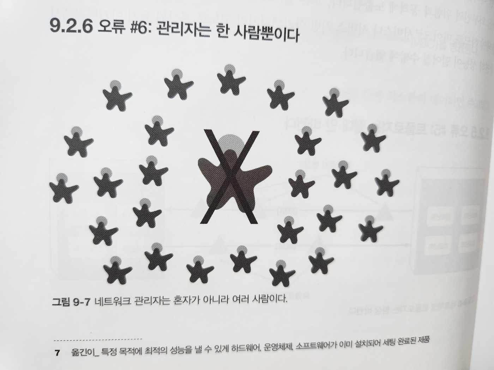
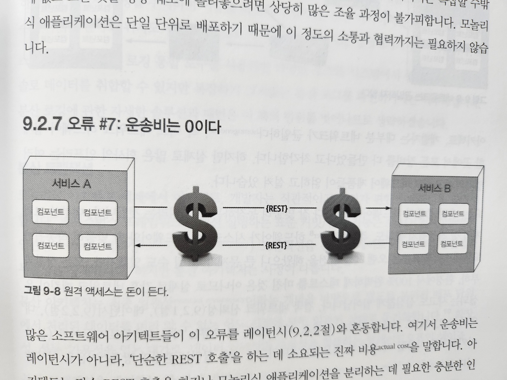
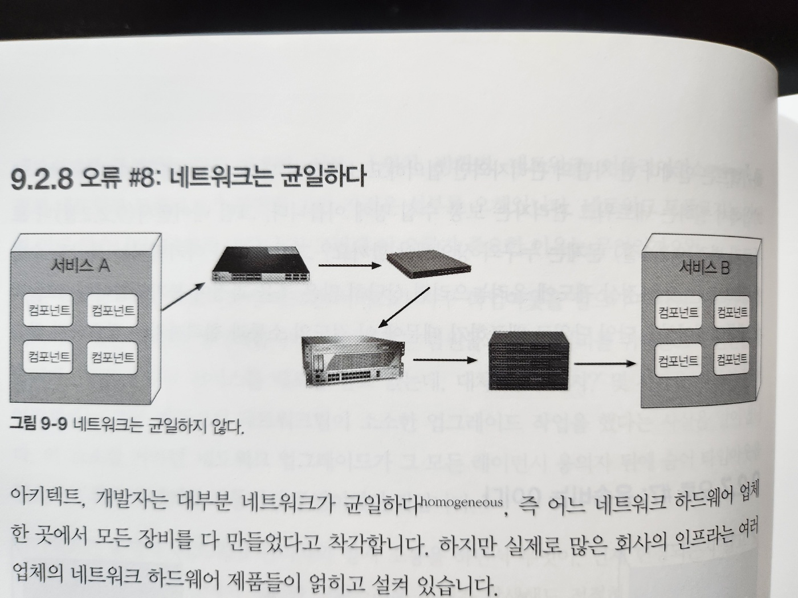

# 9. 기초

- 아키텍처 스타일은 종종 아키텍처 패턴이라고도 부르며, 다양한 아키텍처 특성을 다루는 컴포넌트의 명명된 관계(named relationship)를 기술합니다
- 2부에서는 현대 아키텍처 패턴들을 두루 다루고 있지만, 아키텍트는 규모가 더 큰 패턴에서 나타나는 몇 가지 근본적인 패턴들을 꿰고 있어야 합니다

## 9.1 기초 패턴

- 소프트웨어 아키텍처의 역사를 통틀어 끊임없이 나타나는 패턴들
  - 코드, 배포, 아키텍처 구성하는 시야를 넓혀줍니다
  - e.g. 레이어드는 기능에 따라 서로 다른 관심사를 분리하는 개념

### 9.1.1 진흙잡탕

- 뭐 하나 뚜렷한 아키텍처 구조가 전무한 상태를 진흙잡탕(Big Ball of Mud)이라고 표현합니다
- 데이터베이스를 직접 호출하는 이벤트 핸들러를 가진 단순한 스크립팅 애플리케이션
  - 규모가 커지면서 처치 곤란한 상태가 됩니다
- 아키텍트는 무슨 수를 써서라도 이런 아키텍처는 피하려고 합니다
- 안타깝게도 이 아키텍처 안티패턴은 실제로 흔히 발생합니다
  - 일부로 만들지 않겠지만, 많은 프로젝트가 `코드 품질 및 구조에 관한 거버넌스`가 결여된 탓에 본의 아니게 그렇게 됩니다

- 그림 9-1. 실제 코드베이스를 시각화한 진흙잡탕 아키텍처

### 9.1.2 유니터리 아키텍처

- 소프트웨어 태동기에는 단 1대의 컴퓨터에서 소프트웨어가 돌아갔습니다
- 이후 다양한 진화를 거치면서 단일 엔티티로 시작했단가 점점 더 많이 필요해지면서 나누었습니다
- 예를 들어, 메인 프레임 컴퓨터는 원래 단일 시스템이었지만 점점 갈수록 데이터를 고유한 시스템으로 분리했습니다
- 마찬가지로 컴퓨터가 처음 출시된 시절에도 상업용 개발은 대부분 단일 머신에 초점을 두었지만, PC 네트워크가 보편화되면서 (클라이언트/서버 같은) 분산형 시스템이 등장했습니다
- 이제 유니터리(단일, 통일) 시스템은 임베디드 시스템과 그 밖에 매우 제약이 많은 극소수 환경을 제외하면 거의 쓰이지 않습니다

### 9.1.3 클라이언트/서버

- 프런트엔드와 백엔드로 기술적으로 기능을 분리한 2티어 또는 클라이언트/서버 아키텍처는 대표적인 기본 아키텍처 스타일입니다
- 이 아키텍처는 시대와 컴퓨팅 파워에 따라 여러가지 형태로 존재해왔습니다

#### 데스크톱 + 데이터베이스 서버

- 프레젠테이션 로직은 데스크톱에 두고, (양과 복잡도 모두) 계산량이 많은 액션은 사양이 탄탄한 데이터베이스 서버에서 실행했습니다

#### 브라우저 + 웹 서버

- 현대 웹 개발 시대가 도래하면서 웹 브라우저가 웹 서버에 접근하는 형태로 분리하는 것이 일반화됐습니다
- 이로써 클라이언트는 데스크톱보다 훨씬 가벼운 브라우저로 대체되었고 내외부 방화벽 모두 더 넓은 범위로 배포가 가능해졌습니다
- 데이터베이스는 웹 서버와 분리되어 있지만, 두 서버 모두 운영 센터 내부의 동급 머신에서 운용되고 유저 인터페이스는 브라우저에서 실행되므로 여전히 이 구조를 2티어 아키텍처로 바라보는 아키텍트들도 있습니다

#### 3티어

- 자바, 닷넷 진영에서 애플리케이션 서버 같은 도구가 보급되고 기업들으 더 많은 레이어를 토폴로지에 구축하기 시작했습니다
- 구성
  - 고성능 데이터베이스 서버를 사용하는 데이터베이스 티어
  - 애플리케이션 서버가 관리하는 애플리케이션 티어
  - 온갖 자바스크립트 코드로 가득 찬 프런트엔드 티어
- 요즘은 TCP/IP 같은 네트워크 프로토콜이 어떻게 작동하는지 개발자가 신경쓰지 않아도 되는 것 처럼
  - 아키텍트도 분산 아키텍처에서 이 정도 수준의 연결 작업에 대해서는 그리 걱정할 필요가 없습니다
- 당시 개발된 도구가 제공하는 기능들이 오늘날에도 여전히 메시지 큐 같은 도구 또는 이벤트 기반 아키텍처(14장) 등의 아키텍처 패턴에 존재하기 때문입니다

## 9.2 모놀리식 vs. 분산 아키텍처

- 아키텍처 스타일은 크게 (전체 코드를 단일 단위로 배포하는) 모놀리식과 (원격 액세스 프로토콜을 통해 여러 단위로 배포하는) 분산형, 두 가지로 나뉩니다
- 이 책에서는 다음과 같은 아키텍처 스타일을 자세히 살펴보겠습니다

  - `모놀리식`
    - 레이어드 아키텍처(10장)
    - 파이프라인 아키텍처(11장)
    - 마이크로커널 아키텍처(12장)
  - `분산형`
    - 서비스 기반 아키텍처(13장)
    - 이벤트 기반 아키텍처(14장)
    - 공간 기반 아키텍처(15장)
    - 서비스 지향 아키텍처(16장)
    - 마이크로서비스 아키텍처(17장)

- 분산 아키텍처 스타일은 모놀리식 아키텍처 스타일에 비해 성능, 확장성, 가용성 측면에서 훨신 강력하지만, 이런 파워에도 결코 무시할 수 없는 트레이드오프가 수반됩니다
  - 분산 컴퓨팅의 오류 - 오류: 옳다고 믿거나 가정하지만 실은 틀린 것

### 9.2.1 오류 #1: 네트워크는 믿을 수 있다

- 그림 9-2. 네트워크는 믿을 수 없다
- 시스템이 (마이크로서비스 아키텍처처럼) 네트워크에 더 의존할수록 시스템의 신뢰도는 잠재적으로 떨어질 가능성이 있습니다

### 9.2.2 오류 #2: 레이턴시는 0이다

- 그림 9-3. 레이턴시는 0이 아니다
- 로컬 인메모리 메서드 호출 : 나노 초 ~ 밀리 초
- 원격 호출 : 밀리 초
- 아키텍트는 어떤 분산 아키텍처를 구축하든지 간에 평균 레이턴시는 반드시 알아야 합니다
- 이것이 분산 아키텍처가 실현 가능한지 판단한느 유일한 방법입니다

### 9.2.3 오류 #3: 대역폭은 무한하다

- 그림 9-4. 대역폭은 무한하지 않다
- 모놀리식 아키텍처는 비즈니스 요청을 처리하는 데 그리 큰 대역폭이 필요하지 않으므로 대역폰이 문제될 일은 별로 없습니다
- 하지만 분산 아키텍처에서 시스템이 자잘한 배포 단위(서비스)로 쪼개지면 이 서비스들 간에 주고 받는 통신이 대역폭을 상당히 점유하여 네트워크가 느려지고, 결국 레이턴시와 신뢰성에도 영향을 미칩니다
- 스탬프 커플링: 서비스 A에는 이 데이터가 없기 때문에 서비스 B를 호출하는 것
  - 스탬프 커플링 해결
    - 프라이빗 REST API 엔드포인트를 둔다
    - 계약에 필드 셀렉터를 사용한다
    - GraphQL로 계약을 분리한다
    - 컨슈머 주도 계약(CDC)와 값 주도 계약(VBC)을 병용한다
    - 내부 메시징 엔드포인트를 사용한다

### 9.2.4 오류 #4: 네트워크는 안전하다

- 그림 9-5. 네트워크는 안전하지 않다
- 사설망을 사용하면서 네트워크가 안전하지 않다는 사실을 망각하는 경향이 있습니다
- 보안은 분산 아키텍처에서 훨씬 더 어려운 문제입니다
- 모놀리식에서 분산 아키텍처로 옮아가면서 더 넓은 영역의 악의적인 외부인의 위협과 공격에 노출됩니다

### 9.2.5 오류 #5: 토폴로지는 절대 안 바뀐다

- 그림 9-6. 네트워크 토폴로지는 항상 바뀐다
- 배포를 안해도 네트워크 팀이 작업해서 동작이 안될 수 있다

### 9.2.6 오류 #6: 관리자는 한 사람뿐이다

- 그림 9-7. 네트워크 관리자는 혼자가 아니라 여러 사람이다

### 9.2.7 오류 #7: 운송비는 0이다

- 그림 9-8. 원격 액세스는 돈이 든다
- 분산 아키텍처는 하드웨어, 서버, 게이트웨이, 방화벽 등 리로스가 더 많이 동원되므로 모놀리식 아키텍처보다 비용이 훨씬 더 듭니다

### 9.2.8 오류 #8: 네트워크는 균일하다

- 그림 9-9. 네트워크는 균일하지 않다
- 어느 하드웨어 업체 한 곳에서 모든 장비를 다 만들었다고 착각합니다. 하지만 실제로 많은 회사의 인프라는 여러 업체의 네트워크 하드웨어 제품들이 얽히고 설켜 있습니다

### 9.2.9 다른 분산 아키텍처 고려 사항

- 모놀리식 아키텍처에는 없지만 분산 아키텍처를 설계할 때 맞닥뜨리게 될 이슈 및 해결해야 할 난제들

#### 분산 로깅

- 분산 아키텍처는 애플리케이션과 시스템 로그가 분산되어 있으므로 어떤 데이터가 누락된 근본 원인을 밝혀내기가 대단히 어렵고 시간도 많이 걸립니다
- 모놀리식은 로그가 하나 밖에 없어서 요청을 추적하여 이슈를 특정하기 쉽지만
- 분산 아키텍처는 로그가 여러 곳에 흩어져 있어서 추적하기 어렵습니다
- 스플렁크 같은 로깅 통합 도구를 사용하면 다양한 소스와 시스템에서 통합된 로그 및 콘솔 데이터를 취합할 수 있지만 복잡하기 그지 없는 분산 로그를 확인하기에는 역부족입니다
- 자세한 솔루션은 이 책의 범위를 벗어나므로 생략

#### 분산 트랜잭션

- 모놀리식 아키텍처 세계에서는 편한 트랜잭션을 당연시 합니다
- ACID 트랜잭션을 걸어 업데이트 시 데이터 일관성과 무결정을 강제합니다
  - 하지만 분산 아키텍처는 사정이 다릅니다
- 분산 트랜잭션을 관리하는 한 가지 방법으로 트랜잭셔널 사가가 있습니다
  - 사가는 보상을 위해 이벤트를 소싱하거나 트랜잭션 상태를 관리하기 위해 유상 상태 기계를 활용합니다
  - 사가 외에 BASE 트랜잭션도 사용합니다
    - BASE트랜잭션(기법): 소프트 상태는 소스 -> 타깃으로의 데이터 전달과 데이터 소스 간 비일관성을 말합니다
- 시스템 또는 서비스의 기본 가용성에 따라 시스템은 아키텍처 패턴과 메시징을 사용하여 결국 언젠가 일관되게 맞춰질 것입니다

#### 계약 관리 및 버저닝

- 계약 생성, 유지보수, 버저닝 역시 분산 아키텍처에서 다소 까다롭습니다
- 계약은 클라이언트와 서비스 모두 합의한 행위와 데이터 입니다
- 분산 아키텍처에서는 분리된 서비스와 시스템을 제각기 다른 팀과 부서가 소유하기 때문에 계약 유지보수가 특히 어렵습니다
- 버전 구식화에 필요한 통신 모델은 더욱 복잡합니다
