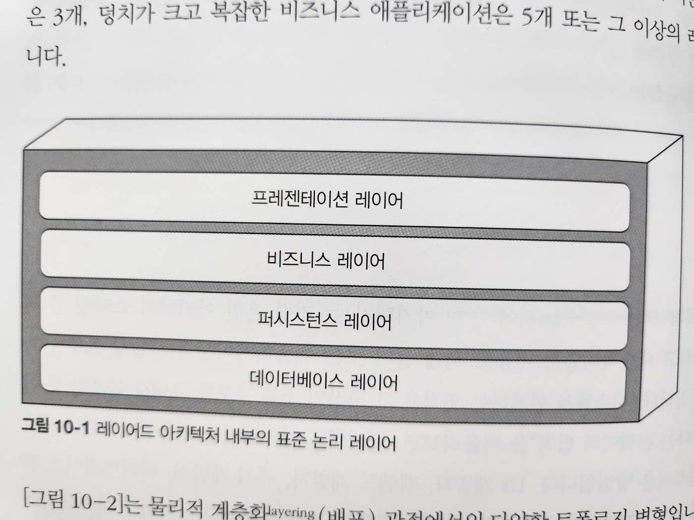
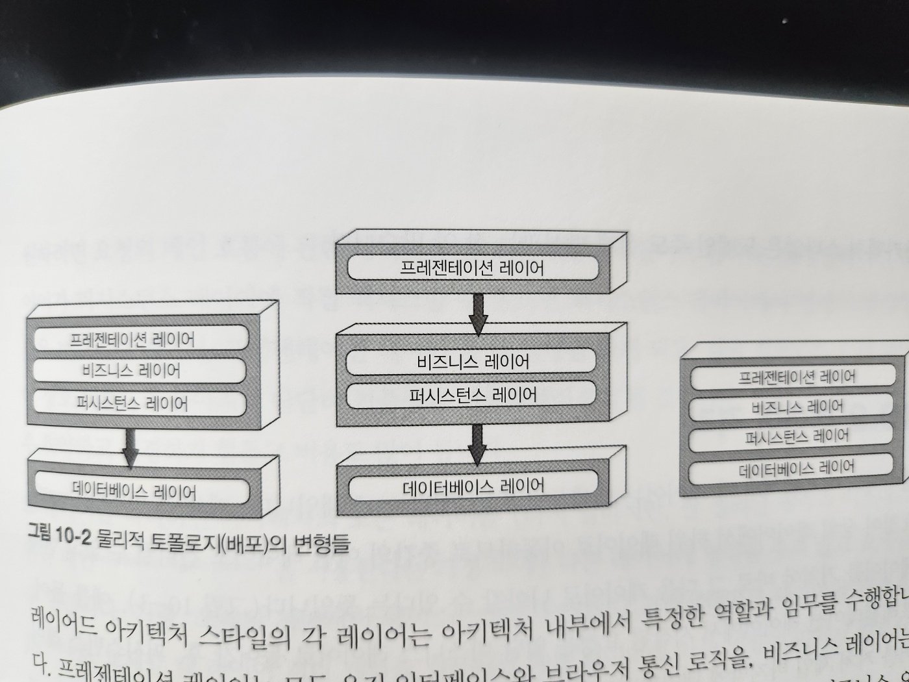
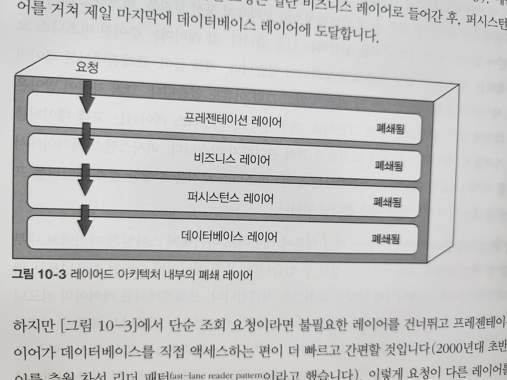
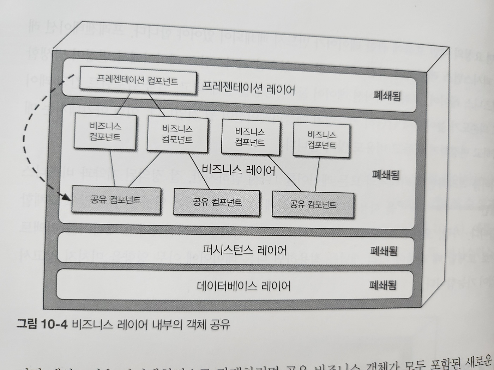
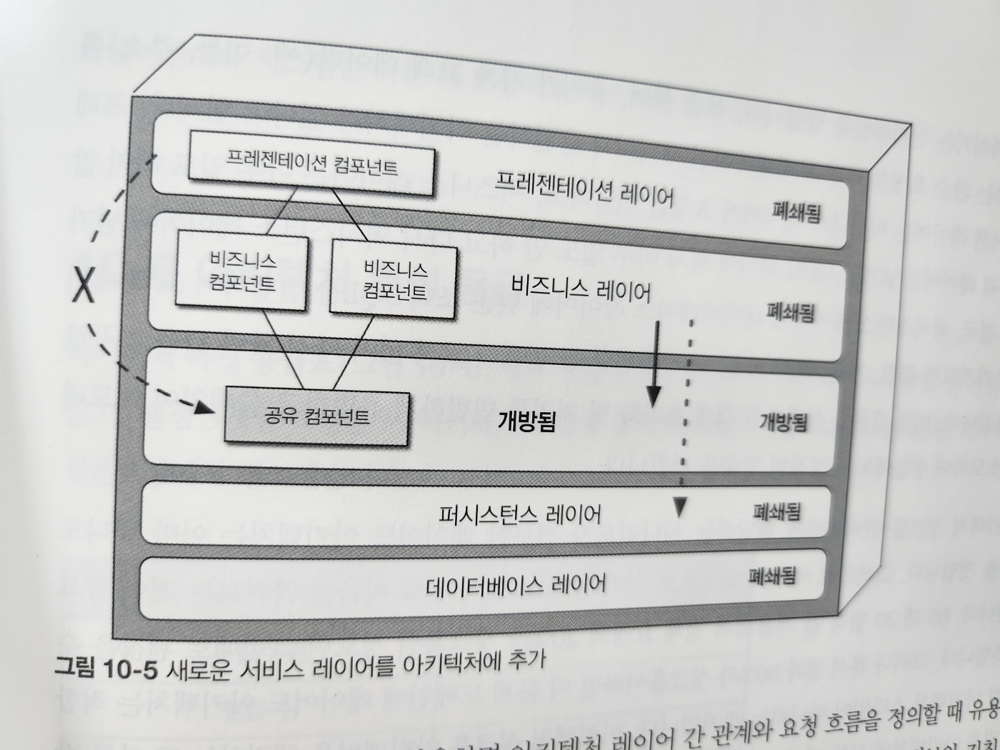
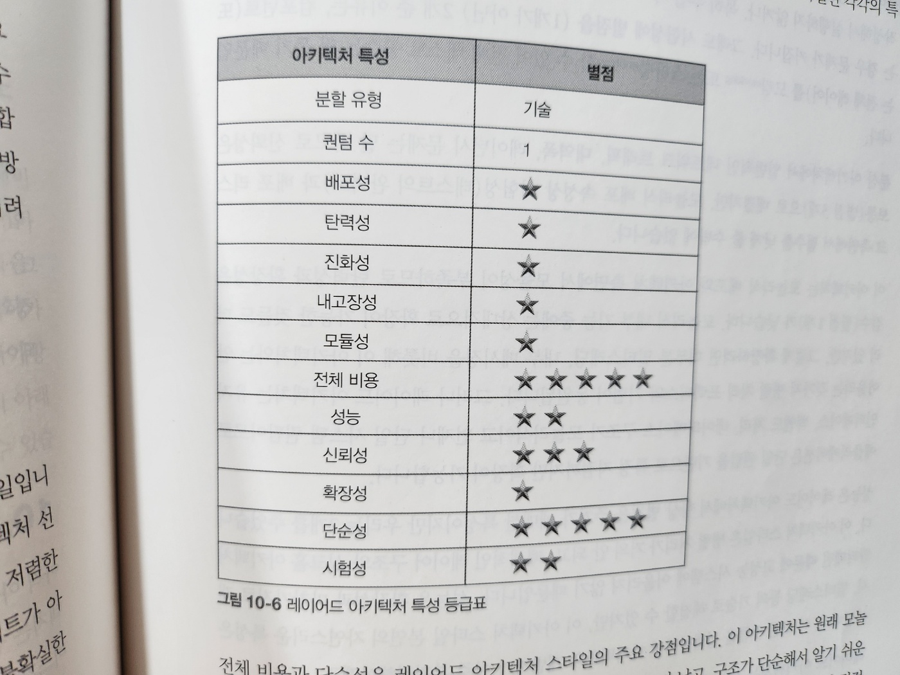

# 10. 레이어드 아키텍처 스타일

- 레이어드 아키텍처는 가장 흔한 아키텍처 스타일 중 하나입니다
- UI 개발자, 백엔드 개발자, ... 등 이런 조직의 계층 구조가 전통적인 레이어드 아키텍처와 잘 맞아떨어집니다
- 그러나 레이어드 아키텍처 스타일은 묵시적 아키텍처 안티패턴, 우발적 아키텍처 안티패턴 등의 몇몇 아키텍처 안티패턴의 범주에 속합니다
- 그래도 어떤 아키텍처 스타일을 사용하는 게 좋을지 확신이 없거나 애자일 개발팀이 일단 시작하기로 했다면 레이어드 아키텍처는 좋은 선택지가 될 가능성이 높습니다

## 10.1 토폴로지

- 레이어드 아키텍처에서 내부 컴포넌트는 논리적으로 수평한 레이어들로 구성되며, 각 레이어는 애플리케이션에서 (프레젠테이션 로직, 비즈니스 로직 등의) 주어진 역할을 수행합니다
- 레이어의 개수와 유형은 특별한 제한은 없지만, 일반적으로 4개의 표준 레이어로 구성합니다(그림 10-1)

  - 프레젠테이션
  - 비즈니스
  - 퍼시스턴스
  - 데이터베이스

- SQL, HSQL 같은 퍼시스턴스 로직이 비즈니스 레이어 컴포넌트에 내장된 경우에 퍼시스턴스 레이어를 비즈니스 레이어에 병합시킵니다
  - 따라서 규모가 작은 애플리케이션은 4개, 덩치가 크고 복잡한 비즈니스 애플리케이션은 5개 또는 그 이상의 레이어로 구성됩니다

- 그림 10-1. 레이어드 아키텍처 내부의 표준 논리 레이어

- 그림 10-2. 물리적 토폴로지(배포)의 변형들
- 그림 10-2는 물리적 계층화(배포) 관점에성의 다양한 토폴로지 변경입니다
- 왼쪽은 프레젠테이션, 비즈니스, 퍼시스턴스 레이어를 단일 배포 단위로 합한 것
  - 데이터베이스 레이어는 외부에 별도로 분리된 물리적인 데이터베이스(또는 파일 시스템)로 나타냅니다
- 가운데 그림은 프레젠테이션 레이어를 자체 배포 단위로 떼어내고 비즈니스 레이어와 퍼시스턴스 레이어를 두 번째 배포 단위로 합한 것입니다
  - 여기에서도 데이터베이스 레이어는 외부 데이터베이스나 파일 시스템 형태로 분리합니다
- 오른쪽 그림은 데이터베이스 레이어를 포함한 4개 표준 레이어를 모두 단일 배포 단위로 뭉뚱그린 것입니다
  - 애플리케이션에 데이터베이스가 내장돼 있거나 인메모리 데이터베이스를 사용하는 소규모 애플리케이션에 적합한 구성입니다
  - 실제로 온프레미스(On-Premises) 제품들이 이런 방식으로 개발되어 고객에게 인도됩니다

#### 레이어 각 역할과 임무

- 프레젠테이션 레이어 : 모든 유저 인터페이스와 브라우저 통신 로직을 담당
- 비즈니스 레이어 : 요청을 받아 알맞은 비즈니스 규칙을 실행
- 퍼시스턴스 레이어 : 데이터베이스와의 통신을 담당
- 데이터베이스 레이어 : 데이터베이스 서버와의 통신을 담당

#### 레이어드 아키텍처 특징

- 기술 분할된 아키텍처
- 컴포넌트를 도메인 단위로 묶는 게 아니라, 아키텍처의 기술 역할에 따라 묶기 때문에 비즈니스 도메인이 각각 모든 아키텍처 레이어에 분산됩니다
- 예를 들어, '고객' 도메인은 프레젠테이션, 비즈니스, 규칙, 서비스, 데이터베이스 등 모든 레이어에 다 포함되므로 이 도메인에 어떤 변경을 가하는 일이 쉽지 않습니다
- 이런 이유로 레이어드 아키텍처 스타일은 도메인 주도 설계 방식과는 잘 안 맞습니다

## 10.2 레이어 격리

- 레이어드 아키텍처의 각 레이어는 폐쇄(closed) 또는 개방(open) 상태입니다
  - `폐쇄 레이어`란, 요청이 상위 레이어에서 하위 레이어로 이동하므로 중간의 어떤 레이어도 `건너뛸 수 없고 현재 레이어를 거쳐야 바로 그 다음 레이어로 나아갈 수 있다`는 뜻입니다
    - 그림 10-3 참고

- 그림 10-3. 레이어드 아키텍처 내부의 폐쇄 레이어
- 하지만 단순 조회 요청이라면 불필요한 레이어를 건너뛰고 프레젠테이션 레이어가 데이터베이스를 직접 액세스하는 편이 더 빠르고 간편할 것입니다
  - 이렇게 요청이 다른 레이어를 건너뛸 수 있으려면 비즈니스 레이어, 퍼시스턴스 레이어는 개방이 되어 있어야 합니다
- 폐쇄 레이어와 개방 레이어, 어느 쪽이 더 유리할까요?
  - 이 질문에 답하려면 레이어 격리라는 핵심 개념을 이해해야 합니다
- 레이어 격리: 어느 아키텍처 레이어에서 변경이 일어나도 다른 레이어에 있는 컴포넌트에 아무런 영향을 끼치지 않기에 레이어 간 계약은 불변임을 의미합니다

  - 각 레이어는 서로 독립적으로 작동되므로 다른 레이어의 내부 작동 로직은 거의/전혀 알지 못합니다
  - 레이어 격리를 지원하려면 요청의 메인 흐름에 관한 레이어가 반드시 폐쇄되어 있어야 합니다

- 레이어를 격리하면 다른 레이어에 영향을 주지 않고 교체할 수 있습니다

## 10.3 레이어 추가

- 어떤 레이어는 개방하는 것이 합리적일 수 있습니다
  - 예를 들어, 비즈니스 레이어에 (날짜, 문자열 유틸리티 클래스, 감사 클래스, 로깅 클래스 등) 공통 비즈니스 기능이 구현된 객체를 구현하여 공유하고,
    프레젠테이션 레이어에서는 이 공유 객체를 직접 사용할 수 없도록 아키텍처 결정을 했다고 합시다
  - 이런 경우에는 프레젠테이션 레이어가 비즈니스 레이어를 액세스할 수 있고 그 내부의 공유 객체 역시 갖다 쓸 수 있는,
    지배/통제하기 어려운 아키텍처 구조입니다(그림 10-4 참고)

- 그림 10-4. 비즈니스 레이어 내부의 객체 공유

- 이런 제약조건을 아키텍처적으로 강제하려면 공유 비즈니스 객체가 모두 포함된 새로운 서비스 레이어를 아키텍처에 추가하면 됩니다

- 그림 10-5. 새로운 서비스 레이어를 아키텍처에 추가
- 10-4에서 새로 추가된 레이어는 10-5와 같이 개방 레이어로 설계해야 비즈니스 레이어가 퍼시스턴스 레이어를 액세스할 때 서비스 레이어를 뚫고 갈 수 있습니다
- 서비스 레이어를 개방 레이어로 만들어 추가하면 비즈니스 레이어는 이 레이어를 액세스하거나
  이 레이어를 지나쳐 다음 레이어로 향할 수 있습니다
- 아키텍처의 어느 레이어가 개방/폐쇄되어 있는지 (그리고 왜 그런지) 정확히 문서화하여 소통하지 않으면 테스트, 유지 보수, 배포 작업이 아주 힘든, 단단히 커플링되어 금방이라도 깨질 듯한 아키텍처가 되어버릴 것입니다

## 10.4 기타 고려 사항

- 아직 아키텍처 스타일을 완전히 결정하지 못했다면 대부분의 애플리케이션에서 레이어드 아키텍처는 좋은 출발점이 될 것입니다
- 마이크로서비스 아키텍처를 고려 중인데 과연 마이크로서비스가 올바른 선택인지 긴가민가할 때 어쨌든 개발은 시작해야 하는 경우에 그렇습니다
- 하지만 재사용은 최소한으로, 객체 계층은 최대한 가볍게 맞추어 적절한 모듈성을 유지하는 것이 중요합니다
  - 그래야 나중에 다른 아키텍처 스타일로 갈아타더라도 큰 어려움이 없겠죠
- 레이어드 아키텍처에서는 아키텍처 싱크홀 안티패턴을 조심해야 합니다
  - 요청이 한 레이어에서 다른 레이어로 이동할 때 각 레이어가 아무 비즈니스 로직도 처리하지 않고 그냥 통과 시키는 안티패턴을 말합니다
    - 예를 들어, 유저가 기본 고객 데이터(예: 이름, 주소)를 조회하는 단순 요청을 하면 프레젠테이션 레이어가 응답하는 아키텍처가 있다고 합시다
      - 프레젠테이션 레이어는 비즈니스 레이어에 요청을 전달하고, 비즈니스 레이어는 아무 일도 하지 않고 규칙 레이어로 넘기고,
        규칙 레이어 역시 아무일도 하지 않고 다시 퍼시스턴스 레이어로 넘기고, 결국 퍼시스턴스 레이어가 데이터베이스 레이어에 단순 조회 SQL을 실행하여 고객 데이터를 가져오면 취합, 계산, 규칙 적용, 데이터 변환 등 일체의 로직 없이 다시 왔던 길을 거꾸로 돌아갑니다.
      - 이런 흐름은 불필요한 객체 초기화 및 처리를 빈번하게 유발하고 쓸데없이 메모리를 소모하며 성능에도 부정적인 영향을 끼칩니다
- 아키텍처 싱크홀 안티패턴에 해당하는 시나리오가 전무한 레이어드 아키텍처는 거의 없지만, 전체 비율을 따져봐서 전체 요청이 20% 이하 정도가 싱크홀이라면 그런대로 괜찮은 수준입니다
- 그러나 분석 결과 80%가 싱크홀이라면 이 문제 도메인에 레이어드 아키텍처는 적합한 아키텍처 스타일이 아니라는 증거입니다- 아키텍처 싱크홀 안티패턴을 해결하는 또 다른 방법은 아키텍처의 모든 레이어를 개방하는 것입니다
  - 그러나 이는 아키텍처상 변경 관리의 어려움이 가중되는 트레이드오프가 있음을 분명하게 인식해야 합니다

## 10.5 왜 이 아키텍처 스타일을 사용하는가

### 장점

- 레이어드 아키텍처는 작고 단순환 애플리케이션이나 웹사이트에 알맞은 아키텍처 스타일입니다
- 특히, 처음 구축을 시작할 때, 예산과 일정이 빠듯한 경우 출발점으로 괜찮은 아키텍처 선택입니다
- 개발자, 아키텍트 모두 익숙하고 그리 복잡하지 않으며 어쩌면 ㅇ비용도 가장 저렴한 아키텍처 스타일로, 소규모 애플리케이션을 간편하게 개발할 수 있습니다
- 아키텍트가 아직 비즈니스 니즈와 요구사항을 분석하는 중이고 어떤 아키텍처 스타일이 최선인지 불확실한 경우에도 나쁘지 않은 선택입니다

### 단점

- 레이어드 아키텍처 기반의 애플리케이션은 규모가 커질수록 유지 보수성, 민첩성, 시험성, 배포성 같은 아키텍처 특성이 점점 나빠집니다
- 따라서 레이어드 아키텍처를 사용한 `대규모 애플리케이션`이나 시스템은 다른 `더 모듈러한 아키텍처 스타일이 더 잘 맞습니다`

## 10.6 아키텍처 특성 등급

- 그림 10-6. 레이어드 아키텍처 특성 등급표
- 별 1개 : 이 아키텍처에서 별로 잘 지원되지 않음
- 별 5개 : 이 아키텍처의 강점 중의 하나
