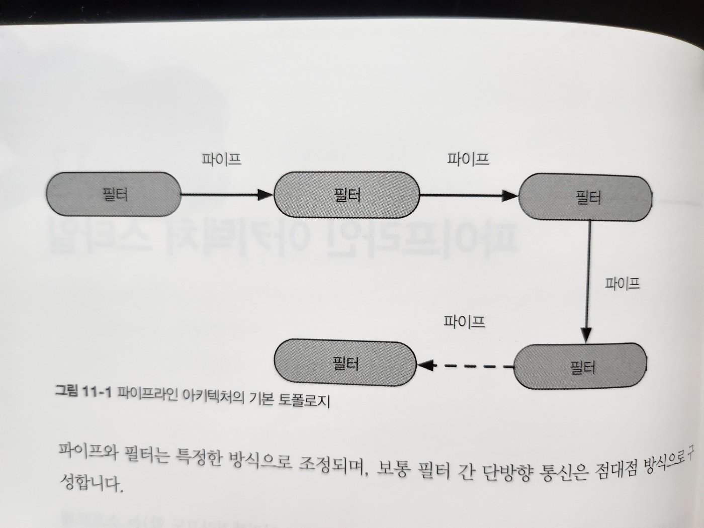
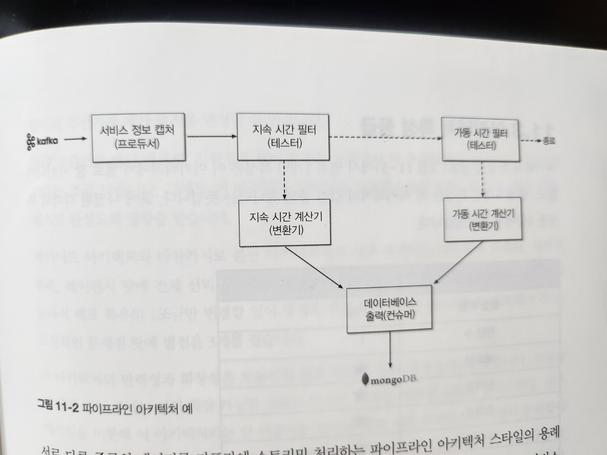
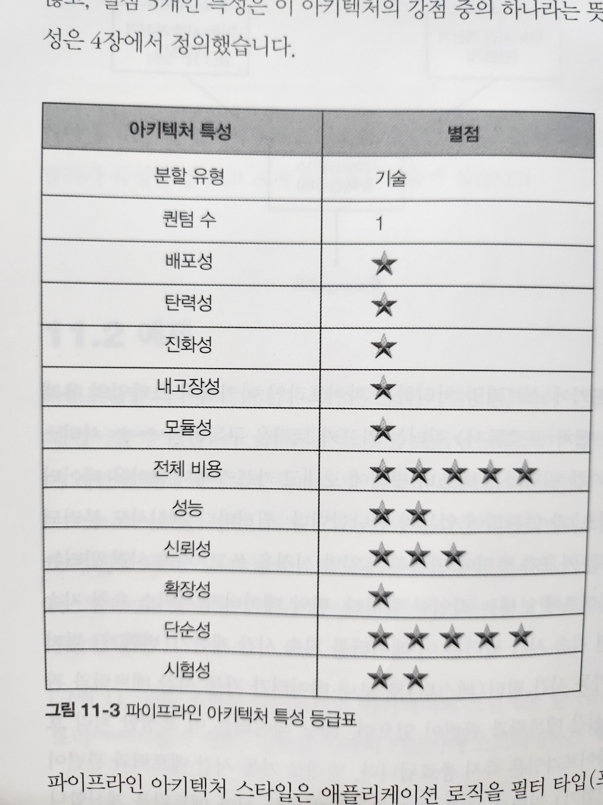

# 11. 파이프라인 아키텍처 스타일

- 파이프라인 아키텍처는 소프트웨어 아키텍처에서 끊임없이 등장하는 기본적인 아키텍처 스타일입니다
- 개발자와 아키텍트가 기능을 개별 파트로 분리하기로 결정하는 순간부터 이 패턴이 수반됩니다
- 이 아키텍처는 Bash나 Zsh같은 유닉스 터미널 쉘 언어의 기초 원리와도 매우 밀접한 관련이 있습니다
- 함수형 언어 개발자는 언어 구조와 이 아키텍처 요소가 유사하다고 생각할 것입니다
  - 사실, 맵리듀스(MapReduce) 프로그래밍 모델을 으용한 많은 도구가 이 기본 토폴로지를 따릅니다
  - 이처럼 파이프라인 아키텍처 스타일은 저수준에서 구현할 수도 있고 고수준의 비즈니스 애플리케이션에도 적용할 수 있습니다

## 11.1 토폴로지

- 파이프라인 아키텍처는 다수의 파이프와 필터로 구성됩니다

- 그림 11-1. 파이프라인 아키텍처의 기본 토폴로지

- 파이프와 필터는 특정한 방식으로 조정되며, 보통 필터 간 단방향 통신은 점대점 방식으로 구성합니다

### 11.1.1 파이프

- 파이프는 한 소스에서 입력을 받아 다른 소스로 출력을 내는, 필터 간 통신 채널입니다
- 파이프는 성능상 이유로 보통 단방향, 점대점 방식으로 구성합니다
- 파이프를 오가는 페이로드의 데이터는 어떤 포맷이라도 가능하지만, 아키텍트는 고성능에 유리한 적은 양의 데이터를 선호합니다

### 11.1.2 필터

- 필터는 자기 완비형(self-contained)이고, 다른 필터와 독립적이며, 일반적으로 무상태성(stateless)입니다
- 필터는 한 가지 태스크만 수행하므로, 복합 태스크는 여러 필터를 이어 붙여 처리하면 됩니다
- 파이프라인 아키텍처 스타일에서 필터는 다음 네 가지 종류가 있습니다

#### 프로듀서(Producer)

- 프로세스의 시작점입니다
- 아웃바운드(outbound)만 있어서(즉, 들어오는 트래픽은 없고 나가는 트래픽만 있기 때문에) 소스(source)라고도 합니다

#### 변환기(transformer)

- 입력을 받아 필요시 일부 또는 전체 데이터를 변환 후, 그 결과를 아웃바운드 파이프로 전달합니다.
- 함수형 프로그래밍의 열혈팬들은 이 기능을 맵(map)이라고 부릅니다

#### 테스터(tester)

- 입력을 받아 하나 이상의 기준(criteria)에 대해 테스트를 하고 그 결과에 따라 필요시 결과를 생산합니다
- 함수형 프로그래머는 이 기능을 리듀스(reduce)라고 부릅니다

#### 컨슈머(consumer)

- 파이프라인 흐름의 종착역입니다
- 컨슈머는 파이프라인 프로세스의 최종 결과를 데이터베이스에 저장하거나 유저 인터페이스 화면에 표시합니다

#### 필터의 조합

- 필터는 다른 필터와 조합하여 사용할 수 있습니다

## 11.2 예시

- 파이프라인 아키텍처 패턴은 다양한 애플리케이션, 특히 간단한 단방향 처리 태스크에서 흔히 찾아볼 수 있습니다
  - 예를 들어, 전자 데이터 교환(EDI, Electronic Data Interchange) 도구는 대부분 이 패턴에 따라 파이프와 필터로 한 종류의 문서를 다른 종류의 문서로 변환합니다
  - ETL(Extract, Transform, Load - 추출, 변환, 적재) 도구 역시 다른 데이터베이스나 데이터소스로 데이터를 변환하여 흘릴 때 파이프라인 아키텍처를 활용합니다

- 그림 11-2. 파이프라인 아키텍처 예
  - 다양한 서비스의 텔레메트리(원격 계측) 정보를 아파치 카프카에 스트리밍하는 예제입니다

## 11.3 아키텍처 특성 등급

- 그림 11-3. 파이프라인 아키텍처 특성 등급표

- 이 아키텍처의 강점은 모듈성과 결부된 전체 비용 및 단순성입니다
  - 이 아키텍처는 원래 모놀리식에 가깝기 때문에 분산 아키텍처 스타일에 수반되는 복잡도가 없고, 단순해서 알기 쉽고 구축 및 유지보수 비용도 비교적 적게 듭니다
- 다양한 필터 타입과 변환기 간의 관심사를 분리함으로써 아키텍처 모듈성을 확보할 수 있고 필터를 교체/수정하더라도 다른 필터에는 아무런 영향도 미치지 않습니다
  - 가령, [그림 11-2] 의 카프카 예제에서 지속 시간 계산기는 다른 필터와 무관하게 계산 로직을 변경할 수 있습니다
- 평균 수준으로 매긴 배포성, 시험성은 필터를 통한 모듈성이 더 우수하므로 레이어드 아키텍처보다는 조금 낫습니다
  - 그래도 이 아키텍처 스타일은 모놀리스라서 절차, 리스크, 배포 빈도, 테스트 완성도의 영향을 받습니다
- 레이어드 아키텍처와 마찬가지로 분산 아키텍처에서 자주 목격되는 네트워크 트래픽, 대역폭 부족, 레이턴시 탓에 전체 신뢰성은 중간 (별 3개)입니다
- 이 아키텍처의 탄력성과 확장성은 모놀리식 배포 때문에 점수가 낮습니다 - 별점 1개
