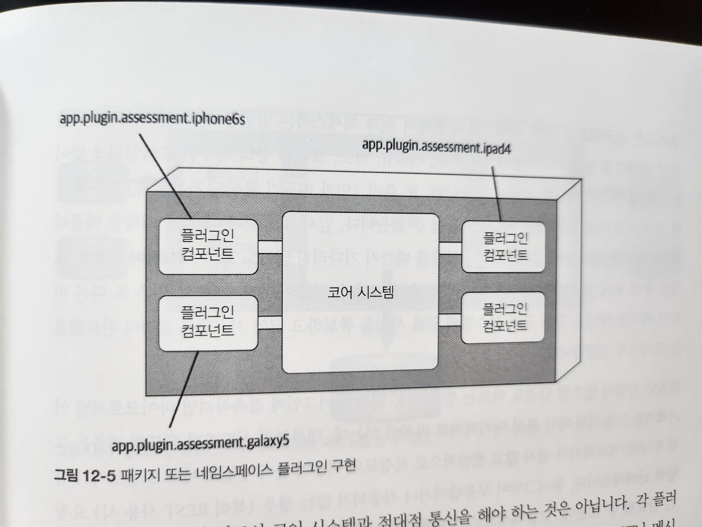

# 12. 마이크로커널 아키텍처 스타일

- 이미 수십 년 전에 만들어진 마이크로커널 아키텍처(micro kernel architecture)는 오늘날에도 널리 쓰이고 있습니다
- 이 아키텍처 스타일은 단일 모놀리식 배포 단위로 패키징해서 다운로드 및 설치가 가능하며, 보통 고객 사이트에서 서드파티 제품으로 설치되는 제품 기반 애플리케이션에 적합합니다

## 12.1 토폴로지

- 마이크로 커널 아키텍처 스타일은 코어 시스템과 플러그인 컴포넌트 라는 두 가지 아키텍처 요소로 구성된 비교적 단순한 모놀리식 아키텍처입니다
- 애플리케이션 로직은 독립적인 플러그인 컴포넌트와 기본 코어 시스템에 골고루 분산되어 확장성, 적응성, 애플리케이션 기능 분리, 커스텀 처리 등을 수행합니다


- 그림 12-1. 마이크로커널 아키텍처의 기본 컴포넌트

### 12.1.1 코어 시스템

- 코어 시스템은 시스템을 실행시키는 데 필요한 최소한의 기능으로 정의합니다
- 예: 이클립스 IDE
  - 코어 시스템: 파일을 열고, 텍스트를 고치고, 다시 파일을 저장하는 기본적인 텍스트 에디터
  - 플러그인을 추가해야 비로소 쓸만한 제품이 된다


- 그림 12-2 마이크로커널 아키텍처 코어 시스템의 변형들


- 유저 인터페이스 변형들

### 12.1.2 플러그인 컴포넌트

- 플러그인 컴포넌트는 특수한 처리 로직, 부가 기능, 그리고 코어 시스템을 개선/확장하기 위한 커스텀 코드가 구현된 스탠드얼론 컴포넌트입니다


- 그림 12-4. 공유 라이브러리 플러그인 구현



- 그림 12-5 패키지 또는 네임스페이스 플러그인 구현


- 그림 12-6. REST를 이용한 원격 플러그인 액세스

  - 플러그인 컴포넌트가 반드시 코어 시스템과 점대점 통신을 해야 하는 것은 아닙니다
  - 각 플러그인을 스탠드얼론 서비스(또는 컨테이너에 구현한 마이크로서비스)로 만들어 REST나 메시징 등 다른 방법으로 기능을 호출하는 방법도 있습니다
    - 이것은 언뜻보기에 전체 확장성을 개선하는 좋은 방법 같지만, [그림 12-6]에서 보다시피 이 토폴로지는 코어 시스템이 모놀리식이므로 여전히 단일 아키텍처 퀀텀입니다
    - 즉, 모든 요청이 무조건 코어 시스템을 거쳐 각 플러그인 서비스로 흘러가는 구조입니다

- 단점
  - 원격 플러그인에 접속하려면 마이크로커널 아키텍처를 모놀리식이 아닌 분산 아키텍처로 바꿔야 하는데, 대부분의 서드파티 온프렘 제품은 그렇게 구현/배포하기가 쉽지 않고 전반적으로 복잡도와 비용이 높아져 전체 배포 토폴로지가 상당히 난해해집니다


- 그림 12-7. 플러그인 컴포넌트에 자체 데이터 저장소를 둘 수 있다

## 12.2 레지스트리

- 코어 시스템은 어떤 플러그인을 사용할 수 있는지, 그 플러그인 가져오려면 어떻게 해야 하는지 알고 있어야 합니다
- 가장 일반적인 구현 방법은 `플러그인 레지스트리를 경유`하는 것입니다
- 이 레지스트리에는 플러그인 명칭, 데이터 계약, (플러그인에서 코어 시스템으로 접속하는 방법별) 세부 원격 액세스 프로토콜 등 각 플러그인 모듈에 관한 정보가 있습니다

```Java
Map<String, String> registry = new HashMap<>();
static {
  // 점대점 액세스 예제 코드
  registry.put("iPhone6s", "Iphone6sPlugin");

  // 메시징 예제 코드
  registry.put("iPhone6s", "Iphone6s.queue");

  // REST형 예제 코드
  registry.put("iPhone6s", "http://atlas:443/assess/iphone6s");
}
```

## 12.3 계약

- 플러그인 컴포넌트와 코어 시스템 간 계약 : 컴포넌트의 도메인 단위로 표준화되어 있다
- 플러그인 컴포넌트가 수행하는 기능 및 입출력 데이터는 계약에 명시되어 있습니다

## 12.4 실제 용례

- 이클립스 IDE, PMD, Jira, Jenkins 등
  - 많은 소프트웨어 개발/릴리스 도구가 마이크로 커널 아키텍처를 사용해서 개발됐습니다
- 크롬, 파이어폭스 같은 웹 브라우저도 마이크로 커널 아키텍처를 응용한 제품으로, 각종 뷰어와 플러그인을 장착하면 코어 시스템에 해당하는 기본 브라우저에 없는 부가 기능을 덧붙일 수 있습니다

## 12.5 아키텍처 특성 등급


- 그림 12-8. 마이크로커널 아키텍처 특성 등급표
- 강점
  - 단순성과 전체 비용
- 단점

  - 모놀리식 배포 -> 탄력성, 내고장성, 확장성이 문제가 될 수 있음

- 특징
  - 마이크로커널 아키텍처는 도메인 분할, 기술분할이 모두 가능한 유일한 아키텍처 스타일입니다
