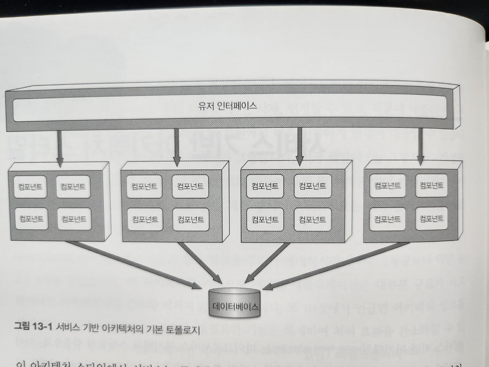
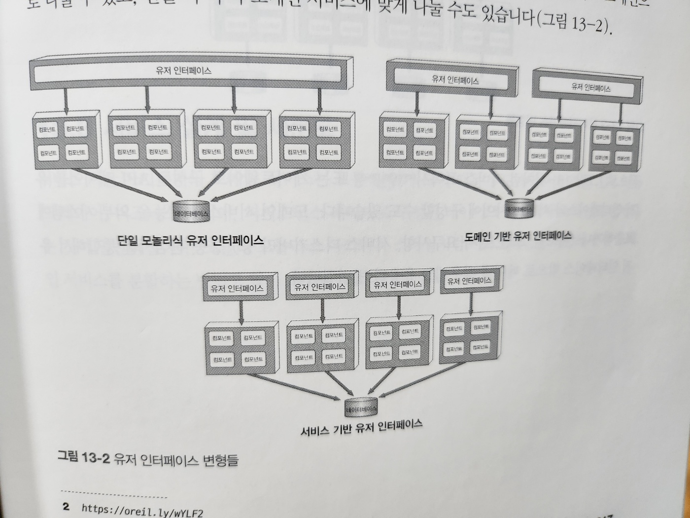
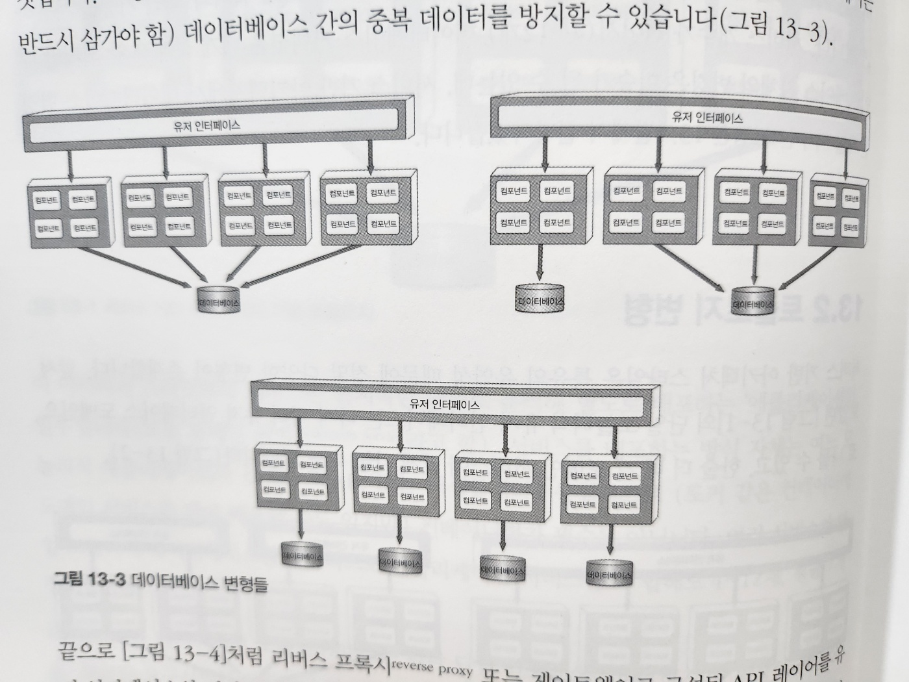
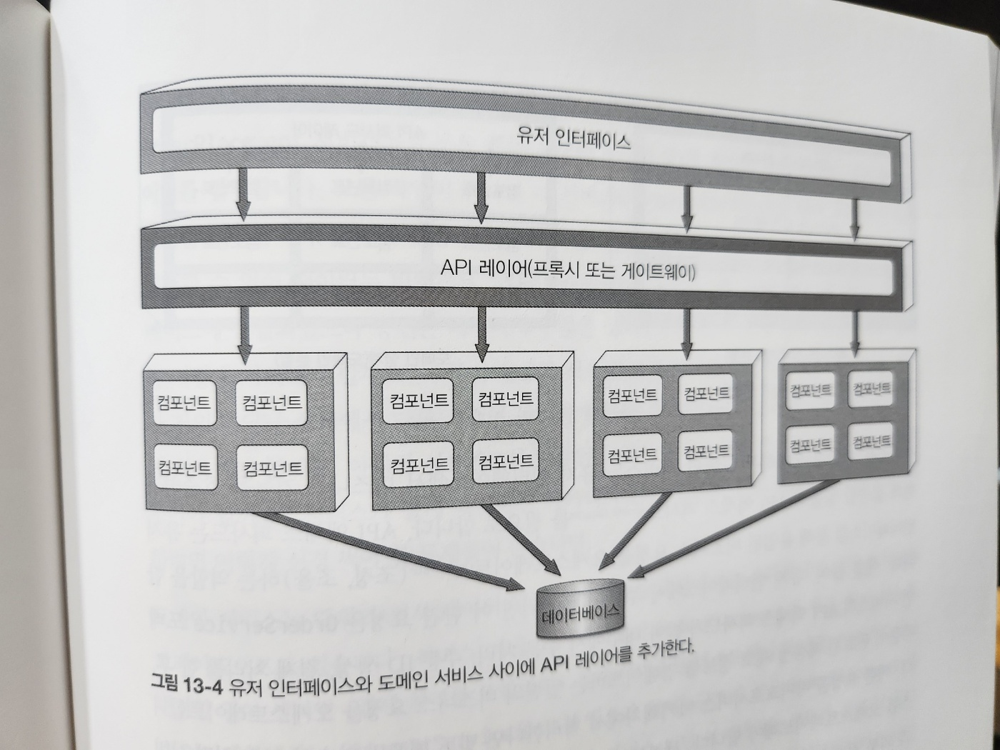
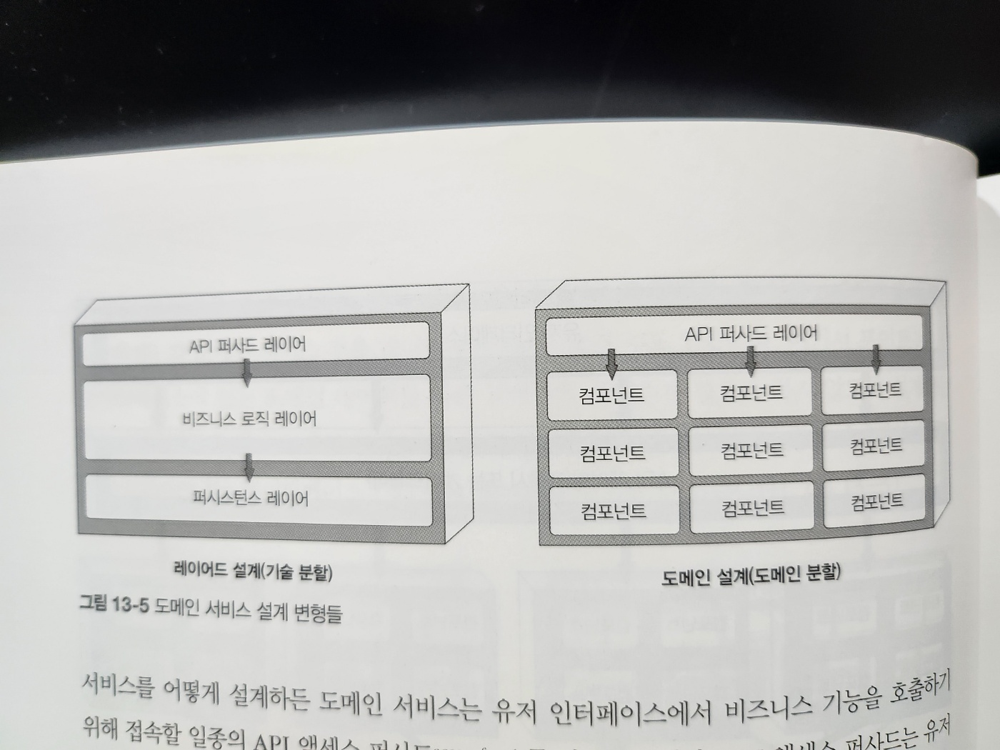
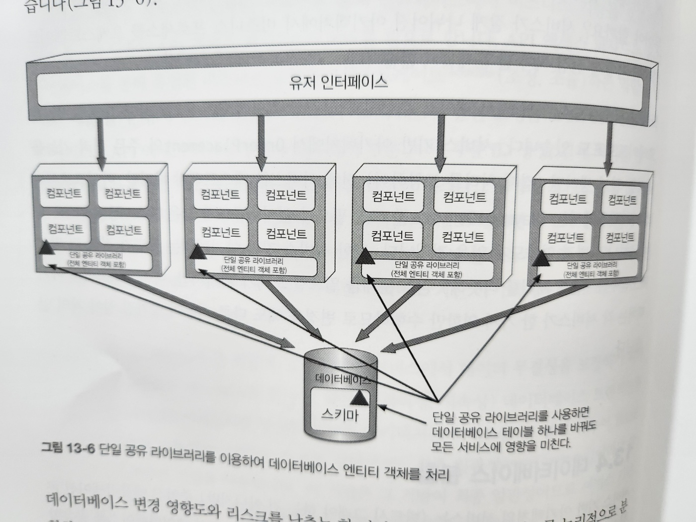
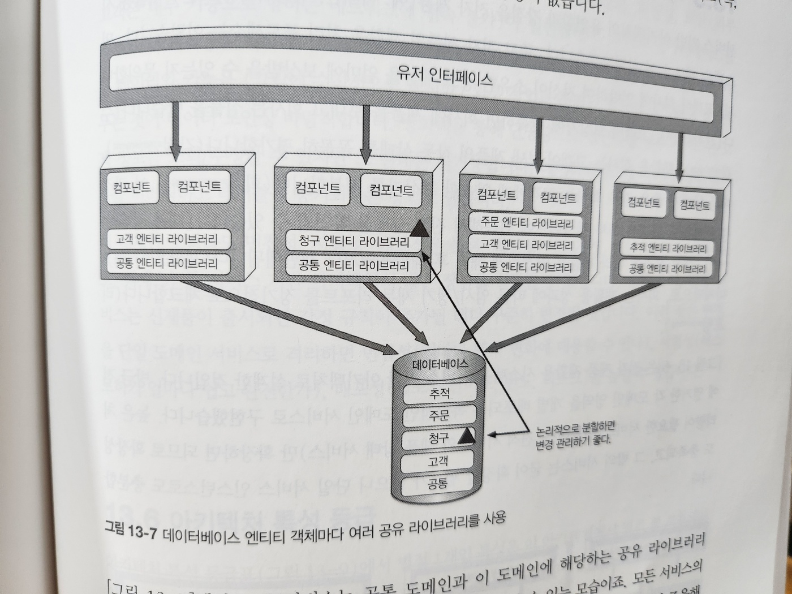
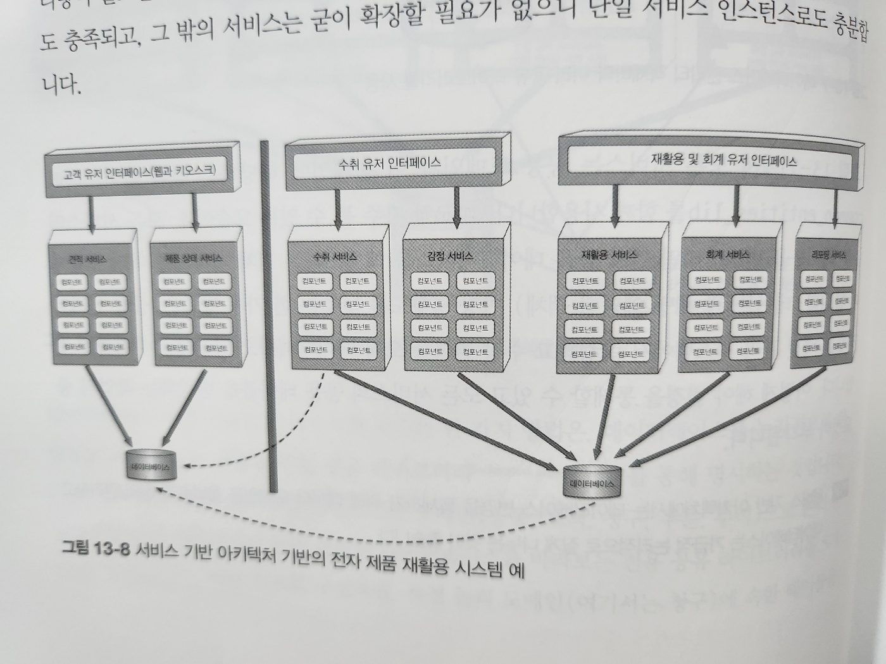
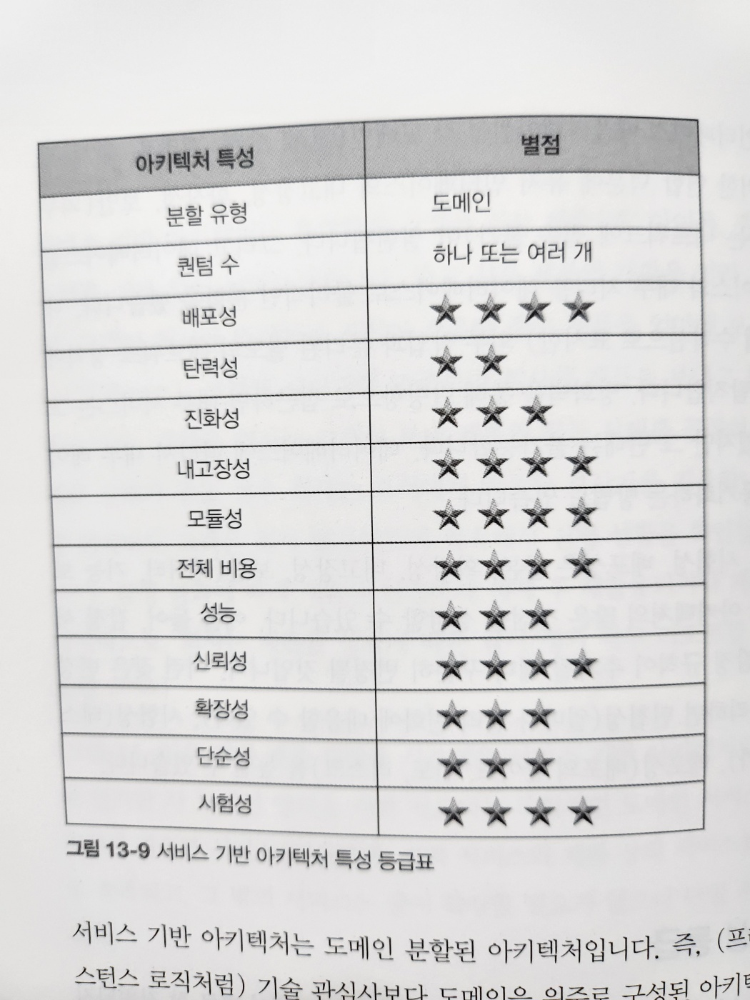
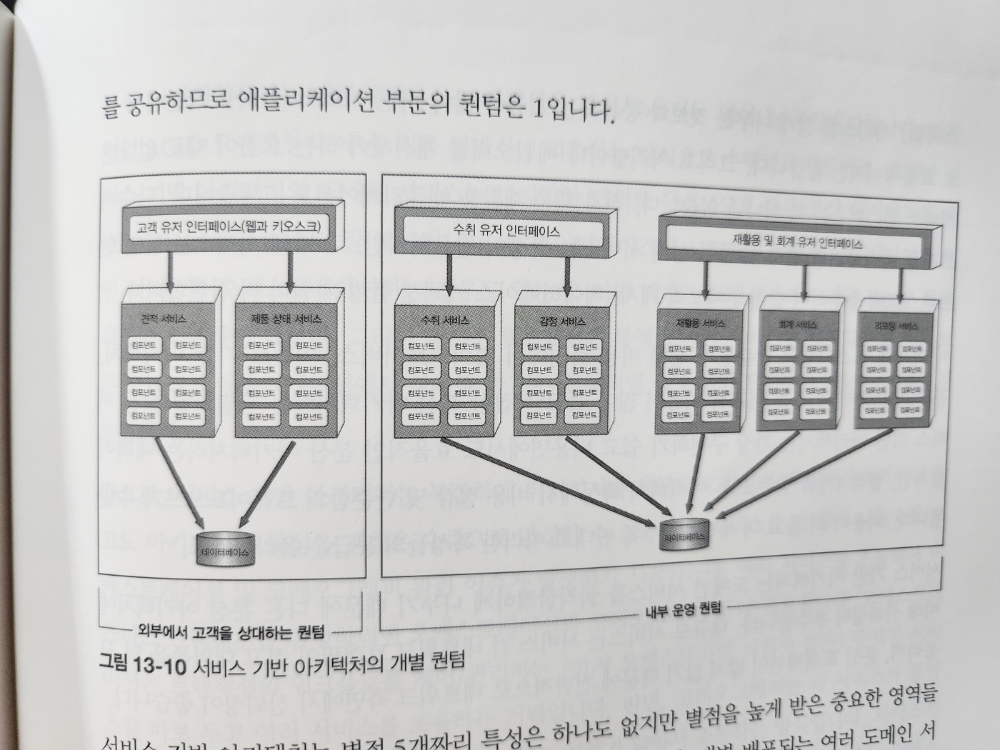

# 13. 서비스 기반 아키텍처 스타일

- 서비스 기반 아키텍처는 `마이크로서비스 아키텍처 스타일의 일종`으로, 아키텍처가 유연해서 가장 실용적인 아키텍처 스타일 중 하나입니다
- `분산형`
  - 서비스 기반 아키텍처(13장)
  - 이벤트 기반 아키텍처(14장)
  - 공간 기반 아키텍처(15장)
  - 서비스 지향 아키텍처(16장)
  - 마이크로서비스 아키텍처(17장)
- 분산 아키텍처이지만 비교적 덜 복잡하고 비용이 많이 들지 않아서 많은 비즈니스 관련 애플리케이션에 널리 채택된 아키텍처입니다

## 13.1 토폴로지

- 각각 따로 배포된 유저 인터페이스와 원격 서비스, 그리고 모놀리스 데이터베이스로 이루어진 대규모 `분산 레이어 구조`입니다

- 이 아키텍처 스타일에서 서비스는 큼지막한 단위로 분리해 별도로 배포하는 '애플리케이션의 일부'입니다

  - 서비스를 배포하는 방식 자체는 모놀리식 애플리케이션과 동일하므로 컨테이너화가 필수는 아닙니다
  - 여러 서비스가 단일 모놀리식 데이터베이스를 공유하므로 애플리케이션 서비스는 다 합해도 4~12개, 평균 7개 정도입니다

- 서비스 기반 아키텍처의 도메인 서비스는 각각 단일 인스턴스로 배포하지만,
  확장성, 내고장성, 처리량 요구사항에 따라 인스턴스를 여럿 둘 수도 있습니다
  - 서비스 인스턴스를 다수 생성하여 배포하려면 유저 인텅페이스로 유입된 요청이 가용한 서비스 인스턴스로 흘러갈 수 있도록 유저 인터페이스와 도메인 서비스 간의 부하 분산 기능이 필요합니다
- 서비스는 원격 액세스 프로토콜로 유저 인터페이스 외부에서 접속할 수 있습니다
  - 프로토콜은 일반적으로 REST를 많이 쓰지만, 메시징, 원격 프로시저 호출(RPC) 도 가용 가능합니다
  - 유저 인터페이스는 프록시나 게이트웨이로 구성된 API 레이어를 통해 서비스에 접속할 수 있지만, 대개는 서비스 로케이터 패턴에 따라 유저 인터페이스, API 게이트웨이, 프록시에 내장된 유저 인터페이스를 직접 액세스합니다
- 서비스 기반 아키텍처는 중앙 공유 데이터베이스를 사용한다는 특징이 중요합니다
  - 따라서 서비스는 기존 모놀리식 레이어드 아키텍처와 동일한 방ㅎ식으로 SQL 쿼리와 조인 기능을 사용하면 됩니다
  - 서비스 개수가 적어서(4~12개) 데이터베이스 커넥션은 문제가 안되지만, 데이터베이스 자체의 변경은 이슈가 될 수 있는데, 서비스 기반 아키테처에서 데이터베이스 변경 문제를 다루는 기법은 13.4절에서 설명하겠습니다

## 13.2 토폴로지 변형

- 서비스 기반 아키텍처 스타일은 특유의 유연성 때문에 정말 다양한 변형이 존재합니다

- 그림 13-2. 유저 인터페이스 변형들

- 그림 13-3. 데이터베이스 변형들

- 그림 13-4. 유저 인터페이스와 도메인 서비스 사이에 API 레이어를 추가한다

## 13.3 서비스 설계 및 세분도

- 그림 13-5. 도메인 서비스 설계 변형들
- 서비스 기반 아키텍처의 도메인 서비스는 보통 단위가 크기 때문에 도메인 서비스를 API 퍼사드 레이어, 비즈니스 레이어, 퍼시스턴스 레이어로 구성된 레이어드 아키텍처 스타일로 설계하는 것이 일반적입니다
  - 모듈러 모놀리스 아키텍처 스타일 처럼 서브도메인을 이용해서 각 도메인 서비스를 분할하는 방법도 많이 쓰입니다(그림 13-5)
- API 퍼사드 레이어는 일련의 비즈니스 요청을 오케스트레이트합니다
  - e.g. 주문 받아서 처리, 주문 ID 생성, 결제 처리 이후 주문이 완료된 제품별 재고 정보를 업데이트
  - 세분도 관점에서 보면,
    - `내부 클래스 수준의 오케스트레이션` : 서비스 기반 아키텍처
    - `외부 서비스의 오케스트레이션` : 마이크로서비스
- `도메인 서비스`는 `데이터 무결성을 보장`하기 위해 커밋/롤백이 수반되는 `ACID 데이터베이스 트랜잭션`을 사용하지만
- `마이크로서비스`처럼 분산도가 높은 아키텍처는 서비스를 더 잘게 나누어 `BASE 트랜잭션`(기본적 가용성, 소프트 상태, 최종 일관성)이라고 알려진
  분산 트랜잭션 기법을 사용합니다
  - 이 기법은 그 기반이 최종 일관성이므로 서비스 기반 아키텍처의 ACID 트랜잭션 레벨의 데이터 무결성은 지원하지 않습니다

## 13.4 데이터베이스 분할

- 그림 13-6. 단일 공유 라이브러리를 이용하여 데이터베이스 엔티티 객체를 처리

- 그림 13-7. 데이터베이스 엔티티 객체마다 여러 공유 라이브러리를 사용

## 13.5 아키텍처 예시

- 그림 13-8. 서비스 기반 아키텍처 기반의 전자 제품 재활용 시스템 예

## 13.6 아키텍처 특성 등급

- 그림 13-9. 서비스 기반 아키텍처 특성 등급표

- 그림 13-10. 서비스 기반 아키텍처의 개별 퀀텀

## 13.7 언제 이 아키텍처 스타일을 사용하는가
