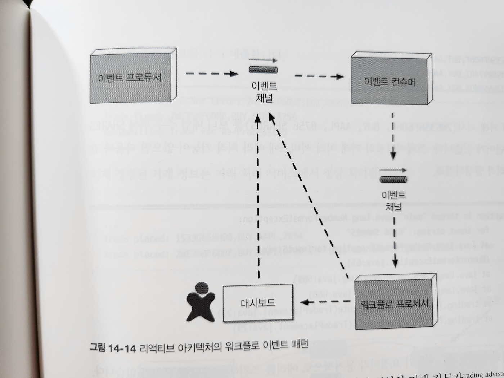

# 14. 이벤트 기반 아키텍처 스타일

- 그림 14-1. 요청 기반 모델

## 14.1 토폴로지

## 14.2 브로커 토폴로지

- 14-2. 브로커 토폴로지

- 그림 14-3. 알림 이벤트가 발송되지만 무시된다

- 그림 14-4. 브로커 토폴로지 예

| 장점                         | 단점            |
| ---------------------------- | --------------- |
| 이벤트 프로세서가 디커플링됨 | 워크플로 제어   |
| 확장성 높음                  | 에러 처리       |
| 응답성 우수함                | 복구성          |
| 성능 우수함                  | 재시작 능력     |
| 내고장성 뛰어남              | 데이터 비일관성 |

- 표 14-1. 브로커 토폴로지 장단점

## 14.3 중재자 토폴로지

- 그림 14-5. 중재자 토폴로지

- 그림 14-6. 이벤트를 적합한 이벤트 중재자에게 위임한다

- 그림 14-7. 5단계로 주문을 처리하는 중재자 예

- 그림 14-8. 중재자 1단계

- 그림 14-9. 중재자 2단계

- 그림 14-10. 중재자 3단계

- 그림 14-11. 중재자 4단계

- 그림 14-12. 중재자 5단계

| 장점          | 단점                       |
| ------------- | -------------------------- |
| 워크플로 제어 | 이벤트 프로세서가 커플링됨 |
| 에러 처리     | 확장성 낮음                |
| 복구성        | 성능 낮음                  |
| 재시작 능력   | 내고장성 좋지 않음         |
| 데이터 일관성 | 워크플로 모델링 복잡함     |

## 14.4 비동기 통신

- 그림 14-13. 동기 통신과 비동기 통신

## 14.5 에러 처리

- 그림 14-14. 리액티브 아키텍처 워크플로 이벤트 패턴

- 그림 14-15. 워크플로 이벤트 패턴의 에러 처리

## 14.6 데이터 소실 방지

- 그림 14-16. 이벤트 기반 아키텍처에서 데이터가 소실될 수 있는 지점

- 그림 14-17. 이벤트 기반 아키텍처에서 데이터 소실을 방지하는 방법

## 14.7 브로드캐스팅

- 그림 14-18. 이벤트를 다른 프로세서에 브로드캐스팅

## 14.8 요청-응답

- 그림 14-19. 요청-응답 메시지 처리

- 그림 14-20. 상관 ID를 이용한 요청-응답 메시지 처리

- 그림 14-21. 임시 큐를 이용한 요청-응답 메시지 처리

## 14.9 요청 기반이냐, 이벤트 기반이냐

| 요청 기반보다 좋은 점              | 장단점                               |
| ---------------------------------- | ------------------------------------ |
| 동적인 유저 콘텐츠의 응답성이 좋음 | 최종 일관성만 지원 됨                |
| 확장성, 탄력성이 우수함            | 처리 흐름을 제어하기 곤란함          |
| 민첩성과 변화 관리가 우수함        | 이벤트 흐름의 결과를 예측하기 어려움 |
| 적응성과 확장성이 뛰어남           | 테스팅, 디버깅이 어려움              |
| 응답성과 성능이 좋음               |                                      |
| 실시간 의사 결정이 가능함          |                                      |
| 상황 인지에 따른 반응성이 좋음     |                                      |

## 14.10 하이브리드 이벤트 기반 아키텍처

## 14.11 아키텍처 특성 등급

- 그림 14-22. 이벤트 기반 아키텍처 특성 등급표
