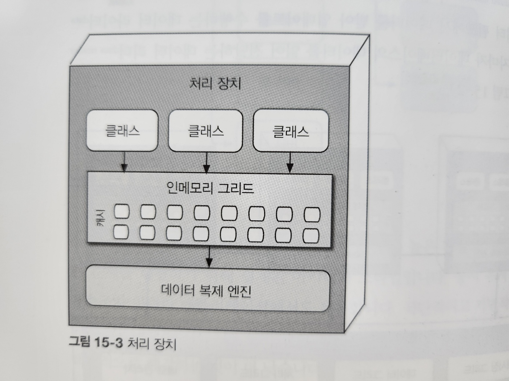
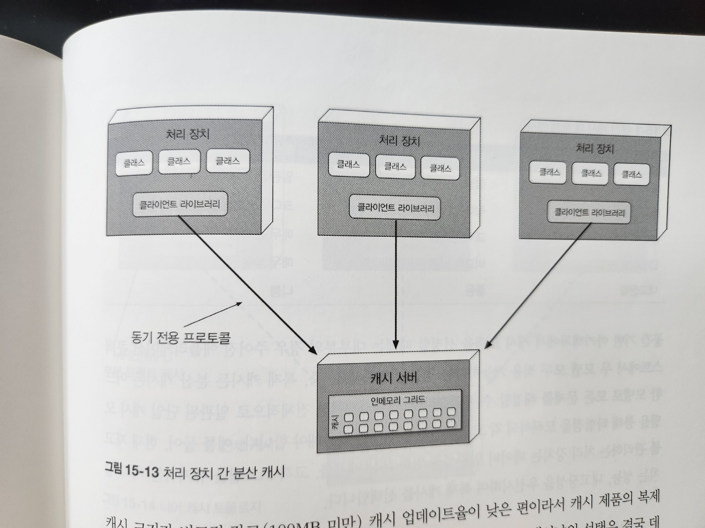

# 15. 공간 기반 이키텍처 스타일

## 15.1 토폴로지

### 15.1.1 처리 장치

### 15.1.2 가상 미들웨어

#### 메시징 그리드

#### 데이터 그리드

#### 처리(processing) 그리드

#### 배포 관리자

### 15.1.3 데이터 펌프

### 15.1.4 데이터 라이터

### 15.1.5 데이터 리더

## 15.2 데이터 충돌

## 15.3 클라우드 대 온프레미스 구현

## 15.4 복제 캐시 대 분산 캐시

#### 표 15-1. 분산 캐시 대 복제 캐시

| 결정 기준     | 복제 캐시     | 분산 캐시    |
| ------------- | ------------- | ------------ |
| 최적화        | 성능          | 일관성       |
| 캐시 크기     | 작다(<100MB)  | 크다(>500MB) |
| 데이터 유형   | 비교적 정적임 | 매우 동적임  |
| 업데이트 빈도 | 비교적 낮음   | 매우 높음    |
| 내고장성      | 좋음          | 나쁨         |

## 15.5 니어 캐시

## 15.6 구현 예시

### 15.6.1 콘서트 티켓 판매 시스템

### 15.6.2 온라인 경매 시스템

## 15.7 아키텍처 특성 등급

