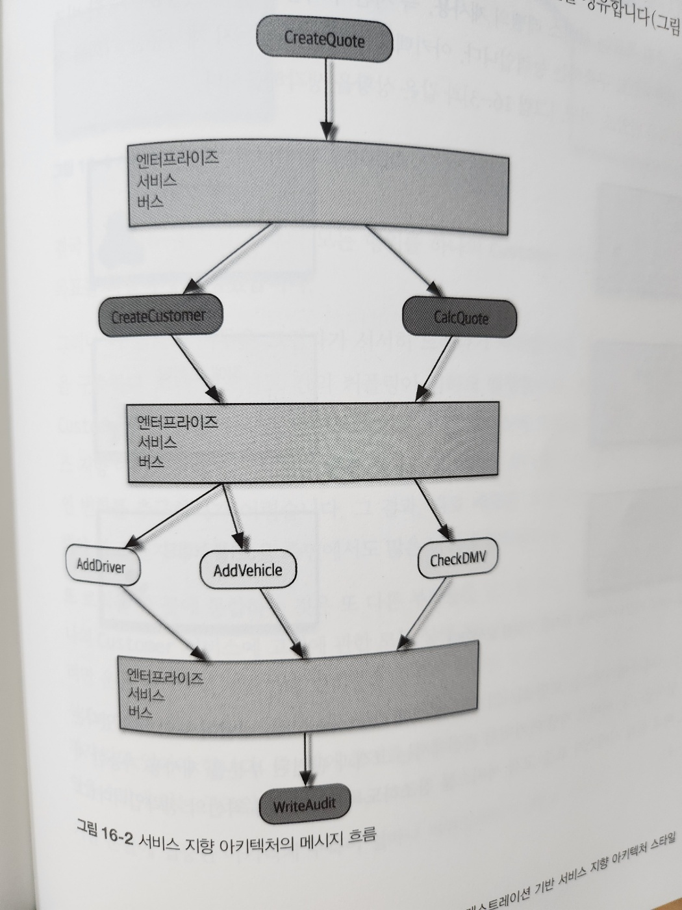

# 16. 오케스트레이션 기반 서비스 지향 아키텍처 스타일

## 16.1 역사와 철학

## 16.2 토폴로지

## 16.3 택소노미

### 16.3.1 비즤스 서비스

### 16.3.2 엔터프라이즈 서비스

### 16.3.3 애플리케이션 서비스

### 16.3.4 인프라 서비스

### 16.3.5 오케스트레이션 엔진

### 16.3.6 메시지 흐름

## 16.4 재사용 그리고 커플링

## 16.5 아키텍처 특성 등급

