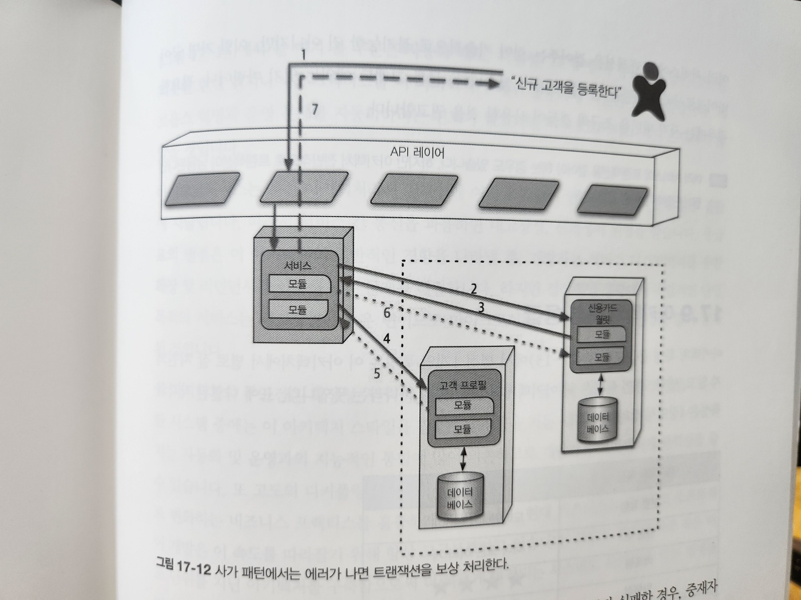

# 17. 마이크로서비스 아키텍처 스타일

## 17.1 역사

## 17.2 토폴로지

## 17.3 분산

## 17.4 경계 콘텍스트

### 17.4.1 세분도

#### 목적

#### 트랜잭션

#### 코레오 그래피

### 17.4.2 데이터 격리

## 17.5 API 레이어

## 17.6 운영 재사용

## 17.7 프런트엔드

## 17.8 통신

#### 프로토콜 인지

#### 이종

#### 상호 운용성

### 17.8.1 코레오그래피와 오케스트레이션

### 17.8.2 트랜잭션과 사가

## 17.9 아키텍처 특성 등급

## 17.10 더 읽을거리
