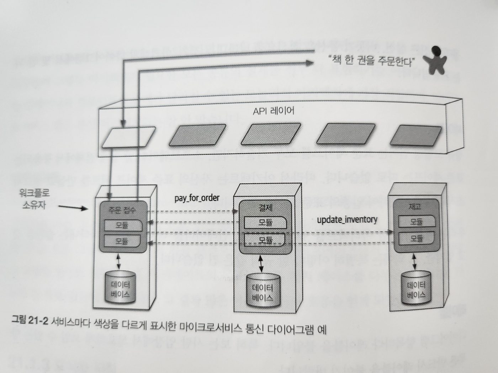
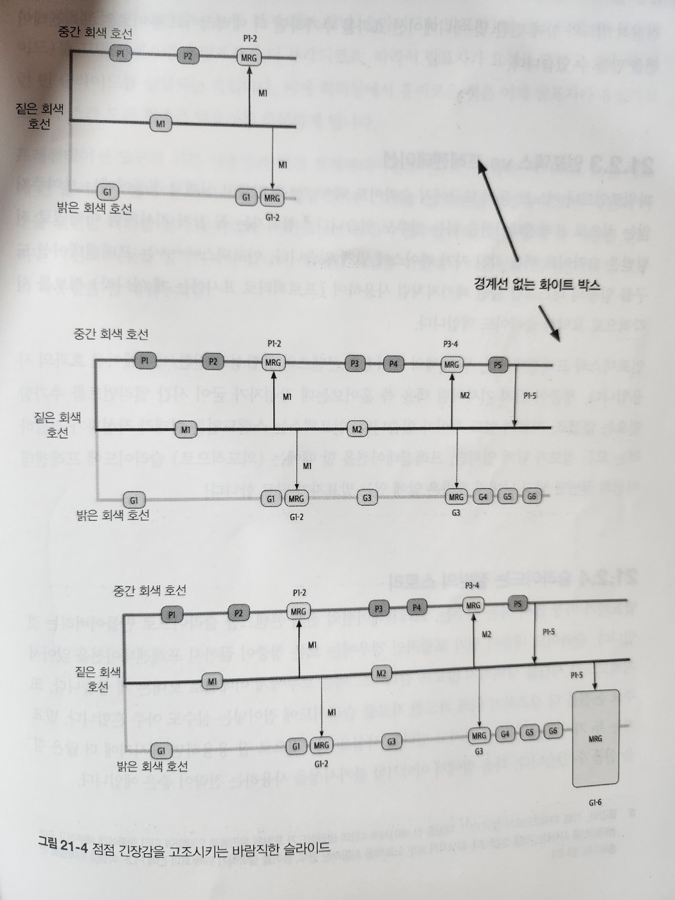

# 21. 아키텍처 도식화 및 프레젠테이션

## 21.1 도식화

### 21.1.1 도구

- 어떤 도구든 상관없지만 아래 기능이 있는지 확인
  - 레이어
  - 템플릿
  - 마그넷

### 21.1.2 도식화 표준: UML, C4, ArchiMate

#### UML

#### C4

- Context
- Container
- Component
- Class

#### ArchiMate

- Architecture-Animate의 합성어
- 비즈니스 도메인을 중심으로 아키텍처를 기술, 분석, 시가화하는 오픈 소스 엔터프라이즈 아키텍처 모델링 언어

### 21.1.3 도식화 지침

- 자신의 스타일을 구축하고 스스로 효과적이라고 생각한 프레젠테이션에서 자유롭게 다이어그램을 차용할 수 있어야 합니다

- 제목
- 선
- 셰이프(모양)
- 레이블(라벨)
- 색상

- 그림 21-2. 서비스마다 색상을 다르게 표시한 마이크로서비스 통신다이어그램 예

## 21.2 프레젠테이션

### 21.2.1 시간 조작

### 21.2.2 점진적 빌드

- 그림 21-4. 점점 긴장감을 고조시키는 바람직한 슬라이드

### 21.2.3 인포덱스 vs 프레젠테이션

### 21.2.4 슬라이드는 절반의 스토리

### 21.2.5 불가시성
