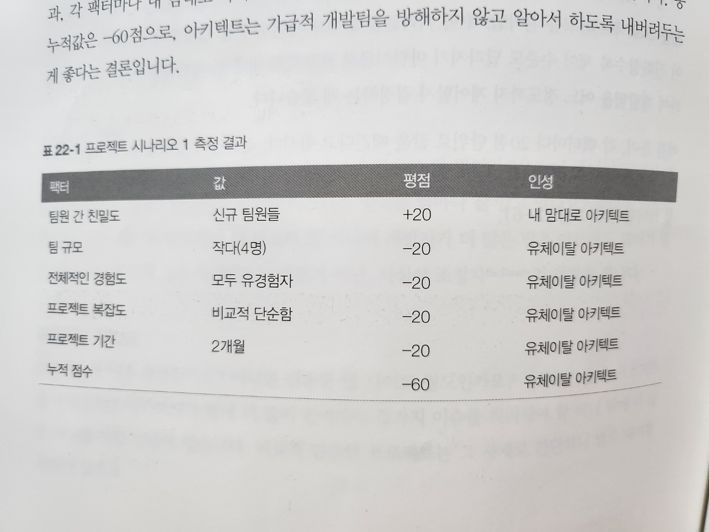
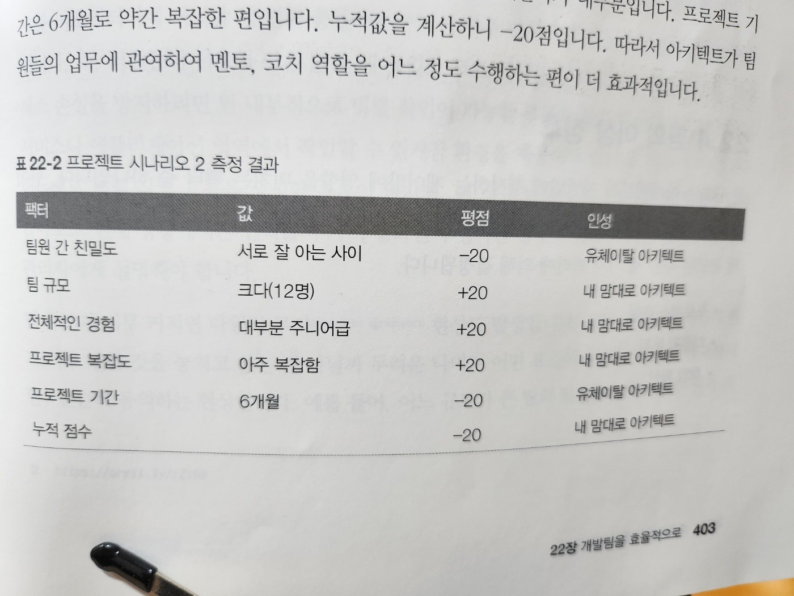

# 22. 개발팀을 효율적으로

## 22.1 팀 경계

## 22.2 아키텍트 성향

### 22.2.1 내 맘대로 아키텍트

### 22.2.2 유체이탈 아키텍트

### 22.2.3 유능한 아키텍트

## 22.3 얼마나 제어해야 하나?

- 제어도를 결정할 5개 팩터
  - 팀원 간 친밀도
  - 팀 규모
  - 전체적인 경험
  - 프로젝트 복잡도
  - 프로젝트 기간

- 표 22-1. 프로젝트 시나리오 1 측정 결과

- 표 22-2. 프로젝트 시나리오 2 측정 결과

## 22.4 팀의 이상 징후

- 효율적의 개발팀의 규모 측정
  - 프로세스 손실
  - 다원적 무지
  - 책임 확산

## 22.5 체크리스트 활용

### 22.5.1 개발자 코드 완성도 체크리스트

### 22.5.2 단위/기능 테스트 체크리스트

### 22.5.3 소프트웨어 릴리스 체크리스트

## 22.6 지침 제시
