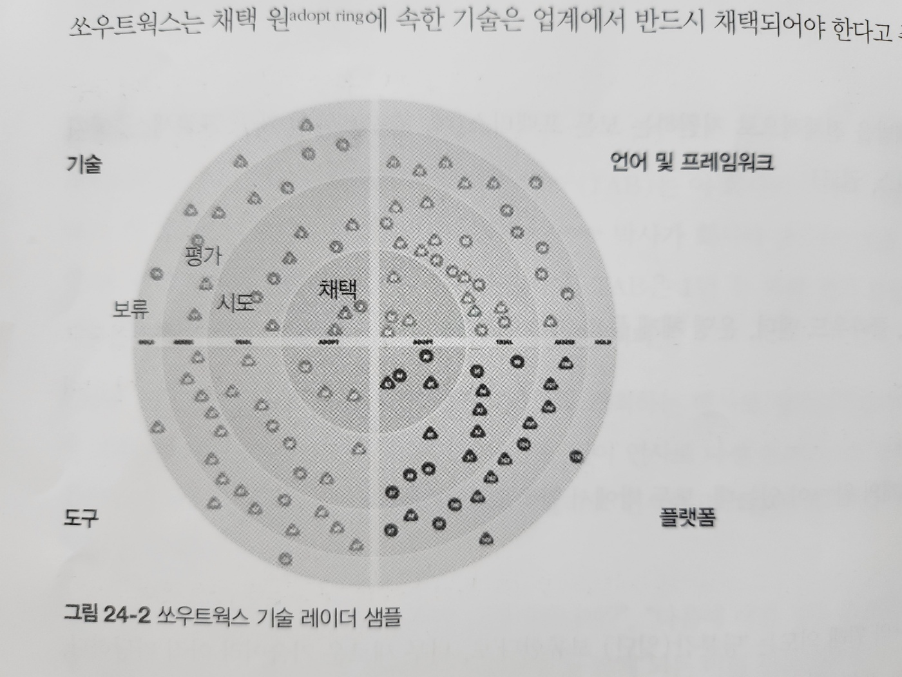

# 24. 커리어패스 개발

## 24.1 20분 규칙

- 아키텍트로서 커리어를 유지하기 위해 새로운 것을 배우거나 특정 주제를 깊이 파고드는 시간을 매일 최소 20분은 할애하라는 규칙입니다

## 24.2 개인 레이더 개발

### 24.2.1 쏘우트웍스 기술 레이더

#### 분면

- 도구
- 언어와 프레임워크
- 기술
- 플랫폼

#### 원

- 보류
- 평가
- 시도
- 채택

- 그림 24-2. 쏘우트웍스 기술 레이더 샘플

### 24.2.2 오픈소스 시각화 비트

## 24.3 소셜 미디어 활용

## 24.4 종언

- 항상 배우고, 항상 연습하고, 아키텍처를 설계해보시길!
