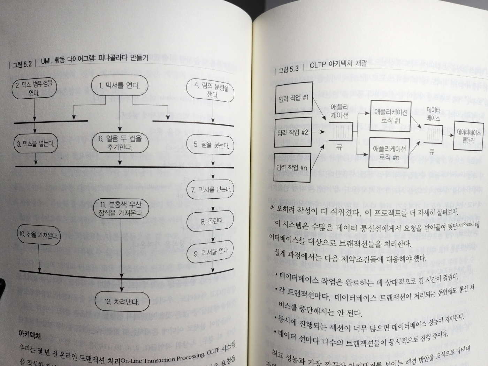
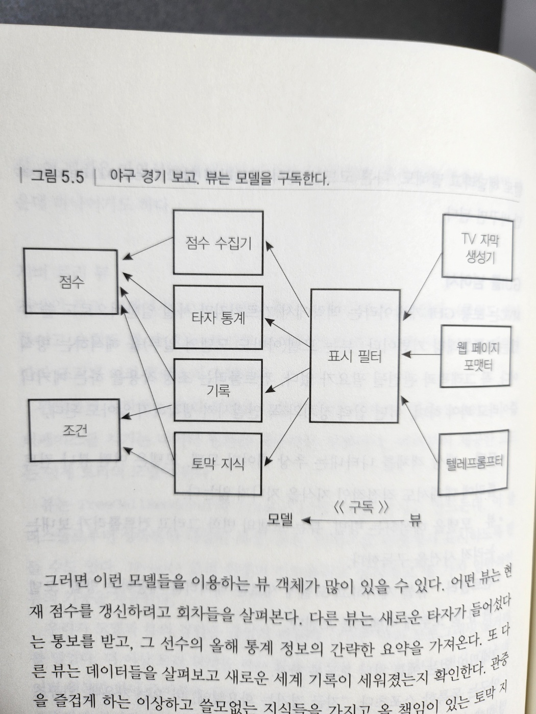
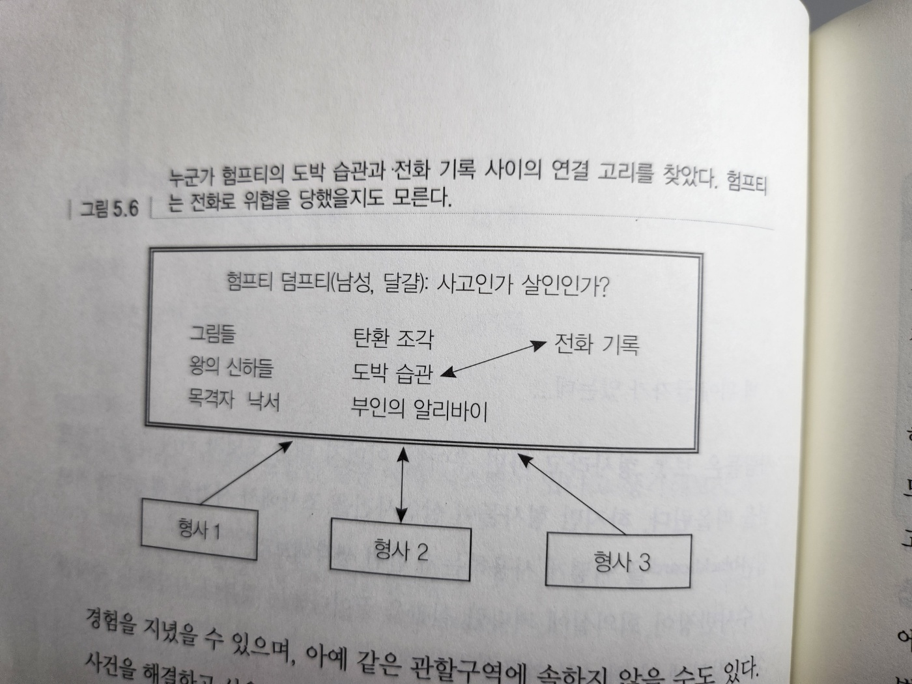

# 5. 구부러지거나 부러지거나

- 현대의 빠른 변화속도에 맞추기 위해서는 가능한 느슨하고 유연한 코드를 작성하기 위해 노력해야 한다
  - 유연성, 적응성
- 이 장에서는 되돌릴 수 있는 의사 결정을 내릴 수 있는 구체적인 방법에 대해 설명한다
- 결합도 줄이기(decoupling)와 디미터 법칙
  - 모듈간의 의존 정도를 의미하는 결합도에 대해 살펴볼 필요가 있다
  - 서로 다른 개념들을 분리하여 결합도를 줄이는 방법에 대해 알아본다
- 메타프로그래밍
  - 유연함을 유지하는 좋은 방법 : 가능한 적은 양의 코드를 작성하는 것
  - 세부사항을 완전히 코드 밖으로 옮기는 방법에 대해 설명한다
    - 세부사항을 안전하고도 쉽게 변경할 수 있다
- 시간적 결합
  - 결합도와 관련하여 시간을 두 측면에서 살펴본다
  - 유연하고 싶다면 시간상의 결합을 피해야 한다
- 단지 뷰일 뿐이야
  - 뷰와 모델의 결합도를 줄이는 방법을 설명한다
- 칠판
  - 모듈들이 데이터를 동기적, 비동기적으로 교환할 수 있는 만남의 장소를 마련해 줌으로써 모듈간 결합도를 획기적으로 줄이는 기술

## 26. 결합도 줄이기와 디미터 법칙

- '직교성'과 '계약에 의한 설계'에서 부끄럼 타는(shy) 코드를 작성하는 것이 이롭다고 했다
- '부끄럽 타는'이란 자신을 남에게 속속들이 드러내지 말고, 너무 많은 사람과 상호작용하지 말라는 두 가지 의미를 모두 내포한다
  - 스파이, 혁명가들은 종종 세포(cell)라 불리는 작은 그룹으로 조직을 만든다
  - 각 세포의 구성원은 같은 세포에 속한 구성원만 알 수 있으며, 다른 세포에 누가 있는지에 대해서는 전혀 모른다
  - 하나의 세포가 발각된다 하더라도, 다른 세포에 있는 사람들은 안전하다
  - 세포 간의 상호작용을 제거함으로써 모두를 보호하는 것이다
- 코드를 세포(모듈, module)로 구성하고, 이들 간의 상호작용을 제한하라
  - 그러면 한 모듈이 변경되거나 교체된다 하더라도 다른 모듈들은 변경 없이 수행될 수 있을 것이다

### 결합도 줄이기

- 얼마나 많은 모듈과 상호작용하는지, 어떻게 상호작용을 하는지에 대해 주의를 기울일 필요가 있다
- 집 리모델링
  - 주 계약자와 계약
  - 주 계약자는 직접 벽돌을 나르지 않고 각각의 역할을 맡은 하도급자와 다시 계약
  - 여러분은 하도급자와 직접 부딛힐 일도, 이들로 인해 골머리 썩을 일도 없게 된다
- 소프트웨어에서도 이와 같은 모델을 따르기를 권한다
  - 어떤 객체에 특정 서비스를 요청했을 때 이 요청을 바로 처리해주기 바란다
  - 제 3의 객체를 넘겨받아 이미 요청한 서비스를 가지고 이러쿵저러쿵 하고 싶지는 않을 것이다
- 예. 과학 기록 정보를 그래프로 표현하는 클래스 작성
  - 데이터 기록기는 세계 곳곳에 분산
    - 각 기록기 객체는 객체가 위치한 곳의 위치와 시간대를 알려주는 장소 객체를 가지고 있다
  - 사용자가 기록기를 선택해서 올바른 시간대가 표시된 데이터 그래프를 보게 하고 싶다면, 다음과 같은 코드를 작성할 수 있을 것이다

```java
// bad
public void plotDate(Date aDate, Selection aSelection) {
  TimeZone tz = aSelection.getRecorder().getLocation().getTimeZone();
  // ...
}
```

- 하지만 이렇게 되면 그래프를 그리는 루틴이 불필요하게 Selection, Recorder, Location 이라는 3개의 클래스와 결합되게 된다
  - 이런 방식으로 코딩하면 우리의 클래스가 의존하게 되는 클래스의 숫자가 대폭 증가하게 된다
- 왜 의존의 증가가 나쁠까?
  - 시스템 어딘가의 무관한 변화가 여러분의 코드에 영향을 미칠 수 있는 위험이 커지기 때문이다
- 예를 들어 Location 클래스가 더 이상 TimeZone을 직접 포함하지 않도록 수정했다면, 여러분 역시 코드를 수정해 주어야 한다
  - 앞의 코드와 같이 직접 위계 구조를 헤집고 다니지 말고, 필요한 정보는 직접 물어보도록 한다

```java
// good
public void plotDate(Date aDate, TimeZone aTimeZone) {
  // ...
}

plotDate(someDate, someSelection.getTimeZone());
```

- Selection에 메서드를 추가하여 직접 시간대를 얻을 수 있도록 하였다
  - 그래프를 그리는 루틴은 시간대가 어디에서 왔는지에 대해서는 상관하지 않는다
- 직접 객체간의 관계를 헤집고 다닌다면 의존 관계가 조합적으로 폭발하게 될 수 있다

  - 이런 현상의 징후는 다양한 방식으로 나타난다
    - 1. 단위 테스트를 링크하기 위한 명령어가 테스트 프로그램 자체보다 긴 대규모 C 혹은 C++ 프로젝트
    - 2. 한 모듈의 '간단한' 수정이 이와 관계없는 모듈을 통해 시스템 전역에 퍼져나가는 경우
    - 3. 개발자가 수정한 부분이 시스템에 어떤 영향을 미칠지 몰라 코드의 수정을 두려워하는 경우

- 불필요한 의존이 많은 시스템은 유지보수하기 어렵고, 이로 인해 비용이 많이 들며 시스템 자체가 매우 불안정한 경향이 있다
  - 우리는 의존도를 최소화하기 위해 디미터 법칙을 사용하여 메서드, 함수를 설계한다

### 디미터 함수 법칙

- 프로그램에서 모듈간 결합도를 최소화
- 이 법칙은 한 객체가 제공하는 메서드에 접근하기 위해 또 다른 객체들을 통하는 것을 허용하지 않는다

```C++
class Demeter {
  private:
    A *a;
    Int func();
  public:
    // ...
    void example(B& b);
}
void Demeter::example(B& b) {
  C c;
  Int f = func(); // 자신
  b.invert(); // 메서드로 넘어온 인자
  a = new A();
  a->setActive(); // 자신이 생성한 객체
  c.print(); // 직접 포함하고 있는 객체
}
```

- 디미터 법칙은 객체의 모든 메서드는 다음에 해당하는 메서드만을 호출해야 한다고 말한다

> Tip 36. 모듈간의 결합도를 최소화하라.

### 확실히 차이를 낳는가?

- 디미터 법칙을 따른다면 정말 유지보수하기 좋은 코드를 생성할 수 있을까?
- 연구에 따르면 응답집합이 큰 클래스는 작은 클래스보다 에러를 발생시키기 쉽다고 한다

  - 이때 `응답집합`은 `클래스의 메서드가 직접 호출하는 함수의 수`를 의미한다

- 함수를 호출하는 클래스의 응답집합 크기를 줄일 수 있기 때문에 좀 더 에러가 적은 클래스들을 만들 수 있다
- 디미터 법칙 -> 위임 -> 성능저하와 메모리 과부화와 같은 문제를 야기할 수 있다 -> 애플리케이션에 맞게 장단점을 잘 고려해야한다
- 대규모 프로젝트에서는 물리적 결합도도 고려해야한다
  - 시스템을 구성하는 파일
  - 디렉터리
  - 라이브러리 간의 관계

### 관련 항목

- 직교성
- 가역성
- 계약에 의한 설계
- 단지 뷰일 뿐이야
- 실용주의 팀
- 가차 없는 테스트

## 27. 메타프로그래밍

- 세부사항은 우리의 깔끔한 코드를 어질러 놓는다
- 세부사항을 코드에서 몰아내라
  - 이렇게 함으로써 우리의 코드는 매우 설정 가능(configurable)하게 되고 '소프트'해진다
  - 즉 변화에 쉽게 적응할 수 있게 되는 것이다

### 동적 설정

- 시스템을 되도록 설정가능하게 만들기 바란다
- 배경 색, 프롬프트 텍스트 뿐 아니라 알고리즘의 선택, 사용할 데이터베이스 제품, 미들웨어 기술, 사용자 인터페이스 스타일 등 시스템의 심층까지
- 이런 아이템들은 통합하거나 엔지니어링하지 말고 설정 옵션으로 구현해야 한다

> Tip 37. 통합하지 말고 설정하라

- 메타데이터를 이용하여 변환 매개 변수, 사용자 선호사항, 설치 디렉터리와 같은 애플리케이션 설정 옵션을 기술하라

- 메타데이터란?
  - 데이터에 관한 데이터
  - 데이터베이스 스키마, 데이터 디렉터리 등
- 우리는 메타데이터를 좀 더 넓은 의미로 사용한다

  - 메타데이터는 애플리케이션을 기술하는 모든 데이터다
    - 애클리케이션이 어떻게 실행되어야 하고
    - 어떤 자원을 이용해야 하는지 등을 기술한다면 메타데이터라 할 수 있다

- 보통 메타데이터는 컴파일타임이 아닌 런타임에 접근, 사용된다

### 메타데이터 주도 애플리케이션

- 우리는 메타데이터를 간단한 사용자 설정을 위해 사용하는 것 이상을 원한다
- 가능한 많은 메타데이터를 써서 애플리케이션을 설정하고 실행시켜라
- 어떻게가 아닌 무엇을 해야 하는지를 명시함으로써 선언적으로 생각하고
  이로써 더 동적이고 적응가능한 프로그램을 만드는 것이다
- 이를 위해서 다음의 일반 규칙을 따른다
  - 일반적인 경우에 대해 프로그램을 만들고, 특별한 것들은 컴파일된 코드 밖 어딘가에 내놓는다

> Tip 38. 코드에는 추상화를, 메타데이터에는 세부 내용을

- 이렇게 접근하면 다음의 이점이 생긴다

  - 설계의 결합도를 줄여 좀 더 유연하고 적응성 있는 프로그램을 만들 수 있다
  - 세부사항을 코드 밖으로 몰아냄으로써 보다 강하고 추상적인 디자인을 만들 수 있다
  - 애플리케이션을 커스터마이징하기 위해 다시 컴파일할 필요가 없다
    - 이런 방식의 커스터마이징을 통해 실제 제작 공정 시스템에서 일어날 수 있는 치명적인 버그에서 벗어나는 우회로를 쉽게 만들 수 있다
  - 메타데이터는 범용 프로그래밍 언어보다 문제 도메인에 가까운 방식으로 표현될 수 있다('도메인 언어' 참고)
  - 동일한 애플리케이션 엔짅과 상이한 메타데이터를 이용해 여러 다른 프로젝트를 진행할 수 있게 된다

- 가능한 마지막 순간까지 세부 정의를 피하고, 세부사항을 소프트하게 변화하기 쉽게 남겨 두라

### 비즈니스 로직

- 데이터베이스 엔진을 선택할 수 있는 설정 옵션으로 만들고, 메타데이터를 사용자 인터페이스에서 결정할 수 있도록 하였다
  - 여기서 더 나아갈 수 있을까? 물론이다!
- 비즈니스 정책이나 룰은 프로젝트의 다른 어떤 부분보다 변화하기 쉽기 때문에 이를 유연한 포맷을 통해 유지보수하는 것이 좋다
- 예. 구매 애플리케이션
  - 중소규모 공급자 : 45일 이내 대금 지급, 대규모 공급자 : 90일 이내 대금 지급
  - 공급 유형과 대금 지급 기일을 설정 가능하게 만들어라
  - 일반화할 기회를 놓치지 말자

### 협동적 설정

- 지금까지는 애플리케이션을 동적으로 설정하는 사용자와 개발자에 대해 이야기했다
  - 그러나 애플리케이션들이 서로를 설정하게 만든다면, 소프트웨어가 스스로 환경에 적응하도록 만들면 어떨까?
- 미리 계획되지 않고, 그때그때 맞게 설정되는 시스템이 있다면 매우 강력할 것이다
  - 운영체제는 이미 부팅하면서 자신을 하드웨어에 맞게 설정하고,
  - 웹 브라우저는 자동으로 새로운 컴포넌트를 업데이트한다
- 여러분이 사용하는 대규모 애플리케이션이라면 아마도 이미 다른 버전의 데이터나 상이한 라이브러리, 운영체제 배포와 같은 문제에 직면하고 있을 것이다

  - 이때 좀 더 동적인 접근을 한다면 도움이 된다

- 내 경험
  - package.json에서 환경변수를 스크립트마다 다르게 설정하여 다른 설정으로 실행할 수 있도록 하였다

### 도도 코드를 작성하기 말라

- 메타데이터를 사용하지 않는다면 코드는 최대한 적응성이나 유연성을 얻을 수 없다
- 이것은 정말 나쁜 일인가?
  - 실세계에서도 환경에 적응하지 못하는 종은 멸종하게 된다
  - 모리셔스 섬의 도도는 인간과 가축의 등장에 적응하지 못했고, 빠르게 멸종됐다
- 여러분의 프로젝트가(또한 경력이) 도도의 전철을 밟지 않도록 하라

### 관련 항목

- 직교성
- 가역성
- 도메인 언어
- 일반 텍스트의 힘

### 연습문제

- 다음 목록 가운데 어떤 것이 프로그램 안의 코드로 표현하는 편이 더 나으며,
  어떤 것이 외부 메타데이터로 표현하는 편이 더 나을까?
  - 1. 통신 포트 할당
  - 2. 다양한 언어의 문법을 강조하는 텍스트 편집기 기능
  - 3. 상이한 그래픽 장치들을 지원하는 텍스트 편집기 기능
  - 4. 파서나 스캐너용 상태 기계
  - 5. 단위 테스트에서 쓰기 위한 샘플 값과 결과들

## 28. 시간적 결합

- 소프트웨어의 설계 요소 자체로서의 시간의 역할에 대해 이야기하려고 한다
- 시간에는 우리에게 두 가지 측면이 있다
  - 동시성 : 같은 시각에 일어나는 일들
  - 순서 : 시간 속에서 일들의 상대적인 위치
- 보통은 두 측면 모두 신경쓰지 않고 직선적 사고를 한다
  - 이것을 하고 그 다음 저것을 하고, ...
  - 하지만 이런 방식으로 생각하면 시간적 결합(temporal coupling)을 만들게 된다
    - 메서드 A는 반드시 메서드 B보다 먼저 호출해야한다
    - 보고서는 한 번에 오직 하나만 실행될 수 있다 등
- 이런 방법은 유연하지 않고 현실적이지도 않다
  - 우리는 동시성을 허용할 필요가 있고
  - 시간이나 순서에 따른 의존성의 결합을 끊는 방법을 생각할 필요가 있다
- 그렇게 함으로써 유연성도 얻을 수 있고, 작업흐름 분석, 아키텍처, 설계, 배치(deploy)와 같은 개발의 여러 측면에서 시간과 관련된 모든 의존성도 줄일 수 있다

### 작업흐름

- 많은 프로젝트에서 요구사항 분석의 일부로서 사용자들의 작업흐름을 모델화하고 분석하는 작업이 필요하다
- 우리가 원하는 것은 동시에 일어나도 되는 것은 어떤 것이고, 엄격한 순서에 따라 일어나야 하는 것은 어떤 것인지 찾아내는 것이다
  - UML(Unified Modeling Language) 활동 다이어그램 같은 표기법을 사용해서 사용자들이 기술해 준 작업흐름을 기록하는 것이 한 방법이다
- 활동 다이어그램은 모서리가 둥근 상자로 그려진 여러 활동들로 이루어진다
  - 한 활동에서 나가는 화살표는 다른 활동으로 갈 수도 있고 동기화 막대로 갈 수도 있다
  - 동기화 막대로 이르는 모든 활동들이 완료된 후에야 막대에서 나가는 화살표들을 따라 진행할 수 있다
  - 자기에게 오는 화살표가 없는 활동은 언제라도 시작할 수 있다
- 활동 다이어그램을 사용하면 동시에 수행될 수 있지만 아직 그렇지 않은 활동들을 찾아내서 병렬성을 극대화할 수 있다

> Tip 39. 작업흐름 분석을 통해 동시성을 개선하라

- 다음의 작업 흐름 기술
  - 1. 믹서를 연다
  - 2. 피냐콜라다 믹스 병뚜껑을 연다
  - 3. 피냐콜라다 믹스를 믹서에 넣는다
  - 4. 화이트 럼 1/2 컵을 잰다
  - 5. 럼을 믹서에 붓는다
  - 6. 얼음 두 컵을 넣는다
  - 7. 믹서를 닫는다
  - 8. 2분 동안 돌린다
  - 9. 믹서를 연다
  - 10. 잔을 가져온다
  - 11. 분홍색 우산 장식을 가져온다
  - 12. 차려낸다



- 그림 5-2. UML 활동 다이터그램: 피냐콜라다 만들기

- 사용자가 이 행동들을 순차적으로 기술했다 하더라도, 우리는 이 중에서 많은 것을 병행해서 실행할 수 있음을 안다
- 의존성이 실제로 어디에 존재하는지 직접 보는 것은 놀라운 경험이 되기도 한다
- 이 경우, 최상위 작업들(1,2,4,10,11)은 제일 먼저 동시에 수행될 수 있는 일들이다
  - 그 후에 3, 5, 6 작업이 동시에 수행될 수 있다
  - 만약 피냐콜라다 만들기 대회에 참여하고 있다면, 이런 최적화 덕분에 확실히 다른 결과를 얻게 될지도 모른다

### 아키텍처

- 온라인 트랜잭션 처리 시스템 예시
  - 시스템이 해야 하는 일
    - 요청을 읽어들여 데이터베이스를 대상으로 그 트랜잭션을 처리하는 일
  - 시스템은 모든 컴포넌트가 다른 컴포넌트와 동시에 실행되는 독립적인 삼중 티어, 다중처리 분산 애플리케이션이었다
    - 시간적 결합 끊기를 활용함으로써 오히려 작성이 더 쉬워졌다
  - 이 시스템은 수많은 데이터 통신선에게서 요청을 받아들여 뒷단 데이터베이스를 대상으로 트랜잭션들을 처리한다
  - 설계 과정에서 다음 제약 조건들에 대응해야 했다
    - 데이터베이스 작업은 완료하는 데 상대적으로 긴 시간이 걸린다
    - 각 트랜잭션마다, 데이터베이스 트랜잭션이 처리되는 동안에도 통신 서비스를 중단해서는 안된다
    - 동시에 진행되는 세션이 너무 많으면 데이터베이스 성능이 저하된다
    - 데이터 선마다 다수의 트랜잭션들이 동시적으로 진행 중이다


- 그림 5-3. 온라인 트랜잭션 처리 아키텍처 개괄

- 각 상자는 독립된 프로세스를 나타낸다
  - 프로세스들은 작업 큐를 통해 통신한다
  - 각 입력 프로세스마다 들어오는 통신선을 하나씩 맡아 감시하고 애플리케이션 서버에 요청도 보낸다
  - 모든 요청은 비동기적이다
- 이 예제는 여러 소비자 프로세스들이 있을 때 빠르고 간단하게 부하를 분산할 수 있는 방법도 하나 보여준다
  - 배고픈 소비자 모델: 중앙 일정 관리자 대신 여러 개의 독립적인 소비자 작업들과 중앙집중식 작업큐를 사용한다
  - 각 소비자 작업은 자기 일을 다 마치고 나면 다른 것을 더 가져오기 위해 다시 큐로 간다
  - 이런 식이라면, 어떤 작업 하나가 버벅대더라도 다른 작업들이 계속 큐에 들어오는 일을 가져갈 수 있으며, 개별 컴포넌트들은 자기 속도에 맞추어 일을 진행할 수 있다
  - 각 컴포넌트들은 서로 시간적으로 결합이 끊기는 것이다

> Tip 40. 서비스를 사용해서 설계하라

- 사실 우리는 컴포넌트 대신 서비스를, 즉 잘 정의되고 일관성 있는 인터페이스 뒤에서 일하는 독립적이고 동시적인 객체들을 만든 것이다

### 동시성을 고려한 설계

- 자바 쓰레드 프로그래밍
- 직선형 코드에서는 엄밀하지 않은 프로그래밍으로 이끌리는 전제들을 남발하기 쉽다
  - 하지만 동시성을 염두에 둔다면 여러 가지 일들을 더 주의 깊게 생각하게 될 수 밖에 없다
    - 동시에 일어날 수 있기 때문에, 갑자기 전에 못 보던 시간에 관련된 의존성들이 보이기 시작한다
- 제일 먼저, 모든 전역 변수나 정적 변수들을 동시 접근으로부터 보호해야 한다
  - 지금이 왜 애초에 전역 변수가 필요했는지 스스로에게 물을 수 있는 좋은 기회다
  - 게다가, 호출 순서와 관계없이 일관성 있는 상태 정보를 보일 수 있는지도 확인해봐야 한다
- 동시성이 있는 시스템
  - 호출될 가능성이 있는 모든 시간에 언제나 객체가 유효한 상태에 있도록 만들어야 한다
- '계약에 의한 설계'에서 논의한 클래스 불변식을 사용하면 이 함정을 피하는 데 도움이 될 것이다

### 더 깔끔한 인터페이스

- 동시성과 시간 순서에 따른 의존성을 고려하는 것은 더 깔끔한 인터페이스를 설계하는 방향으로 여러분을 이끌기도 한다

> Tip 41. 언제나 동시성을 고려해 설계하라

### 배치

- 동시성 요소가 포함된 아키텍처를 설계한 다음에는, 수많은 동시적 서비스들을 다루는 것에 대해 생각하기도 더 쉬워진다
- 동시성 모델은 도처에 스며든다
  - 애클리케이션을 어떻게 배치할지 결정하는 문제에 대해서도 유연하게 대응할 수 있다
    - 독립 애클리케이션으로 할지,
    - 클라이언트-서버 모델로 할지,
    - n-티어로 할지
- 시스템을 독립적인 서비스들로 구성된 아키텍처를 만듦으로써, 설정 역시 동적으로 바꿀 수 있다
- 동시성을 허용하도록 설계한다면, 확장가능성이나 성능에 대한 요구사항이 들어올 때 더 쉽게 그것에 맞추어 줄 수 있으며, 그런 일이 들어오지 않더라도 여전히 깔끔한 설계의 이점을 누리게 된다

### 관련 항목

- 계약에 의한 설계
- 우연에 맡기는 프로그래밍

### 도전해 볼 것

- 아침에 일어나서 출근 준비를 할 때 얼마나 많은 작업을 동시에 수행하는가?
  - 그것을 UML 활동 다이그램으로 표현할 수 있는가?
  - 동시성을 증대시켜서 더 일찍 준비가 끝나게 해줄 어떤 방법을 찾을 수 있는가?

## 29. 단지 뷰일 뿐이야

- 우리는 프로그램을 커다란 덩어리 하나로 짜지 말고, '나눠서 정복하기(divide and conquer)' 방법을 써서 여러 모듈로 나누어 짜야 한다고 배웠다
- 모듈마다 자기만의 책임이 있다
- '사실 잘 정의된 단 하나의 책임만 가지는 것'이 모듈(또는 클래스)에 대한 좋은 정의가 된다
- 하지만 프로그램을 책임에 따른 여러 모듈로 나눈 다음에도 새로운 문제가 생긴다
  - 런타임에 객체들이 어떻게 서로 이야기하게 만들어야 하나?
  - 모듈 사이의 논리적 의존성은 어떻게 관리해야 하나?
  - 즉, 여러 다른 객체들의 상태변화(또는 갱신된 데이터 값)를 어떻게 동기화해야 할까?
- 이 일은 유연하고 깔끔한 방식으로 이루어져야 한다
  - 우리는 객체가 서로에 대해 너무 많이 알기를 원하지 않는다
  - 우리는 모듈이 자기가 보고 싶은 것만 보도록 만들고 싶다
- 우리는 이벤트(event)라는 개념에서 시작하려 한다
  - 이벤트는 단지 '뭔가 흥미로운 일이 방금 일어났다'라고 알리는 특별한 메시지일 뿐이다
  - 이벤트를 이용하면 어떤 객체의 상태 변화를 이에 관심을 가질 다른 객체들에게 알릴 수 있다
- 이벤트를 이렇게 이용하면 객체들 사이의 결합을 최소화할 수 있다
  - 이벤트의 전송자는 수신자에 대해 아무런 직접적인 지식을 가질 필요가 없다

### 출판/구독

- 모든 이벤트를 루틴 하나에 몰아넣는 일은 왜 나쁠까?
  - 그것이 객체 캡슐화에 위배되기 때문이다
  - 단 하나의 루틴이 여러 객체들 사이의 상호작용에 대한 상세한 지식을 지니게 된다
    그리고 결합도도 증가된다(우리가 하려는 일이 결합도를 줄이려는 것인데 말이다)
  - 객체들 역시 이벤트에 대한 지식을 가져야만 하기 때문에 DRY원칙도 어기고, 직교성도 어긴다
  - 이런 종유의 코드는 보통 거대한 case문이나 여러 if문으로 꽉 차있다
- 객체가 자기가 필요한 이벤트들만 구독해서 받아보고 필요하지 않은 이벤트들은 받아오지 않도록 해야한다
  - 그러는 대신 우리는 출판/구독 프로토콜을 사용하려 한다


- 그림 5-4. 출판자/구독자 프로토콜

  - 시퀀스 다이어그램은 객체들을 세로줄로 나열해 놓고, 그 객체들 사이의 메시지 흐름을 보이는 다이어그램이다
  - 이름 옆에 붙은 별표(\*)는 이런 종류의 메시지는 여러 개 보낼 수도 있다는 뜻이다

- 변형 형태들
  - 위 그림 처럼 P2P(peer to peer) 기반으로 출판 구독 방식을 운영하기도 하고
  - 중앙 객체가 수신자들을 데이터베이스를 유지하면서 메시지들을 적절하게 전송해주는 '소프트웨어 버스'를 운영하기도 한다
  - 중요한 메시지라면 이벤트 등록을 안했어도 모든 수신자에게 전송하는 방식으로 운영할 수도 있다
- 굉장히 중요한 설계 개념인 모델, 뷰를 분리를 구현할 때도 출판/구독 메커니즘을 이용할 수 있다

### 모델-뷰-컨트롤러

- 스프레드시트 애클리케이션 예시
  - 숫자, 그래프, 대화상자
  - 위 데이터를 세 곳에 중복해 두고 싶지는 않다
  - 그러므로 우리는 모델, 곧 데이터 자체와 그 데이터를 조작하는 공통 연산들을 만든다
  - 그런 다음 여러 데이터들을 보여주는 독립된 뷰를 만들 수 있다
  - 뷰마다 자신만의 컨트롤러를 가지기도 한다
    - 예를 들어 그래프 뷰는 확대, 축소를 하거나 데이터를 돌려보게 해주는 컨트롤러를 가질 수 있다
    - 이런 것들은 데이터 자체에는 아무 영향을 미치지 않고 오직 뷰에만 영향을 미친다
- 모델을 표시하는 뷰, 그리고 뷰를 관리하는 컨트롤러, 모델을 분리해 내는 것
  - 이것이 모델-뷰-컨트롤러의 핵심 개념이다
- 이렇게 하면 몇 가지 흥미로운 가능성의 문이 열린다
  - 동일한 데이터 모델에 여러 뷰를 둘 수도 있고, 여러 다른 데이터 모델을 보는 공통된 뷰를 만들 수도 있다
  - 심지어 일반적이지 않은 입력 메커니즘을 지원하는 컨트롤러를 여럿 둘 수도 있다

> Tip 42. 모델에서 뷰를 분리하라

- 모델과 뷰/ 컨트롤러를 분리하면, 적은 비용으로 큰 유연성을 얻게 된다

  - 이 기법은 '가역성'을 유지하는 중요한 방법 가운데 하나이기도 하다

- e.g. 자바 트리 뷰

### GUI를 넘어서

- MVC는 보통 GUI 개발이라는 맥락에서 가르치지만 사실 일반적으로도 쓸 수 있는 프로그래밍 기법이다
- 뷰는 모델을 해석하는 방식이다
  - 꼭 그래픽과 관련될 필요가 없다
- 컨트롤러는 조정 작용을 하는 메커니즘이라고 봐야하며, 어떤 입력 장치와 꼭 연결시켜 생각하지 않아도 된다

- 모델
  - 대상 객체를 나타내는 추상 데이터 모델
  - 모델은 어떤 뷰나 컨트롤러에 대해서도 직접적인 지식을 지니지 않는다
- 뷰
  - 모델을 해석하는 방법
  - 뷰는 모델의 변화 그리고 컨트롤러가 보내는 논리적 사건을 구독한다
- 컨트롤러
  - 뷰를 제어하고 모델에 새로운 데이터를 제공하는 방법
  - 모델과 뷰 둘 모두에 이벤트를 보낸다



- 그래픽이 없는 예. 야구
  - 모델
    - 투수가 바뀌거나, 타자가 삼진 아웃을 당했거나, 비가 오기 시작하는 등의 새로운 정보가 도착할 때마다 갱신될 것이다
  - 뷰
    - 현재 점수를 갱신 - 회차 정보
    - 새로운 타자가 들어 섰다 -> 그 선수의 올해 통계 정보의 간략한 요약
    - 데이터들을 살펴보고 새로운 세계 기록이 세워졌는지 확인
    - 관중들을 즐겁게 하는 토막지식 뷰
- 이런 식의 모델-뷰 네트워크는 자주 쓰이는 설계 기법이다
- 서로의 관계가 단순한 직선형 사슬이 아니라 네트워크이기 때문에 유연성도 커진다
  - 모델은 많은 뷰가 있을 수 있고
  - 뷰 하나가 여러 모델을 이용할 수도 있다
- 이 처럼 복잡한 시스템이라면 디버깅 뷰를 만들어 놓으면 유용할 것이다
  - 디버깅 뷰는 상세한 내부 정보를 보여주는 특수한 뷰다
  - 개별 이벤트를 모두 추적해서 표시하는 기능을 추가해 놓는 엄청난 시간을 절약하게 해주는 경우가 있다

### (그렇게 세월이 흘러도) 여전히 결합 중

- 지금까지 결합 줄이기에도 불구하고, 청취자와 이벤트 생성자(구독자와 출판자)는 아직도 서로에 대한 약간의 지식이 남아있다
- 예를 들어 자바에는 두 쪽이 공통의 인터페이스 정의와 호출 방식에 대해 동의하고 있어야 한다
- 다음 항목에서는 출판과 구독 형태의 일종이지만 참여하는 누구도 서로에 대해 알거나 서로를 직접 호출할 필요가 없는 형식을 이용해서 결합도를 지금보다 더 낮추는 방법들을 살펴볼 것이다

### 관련 항목

- 직교성
- 가역성
- 결합도 줄이기와 디미터 법칙
- 칠판
- 결국은 모두 글쓰기

### 연습문제

- 항공 예약 시스템 인터페이스 재설계
- 이슈
  - 추가 비행긱 편의 일정을 언제 잡아야 할지 제안해 주는 엄청난 규모의 리포트 작업
    - 실행하는 데 몇 시간씩 걸린다
  - 우리는 대기 목록의 승객을 처리하는 데 조금 더 융통성이 있으면 좋겠다
    - 그리고 대규모 리포트 작업도 어떻게든 해야 한다(시간이 너무 오래 걸리기 때문이다)

```java
public interface Flight {
  // 비행기가 꽉 찼다면 false를 돌려준다
  public boolean addPassenger(Passenger p);
  public void addToWaitList(Passenger p);
  public int getFlightCapacity();
  public int getNumberOfPassengers();
}
```

```java
public interface Passenger {
  public void waitListAvailable();
}

public interface Flight {
  public void addWaitListPassenger(Passenger p);
  public void removeWaitListPassenger(Passenger p);
  public void addFullListener(FullListener b);
  public void removeFullListener(FullListener b);
}

public interface BigReport extends FullListener {
  public void FLightFullAlert(Flight f);
}
```

## 30. 칠판

- 살인사건 조사해서 사건을 해결하기 위해 칠판을 어떻게 사용하는지 생각해보자

  - 수사 반장이 회의실에 커다란 칠판을 끌어다 놓는다
  - 수사반장은 칠판에 딱 하나의 의문을 적는다
    - 사고인가? 살인인가?
  - 자료가 쌓이면 어떤 형사가 무언가 연결 고리를 찾아내서 자신의 관찰이나 추측을 올리기도 한다
  - 이 과정은 모든 교대조에 속한 수 많은 사람들과 요원들이 참여해서 사건이 종료될 때까지 계속된다

- 칠판 접근방법의 중요한 몇 가지 특징
  - 어떤 형사도 다른 형사들의 존재를 알 필요가 없다
    - 형사들은 칠판을 보며 새로운 정보를 얻으며 자기가 발견한 것을 추가해 쓴다
  - 형사들은 저마다 서로 다른 종류의 훈련을 받았거나, 다른 수준의 교육과 경험을 지녔을 수 있으며, 아에 같은 관할구역에 속하지 않을 수도 있다
    - 사건을 해결하고 싶은 마음은 모두에게 있지만, 공통점은 그뿐이다
  - 수사 과정에서 여러 형사들이 들어오거나 나갈 수 있고, 임무 교대 시간도 제각기 다를 수 있다
  - 무엇을 칠판에 올려도 되는지에 대한 제한이 없다
    - 사진, 증언, 물리적 증거 등등



- 그림 5-6. 누군가 험프티의 도박 습관과 전화 기록 사이의 연결 고리를 찾았다

  - 험프티는 전화로 위협을 당했을지도 모른다

- 우리 작업한 프로젝트 가운데 작업흐름이 분산된 데이터 수집 절차가 포함된 프로젝트가 여럿 있었다
  - 어떤 프로젝트에서든, 단순한 칠판 모델을 기반으로 해결 방안을 설계하기로 하면 작업할 대 쓸 수 있는 튼튼한 메타포가 생겼다
  - 위에서 형사를 예로 들어 나열한 특징들은 객체나 코드 모듈에도 마찬가지로 적용된다
- 칠판 시스템을 이용하면, 지식의 소비자와 생산자들이 익명으로 그리고 비동기적으로 데이터를 주고받는 공간이 생긴다
  - 그 덕분에 객체들 사잉의 결합을 완전히 끊을 수 있다
  - 우리가 작성해야 할 코드의 양도 줄어든다

### 칠판 구현

- 칠판 유형의 시스템들(JavaSpaces, T Spaces)은 키/값 쌍의 모델에 기반을 두고 있다
- 이런 시스템을 이요하면, 객체의 데이터뿐만 아니라 자바 객체 전체를 칠판에 저장한 후 필드의 부분일치 또는 유형별 검색을 통해 다시 가져올 수 있다
- e.g. 작가

  - 사람의 하위 유형
  - 성이 셰익스피어인 작가 템플릿을 사용해서 사람 객체들을 포함하는 칠판을 검색할 수 있다

- JavaSpaces의 중심 기능

  - 읽기: 공간에서 데이터를 찾거나 가져온다
  - 쓰기: 공간에 어떤 것을 놓는다
  - 가져오기: 읽기와 비슷하지만 읽은 것을 공간에서 없앤다
  - 알리기: 템플릿과 일치하는 객체가 공간에 쓰일 때마다 통지를 날리도록 설정한다

- 칠판에 대한 일관성 있는 인터페이스 하나만 있으면 된다는 점이 이런 시스템의 큰 장점이다
  - 칠판을 이용하는 방식의 프로그래밍을 하면 이렇게 많은 인터페이스가 필요 없어지기 때문에, 더 우아하고 일관성 있는 시스템을 만들 수 있다

### 애플리케이션 예제 - 장기 주택 융자금이나 대출 신청을 처리하는 프로그램

- 영역을 관장하는 법은 자신만의 규정이 있기 때문에 끔찍하게 복잡하다
- 신청자는 자신이 몇몇 정보를 밝혔다는 사실을 증명해야 하고, 어떤 정보를 달라고 요청해야 하는데, 어떤 질문들은 하면 안되는 등 이런식이다

- 내 생각
  - 애플리케이션: 앱의 생명주기 등을 정해서 고차함수로 비즈니스로 로직을 외부에서 주입받는 느낌이다
  - 관리도구: 스프린트 보드 같은 느낌

#### 칠판 정리하기

- 사건의 규모가 클 경우, 칠판이 난잡해져서 그 위에서 자료를 찾아보기 힘들어지는 경우도 있다
  - 해결책은 칠판을 여러 구획으로 나누고 어떤 방식으로든 자료를 정리하기 시작하는 것이다
- 소프트웨어 시스템마다 구획을 나누는 방식이 다르다
  - 몇몇 시스템은 상당히 평면적이 지대(zone)나 관심 모임(interest group)을 사용하기도 하는 반면,
    다른 시스템들은 트리 구조와 유사한 더욱 위계적인 구조를 채택하기도 한다

> Tip 43. 칠판을 사용해 작업흐름을 조율하라

- 참여하는 요소들의 독립성과 심지어는 고립성을 유지하는 동시에 이질적인 사실과 행위자들을 잘 조정하는 데 칠판을 사용할 수도 있다

### 관련 항목

- 일반 텍스트의 힘
- 단지 뷰일 뿐이야

### 도전해 볼 것

- 실제 생활에서도 냉장고 문에 붙여 놓은 메모판이나 직장의 큰 화이트보드같은 칠판 시스템을 사용하는가?
  - 이런 시스템이 효과를 발휘하는 이유는 무엇일까?
  - 일정한 형식을 지켜 붙인 메모들이 혹시 있는가?
  - 그런 일관성이 중요한가?

### 연습문제

- 다음 애플리케이션 가운데, 칠판 시스템이 적합한 것은 어떤 것이고
  적합하지 않은 것은 어떤 것인가?
  그리고 그 이유는 무엇인가?
  - 1. 이미지 처리
    - 한 이미지의 부분들을 가져다가 처리한 다음 처리가 완료된 부분을 돌려주는 여러 개의 병렬 프로세스
  - 2. 그룹 일정 관리
    - 전 세계에 흩어져 있고, 시간대도 다르고, 사용하는 언어도 다른 사람들이 만날 약속을 정할 수 있도록 해주어야 한다
  - 3. 네트워크 감시 도구
    - 이 시스템은 성능 통계 자료를 수집하고 문제 발생 보고를 모은다
    - 이런 정보를 사용해서 시스템의 문제점을 찾는 몇 개의 에이전트를 구현하고 싶다
