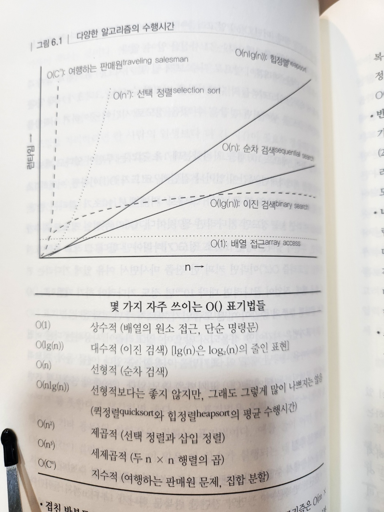

# 6. 코딩하는 동안 해야 할 일들

- 코딩에 들어가면 기계적으로 설계 내용을 컴퓨터가 실행할 수 있는 문장으로 바꾸는 일만 남는다는 생각이 일반적이다
  - 이런 태도가 보기 흉하고, 비효율적이고, 구조가 엉망이고, 유지보수하기 힘든 프로그램이 그렇게 많게 된 가장 큰 원인이다
- 코딩은 기계적인 작업이 아니다

  - 코딩할 때는 프로그램이 정확하고 생산적으로 작동하면서 천수를 누리도록 하기 위한 사려 깊은 생각과 판단을 통한 결정이 필요하다

- 적극적으로 자기 코드에 대해 생각하지 않는 프로그래머는 우연에 마기는 프로그래밍(programming by coincidence)을 하는 것이다

  - 코드가 작동하긴 하지만, 왜 그렇게 작동하는지 설명은 못한다

- `우연에 맡기는 프로그래밍` 항목에서 프로그래머가 코딩 과정에서 더 적극적으로 행동하는 방법을 알아보자
- 우리가 작성하는 코드는 충분히 빨리 돌아가지만 가끔씩은 가장 빠른 프로세서조차도 느리게 만들 수 있는 알고리즘을 만들게 된다
  - `알고리즘의 속도` 항목에서 우리는 코드 속도를 측정하는 여러 방법을 논의하고 성능 문제가 일어나기 전에 미리 잠재적인 문제점을 찾아내는 방법에 대한 몇 가지 기법을 선보일 것이다
- `리팩터링` 항목에서 우리는 코드를 비판적으로 바라보며, 개선하는데 도움이 되는 기법들을, 심지어 프로젝트를 한창 수행중에도 쓸 수 있는 기법들을 살펴볼 것이다
- `테스트하기 쉬운 코드` 항목에서 테스트하기 쉬운 코드를 만들어야 실제로 그 코드를 여러분이 테스트하게 될 확률도 늘어난다는 것을 알게 될 것이다
- 안전운전을 하는 것 처럼 코딩도 대부분은 반복적인 일이지만, 마음을 늘 깨어있도록 유지하면 재앙을 막을 수 있다

## 31. 우연에 맡기는 프로그래밍

- 개발자인 우리들 역시 지뢰밭에서 일한다
  - 우리는 우연에 맡기는 프로그래밍을 하지 말아야 한다
  - 대신 의도적으로 프로그래밍(programming deliberately) 해야 한다

### 프로그래밍을 우연에 맡기면 어떻게 되는가

- 코드가 잘 돌아가지 않게 되었는지 모르는 까닭은 코드가 처음부터 왜 잘돌아가는지 몰랐기 때문이다
- 우연에 맡길 때가 있다. 즐거운 우연과 주도면밀한 계획을 착각하기 쉬운 경우ㄹㄹ 몇 가지 살펴보자

#### 우연적 구현

- 우연적 구현은 결국 문서화되지 않은 에러나 입력값이 특정한 조건에서만 돌아가는 경우와 마주치게 된다
- 불필요한 호출을 제거하려고 하지 않는다. "이제 돌아는 가니까, 그대로 놔두는 것이 좋을거야"라는 생각에 빠지기 쉽다
- 우리는 수정해야할 몇 가지 이유를 생각해낼 수 있다

  - 정말로 제대로 돌아가는 것이 아닐지도 모른다. 우리에게만 그런 것처럼 보일 수도 있다
  - 여러분이 의존하는 조건이 단지 우연인 경우도 있다. 다른 상황(예를 들어 화면 해상도가 다른 경우 등)에서는 이상하게 동작할지도 모른다
  - 문서화되지 않은 동작은 라이브러리의 다음 릴리스에서 변경될 가능성이 있다
  - 불필요한 추가 호출은 코드를 더 느리게 만든다
  - 추가로 호출한 루틴때문에 새로운 버그들이 코드에 들어올 가능성이 있다

- 다른 사람들이 호출할 코드를 작성할 때는 모듈화를 잘하거나 문서화가 잘된 작은 규모의 인터페이스 아래에 구현을 숨기는 것과 같은 기본 원칙들이 모두 도움이 된다
  - 잘 정의된 계약('계약에 의한 설계' 참고)이 오해를 제거하는데 도움이 될 수 있다
- 다른 사람의 루틴을 호출할 때도 문서화된 동작에만 의존하라
  - 무슨 이유인지 그럴 수 없는 경우가 생긴다면, 여러분의 추측을 문서로 상세히 남겨라
    - 내 생각. 문서로 남긴다 -> 주석, 테스트 코드, 테스트 케이스 등

#### 우연적 맥락

- 유틸리티 모듇을 짜고 있다고 가정해보자
  - 사용자가 반드시 GUI가 있어야만 돌아가도록 만들 필요가 있을까?
  - 사용자의 언어가 언제가 영어일 것으로 가정하고 있지는 않은가?
  - 사용자가 글자를 읽을 수 있다고 생각하는가?
- 확실한 것이 아닌데도 의존하고 있는 다른 것들은 어떤 것이 있을까?

#### 암묵적인 가정

- 테스트에 이르기까지 어느 차원에서든 우연은 여러분을 잘못된 길로 이끌 수 있다
- 테스팅이 특히 거짓 원인과 우연적인 결과로 가득 찬 영역이다
  - Y의 원인은 X라고 가정하기는 쉽다. 하지만 우리가 디버깅에서 이야기 했듯이, 가정하지 말라. 증명하라

> Tip 44. 우연에 맡기는 프로그래밍을 하지 말라.

### 의도적으로 프로그래밍하기

- 언제나 자기가 지금 무엇을 하고 있는지 알아야 한다
- 맹목적으로 코딩하지 말라
  - 완전하게 이해하지 못한 애플리케이션을 빌드하려 하거나 익숙하지 않은 기술을 사용하려고 시도하는 행동은 우연에게 자기를 미혹해도 좋다는 초청장을 보내는 것과 다름없다
- 계획을 세우고 그것을 바탕으로 진행하라
- 신뢰할 수 있는 것에만 기대라. 우연한 일이나 가정에 의존하지 말라.
  - 어떤 상황에서 신뢰할 만한 것과 아닌 것을 판단하지 못하겠거든, 일단 가장 최악의 상황을 가정하라.
- 여러분의 가정을 문서로 남겨라
  - '계약에 의한 설계'를 따르면 다른 사람과 가정에 대해 소통하는 데 도움이 될 뿐더러, 자신의 마음속에서 가정을 명확하게 하는 데에도 도움이 된다
- 코드만 테스트할 것이 아니라 여러분이 세운 가정도 테스트해 보아야 한다
  - 여러분의 가정이 틀렸다면, 일찍 발견했으니 운이 좋았다고 생각하라
- 노력을 기울일 대상의 우선순위를 정하라
  - 중요한 것들에 먼저 시간을 투자하라
  - 중요한 부분이 가장 어려운 부분이기도 한 경우가 많다
  - 기반(fundamental) 또는 인프라(infrastructure)가 올바르지 않다면 현란한 부가 기능들도 다 소용없다
- 과거의 노예가 되지 말라
  - 기존 코드가 앞으로 짤 코드를 지배하도록 놓아두지 말라.
  - 더 이상 적절한 코드가 아니라고 생각되면, 어떤 코드라도 교체할 수 있다
  - 언제나 리팩터링할 자세가 되어 있어야 한다
  - 여기서 염두에 둘 것은 일정이 늦어져 발생하는 비용이 필요한 변화를 만들지 않을 경우의 비용보다 적어야 한다는 것이다

### 관련 항목

- 돌멩이 스프와 삶은 개구리
- 디버깅
- 계약에 의한 설계
- 단정적 프로그래밍
- 시간적 결합
- 리팩터링
- 결국은 모두 글쓰기

## 32. 알고리즘의 속도

- '추정'에서 우리는 도심을 가로지르는 데 얼마나 시간이 걸릴까, 프로젝트를 하나 끝마치는 데 기간이 얼마나 걸릴까 등을 추정해 보는 것에 대해 이야기 했다
  - 하지만 실용주의 프로그래머가 거의 날마다 사용하는 또 다른 종류의 추정이 있다
  - 알고리즘이 사용하는 자원, 곧 시간, 프로세서, 메모리 등을 추정하는 것이 그것이다
- 이런 종류의 추정이 결정적인 경우도 많다
  - 어떤 일을 하는 두 가지 방법이 주어졌을 때, 어떤 것을 고를 것인가?
  - 프로그램에 레코드 천 개를 주면 시간이 얼마나 걸리는 지는 안다.
    - 하지만 백만 개라면 어떨까?
- 이런 의문들은 약간의 분석, 그리고 대분자 O 표기법(big O notation)이라고 불리는 근사값을 기록하는 방식을 이용하면 답을 찾을 수 있는 경우가 많다

### 알고리즘을 추정한다는 말의 의미는 무엇인가?

- 일반적으로 입력의 크기는 알고리즘에 영향을 준다
  - 입력의 크기가 클수록, 알고리즘의 수행시간이 길어지거나 사용하는 메모리 양이 늘어난다
- 이런 관계가 1차 함수처럼 선형적이라면, 이 항목은 그다지 중요하지 않을 것이다
  - 하지만 알고리즘은 대개 선형적이지 않다.
  - 좋은 소식은 많은 알고리즘이 선형보다 증가폭이 적다는 것이다
  - 나쁜 소식은 나머지 알고리즘들은 선형보다 훨씬 심각한 경우도 있다는 것이다

### O() 표기법

- O() 표기법은 근사값을 다루기 위한 수학적 방법이다
- 어떤 정렬 루틴이 레코드 n개를 정렬하는데 O(n^2) 시간이 걸린다고 말할 때, 우리는 단지 최악의 경우에 걸리는 시간이 n의 제곱에 따라 달라진다고 말하는 것일 뿐이다
- n이 커질수록 가장 큰 차수에 비하면 다른 차수는 무시해도 될 정도 이기 때문에, 관습적으로 최상위 차수를 제외한 다른 모든 차수는 제거하며, 상수 곱도 표시하지 않는다
  - O(n^2/2 + 3n)은 O(n^2/2)으로 표기한다

### 상식적인 추정

- 상식을 이용해서 수많은 간단한 알고리즘들의 차수를 추정할 수 있다

- 그림 6-1. 다양한 알고리즘의 수행시간

- 간단한 반복문

  - 1부터 n까지 돌아간다면, 이 알고리즘이 O(n)일 가능성이 높다

- 겹친 반복문

  - 반복문 안에 또 반복문이 들어 있다면, 알고리즘은 O(m x n)이 되며, 여기서 m과 n은 두 반복문의 반복 횟수다
  - 반복 횟수가 같다면 O(n^2)이 된다

- 반씩 잘라 나가기

  - 반복문을 돌 때마다 작업 대상의 수를 반으로 줄여 나가는 알고리즘이라면, 대수적 알고리즘, 즉 O(lg(n))이 될 가능성이 높다
  - 정렬된 목록의 이진 검색이나 이진 트리의 순회 등이 모두 이런 알고리즘이다

- 나눠서 정복하기(divide and conquer)

  - 입력 데이터를 반쪽에서 독립적으로 작업한 다음, 결과를 합치는 알고리즘은 O(n x lg(n))이 될 수 있다
  - 퀵정렬이 전형적인 예로, 퀵정렬은 데이터를 반으로 나누고 반쪽에서 재귀적으로 정렬을 수행한다
  - 이미 정렬된 입력값이 들어올 때는 성능이 떨어지기 때문에 엄밀하게는 O(n^2)이지만, 퀵정렬의 평균 수행시간은 O(n x lg(n))이다

- 조합적(combinatoric)
  - 알고리즘이 항목의 순열을 다루기 시작하면 거의 대부분의 수행시간은 걷잡을 수 없을 정도로 늘어난다
  - 그 까닭은 순열에는 계승(factorial)이 관련되기 때문이다
  - 여행하는 판매원 문제, 상자에 물건을 최적으로 집어넣는 문제, 숫자 집합을 분할해서 각 부분 집합의 원소들의 합이 모두 같도록 만드는 문제 등등이다
  - 종종 한정된 문제 도메인에서 이런 종류의 알고리즘의 수행시간을 줄이기 위해 휴리스틱이 동원되기도 한다

### 실적에서의 알고리즘 속도

- O(m x n) 알고리즘에서 외부 요인에 따라 달라진다면, 잠시 작업을 멈추고 커다란 수가 들어왔을 경우, 수행시간이나 메모리 소비에 어떤 영향을 미칠지 생각해 보는 것이 좋다

> Tip 45. 여러분 알고리즘의 차수를 추정하라

- 어떤 일을 하는 코드인지 코드 자체에 대해서도 생각해보라
  - 입력값 n이 작을 경우, 단순한 O(n^2) 코드가 복잡한 O(n x lg(n)) 코드보다 더 좋은 성능을 내기도 한다
  - 특히 O(nlog(n)) 알고리즘에 무거운 내부 반복문이 들어있는 경우라면 특히 더 그러하다
- 이런 이론적인 이야기 와중이라도 실무에서 고려할 내용 역시 존재한다는 사실을 잊어서는 안 된다
  - 추정을 이미 했다고 하더라도, 현장에서 실제 데이터를 입력받아 돌아가는 코드의 수행시간만이 정말로 의미있는 수치다

> Tip 46. 여러분의 추정을 테스트하라

- 정확하게 시간을 재는 일이 어렵다면, 코드 프로파일러(code profiler)를 사용해서 알고리즘이 돌아갈 때 실행되는 각 단계의 반복 회수를 센 다음, 입력값의 규모를 바꿔 가면서 나오는 값을 그래프로 그린다

#### 최고라고 언제나 최고는 아니다

- 적당한 알고리즘을 선택할 때도 실용적이어야 할 필요가 있다

  - 가장 빠른 알고리즘이 언제나 가장 좋은 알고리즘은 아니다
  - 입력값의 규모가 작다면 단순한 삽입 정렬도 퀵정렬과 비슷한 성능을 내준다
  - 그러나 삽입 정렬을 작성하고 디버깅하는데 걸리는 시간은 퀵정렬보다 적다

- 여러분이 선택한 알고리즘이 입력 데이터를 알고리즘이 요구하는 형식으로 준비하는 데 비용이 많이 드는 것은 아닌지 주의 깊게 보아야 한다

  - 입력 데이터의 규모가 작을 경우, 그 데이터를 준비하는 데 걸리는 시간이 알고리즘을 돌리는 시간보다 오히려 더 오래 걸리는 일이 생기기도 한다
  - 이렇게 되면, 그 알고리즘은 적절한 선택이 아닐 것이다

- 그리고 성급한 최적화(premature optimization)를 조심하라
  - 어떤 알고리즘을 개선하느라 여러분의 귀중한 시간을 투자하기 전에 그 알고리즘이 정말로 병목인지 먼저 확실히 해두는 것은 언제나 좋은 생각이다

### 관련 항목

- 추정

## 33. 리팩터링

- 프로그램이 발전해가면, 초기에 내린 결정을 다시 고려하고 코드의 일부분을 다시 작성하는 일이 점점 더 필요해진다

  - 이것은 지극히 자연스러운 과정이다
  - 코드는 발전해야한다. 코드는 정적인 존재가 아니다

- 불행하게도 소프트웨어 개발을 비우하는 메타포는 건축이다. 건축같은 생각으로 이끄는 메타포로 사용한다면 다음 세 가지를 전제하게 된다

  - 1. 설계자(architect)가 설계도를 그린다
  - 2. 건축업자는 땅의 기반을 다지고, 상부구조를 세우고, 전선과 배관을 잇고, 최종 마무리를 한다
  - 3. 입주자가 건물 안에 이사 와서 행복하게 산다. 문제가 생기면 건물 관리소에 연락해서 고친다

- 하지만 소프트웨어는 이런식으로 돌아가지 않는다

  - 소프트웨어는 건축보다 오히려 정원일(gardening)에 더 가깝다
  - 딱딱하기보다는 유기적인 존재다
  - 정원 초기 계획과 조건에 따라 여러 가지 식물을 심는다
  - 몇몇은은 잘자라고, 몇몇은 퇴비가 될 운명이다
  - 빛과 그림자, 바람과 비의 상호작용을 더 잘 이용하기 위해 식물들의 상대적인 위치를 옮기기도 한다
  - 정원의 건강 상태를 지속적으로 관찰하며, 필요하면 토양, 식물, 정원 배치를 조정하기도 한다

- 코드를 다시 작성하기, 다시 작업하기, 다시 설계하기는 총괄해서 '리팩터링(refactoring)'이라고 알려져 있다

### 리팩터링은 언제 해야 하는가?

- 언제나 바로 지금이 최적기다. 어떤 것이라도 코드를 리팩터링해야 할 이유가 될 수 있다
  - 중복 - DRY 원칙('중복의 해악' 참고)의 위반을 발견했다
  - 직교성이 좋지 않은 설계
  - 유효기간이 끝난 지식
  - 성능 - 성능을 개선하려면 시스템의 한 영역에서 다른 영역으로 기능을 옮겨야 한다

#### 현실 세계의 복잡한 문제들

- 리팩터링을 하지 않은 핑계로 자주 사용되는 이유가 일정의 압박이다
- 하지만 이것은 설득력 있는 이유가 되지 못한다
  - 지금 리팩터링을 하지 않으면, 일이 더 진척되었을 때, 곧 신경 써야 할 의존성이 더 많이 생겼을 때 문제를 고치지기 위해 훨씬 더 많은 시간을 투자해야 한다
  - 그때가 되면 일정에 더 여유가 생길까? 우리의 경험에 비추어 봤을 때 그런 일은 없다
- e.g. 리팩터링이 필요한 코드 ~= 종양
  - 나중에 제거하는 데 드는 비용도 더 커질 뿐더러 위험도 훨씬 커진다

> Tip 47. 일찍 리팩터링하고, 자주 리팩터링하라.

- 리팩터링해야 할 것들의 명단을 만들고 유지하라
  - 어떤 것을 지금 당장 리팩터링하기 힘들다면, 일정에 그것을 리팩터링할 시간을 확실히 포함시켜 두도록 한다
  - 그 코드를 사용하는 사람들이 코드가 조만간 리팩터링될 것이라는 사실과 그 사실이 그들의 코드에 영향을 주게 될지 인지하도록 만들어야 한다

### 리팩터링은 어떻게 하는가?

- 리팩터링의 본질은 재설계다
  - 여러분 또는 여러분 팀의 다른 사람이 설계한 모든 것은, 새로운 사실이 밝혀지거나 문제에 대한 이해가 더 깊어지거나 요구사항이 바뀌는 것과 같은 일이 생긴다면, 언제라도 재설계의 대상이 될 수 있다
- 하지만 그렇다고 규모가 거대한 코드에서 아무 부분이나 닥치는 대로 삭제해 버리면서 산산조각으로 분해한다면 나중에는 일을 시작하기 전보다 더 좋지 않은 처지에 놓일지도 모른다

- 마틴 파울러(Martin Fowler)는 손해보다 이득이 큰 방향으로 리팩터링을 하기 위한 다음 몇 가지 간단한 조언을 제공한다

  - 1. 리팩터링과 새로운 기능 추가를 동시에 하지 말라
  - 2. 리팩터링을 시작하기 전 든든한 테스트 집합이 있는지 먼저 확인하라
    - 할 수 있는 한 자주 테스트들을 돌려본다
    - 이렇게 하면 여러분의 변경 때문에 무엇이 망가졌을 경우 재빨리 그 사실을 알 수 있다
  - 3. 단계를 작게 나누어서 신중하게 작업한다
    - 필드를 한 클래스에서 다른 클래스로 옮기기, 비슷한 메서드를 합쳐서 수퍼클래스로 옮기기, 리팩터링에서는 국지적인 변경들이 많이 모여서 커다란 규모의 변화를 낳는 일이 자주 발생한다
    - 단계를 작게 나누고, 한 단계가 끝날 때 마다 테스트를 돌린다면, 기다긴 시간의 디버깅 작업을 피할 수 있다

- 모듈에 큰 변화가 있다면, 일부러 빌드를 실패하도록 변화를 주는 기법도 유용하다

  - 리팩터링 대상 코드에 의존하는 옛날 코드들이 컴파일이 안되게 만들어버리는 것이다
  - 그러면 리팩터링 대상 코드에 어떤 코드들이 의존하는지 쉽게 찾아내서 지금 상황에 맞도록 고칠 수 있다

- 고통을 관리하라. 지금 고통스럽더라도, 앞으로 더욱 고통스러워질 것 같으면 지금 고치는 편이 낫다
- '소프트웨어 엔트로피'에서 배운 교훈을 기억하라. 깨진 창문을 그대로 놓아두지 말라

### 관련 항목

- 고양이가 내 코드를 삼켰어요
- 소프트웨어 엔트로피
- 돌멩이 수프와 삶은 개구리
- 중복의 해악
- 직교성
- 우연에 맡기는 프로그래밍
- 테스트하기 쉬운 코드
- 가차 없는 테스트

## 34. 테스트하기 쉬운 코드

- 사람들은 재사용성과 컴포넌트 기반 개발에 대해 논의하면서 소프트웨어 집적회로를 메타포로 언급하기 좋아한다
- 이것은 집적회로 칩들을 조립해서 회로를 구성할 수 있는 것과 마찬가지로 소프트웨어 컴포넌트도 조립해서 쓸 수 있어야 한다는 생각이다

  - 이것은 여러분이 사용할 컴포넌트가 신뢰할 수 있는 경우에만 가능하다

- 소프트웨어에서도 테스트 가능성을 만들어 넣고, 코드들을 서로 연결하기 전에 코드를 하나하나 철저하게 테스트해야만 한다

### 단위 테스트

- 하드웨어에서 칩 차원의 테스트는 소프트웨어에서 단위 테스트와 동등한 것으로 볼 수 있다
- 두 경우 모두 각 모듈의 동작을 검증하기 위해 다른 것들과 분리(isolate)시켜 놓고 테스트가 이루어진다
- 모듈을 통해 통제(control)된 환경에서 철저하게 테스트하고 나면, 더 넓은 환경에서 그 모듈이 어떻게 행동할 것인지 감을 잡을 수 있을 것이다
- 소프트웨어 단위 테스트란 어떤 모듈에게 이것저것을 시켜보는 코드를 가리킨다

  - 일반적으로, 단위 테스트는 일종의 인위적인 환경을 구축한 다음, 테스트할 모듈의 루틴들을 호출한다
  - 그런 다음 반환된 결과들을 이미 알고 있는 갓과 비교해 보거나 똑같은 테스트를 이전에 돌렸을 때 나온 값과 비교해 보아서 올바른지 검사한다

- '계약에 의한 설계'의 밑바탕에 깔린 개념들을 사용하면 훨씬 더 나은 작업을 할 수 있다

### 계약을 잘 지키는지 테스트해 보기

- 우리는 단위 테스트를 계약을 잘 지키는지 보는 테스트로 생각하길 좋아한다
- 이런 테스트는 우리에게 두 가지 사실을 알려준다
  - 1. 코드가 계약을 지키는지
  - 2. 코드로 표현된 계약의 의미가 우리가 생각한 것과 일치하는지
- 우리는 다양한 종류의 케이스들과 경계 조건들에서도 모듈이 약속한 대로 기능을 잘 수행하는지 테스트하고 싶다
  - (제곱근 테스트 과정 생략)
- 조립된 모듈 구조는 어떻게 테스트해야 할까?
  - 그 모듈의 하위 컴포넌트들을 먼저 테스트
  - 하위 컴포넌트들이 모두 검증된 후 모듈 자체를 테스트
  - 이 기법은 디버그에 들어가는 노력을 줄일 수 있는 방법이다
    - 계약을 잘 지키는지 테스트하는 것을 강조함으로써, 우리는 프로젝트 후반부에 벌어질 수 있는 이런 종류의 재앙들을 피하기 위한 노력을 할 수 있다

> Tip 48. 테스트를 염두에 두고 설계하라.

- 모듈을 설계할 때는, 심지어 루틴 하나를 설계할 때도, 그것이 지켜야 할 계약과 계약을 지키는지 테스트하는 코드도 함께 설계해야 한다
- 테스트를 통과하고 계약을 지키는 코드를 설계하다보면 자연스럽게 그렇게 설계하지 않았으면 생각나지 않았을 경계 조건이나 다른 문제들을 고려하게 된다

### 단위 테스트 작성하기

- 모듈의 단위 테스트는 찾기 편한 곳에 위치하고 있어야 한다
  - 프로젝트의 규모가 작다면 그 모듈의 단위 테스트 코드를 포함해 넣어도 된다
  - 프로젝트 규모가 크다면, 각각의 테스트를 하위 디렉터리로 옮겨놓기를 제안한다
- 테스트 코드를 쉽게 접근할 수 있게 해놓는 것은, 앞으로 여러분의 코드를 사용할지도 모르는 개발자들에게 매우 귀중한 두 가지 자원을 제공하는 것이다
  - 1. 여러분 모듈의 모든 기능을 어떻게 이용해야 하는지 보여주는 예제
  - 2. 후일 코드 변경 시 검증하기 위한 회귀 테스트를 구축할 수 있는 수단

### 테스트 장치(Test Harness)를 사용하기

- 좀 편안한 삶을 위해 표준으로 사용할 테스트 장치를 만들기로 하자
- 테스트 장치는 상태를 기록으로 남기거나, 예상 결과값에 비추어 출력을 분석하거나, 테스트를 선택하고 실행하는 일 처럼 자주 쓰이는 작업들을 다룰 수 있어야 한다
- 테스트 장치는 GUI로 작동할 수도 있고, 프로젝트의 나머지 부분과 동일한 대상 언어로 작성될 수도 있고, markefile과 펄 스크립트의 조합으로 구현될 수도 있다
- 객체지향 언어와 환경에서는 이런 공통적인 기능을 제공하는 기반 클래스를 만들곤 한다
  - 개별 테스트들은 이 기반 클래스에게서 상속받아 구체적인 테스트 코드를 추가하면 된다
  - 이 기법은 DRY 원칙을 지키는 방법으로, 지금 있는 테스트 목록을 여러분 스스로 유지하지 않아도 된다
- 테스트 장치라면 반드시 다음 기능이 있어야 한다

  - 시작할 때 할 일과 마칠 때 할 일을 지정할 수 있는 표준적인 방법
  - 개별적인 테스트들을 선택하거나, 아니면 모든 테스트를 한꺼번에 선택하게 해주는 메서드
  - 예상한 (또는 예상하지 못한) 결과에 비추어 결과를 분석할 수 있는 방법
  - 실패를 보고하는 표준화된 형태

- 테스트는 조립식으로 작동할 수 있어야 한다

### 테스트 윈도우를 만들기

- 테스트 집합이 아무리 좋아도 모든 버그를 발견할 가능성은 없다
- 소프트웨어가 배치된 후에도 테스트해야만 하는 경우가 자주 생길 수 있다
- 추적 메시지를 담아 두는 로그 파일이 디버거를 사용하지 않고도 모듈 내부 상태를 다양한 형태로 볼 수 있는 방법 가운데 하나다
  - 로그 메시지는 반드시 규칙적이고 일관된 형식이어야 한다
  - 프로그램의 처리 시간이나 프로그램이 택한 논리 경로를 추론하기 위해 기록을 자동으로 파싱하고 싶을 때가 있기 때문이다
  - 형식이 좋거나 일관성이 없다면, 진단 결과는 읽기 어렵고 현실적으로 파싱하기도 힘든 그냥 뱉어낸 것에 불과하다
- 실행 중인 코드의 내부로 들어갈 수 있는 또 다른 메커니즘은 일련의 단축키를 제공하는 것이다
  - 어떤 특정한 키 조합을 누르면, 상태 정보와 그 외 것들이 들어있는 진단 제어창이 열리게 만드는 것이다
  - 최종 사용자에게 알리진 않겠지만, 고객 지원실에 있는 사람들에게는 매우 유용한 도구가 될 수 있다
- 규모가 크고 더 복잡한 서버 코드라면, 웹 서버를 내장시키는 것이 작업 상태를 적먹하믄 수잔을 제공하는 멋진 기법이 될 수 있다
  - 누구라도 웹브라우저로 애플리케이션의 표준 포트번호가 아닌 번호(e.g. 8080)에 접근해서 내부 상태와 로그 항목들을 볼 수 있다

### 테스트 문화

- 여러분이 작성하는 모든 소프트웨어는 언젠가는 테스트된다
- 여러이나 여러분 팀이 테스트하지 않으면, 결과적으로 사용자들이 테스트하게 된다
- 테스트는 기술적이라기보다는 문화적인 것이다
- 우리는 사용하는 언어와 상관없이 어떤 프로젝트라도 이런 테스트 문화를 스며들게 할 수 있다

> Tip 49. 소프트웨어를 테스트하라. 그렇지 않으면 사용자가 테스트하게 될 것이다.

### 관련 항목

- 고양이가 내 코드를 삼켰어요
- 직교성
- 계약에 의한 설계
- 리팩터링
- 가차 없는 테스트

## 35. 사악한 마법사

- 애플리케이션이 복잡해짐에 따라, 도구 제작사와 인프라 벤더들은 마법 총알, 마법사를 들고 나왔다
  - 마법사 : 버튼을 하나 누르고 몇 가지 간단한 질문에 대답하면 자동으로 골격 코드를 만들어준다
- 하지만 자신을 위해 만들어진 코드를 정말로 이해하지 못하는 한, 그는 자기 자신을 속이는 것이다
  - 그는 우연에 맡기는 프로그래밍을 하고 있다
- 마법사가 만들어준 코드가 지금 상황에 맞지 않다면, 또는 상황이 바뀌어서 코드를 변경해야 할 필요가 생긴다면, 여러분 혼자 힘으로 해야 한다

- 내 생각
  - 요즘 chat gpt라는 새로운 마법사가 등장했다
  - 이것을 그대로 사용하는 신입 개발자 또는 개발자 지망생들도 존재할 것이다
  - 구글 검색으로 나오는 stackoverflow 답변 또한 마찬가지다
  - 이런 것들을 사용할 땐 제대로 이해하고, 모듈화하고 테스트하고 사용하자

> Tip 50. 자신이 이해하지 못하는, 마법사가 만들어 준 코드는 사용하지 말라

- 우리는 일상적으로 완벽하게 이해하지 못한 것들에 의존하며 지낸다
  - e.g. 집적 회로의 양자역학, 프로세서의 인터럽트 구조 등
  - 하지만 마법사가 생성한 코드는 평범한 개발자가 작성한 기능과 줄 단위로 섞인다
    - 결과적으로 그 코드는 마법사의 코드이기를 관두고 평범한 개발자가 자신의 코드가 되기 시작한다

### 관련 항목

- 직교성
- 코드 생성기
