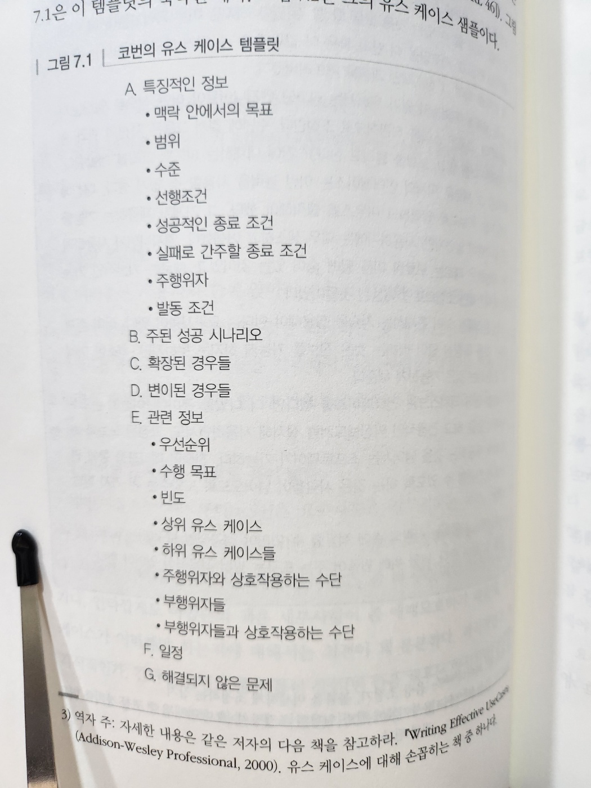
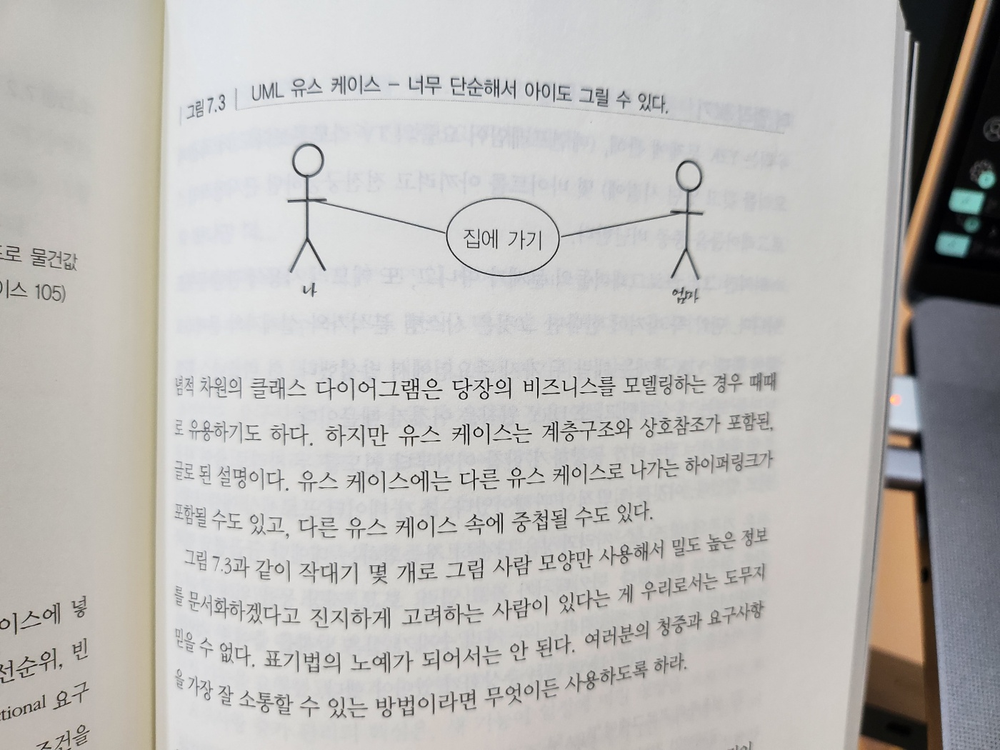

# 7. 프로젝트 전에

- 프로젝트 시작 전 몇 가지 기본 원칙을 정하지 않는다면 망할 수도 있다
- 프로젝트를 시작할 때 요구사항을 결정할 필요가 있다 -> `요구사항의 구렁텅이`
- 상식적인 지혜와 제약조건 관리 -> `불가능한 퍼즐 풀기`
- `준비가 되어야만` : 머리속에서 들리는 경고의 목소리를 언제 경청하는 것이 좋은지 조언
- `명세의 함정` : 명세의 장점
- `동그라미와 화살표` : 형식적 개발 프로세스와 방법론의 몇 가지 위험
- 프로젝트가 제 길을 잡아 나가기 전에 중요한 이슈들을 잘 정리해야 `분석 마비증`을 모면하고, 성공적인 프로젝트를 정말로 시작할 수 있다

## 36. 요구사항의 구렁텅이

- 완성이라는 것은 더 이상 더할 것이 없을 때가 아니라, 더 이상 빼낼 것이 없을 때 얻게 되는 것이다 - 생택쥐페리, 바람과 모래와 별들
- 많은 책과 튜토리얼을 보면 `요구사항 수집`은 프로젝트의 초기에 이뤄진다
- `수집`이라는 말은 요구사항이 이미 널려있다는 암시를 준다
  - 사실은 그렇지 않다. 요구사항이 지면에 놓여져 있는 경우는 퍽 드물다
  - 보통은 가정과 오해, 정치의 지층들 속 깊이 묻혀져 있다

> Tip 51. 요구사항을 수집하지 말고 채굴하라

### 요구사항 채굴하기

- 어느 것이 진정한 요구사항인지 어떻게 분간할 수 있을까?
  - 요구사항이란 어떤 것이 성취되어야 한다는 진술이라는 것이다
- 좋은 요구사항의 예시

  - 요구사항 1: 직원 기록은 지명된 사람들만 볼 수 있다
  - 요구사항 2: 실린더 헤드 온도는 임계값을 넘으면 안 되며, 이는 엔진마다 다르다
  - 요구사항 3: 에디터는 편집하는 파일의 종류에 따라 별도로 선택된 키워드를 강조 표시한다

- 하지만 대개의 요구사항은 이렇게 분명하게 주어지지 않기 때문에, 요구사항 분석은 더욱 복잡해진다
- 위 요구사항 1은 다음과 같이 말했을 수도 있다
  - "해당 직원의 관리자와 인사부에서만 그의 기록을 열람할 수 있다"
  - 이 진술이 정정 요구사항일까? 오늘은 그럴 수도 있지만, 이 진술 속엔 비즈니스 정책이 내포되어 있다
  - 정책은 수시로 바뀐다. 따라서 요구사항 속에 그걸 고정하는 건 그리 좋은 생각이 아니다
  - 우리는 이런 정책들을 요구사항에서 분리해 문서화하고, 양자를 하이퍼링크할 것을 조언한다
- 요구사항은 최대한 일반적진술로 만들고, 나머지 정책에 관한 정보는 개발자에게 구현에서 지원해야 할 것들의 한 예로 넘겨주어야 한다

  - 결국 정책은 애플리케이션에서 메타데이터로 포함될 것이다

- 요구사항, 정책, 구현 간의 구분이란 사용자 인터페이스를 논할 때 더 모호해질 수 있다
  - '시스템은 대출 기한을 선택할 수 있도록 해줘야 한다.'는 것은 요구사항의 진술이다
  - '대출 기한 선택을 위해서 리스트 박스가 필요하다.'는 것은 요구사항의 진술일 수도 있고, 아닐 수도 있다
    - 만약 사용자들이 절대적으로 리스트 박스를 필요로 한다면 그것은 요구사항이다
    - 하지만 뭔가 선택할 수 있는 기능을 설명하느라 리스트 박스를 한 가지 예로 사용하고 있다면 그것은 요구사항이 아닌 것이다
  - 이후 사용자가 인터페이스에서 필요로 하는 것들을 무시했기 때문에 엉망이 된 프로젝트를 이야기 해볼 것이다
- 사용자들이 어떤 작업을 현재 어떻게 하느냐는 것을 알아내는 것보다, 왜 그걸 하는지 그 내재적 이유를 알아내는 것이 더 중요하다
  - 개발을 통하여 그들이 진술한 요구사항을 충족하는 것이 아니고, 그들의 실질적 비즈니스 문제를 해결해야 하는 것이다
- 요구사항 이면의 이유들을 문서화해 놓으면, 여러분의 팀은 나날이 구현 관련 의사결정을 할 때마다 이루 말로 할 수 없는 값진 정보를 얻게 되는 셈이다
- 사용자의 요구사항 내면 깊이 들어갈 수 있는 (그러나 많이들 쓰지 않는) 단순한 기법이 있다
  - 사용자가 되어 보는 것이다
    - 고객 상담을 위한 시스템을 작성하고 있는가?
      - 경험 많은 고객 상담원을 며칠간 관찰하라
    - 수작업 재고 관리 시스템을 자동화하고 있는가?
      - 창고에서 일주일만 일해보라

> Tip 52. 사용자처럼 생각하기 위해 사용자와 함께 일하라.

- 요구사항 채굴 과정은 사용자 층이 바라는 시스템이 무엇인지 배우면서 사용자 층과 관계를 설정하기 시작하는 단계다
  - 다음 장의 '위대한 유산' 참고

### 요구사항 문서화

- 사용자와 함께 그들의 진정한 요구사항을 캐면 애플리케이션이 해야할 것을 묘사하는 몇 가지 시나리오를 얻게 된다
- 전문가라면 이것들을 문서화하려할 것이다
- 이바 야콥슨은 유스 케이스(use case)의 개념 제안

  - 유스 케이스는 시스템의 특정한 사용을 설명한다
  - 사용자 인터페이스 차원에서가 아닌 좀 더 추상적인 차원에서의 이야기
  - 야콥슨의 책은 좀 애매모호하기 때문에 의견이 분분하다

- `유스 케이스`를 보는 하나의 관점은 `목적 지향성`을 강조하는 것이다
  - 이 접근법을 설명하는 템플릿 : 그림 7-1
  - 그림 7-2는 그 유스 케이스 샘플

- 그림 7-1. 코번의 유스 케이스 템플릿

- 그림 7-2. 단순한 유스 케이스 예제

- 정해진 템플릿을 사용함으로써, 유스 케이스에 넣어야할 모든 정보를 빠트림 없이 포함시킬 수 있다
- 이런 조직화는 유스 케이스를 계층적으로 구조화할 수 있게 해준다
  - 고차원의 유스 케이스 안에 좀 더 구체적인 것들이 따라오게 중첩할 수 있다

#### 유스 케이스 다이어그램

- 작업흐름(workflow)은 UML 활동 다이어그램으로 갈무리할 수 있다
  - UML은 Unified Modeling Language의 약자로, 객체 지향 소프트웨어 개발을 위한 표준화된 모델링 언어
    - https://m.blog.naver.com/icbanq/221781238065
    - https://seulhee030.tistory.com/56

- 그림 7-3. UML 유스 케이스 - 너무 단순해서 아이도 그릴 수 있다
  - 표기법의 노예가 되어서는 안 된다
  - 여러분의 청중과 요구사항을 가장 잘 소통할 수 있는 방법이라면 무엇이든 사용하도록 하라

### 지나치게 자세한 명세

- 요구사항 문서를 만들 때 생기는 큰 위험은 지나치게 자세히 서술하는 것이다
  - `좋은 요구사항 문서`는 `추상적`이다
  - 요구사항에 관한 한 비즈니스에 필요한 사항을 정확히 반영하는 가장 간단한 진술문이 최고다
  - 모호하게 하라는 말이 아니다
- 요구사항은 아키텍처가 아니다
  - 요구사항은 설계가 아니며, 사용자 인터페이스도 아니다
  - 요구사항은 필요다

### 더 멀리 보기

- 우리는 Y2K 문제에 관해, 몇 바이트를 아끼려고 전전긍긍하던 근시안적인 프로그래머들을 종종 비난한다
  - Y2K: 2000년 문제, 2000년 1월 1일이 되면 컴퓨터가 1900년으로 인식하는 문제
- 하지만 그건 꼭 따져야 한다면 시스템 분석가와 설계자의 문제라고 해야 한다
- Y2K 문제는 대략 두 가지 주요 원인에서 발생했다
  - 현 비즈니스 관행 너머를 보는 데 실패했고
  - DRY 원칙을 어겼기 때문이다
- 업계에서는 컴퓨터가 등장하기 한참 전부터 연도를 두 가지로 줄여 사용하고 있었다

> Tip 53. 구체적인 것보다 추상적인 것이 더 오래간다

- 요구사하아은 단지 날짜가 사용된다는 것만 명시할 것이다
  - 아마도 잘짜 관련 수학 연산이 필요할 것이라는 암시가 있을 수도 있다
  - 혹 다양한 형태의 이차 저장 장치에 날짜가 저장될 수도 있다고 말해주는지 모른다
  - 이런 DATE 모듈 혹은 클래스의 진정한 요구사항이다

### 딱 하나만 더...

- 많은 프로젝트들이 범위(scope)의 증가 때문에 실패한다고 알려져 있다
  - 이것은 '돌멩이 스프와 삶은 개구리'에서 얘기하는 삶은 개구리 신드롬의 한 측면이다
  - 요구사항이 슬금슬금 추가되는 것을 어떻게 막을 수 있을까?
- 많은 프로젝트가 요구사항을 적극적으로 추적하지 않는다
  - 이는 범위의 변화에 대해서 보고할 길이 없다는 의미가 된다
- 요구사항 증가 관리의 핵시은, `새 기능`이 `일정에 미칠 영향`을 프로젝트 `후원자에게 인식`시키는 것이다
  - 프로젝트가 초기 예측에서 1년 뒤쳐져 있고 비난이 오고갈 즈음이라면, 요구사항이 언제 어떻게 늘어났는지에 대해 정확하고 완전한 그림을 갖고 있는 것이 크게 도움이 될 것이다
- '기능 하나만 더'라는 소용돌이 속으로 빨려 들어가기는 무척 쉽다
  - 하지만 요구사항을 추적함으로써, '기능 하나만 더'가 실은 이번 달에 추가된 15번째 새 기능이었다는 사실을 분명히 알 수 있게 된다

### 용어사전 유지하기

- 요구사항에 대해 토론하면, 사용자나 도메인 전문가들은 어떤 용어들을 사용할 것이다
  - e.g. 클라이언트, 커스터머를 다르게 사용할 수도 있다
- 프로젝트 용어사전(glossary)를 만들고 유지하라
  - 그것은 프로젝트에서 사용되는 모든 용어와 어휘를 모아 놓은 단일한 장소여야 한다
  - 최종 사용자에서 보조 직원까지 프로젝트에 참가하는 모든 사람이 일관성을 위해 동일한 용어 사전을 사용해야 한다
  - 용어사전에 여러 사람이 접근하기 쉬워야 한다. 웹 기반 문서를 사용하는 것은 좋은 방법이다

> Tip 54. 프로젝트 용어사전을 사용하라

- 사용자와 개발자가 동일한 것을 다른 이름으로 가리키는 프로젝트가 성공하기는 매우 힘들며, 같은 이름으로 다른 것을 지칭하는 상황에서는 더더욱 어렵다

### 말을 끄집어내라

- 다음 장의 '결국은 모두 글쓰기'에서는 모든 참가자가 쉽게 접근할 수 있도록 프로젝트 문서를 내부 웹사이트에 올리는 것에 대해 논의한다
  - 이 배포 방식은 요구사항 문서에 대해 특히 유용하다
- 요구사항을 하이퍼텍스트 문서로 표현함으로써, 우리는 다양한 청중의 필요를 더 잘 충족시킬 수 있다
  - 프로젝트 후원자들은 비즈니스 목표가 충족되었는지 확인하기 위해 매우 높은 추상 차원에서 이리 저리 항해해볼 수 있다
  - 프로그래머들은 훨씬 더 상세한 수준으로 내려가기 위해 하이퍼링크를 사용할 수 있다(또한 적절한 정의나 명세를 참고하기 위해서도)

### 관련 항목

- 돌멩이 스프와 삶은 개구리
- 적당히 괜찮은 소프트웨어
- 동그라이와 화살표
- 결국은 모두 글쓰기
- 위대한 유산
