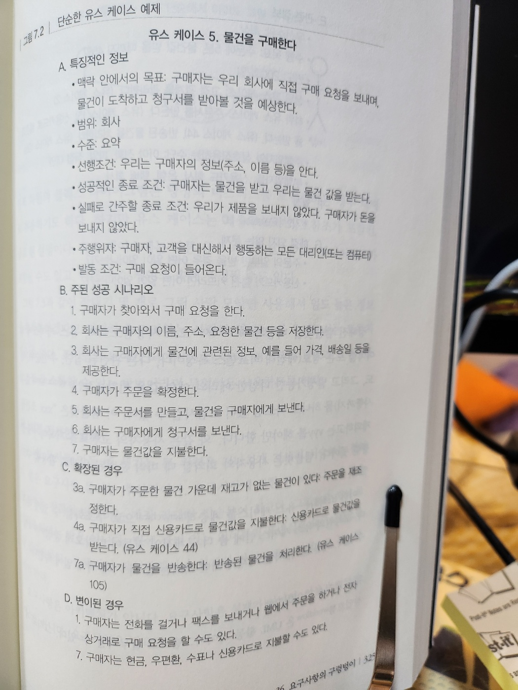

# 7. 프로젝트 전에

- 프로젝트 시작 전 몇 가지 기본 원칙을 정하지 않는다면 망할 수도 있다
- 프로젝트를 시작할 때 요구사항을 결정할 필요가 있다 -> `요구사항의 구렁텅이`
- 상식적인 지혜와 제약조건 관리 -> `불가능한 퍼즐 풀기`
- `준비가 되어야만` : 머리속에서 들리는 경고의 목소리를 언제 경청하는 것이 좋은지 조언
- `명세의 함정` : 명세의 장점
- `동그라미와 화살표` : 형식적 개발 프로세스와 방법론의 몇 가지 위험
- 프로젝트가 제 길을 잡아 나가기 전에 중요한 이슈들을 잘 정리해야 `분석 마비증`을 모면하고, 성공적인 프로젝트를 정말로 시작할 수 있다

## 36. 요구사항의 구렁텅이

- 완성이라는 것은 더 이상 더할 것이 없을 때가 아니라, 더 이상 빼낼 것이 없을 때 얻게 되는 것이다 - 생택쥐페리, 바람과 모래와 별들
- 많은 책과 튜토리얼을 보면 `요구사항 수집`은 프로젝트의 초기에 이뤄진다
- `수집`이라는 말은 요구사항이 이미 널려있다는 암시를 준다
  - 사실은 그렇지 않다. 요구사항이 지면에 놓여져 있는 경우는 퍽 드물다
  - 보통은 가정과 오해, 정치의 지층들 속 깊이 묻혀져 있다

> Tip 51. 요구사항을 수집하지 말고 채굴하라

### 요구사항 채굴하기

- 어느 것이 진정한 요구사항인지 어떻게 분간할 수 있을까?
  - 요구사항이란 어떤 것이 성취되어야 한다는 진술이라는 것이다
- 좋은 요구사항의 예시

  - 요구사항 1: 직원 기록은 지명된 사람들만 볼 수 있다
  - 요구사항 2: 실린더 헤드 온도는 임계값을 넘으면 안 되며, 이는 엔진마다 다르다
  - 요구사항 3: 에디터는 편집하는 파일의 종류에 따라 별도로 선택된 키워드를 강조 표시한다

- 하지만 대개의 요구사항은 이렇게 분명하게 주어지지 않기 때문에, 요구사항 분석은 더욱 복잡해진다
- 위 요구사항 1은 다음과 같이 말했을 수도 있다
  - "해당 직원의 관리자와 인사부에서만 그의 기록을 열람할 수 있다"
  - 이 진술이 정정 요구사항일까? 오늘은 그럴 수도 있지만, 이 진술 속엔 비즈니스 정책이 내포되어 있다
  - 정책은 수시로 바뀐다. 따라서 요구사항 속에 그걸 고정하는 건 그리 좋은 생각이 아니다
  - 우리는 이런 정책들을 요구사항에서 분리해 문서화하고, 양자를 하이퍼링크할 것을 조언한다
- 요구사항은 최대한 일반적진술로 만들고, 나머지 정책에 관한 정보는 개발자에게 구현에서 지원해야 할 것들의 한 예로 넘겨주어야 한다

  - 결국 정책은 애플리케이션에서 메타데이터로 포함될 것이다

- 요구사항, 정책, 구현 간의 구분이란 사용자 인터페이스를 논할 때 더 모호해질 수 있다
  - '시스템은 대출 기한을 선택할 수 있도록 해줘야 한다.'는 것은 요구사항의 진술이다
  - '대출 기한 선택을 위해서 리스트 박스가 필요하다.'는 것은 요구사항의 진술일 수도 있고, 아닐 수도 있다
    - 만약 사용자들이 절대적으로 리스트 박스를 필요로 한다면 그것은 요구사항이다
    - 하지만 뭔가 선택할 수 있는 기능을 설명하느라 리스트 박스를 한 가지 예로 사용하고 있다면 그것은 요구사항이 아닌 것이다
  - 이후 사용자가 인터페이스에서 필요로 하는 것들을 무시했기 때문에 엉망이 된 프로젝트를 이야기 해볼 것이다
- 사용자들이 어떤 작업을 현재 어떻게 하느냐는 것을 알아내는 것보다, 왜 그걸 하는지 그 내재적 이유를 알아내는 것이 더 중요하다
  - 개발을 통하여 그들이 진술한 요구사항을 충족하는 것이 아니고, 그들의 실질적 비즈니스 문제를 해결해야 하는 것이다
- 요구사항 이면의 이유들을 문서화해 놓으면, 여러분의 팀은 나날이 구현 관련 의사결정을 할 때마다 이루 말로 할 수 없는 값진 정보를 얻게 되는 셈이다
- 사용자의 요구사항 내면 깊이 들어갈 수 있는 (그러나 많이들 쓰지 않는) 단순한 기법이 있다
  - 사용자가 되어 보는 것이다
    - 고객 상담을 위한 시스템을 작성하고 있는가?
      - 경험 많은 고객 상담원을 며칠간 관찰하라
    - 수작업 재고 관리 시스템을 자동화하고 있는가?
      - 창고에서 일주일만 일해보라

> Tip 52. 사용자처럼 생각하기 위해 사용자와 함께 일하라.

- 요구사항 채굴 과정은 사용자 층이 바라는 시스템이 무엇인지 배우면서 사용자 층과 관계를 설정하기 시작하는 단계다
  - 다음 장의 '위대한 유산' 참고

### 요구사항 문서화

- 사용자와 함께 그들의 진정한 요구사항을 캐면 애플리케이션이 해야할 것을 묘사하는 몇 가지 시나리오를 얻게 된다
- 전문가라면 이것들을 문서화하려할 것이다
- 이바 야콥슨은 유스 케이스(use case)의 개념 제안

  - 유스 케이스는 시스템의 특정한 사용을 설명한다
  - 사용자 인터페이스 차원에서가 아닌 좀 더 추상적인 차원에서의 이야기
  - 야콥슨의 책은 좀 애매모호하기 때문에 의견이 분분하다

- `유스 케이스`를 보는 하나의 관점은 `목적 지향성`을 강조하는 것이다
  - 이 접근법을 설명하는 템플릿 : 그림 7-1
  - 그림 7-2는 그 유스 케이스 샘플

- 그림 7-1. 코번의 유스 케이스 템플릿

- 그림 7-2. 단순한 유스 케이스 예제

- 정해진 템플릿을 사용함으로써, 유스 케이스에 넣어야할 모든 정보를 빠트림 없이 포함시킬 수 있다
- 이런 조직화는 유스 케이스를 계층적으로 구조화할 수 있게 해준다
  - 고차원의 유스 케이스 안에 좀 더 구체적인 것들이 따라오게 중첩할 수 있다

#### 유스 케이스 다이어그램

- 작업흐름(workflow)은 UML 활동 다이어그램으로 갈무리할 수 있다
  - UML은 Unified Modeling Language의 약자로, 객체 지향 소프트웨어 개발을 위한 표준화된 모델링 언어
    - https://m.blog.naver.com/icbanq/221781238065
    - https://seulhee030.tistory.com/56

- 그림 7-3. UML 유스 케이스 - 너무 단순해서 아이도 그릴 수 있다
  - 표기법의 노예가 되어서는 안 된다
  - 여러분의 청중과 요구사항을 가장 잘 소통할 수 있는 방법이라면 무엇이든 사용하도록 하라

### 지나치게 자세한 명세

- 요구사항 문서를 만들 때 생기는 큰 위험은 지나치게 자세히 서술하는 것이다
  - `좋은 요구사항 문서`는 `추상적`이다
  - 요구사항에 관한 한 비즈니스에 필요한 사항을 정확히 반영하는 가장 간단한 진술문이 최고다
  - 모호하게 하라는 말이 아니다
- 요구사항은 아키텍처가 아니다
  - 요구사항은 설계가 아니며, 사용자 인터페이스도 아니다
  - 요구사항은 필요다

### 더 멀리 보기

- 우리는 Y2K 문제에 관해, 몇 바이트를 아끼려고 전전긍긍하던 근시안적인 프로그래머들을 종종 비난한다
  - Y2K: 2000년 문제, 2000년 1월 1일이 되면 컴퓨터가 1900년으로 인식하는 문제
- 하지만 그건 꼭 따져야 한다면 시스템 분석가와 설계자의 문제라고 해야 한다
- Y2K 문제는 대략 두 가지 주요 원인에서 발생했다
  - 현 비즈니스 관행 너머를 보는 데 실패했고
  - DRY 원칙을 어겼기 때문이다
- 업계에서는 컴퓨터가 등장하기 한참 전부터 연도를 두 가지로 줄여 사용하고 있었다

> Tip 53. 구체적인 것보다 추상적인 것이 더 오래간다

- 요구사항은 단지 날짜가 사용된다는 것만 명시할 것이다
  - 아마도 잘짜 관련 수학 연산이 필요할 것이라는 암시가 있을 수도 있다
  - 혹 다양한 형태의 이차 저장 장치에 날짜가 저장될 수도 있다고 말해주는지 모른다
  - 이런 DATE 모듈 혹은 클래스의 진정한 요구사항이다

### 딱 하나만 더...

- 많은 프로젝트들이 범위(scope)의 증가 때문에 실패한다고 알려져 있다
  - 이것은 '돌멩이 스프와 삶은 개구리'에서 얘기하는 삶은 개구리 신드롬의 한 측면이다
  - 요구사항이 슬금슬금 추가되는 것을 어떻게 막을 수 있을까?
- 많은 프로젝트가 요구사항을 적극적으로 추적하지 않는다
  - 이는 범위의 변화에 대해서 보고할 길이 없다는 의미가 된다
- 요구사항 증가 관리의 핵심은, `새 기능`이 `일정에 미칠 영향`을 프로젝트 `후원자에게 인식`시키는 것이다
  - 프로젝트가 초기 예측에서 1년 뒤쳐져 있고 비난이 오고갈 즈음이라면, 요구사항이 언제 어떻게 늘어났는지에 대해 정확하고 완전한 그림을 갖고 있는 것이 크게 도움이 될 것이다
- '기능 하나만 더'라는 소용돌이 속으로 빨려 들어가기는 무척 쉽다
  - 하지만 요구사항을 추적함으로써, '기능 하나만 더'가 실은 이번 달에 추가된 15번째 새 기능이었다는 사실을 분명히 알 수 있게 된다

### 용어사전 유지하기

- 요구사항에 대해 토론하면, 사용자나 도메인 전문가들은 어떤 용어들을 사용할 것이다
  - e.g. 클라이언트, 커스터머를 다르게 사용할 수도 있다
- 프로젝트 용어사전(glossary)를 만들고 유지하라
  - 그것은 프로젝트에서 사용되는 모든 용어와 어휘를 모아 놓은 단일한 장소여야 한다
  - 최종 사용자에서 보조 직원까지 프로젝트에 참가하는 모든 사람이 일관성을 위해 동일한 용어 사전을 사용해야 한다
  - 용어사전에 여러 사람이 접근하기 쉬워야 한다. 웹 기반 문서를 사용하는 것은 좋은 방법이다

> Tip 54. 프로젝트 용어사전을 사용하라

- 사용자와 개발자가 동일한 것을 다른 이름으로 가리키는 프로젝트가 성공하기는 매우 힘들며, 같은 이름으로 다른 것을 지칭하는 상황에서는 더더욱 어렵다

### 말을 끄집어내라

- 다음 장의 '결국은 모두 글쓰기'에서는 모든 참가자가 쉽게 접근할 수 있도록 프로젝트 문서를 내부 웹사이트에 올리는 것에 대해 논의한다
  - 이 배포 방식은 요구사항 문서에 대해 특히 유용하다
- 요구사항을 하이퍼텍스트 문서로 표현함으로써, 우리는 다양한 청중의 필요를 더 잘 충족시킬 수 있다
  - 프로젝트 후원자들은 비즈니스 목표가 충족되었는지 확인하기 위해 매우 높은 추상 차원에서 이리 저리 항해해볼 수 있다
  - 프로그래머들은 훨씬 더 상세한 수준으로 내려가기 위해 하이퍼링크를 사용할 수 있다(또한 적절한 정의나 명세를 참고하기 위해서도)

### 관련 항목

- 돌멩이 스프와 삶은 개구리
- 적당히 괜찮은 소프트웨어
- 동그라이와 화살표
- 결국은 모두 글쓰기
- 위대한 유산

## 37. 불가능한 퍼즐 풀기

- 때때로, 프로젝트 진행 중에 정말 어려운 퍼즐을 붙잡고 씨름하고 있는 스스로를 발견하게 된다
  - 도무지 어쩔 수 없는 엔지니어링 문제거나, 혹은 생각했던 것보다 훨씬 작성하기 어려운 코드거나, 어쩌면 불가능해 보일지도 모르겠다.
  - 하지만 겉으로 보이는 것만큼 실제로도 정말 그렇게 어려울까?
- 실세계의 퍼즐을 생각해보라
  - 실패였다는 것을 알면서도 똑같은 것을 거듭 시도한다
- 해법은 다른 곳에 있다
  - 그 퍼즐을 푸는 비법은 실제의 제약 조건을 알아내고, 그 속에서 해법을 찾는 것이다
  - 어떤 제약 조건은 절대적이지만, 다른 것들은 단순히 지례 짐작한 것들에 불과하다

### 자유의 정도

- '생각의 틀을 벗어나라'
  - '틀'이 제약과 조건들의 경계선을 의미한다면, 우리가 해야할 일은 그 틀을 파악하는 것이다
  - 틀은 여러분이 생각보다는 꽤 넓을 것이다
- 어떤 퍼즐이든 그것을 `해결하는 열쇠`는 `제약을 인식`하는 것과 더불어 여러분에게 주어진 `자유의 정도가 얼마나 되는지도 깨닫는 것`이다
  - 사람들은 정답일 가능성이 있는 해결방안들도 너무 쉽게 포기하곤 한다
- 아래 그림의 4점을 오직 직선 세 개만으로 모든 점을 다 연결하고 선을 긋기 시작한 점으로 돌아와 보라

- 이것은 틀을 벗어나고 벗어나지 않고의 문제가 아니다
  - 문제는 틀을 찾는 것, 곧 정말로 제약인 것들을 찾는 일이다

> Tip 55. 생각의 틀을 벗어나지 말고, 틀을 찾아라

- 풀리지 않는 문제에 대한 신선한 해결책의 좋은 예로 트로이 목마를 생각해보자
  - 어떻게 해야 들키지 않고 성벽에 둘러싸인 도시에 병사들을 들여보낼 수 있을까?
    - '성문을 통해서'라는 생각은 처음부터 자살행위나 마찬가지라고 생각해서 버려졌음이 뻔하다
    - 제약들의 범주별로 나누고 우선순위로 매겨라
    - 목공은 어떤 일을 시작할 때 그 일에서 필요한 가장 긴 조각을 먼저 자르고, 남은 나무에서 작은 조각들을 잘라낸다
    - 비슷한 방식으로, 우리도 제일 구속이 심한 제약들로부터 파악해 내고 나머지 제약들을 그 안에서 맞춰 보아야 한다

### 분명히 더 쉬운 방법이 있을 거야!

- 어떤 때는 문제가 생각보다 훨씬 어렵다는 것을 발견하는 때도 있다
  - 더 쉽게 문제를 풀 수 있는 방법이 있지 않을까?
  - 바로 이 '불가능'한 문제 때문에 일정이 늦어지고 있거나, 심지어 시스템을 동작하게 만드는 일 자체를 포기하고 있을지도 모른다
- 바로 이 때가 한 걸음 뒤로 물러서서 다음 질문을 스스로에게 해 보아야 할 시점이다

  - 더 쉬운 방법이 존재하는가?
  - 진짜 문제를 풀려고 노력하고 있나. 그렇지 않다면 중요하지 않은 기술적 문제에 정신이 팔려 있는 것인가?
  - 왜 이것이 문제인가?
  - 문제를 이렇게 풀기 어렵게 만드는 것이 무엇인가?
  - 반드시 이 방법으로 해야 하는가?
  - 반드시 해야 하는 일이긴 한가?

- 이 질문들에 대한 답을 찾으려고 노력하다가 어느 순간 갑작스럽게 깨달음을 얻는 경우가 많다
  - 고르디우스의 매듭처럼, 요구사항을 새롭게 해석하니 문제 전체가 사라져 버리는 경우도 많다
    - 고리디우스의 매듭 : 불가능해 보이는 매듭을 풀기 위해 매듭을 풀지 않고 매듭을 잘라버린 이야기
  - 우리에게 필요한 것은 진짜 제약과 우리를 오도하는 제약 그리고 그 차이를 구별하기 위한 지혜다

## 38. 준비가 되어야만

- 어떤 일을 뛰어나게 수행하는 사람들은 공통점이 하나 있다
  - 그들은 언제 시작해야 하고 언제 기다려야 하는지 안다
    - 다이빙 선수는 다이빙대 위에 올라가 뛰어내리기 가장 좋은 순간을 기다린다
    - 지휘자는 오케스트라 앞에 서서, 팔을 치켜들고, 연주를 시작하기 가장 좋은 순간이라고 느낄 때까지 기다린다
- 여러분도 일을 뛰어나게 수행하는 사람이다
  - 여러분도 마음속에서 '기다려'라고 들려오는 목소리에 귀를 기울여야 한다
  - 만약 마음속에 어떤 의심들이 자꾸 거슬린다면 그 느낌을 따르라

> Tip 56. 준비가 되었을 때 시작하라

- '내면의 테니스' 지도 방식
  - 목표로한 곳에서 얼마나 떨어진 곳에 공이 떨어졌는지 소리 내어 말하는 것
  - 잠재의식과 반사신경을 훈련
- 여러분도 개발자로서 지금까지 이와 똑같은 일을 해오고 있다
  - 여러분은 여러 가지 일을 시험해보았고 어떤 것이 잘 됐고 어떤 것이 그렇지 않았는지 보았다
  - 경험과 지혜를 축적해 왔다
  - 어떤 작업을 앞두고 마음속에 어떤 의심이 계속 거슬리거나 왠지 꺼림칙하다면 그 느낌을 따르라
  - 정확히 어떤 것이 문제라고 손가락으로 짚지 못하더라도, 시간을 좀 주면 여러분의 의심은 아마도 좀 더 단단한 것, 대응책을 생각할 수 있는 무엇으로 구체화될 것이다
  - 소프트웨어 개발은 아직 과학이 아니다. 여러분의 수행 능력에 직감이 일조하도록 놓아두라

### 좋은 판단이냐 늑장부림이냐?

- 많은 사람들이 일을 시작하는 최초 행위를 미루기 좋아한다
  - 그렇다면 자신이 단지 늑장부리고 있는지 모든 조각들이 올바른 장소로 맞아 들어가기를 책임감 있게 기다리고 있는지 어떻게 판단할 수 있을까?
- 우리가 이런 상황에서 효과를 본 기법은 `프로토타이핑`을 시작하는 것이다
  - 어려울 것 같은 부분을 고른 다음, 일종의 개념 입증용 코드를 작성해보라
  - 보통 다음 둘 중 하나가 일어난다
    - 1. 시작한지 얼마 되지 않았는데 시간을 낭비하고 있다는 느낌이 들기 시작한다
      - 이렇게 지루함을 느끼는 것은 아마 처음의 머뭇거림이 단지 시작하는 최초의 행위를 미루고 싶은 바람일 뿐이었다는 것을 나타내는 좋은 징표이다
      - 프로토타이핑을 그만 두고 진짜 개발에 뛰어들어라
    - 2. 기본적인 몇몇 전제가 틀렸다는 것을 깨다는 어떤 계시의 순간이 여러분에게 찾아올지도 모른다
      - 어떻게 올바르게 해야할지도 분명히 보이게 된다
      - 이제 프로토타입을 버리고 정식 프로젝트를 시작한다 해도 전혀 불편하지 않을 것이다

## 39. 명세의 함정

- 프로그램 명세화란 어떤 요구사항을 가져와 프로그래머가 자기 기술로 작업을 시작할 수 있는 시점까지 정리하는 과정이다
  - 명세화는 주요한 모호함들을 제거하는 등의 방법으로 세계를 설명하고 명확하게 만드는 의사소통의 한 행위다
  - 명세는 사용자와 하는 약속이기도 하다
- 문제는 많은 설계자들이 명세서 작성을 멈추지 못한다는 점이다
  - 설계자들은 사소한 세부사항까지도 고난에 차도록 시시콜콜하게 밝혀놓지 않는 한 그 날 하루 일을 제대로 하지 못했다고 느낀다
- 이것은 여러 가지 이유로 볼 때 실수다
  - 첫째, 어떤 명세서가 어떤 시스템이나 그 시스템에 대한 `요구사항의 모든 세부사항과 미묘한 차이점들을 모조리 잡아낼 수 있으리라고 믿는 것은 너무 순진한 생각`이다
    - 몇몇 한정된 문제 도메인에서는 한 시스템을 기술하는 형식적 방법이 존재하긴 한다
    - 그렇지만 그럴 경우에도 설계자가 그 방법론에서 사용하는 표기법의 의미를 최종 사용자들에게 설명해 주어야 한다는 문제는 남는다
  - 둘째, 언어 자체의 표현 능력에도 문제가 있다
    - 어떤 기법이라도 여전히 자연 언어로 된 표현에 의존해야 한다
    - e.g. 신발끈을 묶는 것을 설명해보라.
      - 이런 설명은 경이적일 정도로 어렵다. 하지만 우리들 대부분은 으식적으로 생각하지 않고 신발 끈을 묶을 수 있다
  - 마지막으로, 구속복 효과가 있다
    - 해석의 여지를 전혀 남기지 않는 설계는 프로그래밍 노력으로부터 모든 수완과 기술을 빼앗아 버린다
    - 코딩하는 도중에야 어떤 선택가능성들이 분명하게 드러나는 경우가 자주 있다
    - e.g. 명세에는 이렇게 하라고 되어 있는데, 나는 다른 방식으로 해도 거의 똑같은 결과를 가져올 수 있어. 그렇게 하면 시간일 절반으로 주는데
    - 분명 여러분 혼자 마음대로 변경하면 안 되겠지만, 너무 규정하는 설계 때문에 제약을 받고 있다면 이런 기회를 포착하는 것 자체가 불가능할 것이다

> Tip 57. 어떤 일들은 설명하기보다 실제로 하는 것이 쉽다

- 실용주의 프로그래머로서, 기존의 요구 사항 수집, 명세, 코딩 시작 등의 모든 것이 고립되어 진행되는 환경을 믿지 마라
- 대신, 원활한(seamless) 접근 방법을 채택하도록 하라

  - 명세와 구현은 단지 동일한 과정, 즉 요구사항을 포착해서 명문화하는 노력의 다른 측면일 뿐이다
  - 어떤 측면에서든 인공적인 경계 없이 다른 측면으로 흘러갈 수 있어야 한다
  - 여러분은 건강한 개발 과정은 구현과 테스트에서 나온 반응이 명세화 과정으로 다시 돌아가는 것을 장려한다는 것을 깨닫게 될 것이다

- 우리는 명세를 만드는 일에 반대하는 것은 아니다
  - 명세가 필요한 경우도 있다
  - 단지 명세서가 계속 상세해지다 보면 결국 그 이득이 감소하거나 심지어 줄어드는 지점에 이르게 된다는 점을 염두에 두어야 한다
  - 그리고 어떤 명세서를 뒷받침 해주는 구현이나 프로토타입 없이 그 명세서를 기반으로 그 위에 또 다른 명세서를 만드는 것도 조심해야 한다
    - 만들어질 수는 없어도 그 명세를 쓰는 일은 너무나도 쉽기 때문이다
- 명세서가 안심용 담요 역할을 해서 개발자들이 코드 작성이라는 무서운 세상으로부터 보호받는 기간이 길어질수록 진짜 코드 작성단계로 옮겨가기는 점점 더 힘들어진다
  - 이런 명세의 순환에 빠지지 말라.
  - 언젠가는 코딩을 시작해야 하기 때문이다
  - 여러분 팀이 따듰하고 편안한 명세서 속에 푹 싸여 있는 것을 보거든, 밖으로 끄집어내라. 프로토타이핑을 해보거나, 예광탄 개발을 고려해보자

### 관련 항목

- 예광탄

## 40. 동그라미와 화살표

- 구조적 프로그래밍만이 긴 수명을 누렸을 것다
- 하지만 가라앉는 프로젝트로 가득 찬 바다에 둥둥 떠 있는 일부 개발자들은 난판선의 희생자들이 떠내려가는 나무를 꽉 붙잡고 놓지 않는 것처럼 최신 유행에 집착하곤 한다
- 오해하지 말기를, 우리도 (일부) 형식적 기법과 방법들을 좋아한다
  - 하지만 우리는 어떤 기법이든 여러분의 개발 실천방법과 개발 능력의 맥락 안에 그것을 넣어보지도 않고 맹목적으로 받아들이는 것은 단지 실망을 맛보기 위한 비법이라고 믿는다

> Tip 58. 형식적 방법의 노예가 되지 마라

### 방법론이 제 값을 하는가?

- 새로운 도구와 방법론을 채택하는 데 들어가는 비용을 절대 과소평가하지 말라

### 우리가 형식적 방법을 사용해야 할까?

- 절대로 방법론의 노예가 되지 말라
  - 동그라미와 화살표들은 좋은 주인이 못된다
- 실용주의 프로그래머들은 방법론을 비판적으로 바라본 다음 각각의 방법론에서 가장 좋은 것만 뽑아 매달 점점 좋아지는 자신의 작업 실천 방법의 집합 속에 녹여 넣는다

> Tip 59. 비싼 도구가 더 좋은 설계를 낳지는 않는다

- 방법론에 집착하는 프로젝트를 보게 된다면, 여러분은 가야할 길이 먼데 배는 물에 잠겨 들어가는 느낌이 무엇인지 알게 될 것이다

### 관련 항목

- 요구사항의 구렁텅이

## 내용추가

### 짝 프로그래밍

- 한 사람이 코드, 한 사람이 조언
  - 코드짜는 사람
    - 옆 사람 의식해서 더 잘하려고 함
  - 조언하는 사람

### 몹 프로그래밍

- 셋 이상의 사람들이 같이 프로그래밍
- e.g. 기획자, 디자이너, 개발자 이렇게 개발자가 아닌 사람이 될 수도 있다
- 코드를 쓰는 사람은 10분마다 교체

### 애자일에 대해서

- 애자일 : 기민함
  - 무언가를 하는 방식
- 도구 보단 개인과의 상호작용
- 문서보단 소프트웨어
- 계획에 따르는 것보단 변화에 대응
- 한 부분을 빠르게 기획
  - 한 부분을 동시에 개발
  - (반복)
- 정해진 프로세스보단 피드백을 수집하고 그거에 맞춰서 대응하자
- 현재 내가 어디에 있는지 알고, 목표를 향해 가능한 작게 움직이면서
  - 움직이는 것에 대한 평가를 하고 다시 수정해 나간다
  - (반복)
