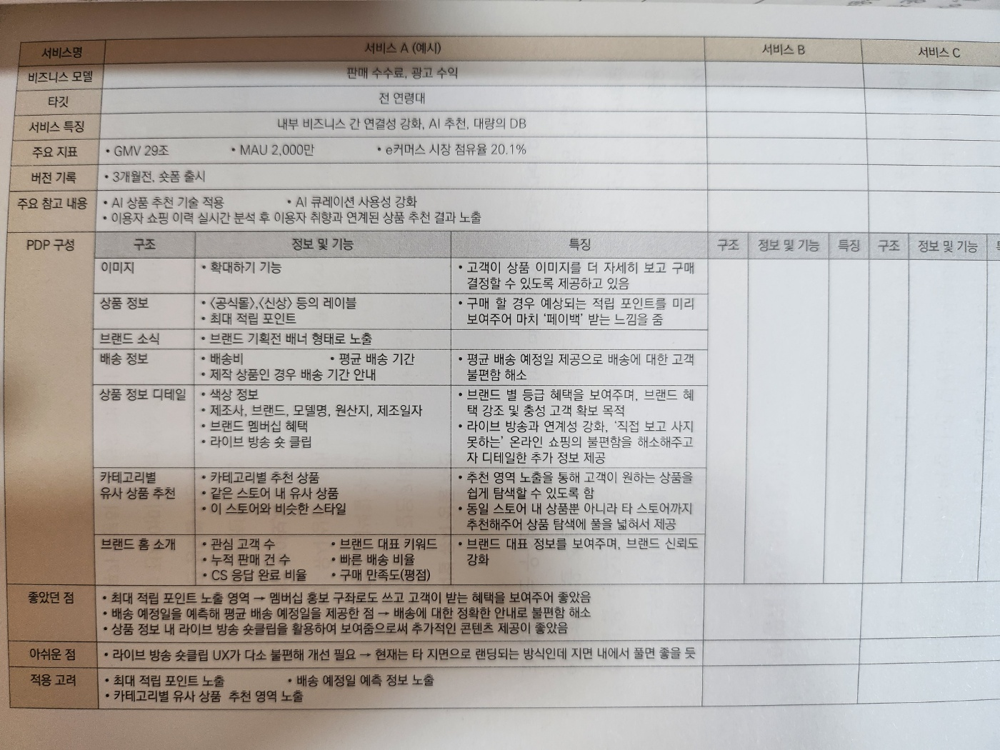

# 프로덕트 매니저 원칙

- 저자 : 장홍석, 강형모, 김수미, 김승욱, 서점직원, 산필수, 이미림, 이상범, 황인혜
- 엮은이 : 최현우

## 목차

- 0.  시작하는 PM을 위한 선배와의 3문3답
- 1.  시작하는 PM을 위한 5가지 스킬
- 2.  더 큰 차이를 만드는 킥오프 기술
- 3.  서비스 뜯어보기 신공
- 4.  본질적인 문제를 풀어라, 알맞는 방법으로
- 5.  '아하 모먼트'를 찾아서
- 6.  의심하고 또 의심하라. 악마도 천사처럼 웃는다
- 7.  '왜 안 되는가'에 집중하라
- 8.  '프로덕트 떼루아'를 파악하라
- 9.  "Why"라고 자문하라

## 00. 시작하는 PM을 위한 선배와의 3문3답

### 신필수

#### 내가 생각하는 PM, PO란 무엇인가?

- 마트 점장과 같다
  - 고차원적인 잡일 담당
- 각자가 어떤 일에 집중하고, 어느 수준의 결과물을 내야 하는지 정의해야 합니다

#### 어떻게 하면 PM, PO가 될 수 있을까?

- 명쾌한 해답이 없다
- 도움이 되는 역량은 있다
  - 글쓰기와 말하기 능력
  - 오너십
  - 영어
  - 호기심과 배우는 자세
  - 다양한 사람과 맞는 성격

### 김수미

#### 내가 생각하는 PM, PO란 무엇인가?

- 문제를 해결하는 사람
- 문제 : 우리가 지금 움직여야 하는 이유, 배경
- 비전을 바탕으로 문제를 파악하고 솔루션을 제시하고 실현하기까지, 어제보다 더 나은 제품을 매일 고민하고 매일 실현할 수 있는 사람

#### 어떻게 하면 PM, PO가 될 수 있을까?

- 기본적으로 PM, PO가 모든 과정에서 직접 결과물을 만들어내는 일보다 동료를 통해서 목표를 달성해내는 역할을 합니다
- 그래서 제품의 문제를 해결하는 동시에 내 동료의 문제를 해결하고 마음까지 살펴야 합니다
- 나의 동료가 일하다 고민이 생기면, 궁금증이 생기면, 어려움이 생기면 가장 먼저 떠오르는 사람이 PM이 되어야 한다고 생각합니다

### 이미림

#### 내가 생각하는 PM, PO란 무엇인가?

- 담당 도메인의 전략과 방향성을 정의할 수 있고, 이를 이해관계자와 메이커스(makers)가 이해할 수 있도록 설득하고 리딩해 도메인을 성장시키는 사람입니다
- PO가 가져야할 자질 중에서 '커뮤니케이션' 능력이 가장 중요하다고 생각합니다
  - 대내외적으로도 프로젝트 미션이나 목표 등을 전달할 필요가 있다
- PM, PO는 '담당 도메인의 전략과 방향성을 정의하고 우선순위에 맞게 프로젝트를 리딩하고, 이를 통해 도메인을 성장시킬 수 있는 사람'으로 정의할 수 있을 것 같다
- 능숙한 커뮤니케이션을 통해 목표를 달성하고 궁극적으로 도메인을 성장

#### 어떻게 하면 PM, PO가 될 수 있을까?

- 도메인 지식을 바탕으로 주도적으로 리딩하고, 이 과정에서 의사결정을 스스로 내릴 수 있어야 하므로 아예 경력이 없는 주니어가 도전하기는 쉽지 않습니다
- 실무에서 몇 년간 '기획' 경험을 쌓거나 소규모 창업을 통해 제로투원 경험을 해본 후 지원

### 김승욱

#### 내가 생각하는 PM, PO란 무엇인가?

- 다음과 같은 역할과 책임을 가진 사람
  - 역할 - 고객이 쓰고 싶은 제품 만들기
    - 고객과 사업과 기술 간 복잡한 역학 관계 중심에서 교두보 역할을 하고, 고객이 쓰고 싶은 제품을 만드는 전략 수립과 실행 과정을 주도하는 것
  - 책임 - 고객과 사업에 가치 창출하기
    - 고객 문제를 잘 해결해줘서 고객이 만족하고 너무 만족해서 돈을 내서라도 계속 쓰고 싶은 프로덕트를 만들어내는 것

#### 어떻게 하면 PM, PO가 될 수 있을까?

- `고객 중심 사고`, `전략적 사고`, `실행력`을 갖춰야 한다고 생각합니다
- 고객 중심 사고
  - 고객 니즈와 문제에 항상 집중하고 고객 문제와 원인의 본질을 찾아내는 집요함을 가지는 자세
- 전략적 사고
  - 고객 문제, 원인, 솔루션을 다각도에서 보고 핵심 요소와 상호작용을 고려해서 구조적으로 정리하고 접근 방향을 계획할 수 있는 능력
- 실행력
  - 소통, 협업 그리고 소통과 협업에 필요한 기술, UX, 비즈니스 리터러시(business literacy, 읽고 쓰는 능력), 자원(사람, 돈, 시간) 관리와 효율적 운영 능력도 일부입니다

### 황인혜

#### 내가 생각하는 PM, PO란 무엇인가?

- PM은 우리 프로덕트를 사용하는 고객에게 제공할 '최고의 경험'을 프로덕트 비전으로 정의하는 사람입니다
- 이 비전을 프로덕트 로드맵으로 구체화한 이후에 개발자, 디자이너와 같은 메이커들과 함께 고객의 니즈에 맞는 프로덕트가 나올 수 있도록 기획부터 프로덕트 론칭 후 분석까지 프로덕트의 전 과정을 리드하고 책임집니다
- 이 과정에서 우리 프로덕트를 사용하는 고객의 문제를 '고객 관점'에서 끊임없이 고민하고, 고객 경험의 문제 정의 및 해결 방향성을 우선순위와 함께 제시하는 미니 CEO 같은 역할 수행이 중요합니다

#### 어떻게 하면 PM, PO가 될 수 있을까?

- 문제 해결 능력과 함께 데이터 기반의 의사 결정을 잘해낼 수 있어야 합니다
- 고객이 우리 프로덕트를 사용하면서 마주하는 문제들을 고객 관점에서 정의하고, 이렇게 정의한 고객 문제를 해결하는 방법을 찾는 과정에서 팀을 이끄는 리더는 PM, PO이기 때문입니다
- 만약 아직 프로덕트 경력이 없다면, 지금 내가 하는 업무에서 최대한 고객의 문제를 정의하고, 세운 가설을 데이터나 실험으로 검증하고 의사 결정을 하는 연습을 해보세요

### 강형모

#### 내가 생각하는 PM, PO란 무엇인가?

- 경험과 데이터를 바탕으로 타임머신을 타고 미래의 고객을 미리 만나보고, 그곳에서 가설을 검증한 후 현실로 돌아와 전략을 조정하는 과정을 반복하는 사람
- 하루가 멀다 하고 빠르게 변하는 오늘이라는 변수 속에서도 흔들림 없이 목표와 전략의 중심을 잡고 결론부터 서두르기보다는 검증 과정을 통해 점을 찍어가며 길을 찾고,
  결국 그 점을 선으로 연결하는 사람입니다
- PM, PO는 기획자만이 아닙니다. 개발자도, 디자이너도 아닙니다. 고객이 무릎을 탁 치며 감탄할 수 있는 감동을 선사하는 사람이며, 이를 위해 어떤 역할도 변화무쌍하게 소화할 수 있는, 오직 고객을 향해 질주하는 카멜레온과 같은 사람입니다

#### 어떻게 하면 PM, PO가 될 수 있을까?

- 고객에게 감동을 줄 수 있는 프로덕트를 만드는 능력이 핵심입니다
- 이를 위해 단순히 한 분야에만 집중하는 것이 아니라, 다양한 기술과 경험을 습득해야 합니다
- 문제를 다각도에서 바라볼 수 있는 폭넓은 시각이 중요합니다
  - 더불어, 경험을 통해 현상을 붆석하고, 세밀하게 문제를 파악하는 능력도 필요합니다
- 과도한 흥분 없이 차분한 자세로 문제의 핵심을 파악하고, 그 문제를 단순화하는 것에서 부터 시작합니다
- 리소스는 최소화하고, 임팩트는 극대화하는 것이 바로 PM, PO의 사명이자 능력입니다
- 프로덕트를 만드는 과정에서 동료들과의 소통은 필수
  - 동료들이 여러분의 아이디어에 공감하고 감동할 때, 고객 역시 그 감동을 느낄 수 있습니다
- 무엇보다 중요한 것은 행동입니다
  - 아무것도 하지 않으면 결과는 '0'이지만, 무언가를 시도한다면 그것은 소중한 경험이 됩니다
  - 실패를 두려워하지 말고, 실험적인 접근법을 받아들이세요
  - 실패에서 배우고, 성공으로 이어질 수 있습니다
  - 고객의 반응과 시장의 피드백을 적극 활용하여 프로덕트의 변화와 성장에 기여하면 됩니다

## 01. 시작하는 PM을 위한 5가지 스킬 - 신필수

> PM으로 성장하고 싶다면 소통 능력, 신뢰감, 지식을 쌓으세요

- 5가지 스킬
  - 글쓰기와 말하기 능력
  - 오너십
  - 영어
  - 호기심과 배우는 자세
  - 다양한 사람과 맞는 성격

### 추천 책

- Shape Up

## 02. 더 큰 차이를 만드는 킥오프 기술 - 김수미

- 킥오프 지점에 다음과 같은 네 가지가 명확하지 않았다
  - 문제 인식: 우리는 문제를 동일하게 인식했는가?
  - 목표 공유: 우리는 같은 목표를 공유했는가?
  - 소통 방식: 우리의 소통 방식과 채널에 합의했는가?
  - 역할과 책임: 목표에 달성하는 데 필요한 각자의 역할과 책임을 명확히 했는가?
- 킥오프 시점에 제대로 싱크하지 않으면 과정에서 애초에 당면하지 않아도 될 문제를 너무 많이 겪게 됩니다

> PM의 몰입을 통해 결과물에 큰 차이를 만들어낼 수 있는 시점, 킥오프에 투자해라!

### 킥오프가 중요한 이유

- PM에게 킥오프란?
  - 문제 해결의 시작 단계에서 이뤄지는 활동
  - 문제를 함께 해결할 이해관계자가 모여 문제 해결 또는 프로젝트의 목적, 범위, 목표, 일정, 리소스, 역할 및 책임 등을 협의하고 구체화하고 공유하는 과정
- 킥오프를 수행했으냐에 따라 PM이 오너십을 지키면서 책임감을 가지고 유연하게 일을 진행할 수 있냐 없냐가 좌지우지됩니다
- 킥오프 과정에서 얼마나 제대로 팀을 세팅했느냐에 따라 데일리 또는 위클리 업무를 원활히 진행할 수 있느냐 또는 아니냐가 결정된다

### 킥오프를 통해서 얻어야 하는 2가지

- 킥오프는 미팅 뿐만 아니라 준비 과정부터 과제를 수행해 정상궤도에 올리기까지 과정입니다
  - 지금은 미팅 그 자체만으로 잠시 좁혀서 이야기해보겠습니다
- 킥오프의 핵심적인 목적은 크게 두 가지입니다
  - 이해관계자들과 문제인식과 목표를 동기화하기
  - 역할과 책임에 대한 혼선이 발생하지 않도록 팀워크 구축하기

### 이해관계자들과 문제인식과 목표를 동기화하기

- 유연성을 충분히 열어두고 과정 중에 변화를 수용할 수 있어야 합니다
- 킥오프 단계에 검토되지 못했지만 진행 중에 더 나은 솔루션을 발견한다면 어떻게 해야 할까?
  - 더 낫고 더 적절하다 합의된다면 새로운 솔루션을 도입할 수 있다

### 역할과 책임에 대한 혼선이 발생하지 않도록 팀워크 구축하기

- 팀워크를 구축하려면 구성원의 전문성과 역량을 바탕으로 역할과 책임을 이해해야 합니다
- 각 구성원이 문제가 생겼을 때 누구를 찾아야 할지 고민이 들지 않게 만들어주면 됩니다
- 이해관계자 중 스폰서가 있다면 스폰서십을 어떻게 유지하고,
  의사결정에 어떻게 참여시킬지 교통정리가 필요합니다
  제품팀이나 프로젝트팀의 역할과 책임을 이해하고 커뮤니케이션하고 의사결정 방법도 정리해야 합니다

### 킥오프에서 제대로 동기화하기

- 킥오프 과정을 제대로 하지 않으면 어떤 일이 일어날까요?
  - 명확한 문제인식이 흐려지면서 목표가 흔들릴 수 있습니다
    - 진짜 해결해야 하는 문제에 집중

### 킥오프에서 팀워크 구축하기

- 구성원들이 동료의 역할을 이해하고 각자의 역할을 최선을 다할 수 있는 환경을 만들어야 한다

### 킥오프를 성공적으로 만드는 4가지

- 1. 우리는 같은 문제를 바라보고 있습니다
- 2. 우리는 같은 결과물로 구체화했고 장애물도 피해갈 수 있습니다
- 3. 우리는 이렇게 협업할 겁니다
  - 협업의 시작은 대화, 커뮤니케이션 방식을 정리
  - `투명성` : 사실 그대로 투명하고 정확히 전달해야 신뢰를 구축할 수 있습니다
  - `전방향성` : 상화좌우 지위고하를 막론하고 편하게 이야기할 수 있는 환겨잉어야 합니다
  - `신속성`과 `존중`하는 대화도 중요합니다
- 4. 우리는 당신과 함께 고객의 문제를 해결할 겁니다
  - 피상적이면 안된다. 진심인 내용을 전달해야 구성원들도 동의하고 공감합니다
    - 동의하고 공감해야 동기부여가 생기는 겁니다
    - 스스로 인정 받고 있다고 느끼고, 서로가 인정할 때 최선을 다해야 하는 이유도 명확해지게 됩니다
  - 안정적인 환경에서 동기부여된 마음으로 문제 해결에 집중할 수 있게 안정적인 스폰서십을 유지하고 있음을 알려줘야 합니다
  - 충분한 동기 부여

### 추천 책

- 인스파이어드
- 프로덕트 리더십
- 프로덕트 오너

## 03. 서비스 뜯어보기 신공 - 이미림

> 서비스를 뜯어보며 성장하자

- `서비스 뜯어보기`의 목적 : 개인과 서비스의 성장
  - 개인과 담당 도메인 모두의 성장

### 왜 뜯어봐야 할까요?

- PO는 프로덕트의 성장에 고민이 많습니다
- 늘 우리 서비스를 이용하는 유저 활동 데이터를 분석하고 특징을 파악합니다
  - 유저 활동 데이터를 분석하고 특징을 파악합니다
- 유저가 서비스를 처음 이용하는 시점부터 이탈하는 시점까지 퍼널별 데이터를 살펴보는데, AARRR 프레임워크를 주로 활용합니다
- AARRR 아래 단계로 지표를 나누어보는 방법론입니다
  - 고객의 획득(Acquisition) : 고객을 어떻게 데려올 것인가?
  - 활성화(Activation) : 고객이 서비스의 핵심 기능을 이용하는가?
  - 유지(Retention) : 고객이 서비스를 지속적으로 이용하는가?
  - 수익화(Revenue) : 고객은 우리가 설정한 최종 목표인 결제를 하는가?
  - 추천(Referral) : 고객이 자발적으로 우리 서비스를 추천하는가?
- 우리가 가진 문제를 정의
- 어떻게 해결할 것인가?
- 타사 서비스를 레퍼런스 삼아 그들의 비즈니스를 이해하고, 서비스를 뜯어봐야 합니다
- 그래야 우리가 겪는 문제를 타사가 어떤 방식으로 풀었는지를 알 수 있고, 그들이 푼 방식을 우리 서비스에 어떻게 적용할지 고민할 수 있고, 더 나아가서는 타사 서비스를 뜯어보고 더 좋은 아이디어를 떠올리고 디벨롭시켜 고객의 문제를 빠르게 해결할 수 있습니다

#### 비즈니스에 대한 이해

- 우리 프로덕트가 어떤 플랫폼에 속하고 어떤 비즈니스를 하는지 파악하는게 좋습니다
  - e.g. 오픈마켓, 종합몰, 자사몰

#### 어떤 문제를 해결하려고 하는가?

- 유저가 어떤 어려움을 갖고 있는지 관심을 기울어야 한다
  - 고객 활동 데이터 분석
  - 유저 인터뷰
  - 사용성 테스트
  - 고객의 소리 등
- 어떤 문제를 해결하면 가장 임팩트가 클지 곰곰히 생각해봅시다

  - 우선순위가 높은 문제부터 해결해나가면 됩니다

- e.g.
  - 문제
    - 제품 상세페이지에서 주문서까지의 전환율이 낮다
  - 해결 방법
    - 주문서까지의 전환율이 낮은 이유에 대해 데이터를 딥다이브해 세부 문제를 찾는다
    - 주문서까지의 전환율이 낮은 이유에 대한 가설을 세워 A/B 테스트를 진행한다
    - 주문서까지의 전환율을 높일 수 있는 방법을 고민하고 개선한다
- 타사 서비스를 뜯어보기 전에 '유저가 서비스를 이용하며 겪는 문제가 정확하게 무엇인지' 뾰족하게 정의해놓는다면 더 깊이 있게 분석할 수 있으니 문제 정의 시 충분한 시간을 들여 고민해야 합니다

#### 타사 비즈니스에 대한 이해

- 같은 비즈니스 영역의 '경쟁사'를 먼저 살펴보고, 그 다음은 우리가 해결하려는 문제를 먼저 마주했을 확률이 높은 '카테고리별 대표 서비스'를 살펴보거나 기존에 이용했는데 '경험이 좋았던 서비스'를 살펴봅니다

#### 타사는 어떤 문제를 해결하려고 했는가?

- 문제 : PDP에서 주문서까지의 전환율이 낮다
- 과정
  - 문제 위주의 탐색

### 어떻게 뜯어봐야 할까요?

- 문제: PDP에서 주문서까지의 전환율이 낮다
- 살펴볼 지면: PDP
  - 전환율 개선이 필요한 주요 지면을 의미합니다
- 플랫폼: 모바일, PC웹

> App의 경우 운영체제에 따라 UI/UX가 다르게 구현되어 있을 수 있음을 인지할 것

- 살펴볼 서비스: 서비스1, 2, 3
  - 경쟁, 카테고리별 대표, 경험이 좋았던 서비스 등 살펴볼 서비스를 선정합니다

#### 각 서비스의 PDP는 어떻게 구성되어 있는가?

#### PDP 내 컴포넌트, 기능, 정보가 어떤 특징을 가지는가?

#### 좋았던 점, 아쉬운 점, 적용할 점

- 지금까지 서비스를 자세하게 뜯어보고 인사이트까지 정리했다면, 이제 최종으로 정리할 시간입니다
- 좋았던 점, 아쉬운 점, 적용할 점을 적습니다

#### 최종 비교

- 서비스별로 지면 구성이 어떻게 되어 있는지, 컴포넌트와 기능 그리고 정보가 어떻게 노출되어 있는지, UI/UX는 어떤지 등을 전반적으로 살펴보고 정리를 마쳤습니다
- 서비스마다 갖고 있는 특징과 차별점을 하나의 표로 정리하고 비교할 차례입니다

- 작성한 표를 보고 어떤 부분을 어떻게 적용할지 고민해봅니다
- 혼자 고민하고 의사결정하기 어렵다면 팀원들과 리뷰하고 함께 보며 자유롭게 의견을 들어보는 것도 좋습니다
- 이 과정에서 생각지 못한 좋은 아이디어가 나올 수도 있습니다

### 어떻게 적용해야 할까요?

- 서비스를 왜, 어떻게 뜯어보는지 설명했습니다
- 적용하는 방법을 알아보겠습니다

- 우리 문제를 해결하는 데 가장 적합하다고 생각되는 우선순위대로 나열합니다

  - 1. 카테고리별 유사 상품 추천
  - 2. 포토 리뷰 모아보기
  - 3. 라이브방송 숏클립

- 우선순위가 정리되었다면 요구사항을 PRD(Product Requirements Document)로 작성하는 단계로 넘어갑니다
  - 배경, 목적, 가설, 성공 지표 등을 정의하고 기능적 요구사항, 유저 스토리 등을 포함해 작성하면 됩니다
  - 사용성 테스트, A/B 테스트 진행 여부를 결정하고 단계별 일정 계획을 수립합니다
- 벤치마킹한 서비스를 우리 서비스에 적용할 때 기억해야 할 점은 '타사에 노출된 형태를 그대로 따라 하지 않는 것'입니다
  - 기대한 효과를 얻기 어려울 수 있다
    - e.g. 카테고리 - 우리는 타사가 가진 카테고리 중 1개 카테고리밖에 취급하지 않는다
- 저자의 실패 원인
  - 자사 '주요 타깃'에 대한 고려가 되지 않았다
    - 경쟁사의 주요 타깃은 20~30대, 우리는 40~50대
    - 커뮤니티 활성화는 글을 자주써야되는데 연령대가 있다보니 글을 쓰는 유저가 적었다
  - 콘텐츠 업로드 방식의 차이를 간과했다
    - 콘텐츠를 모아보는 전용관에 '퀄리티 좋은 콘텐츠'가 노출되려면 '검수'가 필요한데, 우리는 사람이 일일이 수동 검수하는 프로세스여서 주말에는 업로드되는 콘텐츠가 없어 서비스가 정체되었다
    - 반면, 타사는 콘텐츠 자동 검수 기술을 이용하고 있어서 주말에도 활발하게 콘텐츠가 업데이트 되었다
- 뜯어보기의 목적은 우리가 가진 문제해결을 위해 타사 서비스를 이리저리 뜯어보면서 비교한 후 우리의 문제를 해결하고 부족한 부분을 보완하는 것임을 잊지 말아야 합니다

- "배움과 성장을 즐기는 사람이 성공할 확률이 높은 이유는
  그 과정을 통해 인생을 수정하는 것이 두려움이 아니라
  얼마나 즐거운 일인지 알게 되기 때문이다.
  배움과 성장이 없으면 '변화'는 일어나지 않는다" - 이기는 습관, 보도섀퍼

### 추천 책

- 프로덕트 오너
- 그로스 해킹

## 04. 본질적인 문제를 풀어라, 알맞는 방법으로 - 김승욱

> 더 나은 프로덕트를 만드는 과정에서 고민이 될 때, 풀려는 고객 문제와 핵심 원인에 집중해야 한다

- 원칙 : 어떤 `행동`이나 `이론` 따위에서 일관되게 지켜야 하는 기본적인 `규칙이나 법칙`

  - 행동: 더 나은 프로덕트를 만들기 위한 노력과 행동
  - 이론: 제품 개선 순환 과정(Product Iteration Cycle, PIC) 프레임워크
  - 규칙이나 법칙(원칙): PIC 과정의 모든 단계에서 고민이 될 때는 풀려는 고객 문제와 핵심 원인에 집중하라

- 왜 그래야만 할까요? 좋은 프로덕트는 필수적이고 본질적인 고객 문제를 잘 해결해줘서, 고객이 만족하고 너무 만족해서, 돈을 내서라도 계속 쓰고 싶은 프로덕트이기 때문입니다
- 그런데, 핵심 원인을 놓쳐서 고객 문제를 해결해주지 못하면, 아무리 많은 자원을 투자해도 고객은 만족하지 못하고 돈도 못 벌게 됩니다
- 고객을 만족시키면서 돈을 많이 버는 과정을 들어보겠습니다

  - 1. 프로덕트가 고객 문제를 해결해줍니다
  - 2. 고객들은 본인의 문제를 해결하기 위해 프로덕트를 계속 씁니다
  - 3. 고객들은 계속 쓰는 데 필요하다면 기쁜 마음으로 돈을 지불합니다
  - 4. 사업은 돈을 벌고 번 돈을 고객 문제를 더 잘 해결하고 더 많은 고객 문제를 푸는데 재투자합니다
  - 5. 1~4 과정이 무한 반복하며 고객과 사업의 가치 창출의 선순환이 만들어집니다

- 1번 과정에서 프로덕트 직무에 종사하는 분들이 흔히 하는 말이 있습니다
- 본질적인 문제를 풀어라, 알맞은 방법으로(Solve the right problem, in right way).

- right problem : 부수적이거나 피상적인 고객 문제가 아닌, 필수적이고 본질적인 고객 문제

  - 명확히 정의를 내리는 일도 어렵고, 방해 요소도 많고 정답을 바로 알려주지도 않습니다
  - 아무리 어려워도 프로덕트 매니저로서 그걸 찾지 못하면 그 뒤에 노력은 모두 물거품이 됩니다

- 3번에서 막힐 수도 있습니다
  - 필수적이고 본질적인 문제가 아니면 고객은 소중한 돈을 기쁜 마음으로 지불하지 않습니다
- 2번에서 막힐 수도 있습니다

  - 필수적이고 본질적인 문제가 아니면 고객은 소중한 시간을 내서 프로덕트를 쓰지 않기 때문이죠

- right way
  - 본질적인 문제를 해결하는 데 필수적인 원인을 파악하고, 고객이 만족할 수준의 솔루션을 프로덕트를 통해 제공해야 합니다
  - 이것도 쉽지 않습니다
    - 1. 문제에 대한 수없이 많고 그중 어떤 것이 문제 해결에 부수적이고 어떤 것이 필수적인지 구별하기 어렵기 때문입니다
    - 2. 모든 원인을 한 번에 해결할 자원도 없습니다
    - 3. 심지어 첫 시도에 그 원인들이 해결된다는 보장도 없고 그런 경우도 흔치 않습니다

### 제품 개선 순환 과정

- 제품 개선 순환 과정(Product Iteration Cycle, PIC) 프레임워크
  - PIC는 고객이 쓰고 싶은 제품일 확률을 높이는 과정입니다

#### 애자일 소프트웨어 개발과 PIC

- 사용자가 좋아서 쓰게 되는 제품을 만들어낼 확률은 우리 생각보다 낮다

  - 사용자가 써보기 전에는 우리 가설이 맞는지 알 수 없다 -> 겸손한 자세
  - 가절을 검증할 수 있는 최소한의 제품요건과 릿고스를 투자해서 사용자 피드백을 얻는 데 집중한다
  - MVP(Minimum Viable Product)를 만들어 사용자 피드백을 얻는다
  - 사용자 피드백을 바탕으로 제품을 개선한다
  - 이 과정을 반복한다
  - 이 과정을 반복함으로써 진정으로 사용자 니즈/문제를 충족하고 해결하는 제품을 구현하는 데 가까워지는 순환 과정을 밟는다

- PIC는 4단계로 나눠서 고민합니다

  - 기회 포착
    - 목적: 고객은 이런 니즈가 있는데 불만족한다. 이 문제가 가장 시급하고 해결하면 사업 목표 달성할 수 있다
    - 고민: 어떤 문제가 가장 임팩트가 클까?
  - 가설 수립
    - 목적: 가장 시급한 고객 문제의 핵심 원인은 이렇다. 이렇게 풀면 해결되고 기대 효과가 날 것이다
    - 고민: 이 문제의 핵심 원인은 무엇일까?
  - 실행
    - 목적: 핵심 원인과 더불어 제한된 시간과 리소스를 고려해서, 이런 요건을 갖추어 1차 가설을 검증하자
    - 고민: 어떤 기능이 문제해결에 필수일까?
  - 가설 검증
    - 목적: 고객 문제가 해결되지 않았고 목표가 달성되지 않았다. 이유는 이러하니 다음에 저렇게 해보자
    - 고민: 문제가 풀렸나? 왜?, 목표가 달성되었나? 왜?

- PIC는 4단계로 나눠서 고민을 합니다
  - 단계별 고민의 해답을 얻어내기는 정말 어렵습니다
  - 수많은 선택의 기로를 맞이하고, 어떤 선택지가 더 나은지 판단하기 어려운 상황이 많습니다
- 그럴때마다 우리가 풀려는 고객 문제가 필수적이고 본질적인지, 고객 문제의 핵심 원인이 내가 생각한 게 맞는지 되짚어봐야 합니다

  - 그러면 나침반처럼 짙은 안개가 걷히고 명확히 가야 할 방향이 보입니다

- "화장품 제품군의 매출을 획기적으로 성장시켜라"라는 미션을 수행하면서 어떤 후회되는 판단들을 했는지 PIC 4따라가며 본격적으로 소개하겠습니다

### PIC 1단계: 기회 포착

- 기획 포착 단계에서는 고객에게 이런 니즈가 있는데 불만족스러워한다
- "이 문제가 가장 시급하고 만족시켜(해결해)주면 사업 목표를 달성할 수 있다"라는 말을 확신을 가지고 할 수 있어야 합니다

  - 따라서 어떤 고객 문제를 풀면 목표가 달성될지 고민해야 합니다

#### 화장품 매출 성장 예시

- 사업 목표: 매출과 수익 두마리 토끼를 잡는다

  - 전략: 매출 성장 가능성과 수익성 높은 뷰티 카테고리 매출 증대
  - 전술: 고가 브랜드 화장품 셀렉션 매입, 판촉, 할인

##### 오판

- 목표 달성을 위해 채택한 전략의 주요 근거
  - 1. 수익성이 좋다
    - 제품의 부피가 작아 창고와 배송 비용이 낮고
    - 공산품에 가까워 유통기한이 길어 폐기율이 낮고
    - 소모품이라 구매 빈도와 묶음 구매율이 높다
  - 2. 매출 성장 잠재력이 크다
    - 국내 화장품 시장 규모가 크고
    - 온라인 침투율은 높지 않지만 빠르게 늘고 있고
    - 경쟁사 대비 쿠팡의 시장 점유율이 낮다
  - 3. 고가 브랜드 매출 점유율이 특히 낮다
    - 점유율이 낮고
    - 판매 브랜드도 적고
    - 품목도 적다
- `"쿠팡에서 판매하는 화장품을 사려고 할 때, 고객이 품질에 만족할지 확신이 없는 게 가장 시급한 문제고, 제품 내 탐색/구매 여정에서 제품대 한 정보 비대칭이 그 핵심 원인이다"`(오판)

##### 함정

- 필수적인 원인은 고객이 원하는 고가 럭셔리 화장품 브랜드와 품목이 쿠팡에 없기 때문이었다
- 함정 요인
  - 부서간 장벽과 충돌하는 이해관계로 인해서
  - 제품도 나름 그럴싸한 고객 문제와 원인을 발굴해서 들고오다 보니

##### 사일로된 조직구조와 충돌하는 이해관계

- 사업 조직은 이미 'right problem'에 대한 실마리를 가지고 있었습니다

  - 1. 이미 존재하는 화장품 시장과 규모 내에서
  - 2. 온라인에서 판매되는 매출 규모 중 쿠팡의 점유율은 뒤떨어진 상태였는데
  - 3. 특히 고가 브랜드 매출 점유율이 작았고 그 원인은 선호하는 브랜드가 없고
  - 4. 있더라도 좋아하는 품목이 없다

- 사업 조직은 이미 시장 조사와 쿠팡 내 고객 구매 데이터를 통해
  - 1. 고객은 쿠팡에서 주로 로션/스킨 같은 보습/기초 화장 제품군을 구매한다는 사실과
  - 2. 쿠팡은 색조화장 제품군이 없을 거라는 인식과
  - 3. 실제로 있기는 하지만 한국 화장품 시장 점유율의 상위에 포진해 있는 주요 메이크업 브랜드의 품목이 실제로 별로 없다
- 는 사실에 기인한다고 추정하고 있었습니다
  - 이런 실마리들은 탐색 여정에 대한 제품 사용성 테스트나, 퍼널분석이나, 심층 인터뷰로는 발견하기 쉽지 않습니다
  - 더 넓은 시야로 시장 현황 레벨에서 사용자 니즈와 문제를 고민해야 발견할 수 있습니다
- 전사적인 관점에서 각 기능 조직이 다함께 모여 고객 문제를 고민해야 발견될 확률이 높아지는 겁니다

##### 제품 조직 나름 그럴싸한 고객 문제와 원인 발굴

- 제품 조직에서 목표 달성을 위해 앞에서와 같은 잘못된 전략을 채택한 주요 근거는 다음과 같습니다
  - 1. 찾는 고객이 꽤 많다
    - 화장품 검색 키워드 트래픽이 타 카테고리에 준하고
    - 화장품 제품 상세페이지 트래픽 역시 밀리지 않으며
    - 구매 고유고객 역시 큰 차이 없다
  - 2. 비교할 만한 침구류나 캐주얼 의류에 비해 퍼널 효율이 낮다
    - 제품 상세 진입 대비 결제나 장바구니 전환율이 낮으며 장바구니 포기율이 높고
    - 리뷰 탐색율과 리뷰 탐색 시간이 상대적으로 낮은데
    - 제품 상세페이지 탐독율은 비슷하다
  - 3. 고객이 제품 품질에 대한 불확실성으로 구매 허들을 느낀다
    - 몸에 쓰는 제품인만큼 품질에 대해서 깐깐한데
    - 온라인 쇼핑 특성상 직접 테스팅이 어렵고
    - 품질에 대해 간접적으로 파악할 수 있는 정보가 부족하다고 느낀다
      - 예를 들어, 화장품에 특화된 발림성 같은 리뷰 항목이나 제품 성분 같은 제품 상세 정보
- 한마디로, 구매 의사를 보이는 고객은 꽤 있는데, 탐색과 구매 결정 여정에서 전환율이 낮고 품질에 대해 신뢰가 주요 문제다
- 고객에 대한 정성/정량 리서치를 했을 대 뭔가 조각들이 제자리에 맞아들어가는 느낌이 들면, 기대효과 측정 과정에서 예측 모델에 의지치가 반영되는 지표들에 힘이 들어가기 마련입니다(확증편향)
  - 직접 사용자 인터뷰 모더레이팅을 하면서 일관성 있는 VOC들을 귀에 못이 박히게 듣고
  - 유관 퍼널들의 전환율이 고객 VOC를 뒷받쳐주고
  - 점점 이렇게 근거가 쌓이고 쌓이면 생각이 확고해지고
  - (아님에도) 필수적이고 본질적인 문제라고 `자기 최면`을 걸게 되는 신기한 경험을 하게 됩니다
- 이게 정말 명확한 고객 문제인지 여부와, 필수적이고 본질적인 고객 문제인지 여부를 묻는 건 완전 다른 질문이라는 점을 망각하게 됩니다
  - 물론 언젠가 해결해야 할 고객 문제겠지만, 야심찬 사업 목표를 달성해줄 가장 시급한 고객 문제는 아님에도 받아들여집니다

##### 고민될 때: 고객 문제와 핵심 원인에 집중하세요

- 당시 저자의 머리속에 든 생각들
  - 정석대로 하자. 고객의 구매 여정을 관찰해서 미충족 니즈의 핵심 문제와 원인을 정의하자
  - 시간 내 확인된 문제 중 가장 큰 것부터 해결하자
    - 사업이랑 가장 시급한 문제, 원인, 해결 방안을 협의하면서 준비하면 제때 제품 전략이랑 로드맵이 안 나올거 같은데, 우선 초안은 따로 준비해야겠다
  - 이걸 문제를 푸는 것도 분명히 시간낭비는 아니다
    - 사업은 다른 문제가 가장 시급하다네. 제품 조직에서 준비한 문제도 명확한 고객 문제인데 이걸로 밀어붙여야 겠다
  - 일 크게 만들지 말고 이번 분기는 이렇게 가자
    - 근데 사업에서 정의한 고객 문제와 핵심 원인이 매우 공감되네. 제시한 전술에 제품적 개선까지 더해지면 시너지가 엄청날 것 같은데 어쩌지? 우선 이번엔 이렇게 가자
- 완벽한 실수였습니다
  - 고객이 너무 중요하다고 생각하고 풀리지 않아 괴로워하는 필수적이고 본질적인 문제인지 생각하고 판단해야 합니다
  - 커머스의 본질은 애초에 고객이 원하는 물건이 있어야 하지 않나? 퍼널 전황율의 최적화에 기대되는 매출 증분이 과연 고객이 찾는 물건의 구색을 탄탄히 갖추면 기대되는 매출 증분보다 높나?
- 이런 본질적인 질문을 할 수 있어야 하고 제대로 된 답변을 할 수 없다면 판단을 내리면 안 됩니다

### PIC 2단계: 가설 수립

- 가설 수립 단계에서는 `가장 시급한 고객 문제의 핵심 원인은 이렇다. 이렇게 풀면 해결되고 기대효과가 날 것이다`라는 말을 확신을 가지고 할 수 있어야 합니다
- 문제의 핵심 원인을 제대로 정의해야 문제를 해결할 솔루션 가설을 만들 수 있기 때문입니다

#### 오판

- 오판
  - 쿠팡에서 판매하는 화장품을 사려고 할 때 내가 품질에 만족할지 확신이 없다
  - 탐색/구매 여정에서 제품에 대한 정보 비대칭이 그 핵심 원인이다
- 실제 원인

  - 사용자가 이 제품이 정품인지 의심되고 불안하다

- 왜? 고객은 정품인지 확신을 가질 수 없었을까요?

  - 쿠팡에서 팔 것 같지 않다고 생각했기 때문에
    - 쿠팡은 생필품을 주로 팔 것 같고, 고가 브랜드 제품을 팔지 않을 것 같다고 생각했다
  - 쿠팡에서 사본 적이 없기 때문에
    - 쿠팡에서 고가 화장품 브랜드 제품을 사본 경험이 없고 주변에 사봤다는 사람 이야기를 들어본 경우도 흔치 않았다
  - 가품 이슈는 아니지만, 신뢰 이슈에 대해 들어본적이 있기 때문에 - 간혹 맥북을 주문했는데 벽돌이 왔다는 기사도 보이고 - 쿠팡 직매입 로켓 배송 제품은 아니지만 입점 셀러가 가품을 팔았다는 경우를 들어봤다

- 그럼에도 왜 쿠팡에서 이러한 제품들을 계속 검색하는 걸까요?
  - 쿠팡이 가격이 저렴하고 결제 과정도 편하고 배송도 빠르다는 신뢰가 있기 때문입니다

#### 함정

- 이렇게 분명한 실마리가 존재했음에도 저는 왜 핵심 원인을 놓쳤을까요?

  - 제가 경험했던 함정으로 작용한 요인은 크게 2가지였습니다

- 1. 터널 시야 효과로 인해서
  - 성정/정량 고객 리서치가 능숙할수록 결과물에 강하게 의존하고
  - 성공 경험이 쌓이면 고객 VOC와 행동 데이터를 과신하게 되는데
  - 표면적인 VOC에서 머물고 깊이 있는 고객의 생각, 감정, 행동의 원인을 찾는 능력이 부족해 위 두 가지 요인으로 인해 지엽적인 원인을 핵심 원인으로 오판하게 되었다
- 2. 선도사 벤치마크 과신으로
  - 선도사 벤치마크에서 비슷한 원인을 해결하는 기능을 보면 더 믿음이 강해지고
  - 핵심 원인에서 벗어난 원인도 뭔가 근거가 탄탄하고 중요해보이는 착시현상에 빠졌다

#### 터널 시야 효과

#### 선도사 벤치마크 과신

#### 고민될 때: 고객 문제와 핵심 원인에 집중하세요

### PIC 3단계: 실행
